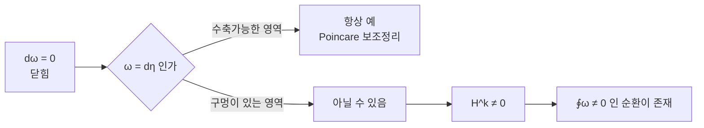

# de Rham 코호몰로지

# 개요

[미분형식](differential-forms.md)에서 $d\circ d=0$ 이므로 완전형식은 반드시 닫혀 있다. 역이 성립하는지는 공간의 모양에 달렸다. $\mathbb R^2$ 에서는 닫힘형식이 모두 완전하지만, 원점을 뺀 평면에서는 그렇지 않다.

de Rham 코호몰로지는 이 차이를 재는 벡터공간이다. 닫힘형식을 완전형식으로 나눈 몫이며, 0 이 아니면 국소적으로는 메울 수 있는데 전역적으로는 메울 수 없는 형식이 있다는 뜻이다. 즉 구멍을 센다.

놀라운 점은 결과가 위상 불변량이라는 것이다. 매끄러운 구조와 미분을 써서 정의했는데, de Rham 정리에 따르면 이것이 [단체 호몰로지](homology.md)로 계산한 위상적 코호몰로지와 동형이다. 해석과 위상이 만나는 가장 고전적인 지점이며, 지표 정리들의 원형이다.

# 직관

## 국소적으로는 언제나 메울 수 있다

Poincaré 보조정리가 그 진술이다. 수축가능한 열린집합 위에서는 모든 닫힘형식이 완전하다. 공 안에서는 $d\omega=0$ 이면 $\omega=d\eta$ 인 $\eta$ 를 실제로 구성할 수 있다.

따라서 코호몰로지가 0 이 아닌 것은 순전히 전역적인 현상이다. 조각조각 만든 $\eta$ 들이 겹치는 부분에서 서로 맞지 않아 하나로 이어 붙일 수 없을 때 생긴다.

## 각형식

$M=\mathbb R^2\setminus\{0\}$ 위에서 다음을 보자.

$$
\omega=\frac{-y\,dx+x\,dy}{x^2+y^2}
$$

계산하면 $d\omega=0$ 이다. 국소적으로는 $\omega=d\theta$ 로 각도 함수의 미분이다. 그런데 각도 함수는 전역적으로 정의되지 않는다. 한 바퀴 돌면 $2\pi$ 만큼 어긋나기 때문이다.

Stokes 정리가 완전성을 부정해 준다. 단위원 위의 적분이 $2\pi \ne 0$ 인데, $\omega=d\eta$ 라면 닫힌 곡선 위의 적분이 0 이어야 한다. 따라서 $H^1(M)\ne0$ 이다.

## 적분이 쌍대성을 준다

$k$ 형식은 $k$ 차원 부분다양체 위에서 적분된다. Stokes 정리에 의해 완전형식은 경계 없는 순환 위에서 0 이고, 닫힘형식은 경계 위에서 0 이다.

그래서 적분이 코호몰로지와 호몰로지 사이의 쌍대 짝짓기를 정의한다. 이것이 de Rham 정리의 내용이며, 두 이론이 같은 것을 세고 있음을 적분 하나가 증명한다.

# 정의

## 복합체와 코호몰로지

매끄러운 다양체 $M$ 위에서 다음 열이 $d\circ d=0$ 이므로 사슬 복합체다.

$$
0\to\Omega^0(M)\xrightarrow{\ d\ }\Omega^1(M)\xrightarrow{\ d\ }\cdots\xrightarrow{\ d\ }\Omega^n(M)\to0
$$

$k$ 번째 de Rham 코호몰로지는 다음 실벡터공간이다.

$$
H^k_{\mathrm{dR}}(M)=\frac{Z^k}{B^k},\qquad Z^k=\ker d|_{\Omega^k},\quad B^k=\mathrm{im}\,d|_{\Omega^{k-1}}
$$

$Z^k$ 의 원소를 닫힘형식, $B^k$ 의 원소를 완전형식, 몫에서의 동치류를 코호몰로지류라 한다.

## 곱과 함자성

쐐기곱이 코호몰로지로 내려와 등급 대수 구조를 준다. $[\alpha][\beta]=[\alpha\wedge\beta]$ 가 잘 정의되는 것은 완전형식과의 쐐기가 다시 완전하기 때문이다.

매끄러운 사상 $F:N\to M$ 은 당김으로 $F^*:H^k(M)\to H^k(N)$ 을 유도한다. 화살표 방향이 뒤집히므로 반변 함자다. 호모토픽한 두 사상은 같은 준동형을 유도하며, 이것이 다음 절의 핵심이다.

# 성질

## 호모토피 불변

$F,G:N\to M$ 이 매끄럽게 호모토픽하면 $F^\ast=G^\ast$ 다. 증명은 호모토피 작용소 $K:\Omega^k(M)\to\Omega^{k-1}(N)$ 를 만들어 다음을 보이는 것이다.

$$
G^*\omega-F^*\omega=d(K\omega)+K(d\omega)
$$

$\omega$ 가 닫혀 있으면 둘째 항이 사라지고 차이가 완전형식이 되어 코호몰로지에서 같아진다.

따라서 호모토피 동치인 두 다양체는 같은 코호몰로지를 가진다. 특히 수축가능하면 점과 같은 코호몰로지를 가지며, 이것이 Poincaré 보조정리다.

$$
H^k(\mathbb R^n)=\begin{cases}\mathbb R&k=0\\0&k>0\end{cases}
$$

## Mayer–Vietoris 수열

$M=U\cup V$ 로 열린집합 둘로 덮으면 긴 완전열이 있다.

$$
\cdots\to H^k(M)\to H^k(U)\oplus H^k(V)\to H^k(U\cap V)\xrightarrow{\ \delta\ }H^{k+1}(M)\to\cdots
$$

조각의 코호몰로지에서 전체를 계산하는 도구이며, 연결 준동형 $\delta$ 가 단위 분할로 만들어진다. 귀납적으로 구, 원환면, 사영공간의 코호몰로지가 이 수열로 계산된다.

| 다양체 | $H^0$ | $H^1$ | $H^2$ |
|---|---|---|---|
| $\mathbb R^n$ | $\mathbb R$ | $0$ | $0$ |
| $S^1$ | $\mathbb R$ | $\mathbb R$ | $0$ |
| $S^2$ | $\mathbb R$ | $0$ | $\mathbb R$ |
| $T^2$ | $\mathbb R$ | $\mathbb R^2$ | $\mathbb R$ |
| $\mathbb R^2\setminus\{0\}$ | $\mathbb R$ | $\mathbb R$ | $0$ |

$H^0$ 의 차원이 연결 성분의 개수다. $d f=0$ 인 함수가 각 성분에서 상수이기 때문이다.

## de Rham 정리

매끄러운 다양체 $M$ 에 대해 적분이 유도하는 사상이 동형이다.

$$
H^k_{\mathrm{dR}}(M)\ \cong\ H^k(M;\mathbb R)
$$

오른쪽은 실계수 특이 코호몰로지다. 증명은 좋은 덮개를 잡아 두 이론에 Mayer–Vietoris 를 동시에 적용하고 다섯 보조정리로 귀납하는 방식이다.

결과가 두 방향으로 읽힌다. 미분방정식의 가해성이 위상으로 결정되고, 거꾸로 위상 불변량을 해석적으로 계산할 수 있다. 코호몰로지가 실계수이므로 비틀림 정보는 잃는다는 점이 유일한 손실이다. $\mathbb{RP}^2$ 의 $H^1$ 이 정수 계수로는 $\mathbb Z/2$ 지만 실계수로는 0 이 된다.

## Euler 지표

교대합이 [Euler 지표](euler-characteristic.md)를 준다.

$$
\chi(M)=\sum_k(-1)^k\dim H^k_{\mathrm{dR}}(M)
$$

삼각분할로 센 값과 일치한다는 사실이 de Rham 정리의 따름이며, $\chi$ 가 조합적으로도 해석적으로도 계산된다는 뜻이다. Gauss–Bonnet 정리와 지표 정리들이 이 다리를 건넌다.

## Hodge 이론

$M$ 이 콤팩트이고 Riemann 계량을 가지면 각 코호몰로지류에 조화형식 대표원이 정확히 하나 있다.

$$
H^k_{\mathrm{dR}}(M)\cong\mathcal H^k=\ker\Delta|_{\Omega^k},\qquad\Delta=d\delta+\delta d
$$

위상적 불변량이 타원형 편미분방정식의 해공간으로 실현된다. 코호몰로지가 유한차원이라는 사실도 이 타원성에서 나온다. 여기에 Poincaré 쌍대성 $H^k\cong H^{n-k}$ 가 Hodge 별작용소로 주어진다.

## 계산 가능성과 한계

콤팩트 다양체의 코호몰로지는 유한차원이고 Mayer–Vietoris 로 계산 가능하다. 반면 실계수이므로 비틀림을 보지 못하고, 기본군의 비가환성도 대부분 잃는다. $H^1$ 은 항상 $\pi_1$ 의 가환화의 정보만 담는다.

이 한계 때문에 더 정밀한 불변량이 필요해지고, 정수 계수 코호몰로지와 호모토피군이 그 자리를 채운다.

# 활용

## 미분방정식의 가해성

"$d\omega=0$ 인 $\omega$ 에 대해 $\eta$ 가 존재하는가" 는 전형적인 편미분방정식 문제다. 코호몰로지가 그 답을 위상으로 환원한다. $H^k=0$ 이면 항상 풀리고, 아니면 장애물이 정확히 코호몰로지류로 측정된다.

$\mathbb R^3$ 에서 $\mathrm{curl}\,F=0$ 이면 $F=\nabla f$ 인 것과, 구멍 있는 영역에서 그것이 깨지는 것이 $H^1$ 의 이야기다. 유체역학의 순환과 전자기학의 게이지 퍼텐셜이 같은 구조다.

## 물리의 위상적 효과

Aharonov–Bohm 효과는 자기장이 0 인 영역에서도 퍼텐셜의 순환이 관측 가능한 위상차를 만드는 현상이다. 영역이 단순연결이 아니라 $H^1\ne0$ 이라는 것이 그 근거다.

자기 홀극의 전하 양자화, 위상 절연체의 분류, 게이지 이론의 순간자 수가 모두 코호몰로지류로 표현된다. 물리적 양이 정수로 양자화되는 현상의 상당수가 위상 불변량의 정수성에서 나온다.

## 대수기하와의 연결

복소 다양체에서는 Dolbeault 코호몰로지로 정련되고, Hodge 분해가 $H^k$ 를 $(p,q)$ 성분으로 쪼갠다. 대수다양체의 코호몰로지 구조를 연구하는 Hodge 이론이 여기서 시작하며, 대수적 순환과 위상적 순환의 관계를 묻는 Hodge 추측이 그 중심 문제다.

## 층 코호몰로지로의 일반화

de Rham 복합체는 상수층의 분해라고 읽을 수 있고, 그러면 코호몰로지가 층 코호몰로지의 한 경우가 된다. 이 관점이 대수기하, 복소해석기하, 위상을 하나의 틀로 묶으며, 유도 함자 언어가 현대 수학의 표준이 된 계기다.

# 연관 문서

## 선수지식

- [미분형식과 Stokes 정리](differential-forms.md)
- [단체 호몰로지](homology.md)

## 더 알아보기

- [Hodge 이론과 조화형식](hodge-theory.md)
- [Chern–Simons 이론과 레벨 양자화](chern-simons.md)

#algebraic_topology #differential_geometry #analysis
