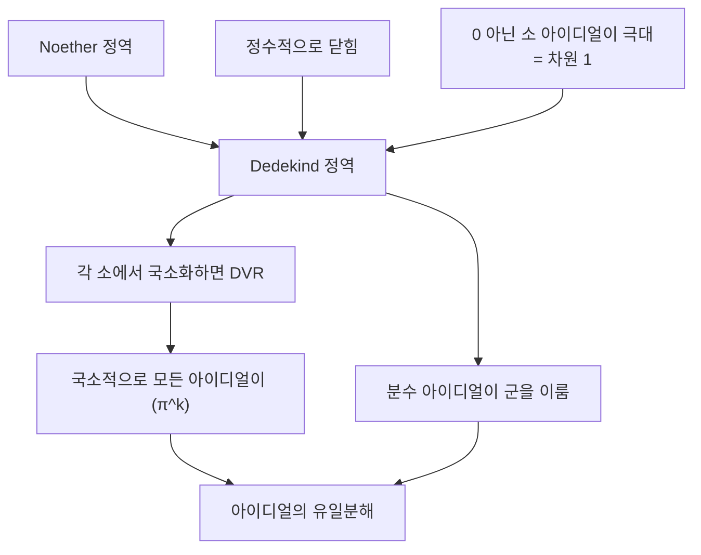

# Dedekind 정역과 아이디얼의 유일분해

# 개요

$\mathbb Z$ 에서 소인수분해가 유일하다는 성질은 특별하다. 정수를 조금만 넓혀도 깨진다. $\mathbb Z[\sqrt{-5}]$ 에서 $6=2\cdot3=(1+\sqrt{-5})(1-\sqrt{-5})$ 이고 네 인수가 모두 기약원이다.

Dedekind 가 찾은 복구 방법은 분해의 대상을 바꾸는 것이었다. 원소가 아니라 [아이디얼](prime-ideals.md)을 분해하면 유일성이 돌아온다. 이것이 성립하는 환의 부류가 Dedekind 정역이고, 조건은 세 줄로 끝난다. Noether 이고, 정수적으로 닫혀 있고, 0 이 아닌 소 아이디얼이 모두 극대다.

세 조건이 왜 그것인지가 이 문서의 주제다. 답은 [국소화](localization-rings.md)에 있다. 각 소 아이디얼에서 국소화하면 이산 부치환이라는 가장 단순한 환이 나오고, 거기서는 모든 아이디얼이 하나의 원소의 거듭제곱으로 생성된다. 전역적인 유일분해가 국소적으로 자명한 사실들을 모아 붙인 결과라는 관점이며, 대수적 정수론과 대수기하가 공유하는 골격이다.

# 직관

## 기약과 소가 갈라진다

$\mathbb Z$ 에서는 "더 쪼개지지 않는다"(기약)와 "곱을 나누면 인수 하나를 나눈다"(소)가 같은 뜻이다. 유일분해가 성립하는 이유가 바로 이 일치다.

$\mathbb Z[\sqrt{-5}]$ 에서 $2$ 는 기약이지만 소가 아니다. $2\mid(1+\sqrt{-5})(1-\sqrt{-5})=6$ 인데 어느 쪽도 나누지 않는다. 원소 $2$ 가 "절반만" 나누는 셈인데, 그 절반에 해당하는 원소가 환 안에 없다.

## 없는 인수를 아이디얼로 만든다

없는 원소를 아이디얼이 대신한다. $\mathfrak p=(2,1+\sqrt{-5})$ 를 잡으면 $\mathfrak p^2=(2)$ 이고, $(1+\sqrt{-5})=\mathfrak p\mathfrak q$ 꼴로 쪼개진다. 두 분해가 같은 소 아이디얼들의 곱으로 합쳐진다.

Dedekind 가 이것을 "이상적인 수" 라 부른 데서 아이디얼이라는 이름이 나왔다. 원소로는 존재하지 않는 가상의 인수를, 그 인수가 나누는 원소들의 집합으로 대신 표현한 것이다.

## 세 조건이 각각 무엇을 막는가

- Noether 성이 없으면 무한히 쪼개지는 아이디얼이 생겨 분해가 끝나지 않는다.
- 정수적으로 닫혀 있지 않으면 환이 "빠진 원소" 를 가진다. $\mathbb Z[\sqrt{-3}]$ 은 $\frac{1+\sqrt{-3}}2$ 를 놓쳤고, 그 결과 $(2)$ 가 소 아이디얼의 곱으로 쓰이지 않는다. 정수적 폐포를 취하면 고쳐진다.
- 차원이 1 이 아니면, 곧 소 아이디얼 사이에 포함관계가 층을 이루면 "소인수" 라는 개념이 한 층으로 정해지지 않는다. $k[x,y]$ 에서 $(x)\subset(x,y)$ 인 것이 그 예다.

## 국소화가 문제를 자명하게 만든다

$\mathfrak p$ 에서 국소화한 $\mathcal O_{\mathfrak p}$ 는 극대 아이디얼이 하나뿐인 1 차원 정역이고, 위 세 조건 아래에서 그 극대 아이디얼이 주 아이디얼 $(\pi)$ 가 된다. 모든 원소가 $u\pi^k$ 꼴로 유일하게 쓰이므로 분해가 자명하다.

전역의 아이디얼은 모든 국소화에서의 지수 $v_{\mathfrak p}(\mathfrak a)$ 로 완전히 결정된다. 유일분해는 "각 소마다 지수를 하나씩 읽는다" 는 진술이 된다.

# 정의

## Dedekind 정역

정역 $R$ 이 다음 셋을 만족하면 Dedekind 정역이라 한다.

- Noether: 모든 아이디얼이 유한생성이다.
- 정수적으로 닫힘: 분수체 $K$ 의 원소가 $R$ 계수 일계수 다항식의 근이면 그 원소가 $R$ 에 있다.
- 차원 1: 0 이 아닌 모든 소 아이디얼이 극대다.

체는 정의상 제외하거나 자명한 경우로 포함한다(문헌마다 다르다).

## 이산 부치환

극대 아이디얼이 하나뿐인 Dedekind 정역을 이산 부치환(DVR)이라 한다. 동치인 서술이 여럿이다.

- 국소 주 아이디얼 정역이면서 체가 아니다.
- 극대 아이디얼이 $(\pi)$ 로 생성되고, 0 이 아닌 모든 아이디얼이 $(\pi^k)$ 다.
- 분수체에 전사인 부치 $v:K^\times\to\mathbb Z$ 가 있어 $R=\{x:v(x)\ge0\}\cup\{0\}$ 이다.

$\pi$ 를 균등화원이라 한다. $\mathbb Z_{(p)}$ 와 $p$ 진 정수환 $\mathbb Z_p$ 와 형식적 멱급수환 $k[[t]]$ 가 표준 예다.

## 분수 아이디얼

$K$ 의 $R$ 부분가군 $I$ 중에서 $dI\subseteq R$ 인 $d\in R\setminus\{0\}$ 가 존재하는 것을 분수 아이디얼이라 한다. 곱은 원소들의 곱이 생성하는 가군으로 정의한다.

$I$ 가 가역이라는 것은 $IJ=R$ 인 $J$ 가 있다는 뜻이며, 그때 $J=\{x\in K:xI\subseteq R\}$ 로 유일하다.

## 부치와 지수

Dedekind 정역의 각 소 아이디얼 $\mathfrak p$ 에 대해 국소화 $R_{\mathfrak p}$ 가 DVR 이고, 그 부치를 $v_{\mathfrak p}$ 로 쓴다. 0 이 아닌 분수 아이디얼 $I$ 에 대해 $v_{\mathfrak p}(I)$ 는 $IR_{\mathfrak p}=\mathfrak p^{k}R_{\mathfrak p}$ 인 $k$ 다.

# 성질

## 동치인 특징들

정역 $R$ 에 대해 다음이 모두 동치다.

- $R$ 이 Dedekind 정역이다.
- 0 이 아닌 모든 아이디얼이 소 아이디얼의 곱으로 유일하게 쓰인다.
- 0 이 아닌 모든 분수 아이디얼이 가역이다. 곧 분수 아이디얼 전체가 군을 이룬다.
- $R$ 이 Noether 이고, 모든 국소화 $R_{\mathfrak p}$ 가 DVR 이다.
- $R$ 이 Noether 이고 1 차원이며, 모든 아이디얼이 원소 두 개로 생성된다.

마지막 항목은 실무에서 유용하다. 아이디얼이 언제나 $(\alpha,\beta)$ 꼴이며, 게다가 $\alpha$ 를 0 이 아닌 원소 중 아무거나 골라도 된다.

## 유일분해

$$
\mathfrak a=\prod_{\mathfrak p}\mathfrak p^{\,v_{\mathfrak p}(\mathfrak a)}
$$

유한 개의 $\mathfrak p$ 에서만 지수가 0 이 아니다. 분수 아이디얼에서는 지수가 음수일 수 있고, 그러면 군 구조가 $\bigoplus_{\mathfrak p}\mathbb Z$ 와 동형이 된다. 곧 분수 아이디얼군이 소 아이디얼을 기저로 하는 자유 아벨군이다.

포함관계가 나눗셈과 같다는 점도 따라온다. $\mathfrak a\subseteq\mathfrak b\iff\mathfrak b\mid\mathfrak a$ 이며, "나누는 것이 품는 것" 이라는 표어로 불린다.

## 유수군

주 분수 아이디얼이 부분군을 이루므로 몫을 취할 수 있다.

$$
\mathrm{Cl}(R)=\frac{\{\text{분수 아이디얼}\}}{\{\text{주 분수 아이디얼}\}}
$$

$\mathrm{Cl}(R)=1$ 인 것과 $R$ 이 주 아이디얼 정역인 것과 유일분해 정역인 것이 모두 동치다. 일반 Noether 정역에서는 주 아이디얼 정역이 유일분해 정역보다 진짜로 강한 조건인데, Dedekind 정역에서는 두 개념이 붕괴한다.

$R$ 이 [대수적 수체](algebraic-number-fields.md)의 정수환이면 이 군이 유한하지만, 일반 Dedekind 정역에서는 그렇지 않다. Claborn 의 정리에 따르면 임의의 아벨군이 어떤 Dedekind 정역의 유수군으로 실현된다.

## 예와 비예

Dedekind 정역인 것.

- $\mathbb Z$ 와 체 위의 다항식환 $k[t]$ 를 비롯한 모든 주 아이디얼 정역.
- 수체의 정수환 $\mathcal O_K$ 다.
- 체 위의 비특이 아핀 곡선의 좌표환.

아닌 것.

- $\mathbb Z[\sqrt{-3}]$ 은 정수적으로 닫혀 있지 않다. 폐포는 $\mathbb Z[\frac{1+\sqrt{-3}}2]$ 이고 그것은 Dedekind 다.
- $k[x,y]$ 는 차원이 2 다. 유일분해 정역이지만 Dedekind 는 아니다.
- $k[x,y]/(y^2-x^3)$ 은 첨점이 있는 곡선이라 특이점에서 정수적으로 닫히지 않는다. 정수적 폐포를 취하는 것이 기하적으로는 특이점 해소다.

세 번째 예가 이 이론의 기하적 의미를 보여 준다. "정수적으로 닫혀 있다" 가 "곡선이 매끄럽다" 에 대응하고, 아이디얼의 유일분해가 "점마다 소멸 차수를 읽을 수 있다" 에 대응한다.

# 활용

## 대수적 정수론의 기반

수체의 정수환이 Dedekind 정역이라는 정리가 이 분야의 첫 구조 정리다. 소수 $p$ 가 $p\mathcal O_K=\prod\mathfrak p_i^{e_i}$ 로 쪼개지고, $\sum e_if_i=n$ 이라는 등식이 성립하며, 분기 소수가 판별식을 나누는 유한 개뿐이라는 사실이 전부 여기서 나온다.

$\mathbb Z[x]/(f)$ 가 정수적으로 닫혀 있지 않은 경우가 흔하므로, 실제 계산에서는 정수적 폐포를 구하는 것이 첫 단계다. Round 2 나 Pohst–Zassenhaus 알고리즘이 이 일을 하며, 판별식의 제곱인수를 찾는 것이 병목이라 큰 차수에서는 여전히 어렵다.

## 곡선의 기하

비특이 아핀 곡선의 좌표환이 Dedekind 정역이고, 소 아이디얼이 곡선의 점에 대응한다. 부치 $v_{\mathfrak p}(f)$ 는 함수 $f$ 가 점 $\mathfrak p$ 에서 갖는 소멸 차수이며, 아이디얼의 유일분해가 인자의 언어가 된다.

유수군은 이때 Picard 군이다. 곡선 위의 선다발 또는 인자류를 분류하며, 타원곡선의 군 구조가 바로 이 군이다. 수체와 함수체가 같은 틀 안에 들어온다는 것이 대수적 정수론과 대수기하가 평행하게 전개되는 이유다.

## 가군의 분류

Dedekind 정역 위의 유한생성 가군은 완전히 분류된다. 비틀림 부분과 자유 부분으로 갈리고, 계수 $n$ 인 사영 가군은 $R^{n-1}\oplus I$ 꼴로 아이디얼 하나만큼의 자유도를 가진다. 두 가군이 동형인 것은 계수가 같고 유수류가 같은 것과 동치다.

주 아이디얼 정역 위의 가군 구조 정리(유한생성 아벨군의 분류를 포함한다)가 유수가 1 인 특수한 경우다. 유수군이 정확히 그 정리가 얼마나 어긋나는지를 재는 양이다.

## 국소–전역 원리

Dedekind 정역의 성질이 모든 국소화에서의 성질로 환원된다는 관점이 더 넓은 원리의 원형이다. 아이디얼이 국소 데이터로 결정되고, 가군의 성질이 국소적으로 확인되며, 전역 대상은 국소 대상들을 겹치는 부분에서 붙인 것이다.

같은 사고가 층과 스킴의 언어로 일반화되어 현대 대수기하의 골격이 되었다. 정칙 국소환이 매끄러운 점에, 차원 1 인 경우가 곡선에 대응하며, Dedekind 정역은 그 가장 단순한 비자명 사례다.

# 연관 문서

## 선수지식

- [소 아이디얼과 극대 아이디얼](prime-ideals.md)
- [환의 국소화](localization-rings.md)

## 더 알아보기

- [대수적 수체와 정수환](algebraic-number-fields.md)

#ring_theory #algebra #number_theory
