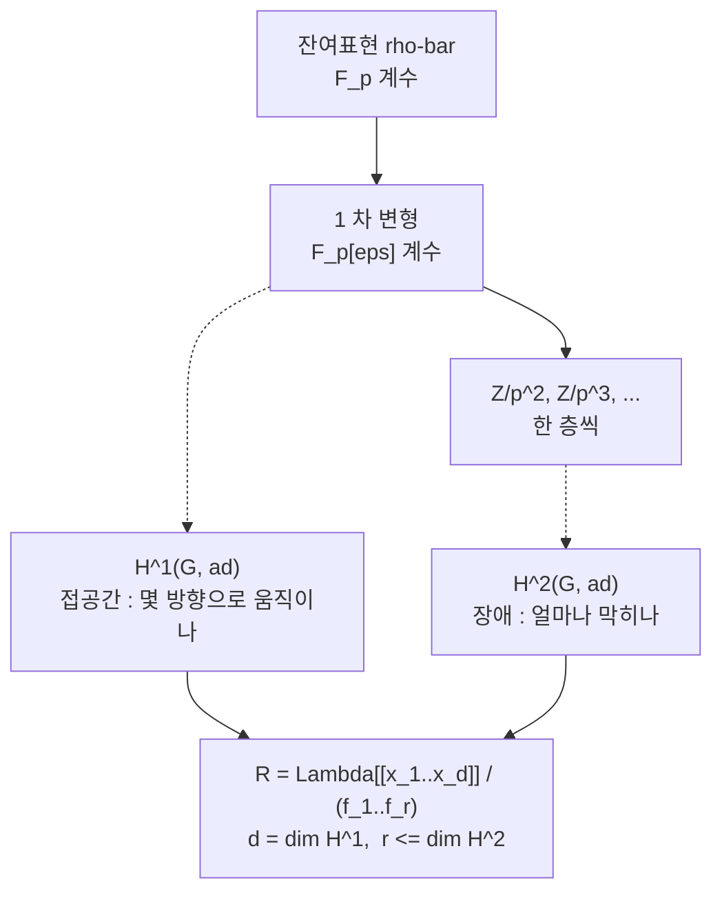

# Galois 표현의 변형과 보편 변형환

# 개요

[Fontaine–Mazur 추측](fontaine-mazur.md)은 어떤 $p$ 진 Galois 표현이 기하에서 오는지를 국소 조건으로 판정한다. 그 진술을 정리로 바꾸는 기계가 $R=T$ 이고, 이 문서는 그 $R$ 쪽인 **변형환**을 만든다.

Mazur 의 착상은[^1] 유한체 위의 표현

$$
\bar\rho\colon G\longrightarrow \mathrm{GL}\_n(\mathbb F_p)
$$

로 환원되는 $p$ 진 표현을 하나씩 찾는 대신 전부 한꺼번에 다루는 것이다. 완비 국소환 $A$ 마다 $A$ 계수 올림의 집합 $D(A)$ 를 대응시키면 함자가 되고, 적당한 조건 아래 표현가능하다. 환 $R_{\bar\rho}$ 와 그 위의 표현 하나가 있어

$$
D(A)\thickspace\cong\thickspace\mathrm{Hom}\_{\text{연속}}(R_{\bar\rho},A)
$$

가 모든 $A$ 에서 자연스럽게 성립한다. $\bar\rho$ 의 모든 올림이 $R_{\bar\rho}$ 위의 **보편 변형** 하나의 특수화이고, 표현론의 질문이 가환대수의 질문이 된다.

환의 모양은 코호몰로지가 정한다. 접공간은 $H^1(G,\mathrm{ad}\thinspace\bar\rho)$ 이고 관계식의 장애는 $H^2(G,\mathrm{ad}\thinspace\bar\rho)$ 에 산다. [군 확대](group-extensions.md)를 $H^2$ 로 분류하고 $H^1$ 로 자기동형을 재던 기계가, 여기서는 계수환을 $\mathbb Z/p^m$ 으로 한 층씩 올리는 데 쓰인다.

# 직관

## 1 차 변형과 코사이클

$\bar\rho$ 를 $\mathbb Z/p^2$ 계수로 올려 행렬 성분을 $p$ 배의 보정으로 쓴다.

$$
\rho(g)=\bigl(1+p\thinspace c(g)\bigr)\thinspace\tilde{\bar\rho}(g)
$$

$\rho$ 가 준동형일 조건을 $p^2=0$ 에서 전개하면 $c$ 에 대한 조건 하나가 남는다.

$$
c(gh)=c(g)+\mathrm{Ad}(\bar\rho(g))\thinspace c(h)
$$

계수가 $\mathrm{ad}\thinspace\bar\rho=M_n(\mathbb F_p)$ 인 1-코사이클 조건이다. $1+pm$ 꼴로 켤레를 취하면 $c$ 가 coboundary 만큼 바뀌므로

$$
\lbrace\text{1 차 변형}\rbrace\big/\text{동치}\thickspace\cong\thickspace H^1(G,\mathrm{ad}\thinspace\bar\rho)
$$

이다. 보정항이 $\mathfrak{gl}\_n$ 값이고 $G$ 가 그 위에 켤레로 작용하므로 계수가 $\mathrm{ad}$ 다.

## 장애류

$\mathbb Z/p^m$ 에서 $\mathbb Z/p^{m+1}$ 로 한 층 올릴 때 들어 올린 사상은 준동형이 아니고, 어긋나는 정도가 2-코사이클을 만든다. 그 류가 $H^2(G,\mathrm{ad}\thinspace\bar\rho)$ 에서 $0$ 이어야 올림이 존재하며, 이를 **장애류**라 한다.

$H^2=0$ 이면 장애가 없어 모든 층이 올라가고 $R$ 은 형식적 멱급수환이다. $H^2\ne0$ 이면 관계식이 생기며 개수는 $\dim H^2$ 를 넘지 않는다. 상한과 실제 개수 사이의 간격에 계산의 어려움이 모인다.

## 표현가능성 조건

함자 $D$ 가 표현가능하려면 올림을 붙여 나갈 때 선택이 유일해야 한다. $\bar\rho$ 가 자명하지 않은 자기준동형을 가지면 동치류를 붙이는 방식이 여럿이 되어 보편 대상이 깨진다. 그래서 Schur 조건을 건다.

$$
\mathrm{End}\_{G}(\bar\rho)=\mathbb F_p\qquad(\text{예컨대 }\bar\rho\ \text{가 절대기약})
$$

이 조건이 있으면 Schlessinger 의 판정[^2]이 통과하고 $R_{\bar\rho}$ 가 존재한다. 없으면 기저까지 기억하는 **틀 붙인 변형**을 쓴다. 틀 변형 함자는 언제나 표현가능하고 $\mathrm{PGL}\_n$ 만큼 차원이 늘어난 $R^{\square}\_{\bar\rho}$ 를 준다. Kisin 이 국소 조건을 다룰 때 쓰는 것이 이쪽이다.

# 정의

## 계수환의 범주

$\Lambda$ 를 잉여체 $k=\mathbb F_p$ 인 완비 이산부치환이라 하고 보통 $\mathbb Z_p$ 를 쓴다. 범주 $\mathcal C_\Lambda$ 의 대상은 잉여체가 $k$ 인 완비 국소 Noether $\Lambda$ 대수, 사상은 국소 $\Lambda$ 대수 준동형이다. 유한 길이 대상만 모은 부분범주에서 함자를 정의하고 극한으로 넘긴다.

## 변형 함자

$\bar\rho\colon G\to\mathrm{GL}\_n(k)$ 에 대해

$$
D_{\bar\rho}(A)=\Bigl\lbrace\rho\colon G\to\mathrm{GL}\_n(A)\ \text{연속}\ \Big|\ \rho\bmod\mathfrak m_A=\bar\rho\Bigr\rbrace\Big/\ \ker\bigl(\mathrm{GL}\_n(A)\to\mathrm{GL}\_n(k)\bigr)\text{-켤레}
$$

로 둔다. 켤레를 나누지 않은 것이 **틀 붙인 변형 함자** $D^{\square}\_{\bar\rho}$ 다.

수론에서 $G$ 는 유한집합 $S$ 밖에서 비분기인 최대 확대의 Galois 군 $G_{\mathbb Q,S}$ 다. 이 군이 Mazur 의 $p$ 유한성 조건 $\Phi_p$ 를 만족하므로 코호몰로지가 유한 차원이다.

## 보편 변형환

**정리(Mazur).** $G$ 가 $\Phi_p$ 를 만족하고 $\mathrm{End}\_G(\bar\rho)=k$ 이면 $D_{\bar\rho}$ 는 표현가능하다. 곧 $R_{\bar\rho}\in\mathcal C_\Lambda$ 와 보편 변형 $\rho^{\mathrm{univ}}\colon G\to\mathrm{GL}\_n(R_{\bar\rho})$ 가 있어 모든 $A$ 에서

$$
\mathrm{Hom}\_{\mathcal C_\Lambda}(R_{\bar\rho},A)\thickspace\xrightarrow{\ \sim\ }\thickspace D_{\bar\rho}(A),
\qquad \varphi\longmapsto \varphi\circ\rho^{\mathrm{univ}}
$$

이 전단사다. Schur 조건 없이도 $D^{\square}\_{\bar\rho}$ 는 $R^{\square}\_{\bar\rho}$ 로 표현가능하다.

## 접공간과 표시

이중수 $k[\varepsilon]$ 에서의 값이 접공간이다.

$$
D_{\bar\rho}(k[\varepsilon])\thickspace\cong\thickspace\mathrm{Hom}\_k\bigl(\mathfrak m_R/(\mathfrak m_R^2,p),\thinspace k\bigr)\thickspace\cong\thickspace H^1(G,\mathrm{ad}\thinspace\bar\rho)
$$

$d=\dim_k H^1$ 개의 생성원으로 $R$ 을 덮을 수 있고 장애 이론이 관계식의 개수를 누른다.

$$
R_{\bar\rho}\thickspace\cong\thickspace\Lambda[[x_1,\dots,x_d]]/(f_1,\dots,f_r),\qquad r\le \dim_k H^2(G,\mathrm{ad}\thinspace\bar\rho)
$$

$H^2=0$ 이면 $R_{\bar\rho}\cong\Lambda[[x_1,\dots,x_d]]$ 로 매끄럽고, 일반적으로

$$
\dim R_{\bar\rho}\thickspace\ge\thickspace 1+\dim H^1-\dim H^2
$$

이다. 오른쪽은 Tate 의 전역 Euler 표수 공식으로 $H^0$ 과 무한소수 자리의 기여만으로 계산된다. $\mathrm{GL}\_2$ 의 홀수 $\bar\rho$ 에서 $\mathrm{ad}^0$ 를 쓰면 하한이 $1$ 이고, $R$ 이 $\Lambda$ 위 유한이라는 기대와 맞는다.

## 조건을 단 변형

실제로 쓰는 것은 부분함자를 잘라낸 것이다.

- **$S$ 밖 비분기**: $G_{\mathbb Q,S}$ 를 쓰는 것으로 반영된다.
- **행렬식 고정**: $\det\rho=\chi^{k-1}\cdot(\text{유한 지표})$ 를 요구한다.
- **$p$ 자리의 국소 조건**: 평탄, 결정적, 반안정, 또는 Hodge–Tate 무게를 지정한 것. [Fontaine–Mazur](fontaine-mazur.md) 의 de Rham 조건을 변형환의 언어로 옮긴 것이다[^4].
- **$\ell\ne p$ 자리의 국소 조건**: 도체의 형태를 지정한다.

각 조건은 국소 틀 변형환 $R^{\square}\_v$ 의 닫힌 부분스킴에 대응하고 전역 변형환은 그 교차로 잘린다. Kisin 은 $p$ 자리 국소 틀 변형환의 기약 성분을 분류했고, 그 성분들이 $p$ 진 국소 Langlands 대응의 표현론적 자료와 맞물려 모듈러성 올림 정리의 국소 입력이 되었다.

# 성질

## $R=T$

같은 $\bar\rho$ 로 환원되는 고유형식들의 Hecke 대수 $\mathbb T_{\bar\rho}$ 도 $\mathcal C_\Lambda$ 의 대상이고, Galois 표현을 만드는 구성이 자연사상

$$
R_{\bar\rho}\longrightarrow\mathbb T_{\bar\rho}
$$

을 준다. 모듈러성은 이 사상의 전사성에 해당하고 **$R=T$ 정리**는 동형이라는 주장이다. 동형이면 조건을 만족하는 $\bar\rho$ 의 모든 변형이 모듈러다.

Wiles 와 Taylor 의 증명[^3]은 수치 판정을 쓴다. $R$ 이 완전교차이고 $\mathbb T$ 의 합동 가군의 크기가 $R$ 의 여접공간 크기와 맞으면 동형이라는 가환대수 보조정리를 만들고, Taylor–Wiles 계가 그 조건을 공급한다. 보조 소수를 무한히 붙였다 극한을 취해 $R$ 을 $\Lambda[[x_1,\dots,x_g]]$ 위에서 통제하는 패칭 논법이며, Diamond, Fujiwara, Kisin, Calegari–Geraghty 를 거쳐 $\mathrm{GL}\_n$ 과 수체로 확장되었다.

## 장애 없는 변형

$H^2(G_{\mathbb Q,S},\mathrm{ad}^0\bar\rho)=0$ 이면 변형 문제가 장애 없음이라 하고 $R$ 은 $\mathbb Z_p[[x_1,x_2,x_3]]$ 이다. Böckle 등은 $\bar\rho$ 의 상이 충분히 크고 $p$ 가 작지 않으면 대체로 그렇다는 결과를 얻었다. 이때 변형 공간은 매끄러운 3 차원 덩어리이고 모듈러 점들의 배치가 다음 질문이 된다.

## Serre 추측과 모듈러성 올림

- **Serre 추측**: Khare–Wintenberger 의 증명은 $\bar\rho$ 를 올려 특성 $0$ 표현을 만들고 모듈러성 올림으로 옮기는 귀납이다. 올리는 단계가 변형환의 점을 찾는 일이고, Ramakrishna 의 올림 정리가 국소 조건을 단 변형환이 비어 있지 않음을 보장한다.
- **모듈러성 올림**: $\bar\rho$ 가 모듈러이면 조건을 만족하는 변형도 모듈러라는 정리들이 $R=T$ 의 변주다. Fermat 의 마지막 정리가 첫 응용이었다.
- **Fontaine–Mazur**: de Rham 조건을 단 변형환의 $\mathbb Q_p$ 값 점이 모두 $\mathbb T$ 에서 온다는 것이 추측의 내용이다. Kisin 과 Emerton 의 $\mathrm{GL}\_2$ 증명은 국소 변형환의 기하를 $p$ 진 국소 Langlands 로 읽는다.
- **고유다양체**: 변형환의 점을 강체적으로 해석해 얻는 $p$ 진 해석공간이 Hida 족과 eigenvariety 다. 고전점이 그 안에 조밀하게 놓이고, 어느 점이 de Rham 인지가 다시 Fontaine–Mazur 다.

# 활용

## 1 차원 변형환의 계산

$n=1$ 이고 $\bar\rho$ 가 자명한 지표이면 $\mathrm{ad}\thinspace\bar\rho$ 는 자명 계수 $\mathbb F_p$ 이고 $A$ 계수 변형은 $\rho\colon G\to 1+\mathfrak m_A$ 다. 켤레가 자명하므로 틀 문제가 없다.

$G=\mathbb Z_p$ 이면 생성원 $\gamma$ 를 $t\in\mathfrak m_A$ 로 $\gamma\mapsto 1+t$ 로 보내면 되므로

$$
R=\mathbb Z_p[[T]],\qquad \rho^{\mathrm{univ}}(\gamma)=1+T
$$

이고 $H^2(\mathbb Z_p,\mathbb F_p)=0$ 이라 매끄럽다.

$G=\mathbb Z/p$ 이면 $\gamma^p=1$ 이므로 $(1+t)^p=1$ 이 요구된다.

$$
R=\mathbb Z_p[[T]]\big/\bigl((1+T)^p-1\bigr)
$$

$\dim H^1(\mathbb Z/p,\mathbb F_p)=1$ 이 생성원 개수를, $\dim H^2(\mathbb Z/p,\mathbb F_p)=1$ 이 관계식 개수의 상한을 준다. $(1+T)^p-1=T\cdot\Phi_p(1+T)$ 이고 $\Phi_p(1+T)$ 가 $p$ 에서 Eisenstein 이므로

$$
R\thickspace\cong\thickspace\mathbb Z_p\ \times\ \mathbb Z_p[\zeta_p]
$$

이고 두 성분은 자명한 변형과 $p$ 차 분기 지표에 해당한다.

$\mathbb Z_p$ 쪽은 계수환을 한 층 키울 때마다 변형이 $p$ 배로 늘어난다. $R=\mathbb Z_p[[T]]$ 가 $\mathbb Z_p$ 위 상대 차원 $1$ 이기 때문이다. $\mathbb Z/p$ 쪽은 $A=\mathbb Z/p^2$ 에서 $p$ 개로 포화된다. $R$ 이 $\mathbb Z_p$ 위 유한이라 $\mathbb Z/p^k$ 값 점이 유한개다.

수론의 상황은 두 극단 사이에 있다. $G_{\mathbb Q,S}$ 는 $\mathbb Z_p$ 보다 크고 $H^1$ 이 여러 차원이지만, $p$ 자리의 국소 조건과 행렬식 고정이 관계식을 걸어 $R$ 을 $\mathbb Z_p$ 위 유한에 가깝게 누른다. $R=T$ 가 성립하면 그 유한한 목록이 고유형식의 목록이다.

## 접공간 계산 절차

구체적인 $\bar\rho$ 에 대해 $\dim H^1(G_{\mathbb Q,S},\mathrm{ad}^0\bar\rho)$ 를 구하는 것이 첫 단계다.

1. $\bar\rho$ 의 상을 결정하고 $\mathrm{ad}^0$ 의 $G$ -가군 분해를 본다.
2. $H^0$ 를 읽는다. 상이 충분히 크면 $H^0(\mathrm{ad}^0)=0$ 이다.
3. Tate 의 전역 Euler 표수 공식으로 $\dim H^1-\dim H^2$ 를 얻는다. 홀수 $\bar\rho$ 와 $\mathrm{ad}^0$ 에서 이 값은 $S$ 와 무한소수 자리의 기여로 정해진다.
4. Poitou–Tate 완전열로 국소 조건을 단 Selmer 군과 쌍대 Selmer 군을 연결하고 조건이 자른 $H^1$ 을 센다.

3 단계까지가 형식적이고 4 단계에서 쌍대 Selmer 군을 죽이는 것이 어렵다. Taylor–Wiles 계에서 보조 소수를 붙이는 목적이 그 쌍대 군을 $0$ 으로 만드는 것이다.

[^1]: B. Mazur, *Deforming Galois representations*, Galois Groups over $\mathbb Q$ (MSRI Publ. 16, 1989), 385–437. 변형 함자, $\Phi_p$ 조건, 표현가능성, 접공간이 $H^1$ 이라는 계산이 모두 이 논문에 있다.

[^2]: M. Schlessinger, *Functors of Artin rings*, Trans. AMS **130** (1968), 208–222. 표현가능성 판정.

[^3]: A. Wiles, *Modular elliptic curves and Fermat's Last Theorem*, Ann. of Math. **141** (1995); R. Taylor, A. Wiles, *Ring-theoretic properties of certain Hecke algebras*, 같은 권. $R=T$ 와 패칭 논법의 원전.

[^4]: M. Kisin, *Moduli of finite flat group schemes, and modularity*, Ann. of Math. **170** (2009), 1085–1180. 국소 틀 변형환의 기약 성분과 모듈러성 올림.

# 연관 문서

## 선수지식

- [Fontaine–Mazur 추측](fontaine-mazur.md)
- [군 확대와 Jordan–Hölder 정리](group-extensions.md)
- [Poitou–Tate 완전열과 대역 상호법칙](poitou-tate.md)

## 더 알아보기

- [Serre 추측과 Khare–Wintenberger 정리](serre-conjecture.md)

#number_theory #group_theory #ring_theory #construction
