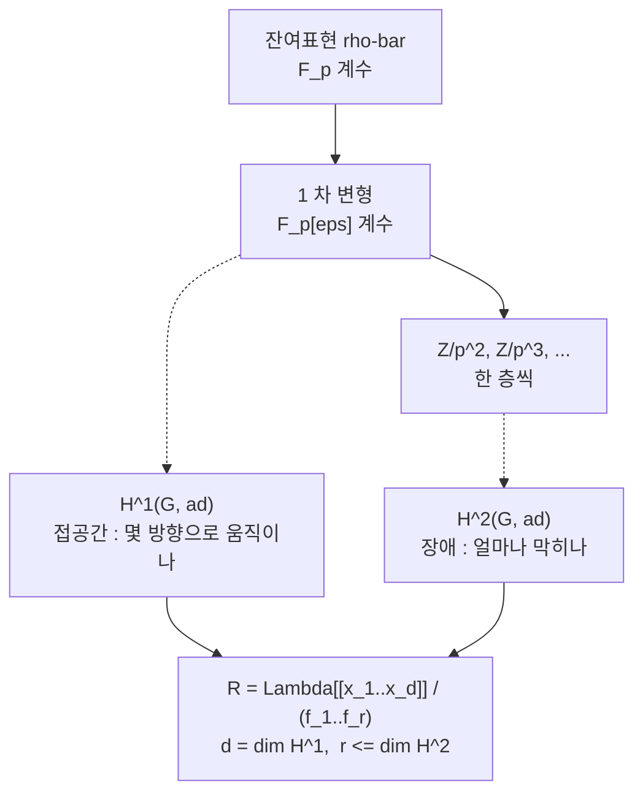

# Galois 표현의 변형과 보편 변형환

# 개요

[Fontaine–Mazur 추측](fontaine-mazur.md)은 어떤 `p` 진 Galois 표현이 기하에서 오는지를 국소 조건으로 판정하자는 제안이었고, 그 진술을 정리로 바꾸는 기계가 `R=T` 다. 이 문서는 그 `R` 쪽, 곧 **변형환**을 만든다.

착상은 Mazur 의 것이다.[^1] 유한체 위의 표현 하나

$$
\bar\rho\colon G\longrightarrow \mathrm{GL}_n(\mathbb F_p)
$$

를 고정하고, 이것으로 환원되는 `p` 진 표현을 **하나씩** 찾는 대신 **전부 한꺼번에** 다룬다. 완비 국소환 `A` 마다 `A` 계수 올림의 집합 `D(A)` 를 대응시키면 함자가 되고, 적당한 조건 아래 이 함자는 표현가능하다. 즉 환 `R_{\bar\rho}` 와 그 위의 표현 하나가 있어

$$
D(A)\;\cong\;\mathrm{Hom}_{\text{연속}}(R_{\bar\rho},A)
$$

가 모든 `A` 에서 자연스럽게 성립한다. `\bar\rho` 의 모든 올림이 `R_{\bar\rho}` 위의 **보편 변형** 하나에서 특수화로 나온다는 뜻이다. 표현들의 모임이 환 하나가 되고, 표현론의 질문이 가환대수의 질문으로 바뀐다.

환의 모양은 코호몰로지가 정한다. 접공간은 `H^1(G,\mathrm{ad}\,\bar\rho)`, 관계식의 장애는 `H^2(G,\mathrm{ad}\,\bar\rho)` 에 산다. [군 확대](group-extensions.md)에서 확대가 `H^2` 로 분류되고 `H^1` 이 자기동형을 쟀던 것과 같은 기계가, 여기서는 계수환을 `\mathbb Z/p^m` 으로 한 층씩 올리는 데 쓰인다. 한 층 올리는 문제가 곧 작은 확대 문제이기 때문이다.

# 직관

## 변형은 `p` 진 방향의 미분이다

`\bar\rho` 를 `\mathbb Z/p^2` 계수로 올린다고 하자. 행렬 성분을 `\bar\rho(g)` 에 `p` 배의 보정을 더한 것으로 쓴다.

$$
\rho(g)=\bigl(1+p\,c(g)\bigr)\,\tilde{\bar\rho}(g)
$$

`\rho` 가 준동형일 조건을 `p^2=0` 에서 전개하면 `c` 에 대한 조건이 하나 남는다.

$$
c(gh)=c(g)+\mathrm{Ad}(\bar\rho(g))\,c(h)
$$

이것이 계수가 `\mathrm{ad}\,\bar\rho=M_n(\mathbb F_p)` 인 **1-코사이클** 조건이다. 그리고 `1+pm` 꼴로 켤레를 취하면 `c` 가 coboundary 만큼 바뀐다. 그러므로

$$
\{\text{1 차 변형}\}\big/\text{동치}\;\cong\;H^1(G,\mathrm{ad}\,\bar\rho)
$$

이다. 변형이론의 첫 문장이 이것 하나다. `\mathrm{ad}` 를 계수로 쓰는 이유도 여기서 나온다 — 보정항이 `\mathfrak{gl}_n` 값이고 `G` 는 그 위에 켤레로 작용한다.

## 한 층씩 올리다 걸리는 곳

`\mathbb Z/p^m` 까지 올렸다고 하고 `\mathbb Z/p^{m+1}` 로 한 층 더 가려 한다. 아무렇게나 들어 올린 사상은 준동형이 아니고, 준동형에서 어긋나는 정도가 2-코사이클을 하나 만든다. 그 류가 `H^2(G,\mathrm{ad}\,\bar\rho)` 에서 `0` 이어야 올림이 존재한다. 이것이 **장애류**다.



`H^2=0` 이면 장애가 아예 없으므로 모든 층이 올라가고 `R` 은 형식적 멱급수환, 곧 매끄럽다. `H^2\ne0` 이면 관계식이 생기는데, 개수는 `\dim H^2` 를 넘지 않는다. 넘지 않을 뿐 정확히 같을 필요는 없고, 이 간격이 실제 계산의 어려움이 모여 있는 자리다.

## 왜 보편 대상이 존재하는가

함자 `D` 가 표현가능하려면 올림을 붙여 나갈 때 선택이 유일해야 한다. 걸림돌은 자기동형이다. `\rho` 와 그 켤레를 같다고 보는데, `\bar\rho` 가 자명하지 않은 자기준동형을 가지면 동치류를 붙이는 방식이 여럿이 되어 보편 대상이 깨진다. 그래서 조건을 건다.

$$
\mathrm{End}_{G}(\bar\rho)=\mathbb F_p\qquad(\text{예컨대 }\bar\rho\ \text{가 절대기약})
$$

Schur 조건이라 부른다. 이것이 있으면 Schlessinger 의 판정이 통과하고 `R_{\bar\rho}` 가 존재한다. 없으면 대신 기저까지 함께 기억하는 **틀 붙인 변형**을 쓴다. 틀 변형 함자는 언제나 표현가능하고, 대가로 `\mathrm{PGL}_n` 만큼 차원이 늘어난 `R^{\square}_{\bar\rho}` 가 나온다. Kisin 이 국소 조건을 다룰 때 쓰는 것이 이쪽이다.

# 정의

## 계수환의 범주

`\Lambda` 를 잉여체 `k=\mathbb F_p` 인 완비 이산부치환(보통 `\mathbb Z_p`)이라 하자. 범주 `\mathcal C_\Lambda` 의 대상은 잉여체가 `k` 인 완비 국소 Noether `\Lambda`-대수이고, 사상은 국소 `\Lambda`-대수 준동형이다. 유한 길이 대상만 모은 부분범주에서 함자를 정의하고 극한으로 넘긴다.

## 변형 함자

`\bar\rho\colon G\to\mathrm{GL}_n(k)` 에 대해

$$
D_{\bar\rho}(A)=\Bigl\{\rho\colon G\to\mathrm{GL}_n(A)\ \text{연속}\ \Big|\ \rho\bmod\mathfrak m_A=\bar\rho\Bigr\}\Big/\ \ker\bigl(\mathrm{GL}_n(A)\to\mathrm{GL}_n(k)\bigr)\text{-켤레}
$$

로 둔다. 켤레를 나누지 않은 것이 **틀 붙인 변형 함자** `D^{\square}_{\bar\rho}` 다.

수론에서 `G` 는 유한집합 `S` 밖에서 비분기인 최대 확대의 Galois 군 `G_{\mathbb Q,S}` 를 쓴다. 이 군이 `p` 유한성 조건(Mazur 의 `\Phi_p`)을 만족하므로 코호몰로지가 유한 차원이고 아래 정리가 돌아간다.

## 보편 변형환

**정리(Mazur).** `G` 가 `\Phi_p` 를 만족하고 `\mathrm{End}_G(\bar\rho)=k` 이면 `D_{\bar\rho}` 는 표현가능하다. 곧 `R_{\bar\rho}\in\mathcal C_\Lambda` 와 보편 변형 `\rho^{\mathrm{univ}}\colon G\to\mathrm{GL}_n(R_{\bar\rho})` 가 있어 모든 `A` 에서

$$
\mathrm{Hom}_{\mathcal C_\Lambda}(R_{\bar\rho},A)\;\xrightarrow{\ \sim\ }\;D_{\bar\rho}(A),
\qquad \varphi\longmapsto \varphi\circ\rho^{\mathrm{univ}}
$$

이 전단사다. Schur 조건 없이도 `D^{\square}_{\bar\rho}` 는 언제나 `R^{\square}_{\bar\rho}` 로 표현가능하다.

## 접공간과 표시

이중수 `k[\varepsilon]` 에서의 값이 접공간이다.

$$
D_{\bar\rho}(k[\varepsilon])\;\cong\;\mathrm{Hom}_k\bigl(\mathfrak m_R/(\mathfrak m_R^2,p),\,k\bigr)\;\cong\;H^1(G,\mathrm{ad}\,\bar\rho)
$$

따라서 `d=\dim_k H^1` 개의 생성원으로 `R` 을 덮을 수 있고, 장애 이론이 관계식의 개수를 누른다.

$$
R_{\bar\rho}\;\cong\;\Lambda[[x_1,\dots,x_d]]/(f_1,\dots,f_r),\qquad r\le \dim_k H^2(G,\mathrm{ad}\,\bar\rho)
$$

특히 `H^2=0` 이면 `R_{\bar\rho}\cong\Lambda[[x_1,\dots,x_d]]` 로 매끄럽고, 어떤 경우든

$$
\dim R_{\bar\rho}\;\ge\;1+\dim H^1-\dim H^2
$$

이다. 오른쪽은 Tate 의 전역 Euler 표수 공식으로 `H^0` 과 무한소수 자리의 기여만으로 계산된다. `\mathrm{GL}_2` 의 홀수 `\bar\rho` 에서 `\mathrm{ad}^0` 를 쓰면 이 하한이 `1` 이 되어, `R` 이 `\Lambda` 위 유한이라는 기대와 맞아떨어진다.

## 조건을 단 변형

그냥 변형환은 너무 크다. 실제로 쓰는 것은 부분함자를 잘라낸 것이다.

- **`S` 밖 비분기**: `G_{\mathbb Q,S}` 를 쓰는 것으로 이미 반영된다.
- **행렬식 고정**: `\det\rho=\chi^{k-1}\cdot(\text{유한 지표})` 를 요구한다.
- **`p` 자리의 국소 조건**: 평탄, 결정적, 반안정, 또는 Hodge–Tate 무게를 지정한 것. 이 조건들이 [Fontaine–Mazur](fontaine-mazur.md) 의 de Rham 조건을 변형환의 언어로 옮긴 것이다.
- **`\ell\ne p` 자리의 국소 조건**: 도체의 형태를 지정한다.

각 조건은 국소 틀 변형환 `R^{\square}_v` 의 닫힌 부분스킴에 대응하고, 전역 변형환은 그 조건들을 모두 만족하는 부분으로 잘린다. Kisin 은 `p` 자리의 국소 틀 변형환의 **기약 성분**을 분류했고, 그 성분들이 `p` 진 국소 Langlands 대응의 표현론적 자료와 맞물린다는 것이 모듈러성 올림 정리의 국소 입력이 되었다.

# 성질

## `R=T`

같은 `\bar\rho` 로 환원되는 고유형식들이 이루는 Hecke 대수 `\mathbb T_{\bar\rho}` 도 `\mathcal C_\Lambda` 의 대상이고, Galois 표현을 만드는 구성이 자연사상

$$
R_{\bar\rho}\longrightarrow\mathbb T_{\bar\rho}
$$

을 준다. 모듈러성은 이 사상이 전사임에 해당하고, **`R=T` 정리**는 동형이라는 주장이다. 동형이면 `\bar\rho` 의 모든(조건을 만족하는) 변형이 모듈러다.

Wiles 와 Taylor 의 증명은 이 사상이 동형임을 수치 판정으로 확인한다. `R` 이 완전교차이고 `\mathbb T` 의 합동 가군의 크기가 `R` 의 여접공간 크기와 맞으면 동형이라는 가환대수 보조정리를 만들고, Taylor–Wiles 계가 그 조건을 공급한다. 보조 소수를 무한히 많이 붙였다 극한을 취해 `R` 을 `\Lambda[[x_1,\dots,x_g]]` 위에서 통제하는 **패칭** 논법이다. Diamond, Fujiwara, Kisin, Calegari–Geraghty 를 거치며 이 논법은 `\mathrm{GL}_n` 과 수체로 확장되었다.

## 장애가 없는 변형

`H^2(G_{\mathbb Q,S},\mathrm{ad}^0\bar\rho)=0` 이면 변형 문제가 **장애 없음**이라 하고 `R` 은 `\mathbb Z_p[[x_1,x_2,x_3]]` 이 된다. Mazur 가 물었고, Böckle 등이 `\bar\rho` 의 상이 충분히 크고 `p` 가 작지 않으면 대체로 그렇다는 결과를 얻었다. 이 경우 변형 공간은 매끄러운 3 차원 덩어리이고, 모듈러 점들이 그 안에 어떻게 놓이는지가 다음 질문이 된다.

## 무엇에 쓰이나

- **Serre 추측**: Khare–Wintenberger 의 증명은 `\bar\rho` 를 올려 특성 `0` 표현을 만들고 그것을 모듈러성 올림으로 옮기는 귀납이다. 올리는 단계가 정확히 변형환의 점을 찾는 일이고, Ramakrishna 의 올림 정리가 국소 조건을 단 변형환이 비어 있지 않음을 보장한다.
- **모듈러성 올림**: `\bar\rho` 가 모듈러이면 조건을 만족하는 변형도 모듈러라는 형태의 정리 전체가 `R=T` 의 변주다. Fermat 의 마지막 정리가 그 첫 응용이었다.
- **Fontaine–Mazur**: de Rham 조건을 단 변형환의 `\mathbb Q_p` 값 점이 모두 `\mathbb T` 에서 온다는 것이 추측의 내용이다. Kisin 과 Emerton 의 `\mathrm{GL}_2` 증명은 국소 변형환의 기하를 `p` 진 국소 Langlands 로 읽어내는 데 성공한 결과다.
- **고유다양체**: 변형환의 점을 강체적으로 해석해 얻는 `p` 진 해석공간이 Hida 족과 eigenvariety 다. 고전점이 그 안에 조밀하게 놓이고, 어느 점이 de Rham 인지를 묻는 것이 다시 Fontaine–Mazur 다.

# 활용

## 가장 작은 변형환을 손으로 만든다

`n=1`, `\bar\rho` 는 자명한 지표라 하자. 그러면 `\mathrm{ad}\,\bar\rho` 는 자명 계수 `\mathbb F_p` 이고, `A` 계수 변형은 `\rho\colon G\to 1+\mathfrak m_A` 하나다. 켤레가 자명하므로 틀 문제도 없다. `G` 두 개를 비교한다.

**`G=\mathbb Z_p`** (procyclic, 생성원 `\gamma`). 변형은 `\gamma\mapsto 1+t`, `t\in\mathfrak m_A` 를 아무렇게나 고르면 되므로

$$
R=\mathbb Z_p[[T]],\qquad \rho^{\mathrm{univ}}(\gamma)=1+T
$$

이고 매끄럽다. `H^2(\mathbb Z_p,\mathbb F_p)=0` 이라 장애가 없기 때문이다.

**`G=\mathbb Z/p`**. 이번에는 `\gamma^p=1` 이라는 관계가 있으므로 `(1+t)^p=1` 이어야 한다.

$$
R=\mathbb Z_p[[T]]\big/\bigl((1+T)^p-1\bigr)
$$

생성원 하나, 관계식 하나다. `\dim H^1(\mathbb Z/p,\mathbb F_p)=1` 이 생성원의 개수를, `\dim H^2(\mathbb Z/p,\mathbb F_p)=1` 이 관계식 개수의 상한을 준 것이다. 이 환은 더 쪼개진다. `(1+T)^p-1=T\cdot\Phi_p(1+T)` 이고 `\Phi_p(1+T)` 가 `p` 에서 Eisenstein 이므로

$$
R\;\cong\;\mathbb Z_p\ \times\ \mathbb Z_p[\zeta_p]
$$

두 성분은 각각 자명한 변형과 `p` 차 분기 지표에 해당한다. 변형환의 성분 분해가 표현의 분류를 그대로 보여 주는 가장 작은 예다.

```python
from math import comb

def phi_p_shifted(p):
    """Phi_p(1+T) = ((1+T)^p - 1)/T 의 계수를 낮은 차수부터."""
    num = [comb(p, k) for k in range(p + 1)]      # (1+T)^p
    num[0] -= 1                                   # 상수항이 0 이 되어 T 로 나뉜다
    return num[1:]

def is_eisenstein(coeffs, p):
    n = len(coeffs) - 1
    return (coeffs[n] == 1                        # 모닉
            and all(c % p == 0 for c in coeffs[:n])
            and coeffs[0] % (p * p) != 0)         # 상수항이 p 로 정확히 한 번

def deformations(p, k, procyclic):
    """A = Z/p^k 계수의 변형을 직접 센다. 자명한 1 차원 잔여표현이므로
    변형은 gamma 를 1 + m_A 의 원소로 보내는 것이고, G 의 관계식만 지키면 된다."""
    mod = p ** k
    lifts = [a for a in range(1, mod) if a % p == 1]          # 1 + m_A
    if procyclic:                                             # G = Z_p : 관계식 없음
        return lifts
    return [a for a in lifts if pow(a, p, mod) == 1]          # G = Z/p : gamma^p = 1

for p in (3, 5):
    f = phi_p_shifted(p)
    print(f"p = {p} :  Phi_p(1+T) = {f[::-1]}  (높은 차수부터),  Eisenstein = {is_eisenstein(f, p)}")
    assert is_eisenstein(f, p)                     # 그러므로 Z_p[[T]]/(Phi_p(1+T)) = Z_p[zeta_p]
    for k in (2, 3, 4):
        a, b = deformations(p, k, True), deformations(p, k, False)
        print(f"   A = Z/{p}^{k} :  G = Z_p 에서 {len(a):>3} 개,  G = Z/{p} 에서 {len(b):>2} 개")
        assert len(a) == p ** (k - 1)              # R = Z_p[[T]] : 층마다 p 배로 늘어난다
        assert len(b) == p                         # R 이 Z_p 위 유한 : 더 늘지 않는다
print("\n매끄러운 변형환은 계수환을 키우면 점이 늘고, 관계식이 있는 쪽은 멈춘다.")

# p = 3 :  Phi_p(1+T) = [1, 3, 3]  (높은 차수부터),  Eisenstein = True
#    A = Z/3^2 :  G = Z_p 에서   3 개,  G = Z/3 에서  3 개
#    A = Z/3^3 :  G = Z_p 에서   9 개,  G = Z/3 에서  3 개
#    A = Z/3^4 :  G = Z_p 에서  27 개,  G = Z/3 에서  3 개
# p = 5 :  Phi_p(1+T) = [1, 5, 10, 10, 5]  (높은 차수부터),  Eisenstein = True
#    A = Z/5^2 :  G = Z_p 에서   5 개,  G = Z/5 에서  5 개
#    A = Z/5^3 :  G = Z_p 에서  25 개,  G = Z/5 에서  5 개
#    A = Z/5^4 :  G = Z_p 에서 125 개,  G = Z/5 에서  5 개
#
# 매끄러운 변형환은 계수환을 키우면 점이 늘고, 관계식이 있는 쪽은 멈춘다.
```

두 열의 대비가 변형환의 차원을 눈으로 보여 준다. `\mathbb Z_p` 쪽은 계수환을 한 층 키울 때마다 변형이 `p` 배로 늘어난다. `R=\mathbb Z_p[[T]]` 가 `\mathbb Z_p` 위에서 상대 차원 `1` 이기 때문이다. `\mathbb Z/p` 쪽은 `A=\mathbb Z/p^2` 에서 이미 `p` 개로 포화되고 더 늘지 않는다. `R` 이 `\mathbb Z_p` 위 유한이라 `\mathbb Z/p^k` 값 점이 유한개로 묶이는 것이다. 관계식 하나가 무한한 자유도를 유한한 목록으로 잘랐다.

수론에서 마주치는 상황은 이 두 극단 사이에 있다. `G_{\mathbb Q,S}` 는 `\mathbb Z_p` 보다 훨씬 크고 `H^1` 은 여러 차원이지만, `p` 자리의 국소 조건과 행렬식 고정이 관계식을 걸어 `R` 을 `\mathbb Z_p` 위 유한에 가깝게 누른다. `R=T` 가 성립할 때 그 유한한 목록이 정확히 고유형식의 목록이 된다.

## 접공간을 세는 실전 절차

구체적인 `\bar\rho` 에 대해 `\dim H^1(G_{\mathbb Q,S},\mathrm{ad}^0\bar\rho)` 를 계산하는 것이 변형환을 다루는 첫 단계다. 순서는 이렇다.

1. `\bar\rho` 의 상을 결정한다. `\mathrm{ad}^0` 가 `G` -가군으로 어떻게 분해되는지 본다.
2. `H^0` 를 읽는다. 상이 충분히 크면 `H^0(\mathrm{ad}^0)=0` 이다.
3. Tate 의 전역 Euler 표수 공식으로 `\dim H^1-\dim H^2` 를 얻는다. 홀수 `\bar\rho` 와 `\mathrm{ad}^0` 에서 이 값은 `S` 와 무한소수 자리의 기여만으로 정해진다.
4. Poitou–Tate 완전열로 국소 조건을 단 Selmer 군과 그 쌍대 Selmer 군을 연결하고, 조건이 자른 뒤의 `H^1` 을 센다.

3 단계까지가 형식적이고, 4 단계에서 쌍대 Selmer 군을 실제로 죽이는 것이 어렵다. Taylor–Wiles 계에서 보조 소수를 붙이는 목적이 바로 그 쌍대 군을 `0` 으로 만드는 것이다.

[^1]: B. Mazur, *Deforming Galois representations*, Galois Groups over `\mathbb Q` (MSRI Publ. 16, 1989), 385–437. 변형 함자, `\Phi_p` 조건, 표현가능성, 접공간이 `H^1` 이라는 계산이 모두 이 논문에 있다.

[^2]: M. Schlessinger, *Functors of Artin rings*, Trans. AMS **130** (1968), 208–222. 표현가능성 판정.

[^3]: A. Wiles, *Modular elliptic curves and Fermat's Last Theorem*, Ann. of Math. **141** (1995); R. Taylor, A. Wiles, *Ring-theoretic properties of certain Hecke algebras*, 같은 권. `R=T` 와 패칭 논법의 원전.

[^4]: M. Kisin, *Moduli of finite flat group schemes, and modularity*, Ann. of Math. **170** (2009), 1085–1180. 국소 틀 변형환의 기약 성분과 모듈러성 올림.

# 연관 문서

## 선수지식

- [Fontaine–Mazur 추측](fontaine-mazur.md)
- [군 확대와 Jordan–Hölder 정리](group-extensions.md)

## 더 알아보기

- [Serre 추측과 Khare–Wintenberger 정리](serre-conjecture.md)

#number_theory #group_theory #ring_theory #construction
