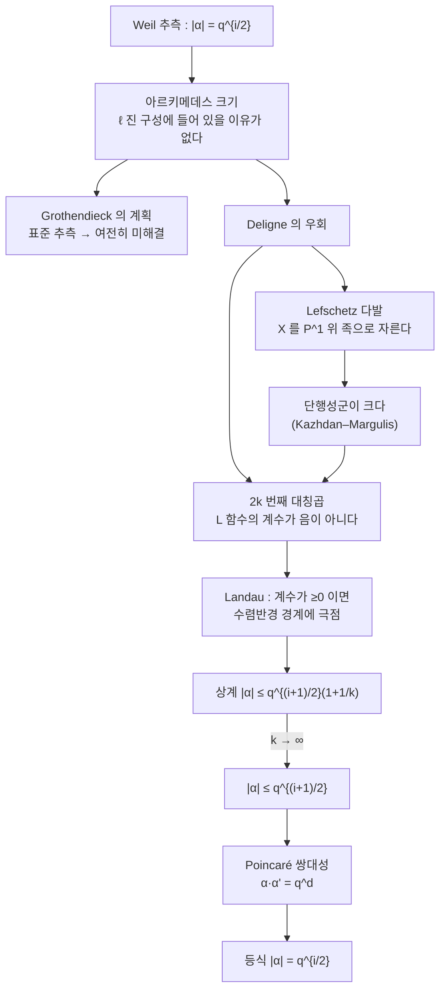

# Deligne 의 Weil 추측 증명

# 개요

Weil 추측의 세 항목 가운데 둘은 1960 년대에 닫혔다. [Dwork](dwork-rationality.md)가 $p$ 진 해석학으로 유리성을 증명했고, Grothendieck 의 에탈 코호몰로지가 유리성과 함수방정식을 다시 증명했다. 남은 하나가 **Riemann 가설**이다.

$$
Z(X/\mathbb F_q,T)=\prod_{i=0}^{2d}P_i(T)^{(-1)^{i+1}},
\qquad
P_i(T)=\prod_j(1-\alpha_{ij}T),
\qquad
|\alpha_{ij}|=q^{i/2}
$$

마지막 줄의 절댓값은 **복소** 절댓값이다. $\alpha_{ij}$ 는 $\ell$ 진 코호몰로지의 Frobenius 고윳값이고, 대수적 수이므로 복소수에 심을 수 있다. 그 모든 심에서 절댓값이 정확히 $q^{i/2}$ 라는 것이 주장이다.

왜 이것만 어려운가. 유리성과 함수방정식은 코호몰로지 이론이 존재하기만 하면 형식적으로 따라 나온다. 유리성은 "대각합의 생성함수는 유리함수" 라는 선형대수이고, 함수방정식은 Poincaré 쌍대성이다. 하지만 절댓값은 **아르키메데스 크기**에 관한 진술이고, $\ell$ 진 계수를 쓰는 코호몰로지 안에 그런 정보가 들어 있을 이유가 없다. 대수적인 구성에서 해석적인 부등식을 뽑아내야 한다.

Grothendieck 의 계획은 "표준 추측" 을 세워 Hodge 이론의 양positivity을 유한체로 옮기는 것이었다. 그 추측은 지금도 열려 있다. Deligne 은 1974 년에 **그 길을 우회했다.** 곡선의 다발로 다양체를 자르고, 단행성군의 크기를 재고, 그리고 $L$ 함수의 계수가 실수이고 음이 아니라는 사실을 $2k$ 제곱 트릭으로 증폭해서 부등식을 조였다. 해석적 정수론의 Rankin 의 수법이 산술기하의 중심 정리를 증명했다.

따름정리 하나가 이 정리의 무게를 보여 준다. Ramanujan 이 1916 년에 추측한 $|\tau(p)|\le2p^{11/2}$ 가 Deligne 의 정리에서 나온다. 60 년 가까이 열려 있던 해석적 부등식이 유한체 위 기하의 결과였다. 이 문서의 계산 절에서 그 부등식을 직접 확인한다.

# 직관

## 절댓값 하나를 어떻게 좁히는가

핵심 전략은 **부등식을 두 방향에서 조이는 것**이다. Deligne 은 처음부터 $|\alpha|=q^{i/2}$ 를 노리지 않는다. 먼저 느슨한 상계

$$
|\alpha|\le q^{(i+1)/2}
$$

를 얻고, 그 다음 여러 장치로 반씩 조여 정확한 값에 수렴시킨다. 마지막 한 걸음은 Poincaré 쌍대성이 맡는다. $|\alpha|\le q^{(i+1)/2}$ 를 $H^i$ 와 $H^{2d-i}$ 양쪽에 적용하고 $\alpha\cdot\alpha'=q^d$ 라는 쌍대성의 관계를 쓰면 두 부등식이 서로를 눌러 등식이 된다.

그러니 문제는 "어떻게 상계 하나를 얻는가" 로 줄어든다.

## 계수가 음이 아니면 극점이 크기를 말해 준다

해석적 정수론의 오래된 요령이다. Dirichlet 급수 $\sum a_nn^{-s}$ 에서 $a_n\ge0$ 이면, 수렴하는 영역의 경계에 반드시 극점이 있다(Landau 의 정리). 곧 **계수가 음이 아니면 수렴반경이 극점의 위치로 읽힌다.**

$L$ 함수 쪽으로 옮기면 이렇다. $L(T)=\prod(1-\alpha_jT)^{-1}$ 의 $\log$ 를 전개하면 계수가 $\sum\alpha_j^n/n$ 이다. 이것이 실수이고 음이 아니라면, 급수의 수렴반경이 $\max|\alpha_j|^{-1}$ 이고 그 경계가 극점이다. 극점의 위치를 다른 방법으로 통제할 수 있으면 $\max|\alpha_j|$ 의 상계가 나온다.

문제는 계수가 음이 아닐 이유가 없다는 것이다. Deligne 의 해법이 **$2k$ 제곱 트릭**이다. 다발 $\mathcal F$ 대신 그 $2k$ 번째 대칭곱 $\mathrm{Sym}^{2k}\mathcal F$ 를 본다. 대칭곱의 대각합은 제곱의 합 꼴로 정리되어 실수이고 음이 아니다. 그러면 Landau 의 논법이 작동하고

$$
|\alpha|\le q^{(i+1)/2}\Big(1+\tfrac1k\Big)\ \text{꼴의 상계}
$$

가 나온다. $k\to\infty$ 로 보내면 상계가 조여진다. Rankin 이 $\tau(n)$ 의 상계를 얻을 때 쓴 것과 같은 수법이다.

## 다발과 단행성

$2k$ 제곱 트릭을 쓰려면 $\mathcal F$ 가 고정된 하나가 아니라 **매개변수를 따라 움직이는 족**이어야 한다. 그래야 대각합의 합이 평균으로 작동한다.

Deligne 은 $X$ 를 Lefschetz 다발로 자른다. 즉 $X$ 를 사영공간에 심고 초평면 다발로 $\mathbb P^1$ 위의 족으로 만든다. 각 올이 $X$ 의 초평면 절단이고, 차원이 하나 낮다. 그러면 $X$ 의 코호몰로지가 $\mathbb P^1$ 위 층의 코호몰로지로 바뀌고, 귀납이 가능해진다.

그 층 위에서 결정적인 것이 **단행성군**이다. 올이 특이해지는 점 주위를 돌 때 소멸 순환(vanishing cycle)이 어떻게 움직이는지를 재는 군이다. Kazhdan–Margulis 의 정리로 이 군이 충분히 크다(대칭곱이 기약이다)는 것을 보이면, $\mathrm{Sym}^{2k}$ 의 불변량이 작아져서 위의 부등식이 낭비 없이 조여진다. **단행성이 크다 = 족이 진짜로 움직인다 = 평균이 잘 듣는다.**



# 정의

## Weil 추측의 Riemann 가설

$X$ 를 $\mathbb F_q$ 위의 매끄러운 사영다양체, 차원 $d$ 라 하자. $\ell\ne p$ 인 소수에 대해 $\ell$ 진 에탈 코호몰로지 $H^i(X_{\overline{\mathbb F_q}},\mathbb Q_\ell)$ 위에 기하적 Frobenius 가 작용하고

$$
P_i(T)=\det\big(1-T\,\mathrm{Frob}\mid H^i\big)=\prod_j(1-\alpha_{ij}T)
$$

이다.

> **정리 (Deligne, 1974).** 모든 $i,j$ 와 $\mathbb Q_\ell\hookrightarrow\mathbb C$ 의 모든 심에 대해
> $$|\alpha_{ij}|=q^{i/2}$$
> 특히 $P_i(T)\in\mathbb Z[T]$ 이고 $\ell$ 에 무관하다.

$q^{i/2}$ 를 $\alpha$ 의 **무게**라 한다. 이 진술이 $\zeta$ 함수의 영점과 극점이 $\mathrm{Re}(s)=i/2$ 위에 놓인다는 말이고, 그래서 Riemann 가설이라 부른다.

## 순수성과 무게

무게 개념은 Deligne 이 두 번째 논문(*Weil II*, 1980)에서 크게 확장했다. 층 $\mathcal F$ 가 **무게 $w$ 이하**라 함은 모든 닫힌점에서 Frobenius 고윳값의 절댓값이 $q_x^{w/2}$ 이하라는 뜻이다. 핵심 정리는 다음이다.

> 무게 $\le w$ 인 층의 고차 순상(higher direct image) $R^if_!\mathcal F$ 는 무게 $\le w+i$ 다.

무게가 사상 아래에서 어떻게 변하는지를 말하는 이 정리가 *Weil I* 보다 훨씬 강력하고, 이후 혼합 Hodge 가군, 편향 층(perverse sheaf), 결정 대수의 대칭성 등으로 이어지는 무게 이론의 출발점이 된다.

## Ramanujan–Petersson

무게 $k$ 의 Hecke 고유 첨점형식 $f=\sum a_nq^n$ 에 대해

$$
|a_p|\le2\,p^{(k-1)/2}\qquad(p\nmid N)
$$

이 **Ramanujan–Petersson 추측**이다. $k=12$ 이고 $N=1$ 인 것이 판별식 $\Delta$ 이고 $a_p=\tau(p)$ 다.

# 성질

## 왜 Ramanujan 이 따라오는가

연결고리가 Deligne 자신이 1969 년에 만든 구성이다. 무게 $k\ge2$ 의 Hecke 고유형식 $f$ 마다 [Galois 표현](galois-representations.md)

$$
\rho_f:\mathrm{Gal}(\overline{\mathbb Q}/\mathbb Q)\to\mathrm{GL}_2(\mathbb Q_\ell),
\qquad
\mathrm{tr}\,\rho_f(\mathrm{Frob}_p)=a_p,
\quad
\det\rho_f(\mathrm{Frob}_p)=p^{k-1}
$$

가 [모듈러 곡선](modular-curves.md) 위 어떤 다발의 에탈 코호몰로지 안에서 잘려 나온다. 그 코호몰로지가 무게 $k-1$ 이므로 Deligne 의 정리가 두 고윳값 $\alpha_p,\beta_p$ 에 대해 $|\alpha_p|=|\beta_p|=p^{(k-1)/2}$ 를 준다. 그러면

$$
|a_p|=|\alpha_p+\beta_p|\le|\alpha_p|+|\beta_p|=2p^{(k-1)/2}
$$

다. $k=12$ 에서 $|\tau(p)|\le2p^{11/2}$ 다. 순수한 해석적 부등식이 유한체 위 기하에서 나온 것이다.

$\alpha_p\beta_p=p^{k-1}$ 이므로 $\alpha_p=p^{(k-1)/2}e^{i\theta_p}$ 와 $\beta_p=\overline{\alpha_p}$ 로 쓸 수 있고

$$
a_p=2p^{(k-1)/2}\cos\theta_p
$$

가 된다. 각 $\theta_p\in[0,\pi]$ 를 **Frobenius 각**이라 하고, 그 분포가 Sato–Tate 추측의 주제다. Deligne 의 정리는 각이 실수라는 것, 곧 $a_p$ 가 한계 안에 있다는 것까지만 말하고 분포는 말하지 않는다.

## 두 절댓값, 다시

[Dwork 문서](dwork-rationality.md)에서 Kloosterman 합의 $\alpha,\beta$ 가 두 절댓값에서 서로 다른 성질을 갖는 것을 보았다. $p$ 진 부치는 [Newton 다각형](newton-polygon.md)이 공짜로 주고, 복소 절댓값 $\sqrt q$ 는 어렵다. 이 문서가 그 어려운 쪽에 대한 것이다.

| | $p$ 진 | 복소 |
|---|---|---|
| 도구 | Newton 다각형, Dwork 이론 | 에탈 코호몰로지, 무게 |
| 난이도 | 계수에서 바로 읽힌다 | Deligne 의 정리 |
| 주는 것 | 보통/초특이, 형식군의 높이 | Weil 한계, Ramanujan |
| 남은 문제 | Newton 다각형의 도약 | Sato–Tate 형 분포 |

$d=1$ 인 곡선의 경우는 Weil 자신이 1948 년에 증명했다. 곡면에 대해서는 Deligne 이전에도 부분적 결과가 있었지만, 임의 차원은 1974 년까지 열려 있었다.

## 증명의 뼈대

*Weil I* 의 구조를 요약하면 이렇다.

1. **환원.** Poincaré 쌍대성과 약한 Lefschetz 정리로 짝수차원 다양체의 중간 코호몰로지 $H^d$ 로 환원한다.
2. **Lefschetz 다발.** $X$ 를 $\mathbb P^1$ 위의 초평면 절단의 족으로 만든다. 소멸 순환이 만드는 층 $\mathcal F$ 가 주인공이다.
3. **단행성.** $\mathcal F$ 의 단행성군이 충분히 크다. 따라서 $\mathrm{Sym}^{2k}\mathcal F$ 가 기하적으로 기약이고 불변량 공간이 작다.
4. **$2k$ 제곱과 양성.** $L(\mathrm{Sym}^{2k}\mathcal F,T)$ 의 $\log$ 계수가 실수이고 음이 아니다.
5. **Landau.** 그 급수의 수렴반경에서 고윳값의 상계 $|\alpha|\le q^{(d+1)/2}(1+\varepsilon_k)$ 를 얻고 $k\to\infty$ 로 조인다.
6. **쌍대성으로 마무리.** 얻은 상계를 쌍대 쪽에도 적용해 등식으로 만든다.

3 번이 기술적 심장이고, 4 번이 해석적 정수론에서 빌려 온 아이디어다. 표준 추측은 어디에도 쓰이지 않는다.

# 활용

## 곱셈성이 한계를 퍼뜨린다

소수에서의 한계가 왜 모든 $n$ 으로 퍼지는가. $\Delta$ 가 Hecke 고유형식이라 $\tau$ 가 곱셈적이기 때문이다.

```python
bad = [(m, n) for m in range(1, 21) for n in range(1, 21)
       if m * n <= N and gcd(m, n) == 1 and tau[m*n] != tau[m] * tau[n]]
print(f"  서로소 m,n 에서 τ(mn)=τ(m)τ(n) 인가 : {not bad}   반례 {bad[:3]}")
bad2 = [p for p in PR if p*p <= N and tau[p*p] != tau[p]**2 - p**11]
print(f"  τ(p²) = τ(p)² - p^11 인가 : {not bad2}   반례 {bad2}")

#   서로소 m,n 에서 τ(mn)=τ(m)τ(n) 인가 : True   반례 []
#   τ(p²) = τ(p)² - p^11 인가 : True   반례 []
```

두 번째 등식 $\tau(p^2)=\tau(p)^2-p^{11}$ 이 바로 $\alpha_p+\beta_p=\tau(p)$ 와 $\alpha_p\beta_p=p^{11}$ 에서 나오는 $\alpha_p^2+\beta_p^2$ 다. Frobenius 고윳값 두 개가 Hecke 작용소의 고윳값으로 보이는 자리다.

## 어디로 이어지는가

- **무게 이론.** *Weil II* 의 무게 정리가 편향 층, 교차 코호몰로지, 혼합 Hodge 가군으로 이어졌다. "무게" 가 산술기하의 기본 언어가 되었다.
- **지수합.** [Kloosterman 합](dwork-rationality.md)을 포함한 온갖 지수합의 최적 상계가 Deligne 의 정리에서 나온다. Katz 의 *Gauss Sums, Kloosterman Sums and Monodromy Groups* 가 이 응용을 체계화했다.
- **해석적 정수론.** Ramanujan 한계가 모듈러 형식의 $L$ 함수를 다루는 모든 추정에 들어간다. 볼록성 깨기, 부분합 추정, 소수 정리의 변형이 여기에 의존한다.
- **부호 이론.** Goppa 의 대수기하 부호의 성능이 $\#X(\mathbb F_q)$ 의 하계에서 나오고, 그 하계가 Weil 한계다. Tsfasman–Vlăduţ–Zink 한계가 Gilbert–Varshamov 한계를 넘은 것이 이 정리의 직접적 산물이다.
- **표준 추측.** Grothendieck 이 원했던 길은 여전히 열려 있다. Deligne 의 증명은 그것을 우회했을 뿐 대체하지 않았고, 표준 추측은 지금도 대수적 순환 이론의 중심 미해결 문제다.

# 연관 문서

## 선수지식

- [Dwork 의 유리성 정리와 지수합](dwork-rationality.md)

## 더 알아보기

- [Sato–Tate 분포](sato-tate.md)

#number_theory #algebraic_topology #theorem #complex_analysis
