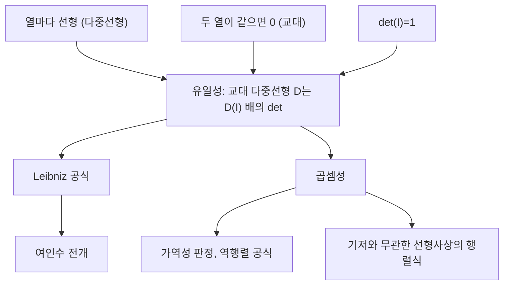

# 행렬식

# 개요

행렬식은 정사각행렬에 스칼라 하나를 대응시키는 함수다. 열에 대해 다중선형, 두 열이 같으면 0(교대적), 항등행렬에서 1이라는 세 조건이 이 함수를 유일하게 결정한다[^1]. Leibniz 공식, 여인수 전개, 곱셈성, 가역성 판정이 모두 이 세 조건에서 따라나온다. 실수 위에서는 절댓값이 부피 배율이고 부호가 방향 보존 여부다. 특성다항식을 통해 고윳값 이론의 입구가 되고, 조합론에서는 신장트리 개수 같은 세는 문제의 닫힌 형태를 준다.

# 직관

2차 행렬의 두 열이 만드는 평행사변형의 부호 있는 면적이 행렬식이다. 한 열을 c배 늘리면 면적도 c배가 되고, 한 열에 다른 열의 배수를 더해도 밑변과 높이가 그대로이므로 면적은 변하지 않는다. 두 열이 평행하면 평행사변형이 납작해져 면적이 0인데, 이것이 "열이 선형종속이면 행렬식이 0"이라는 사실이다. 두 열을 교환하면 방향이 뒤집혀 부호가 바뀐다. n차원에서는 n개의 열이 만드는 평행육면체의 부호 있는 부피가 된다.

세 조건에서 나머지 전부가 따라나오는 구조는 다음과 같다.

# 정의

$F$ 를 체, $A$ 를 $F$ 성분의 $n$ 차 정사각행렬, $a_1$ 부터 $a_n$ 을 $A$ 의 열벡터라 하자. 행렬식은 열들의 함수로서 다음 세 조건으로 규정된다. 먼저 각 열에 대한 선형성이다.

$$
\det(\dots,\ \alpha u+\beta v,\ \dots)
=\alpha\det(\dots,u,\dots)+\beta\det(\dots,v,\dots)
$$

다음은 교대성과 정규화다.

$$
a_i=a_j\ (i\neq j)\ \Longrightarrow\ \det A=0,
\qquad \det I_n=1
$$

이 세 조건을 만족하는 함수는 존재하며 유일하고[^1], 명시적으로 Leibniz 공식으로 주어진다. $S_n$ 은 $n$ 차 대칭군, $\mathrm{sgn}$ 은 순열의 부호(짝순열이면 $1$ , 홀순열이면 $-1$ )다.

$$
\det A=\sum_{\sigma\in S_n}\mathrm{sgn}(\sigma)\prod_{i=1}^{n}a_{i\thinspace\sigma(i)}
$$

$A$ 에서 $i$ 행과 $j$ 열을 지운 $(n-1)$ 차 행렬을 $A_{ij}$ 라 쓰면(minor), 고정한 행 $i$ 에 대해 여인수 전개(Laplace 전개)가 성립한다[^2].

$$
\det A=\sum_{j=1}^{n}(-1)^{i+j}a_{ij}\det A_{ij}
$$

[선형사상](linear-maps.md) $T:V\to V$ 의 행렬식은 기저를 하나 골라 얻은 표현행렬의 행렬식으로 정의한다. 기저를 바꾸면 표현행렬이 $P^{-1}AP$ 로 바뀌는데 아래 곱셈성 때문에 값이 같으므로, 이 정의는 기저 선택과 무관하다.

# 성질

## 유일성과 Leibniz 공식

각 열을 표준기저로 전개하면 다중선형성에 의해 $n^n$ 개의 항이 생기고, 교대성이 인덱스가 중복된 항을 모두 $0$ 으로 만들어 인덱스가 순열인 항만 남는다. 순열을 인접 교환의 합성으로 분해하면 각 항의 부호가 $\mathrm{sgn}(\sigma)$ 가 되어 Leibniz 공식이 나온다. 같은 논증은 조금 더 강한 사실을 준다: 열들에 대한 임의의 교대 다중선형 함수 $D$ 는 $D(I)$ 배의 행렬식과 같다[^1].

## 곱셈성

$A$ 를 고정하면 $AB$ 의 열은 $Ab_j$ 이므로, $B$ 에 대응시키는 함수 $\det(AB)$ 는 $B$ 의 열에 대해 교대 다중선형이다. 위 유일성 논증을 적용하면 이 함수는 그 값이 항등행렬에서 $\det A$ 인 $\det$ 의 상수배다.

$$
\det(AB)=\det A\cdot\det B
$$

따라서 $A$ 가 가역이면 $\det(A^{-1})$ 는 $\det A$ 의 역수다. Leibniz 공식에서 $\sigma$ 를 $\sigma^{-1}$ 로 바꾸어 합하면 전치에 대한 불변성도 나오므로, 행에 대한 모든 성질은 열에 대한 성질과 그대로 대응된다.

$$
\det(A^{\mathsf T})=\det A
$$

## 가역성 판정

행렬식이 $0$ 이 아닌 것, 열들이 선형독립인 것, $A$ 가 가역인 것은 서로 동치다. 열이 종속이면 한 열이 나머지의 선형결합이고 다중선형성과 교대성으로 행렬식이 $0$ 이 된다. 반대 방향은 adjugate가 역행렬을 직접 만들어 준다.

$$
A^{-1}=\frac{1}{\det A}\mathrm{adj}(A),
\qquad (\mathrm{adj}A)_{ij}=(-1)^{i+j}\det A_{ji}
$$

같은 공식에서 Cramer 공식이 나온다. $A^{(i)}$ 를 $A$ 의 $i$ 번째 열을 $b$ 로 교체한 행렬이라 하면 $Ax=b$ 의 해는 다음과 같다.

$$
x_i=\frac{\det A^{(i)}}{\det A}
$$

## 부피와 방향

실행렬 $A$ 에 대해 단위입방체의 상은 부피가 $\lvert\det A\rvert$ 인 평행육면체이고, 더 일반적으로 Lebesgue [측도](measure.md)는 선형사상 $A$ 아래에서 $\lvert\det A\rvert$ 배로 변한다. $\det A$ 가 양수면 방향을 보존한다. $m\le n$ 인 벡터 $m$ 개가 만드는 $m$ 차원 부피는 Gram 행렬의 행렬식으로 주어지며, 여기서 괄호는 [내적](inner-product-spaces.md)이다.

$$
\mathrm{vol}_m(a_1,\dots,a_m)=\sqrt{\det G},
\qquad G_{ij}=\langle a_i,a_j\rangle
$$

## 흔한 오해

다중선형성은 열 단위이지 행렬 단위가 아니다. 일반적으로 $\det(A+B)$ 는 $\det A+\det B$ 와 다르고, 스칼라배는 차원만큼 곱해져 $\det(cA)=c^n\det A$ 다. 또 Leibniz 공식은 항이 $n!$ 개이므로 정의로는 쓰되 계산에는 쓰지 않는다.

# 활용

## 특성다항식

행렬식은 고윳값 문제를 다항식 문제로 바꾼다.

$$
\chi_A(\lambda)=\det(\lambda I-A)
$$

의 근이 [고윳값](eigenvalues.md)이다. 전개하면 $\lambda^{n-1}$ 의 계수가 대각합의 부호 반대이고 상수항이 $(-1)^n\det A$ 이므로, 대각합과 행렬식은 고윳값의 합과 곱이다.

## 계산

실제 계산은 Gauss 소거(LU 분해)로 $O(n^3)$ 에 한다. 한 행에 다른 행의 배수를 더하는 연산은 행렬식을 보존하고 행 교환은 부호만 뒤집으므로, 소거 후 얻은 삼각행렬의 대각 성분 곱에 교환 횟수의 부호를 붙이면 된다.

## 그래프와 조합론

Kirchhoff의 matrix-tree 정리는 연결 그래프의 신장트리 개수가 [그래프 Laplacian](graph-laplacian.md)에서 한 행과 한 열을 지운 minor의 행렬식(부호를 맞춘 값)과 같다고 말한다[^3]. 이 공식에서 [유효저항](effective-resistance.md)이 두 행렬식의 비로 표현되고, [최소 신장트리](minimum-spanning-tree.md)를 세는 문제도 선형대수로 환원된다.

## 다변수 미적분

변수변환 공식에 등장하는 Jacobian 행렬식은 국소 부피 배율이다. [미분](derivative.md)이 국소 선형근사를 주므로, 좌표변환이 부피를 얼마나 왜곡하는지는 도함수 행렬의 행렬식이 측정한다.

[^1]: John Greene, Math 5327 — Determinants: Uniqueness and more Uniqueness, University of Minnesota Duluth. https://www.d.umn.edu/~jgreene/Math_5327_Linear/Determinants_2.pdf
[^2]: Larry Rolen, Linear Algebra Notes — Determinants / Laplace expansion and adjoint matrices, Vanderbilt University. https://math.vanderbilt.edu/rolenl/LinearAlgebraNotesDeterminants.pdf
[^3]: David P. Williamson, ORIE 6334 Lecture 8 — The Matrix-Tree Theorem, Cornell University. https://people.orie.cornell.edu/dpw/orie6334/lecture8.pdf

# 연관 문서

## 선수지식

- [선형사상](linear-maps.md)

## 더 알아보기

- [고윳값과 고유벡터](eigenvalues.md)
- [격자와 최단벡터 문제](lattices.md)
- [Fredholm 행렬식](fredholm-determinant.md)
- [Reidemeister 비틀림과 렌즈 공간](reidemeister-torsion.md)

#linear_algebra
