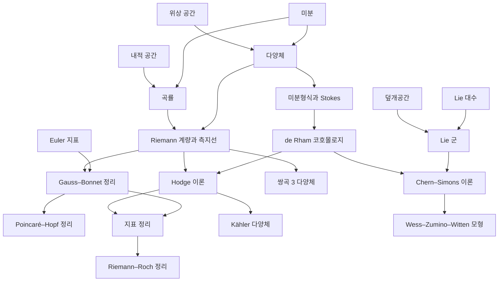

# 미분기하 개관

# 개요

미분기하는 미적분이 되는 공간 위에서 휘어짐을 재고, 그 국소량의 적분이 위상 불변량이 되는 현상을 다룬다. 물음은 "국소적으로 잰 곡률이 공간 전체에 대해 무엇을 결정하는가" 이고, 답의 원형은 Gauss–Bonnet 정리다. 곡면의 곡률을 적분하면 [Euler 지표](euler-characteristic.md)가 나온다.

미분기하의 갈래는 네 줄기다. 미분이 정의되는 공간인 다양체와 그 위의 미분형식, 계량과 곡률, Hodge 이론에서 지표 정리로 가는 해석적 갈래, 그리고 Lie 군 위의 게이지 이론이다. 위상 불변량 쪽은 [위상수학 개관](topology-overview.md)에, 대수 쪽 기반은 [Lie 대수](lie-algebras.md)에 있다.

시작은 [다양체](manifolds.md)와 [곡률](curvature.md)이다. 둘이 [Riemann 계량과 측지선](riemannian-metrics.md)에서 만나 거리를 가진 다양체가 되고, 거기서 [Gauss–Bonnet 정리](gauss-bonnet.md)와 [Hodge 이론](hodge-theory.md)으로 갈라진 뒤 [지표 정리](index-theorem.md)에서 다시 만난다.

# 지도

# 갈래

## 다양체와 미분형식

- [다양체](manifolds.md): 국소적으로 유클리드 공간인 위상공간과 매끄러운 구조
- [벡터다발](vector-bundles.md): 점마다 붙인 벡터 공간, 전이함수와 접속, 곡률
- [특성류](characteristic-classes.md): 곡률의 불변 다항식이 주는 코호몰로지류, Chern–Weil 이론
- [미분형식과 Stokes 정리](differential-forms.md): 좌표에 의존하지 않는 적분과 외미분

## 계량과 곡률

- [곡률](curvature.md): 곡선과 곡면의 휘어짐, Gauss 곡률과 평균 곡률
- [Riemann 계량과 측지선](riemannian-metrics.md): 접공간의 내적, Levi-Civita 접속, 측지선 방정식
- [Gauss–Bonnet 정리](gauss-bonnet.md): 곡률 적분이 Euler 지표를 준다
- [Poincaré–Hopf 정리](poincare-hopf.md): 벡터장의 특이점 지수의 합도 Euler 지표다
- [쌍곡 3 다양체와 Mostow 강직성](hyperbolic-3-manifolds.md): 3 차원에서 쌍곡 계량이 위상으로 결정된다

## Hodge 이론과 지표 정리

- [Hodge 이론](hodge-theory.md): 코호몰로지류마다 조화형식 대표원이 하나
- [Kähler 다양체](kahler-manifolds.md): 복소구조와 계량이 양립할 때의 분해
- [지표 정리](index-theorem.md): 타원작용소의 해석적 지표가 위상적 지표와 같다
- [Riemann–Roch 정리](riemann-roch.md): 곡선 위 선다발의 단면 차원을 세는 공식

## Lie 군과 게이지 이론

- [Lie 군](lie-groups.md): 군 구조와 매끄러운 구조를 함께 가진 공간
- [Chern–Simons 이론](chern-simons.md): 3 차원 다양체 위의 위상적 게이지 이론
- [Wess–Zumino–Witten 모형과 벌크–경계 대응](wess-zumino-witten.md): 경계의 공형장론과의 대응

# 연관 문서

## 선수지식

- [집합](sets.md)

## 더 알아보기

- [다양체](manifolds.md)
- [곡률](curvature.md)
- [Lie 군](lie-groups.md)

#differential_geometry #topology #overview
