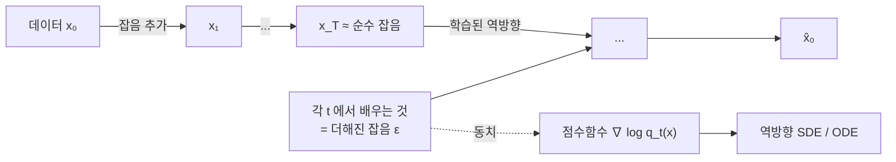

# 확산모형

# 개요

[변분 오토인코더](variational-autoencoder.md)는 잠재변수에서 데이터로 가는 사상을 신경망 하나로 학습한다. 표현력이 크지만 표본이 흐릿하다는 약점이 오래 남았다. 인코더와 디코더를 동시에 학습하는 구조가 근사 사후분포의 품질에 묶여 있기 때문이다.

확산모형은 그 사상을 한 번에 배우지 않는다. 데이터에 잡음을 조금씩 더해 순수 잡음으로 만드는 전방 과정을 고정해 두고, 그 반대 방향만 배운다. 각 단계는 "조금 흐려진 것을 조금 선명하게" 하는 작은 문제라 훨씬 쉽고, 전체 생성은 그 단계를 수백에서 수천 번 반복하는 것이다.

구조적으로 보면 잠재변수가 데이터와 같은 차원이고 전방 과정에 학습할 모수가 없는 계층적 VAE 다. 그래서 같은 ELBO 가 목적함수로 나오는데, 정리하면 놀랍도록 단순한 형태가 된다. 각 잡음 수준에서 더해진 잡음을 예측하는 최소제곱 회귀다.

연속 극한을 취하면 [확률미분방정식](ito-calculus.md)이 된다. 전방 과정이 SDE 이고 생성이 그 시간역전 SDE 를 적분하는 것이며, 신경망이 배우는 대상은 각 시각 분포의 점수함수 `\nabla_x\log q_t(x)` 다. 이산적인 잡음 제거 모형과 점수 기반 모형이 같은 것의 두 서술이라는 사실이 2020 년에 정리되면서 이 분야가 현재의 형태를 갖췄다.

# 직관

## 어려운 문제를 쉬운 문제 여럿으로

데이터 분포에서 곧바로 표본을 뽑는 것은 어렵다. 반면 잡음이 많이 섞인 분포는 거의 Gauss 라 뽑기 쉽고, 잡음을 조금 걷어 내는 것도 쉽다.

전방 과정을 잡음 수준의 사다리로 보면, 각 칸에서 한 칸 아래로 내려가는 조건부 분포만 알면 된다. 잡음 증가분이 작으면 그 조건부 분포가 Gauss 로 잘 근사되고, 그 평균을 신경망이 예측한다.



## 점수함수가 방향을 가리킨다

`q_t` 를 시각 `t` 의 분포라 하면 `\nabla_x\log q_t(x)` 는 밀도가 커지는 방향이다. 잡음 낀 점에서 데이터가 있을 법한 쪽을 가리키는 벡터장이며, 잡음 제거가 이 방향으로 조금 움직이는 것이다.

밀도 `q_t` 자체는 정규화상수 때문에 다루기 어렵지만 점수함수는 그렇지 않다. 로그를 미분하면 정규화상수가 사라지기 때문이다. 확률모형에서 가장 까다로운 부분을 우회하는 것이 이 접근의 요점이다.

## 잡음 예측이 곧 점수 추정이다

전방 과정이 `x_t=x_0+\sigma_t\epsilon` 이면 Tweedie 공식이 다음을 준다.

$$
\mathbb E[x_0\mid x_t]=x_t+\sigma_t^2\,\nabla_x\log q_t(x_t)
$$

곧 "잡음 낀 관측에서 원본의 조건부 평균" 과 "점수함수" 가 서로를 결정한다. 신경망에 `\epsilon` 을 예측하도록 최소제곱 회귀를 시키면, 그 최적해가 자동으로 `-\sigma_t\nabla\log q_t` 다.

ELBO 를 전개해 나오는 복잡한 KL 항들의 가중합이 이 단순한 회귀로 정리된다는 점이 실용화의 결정적 계기였다. 학습에 필요한 것은 데이터에 잡음을 더하고 그 잡음을 맞히는 것뿐이다.

# 정의

## 전방 과정

분산 폭발(VE) 형식이 가장 단순하다.

$$
x_t=x_0+\sqrt t\,\epsilon,\qquad\epsilon\sim\mathcal N(0,I)
$$

`q_t` 는 데이터 분포에 분산 `t` 인 Gauss 를 합성곱한 것이다. `t` 가 충분히 크면 데이터의 구조가 묻혀 `\mathcal N(0,tI)` 와 구별되지 않는다.

실무에서는 분산 보존(VP) 형식을 더 많이 쓴다.

$$
x_t=\sqrt{\bar\alpha_t}\,x_0+\sqrt{1-\bar\alpha_t}\,\epsilon
$$

`\bar\alpha_t` 가 1 에서 0 으로 줄어들며, 어느 `t` 에서도 `x_t` 의 분산이 대략 일정하게 유지되어 신경망 입력의 규모가 안정된다.

## SDE 서술

$$
dx=f(x,t)\,dt+g(t)\,dw
$$

VE 는 `f=0,\ g(t)=1`, VP 는 `f=-\tfrac12\beta(t)x,\ g=\sqrt{\beta(t)}` 다.

Anderson 의 시간역전 정리가 대응하는 역방향 SDE 를 준다.

$$
dx=\big[f(x,t)-g(t)^2\nabla_x\log q_t(x)\big]dt+g(t)\,d\bar w
$$

`dt` 가 음수이고 `\bar w` 가 역시간 Brown 운동이다. 점수함수만 알면 생성이 이 SDE 의 수치적분으로 환원된다.

## 확률흐름 ODE

같은 주변분포를 갖는 결정적 과정도 있다.

$$
\frac{dx}{dt}=f(x,t)-\tfrac12g(t)^2\nabla_x\log q_t(x)
$$

잡음 항이 없으므로 잠재점과 표본이 일대일로 대응하고, 가능도를 연속 정규화 흐름으로 정확히 계산할 수 있다. 고차 ODE 해법으로 단계 수를 10 배 이상 줄이는 가속 표본기들이 이 형식 위에서 만들어진다.

## 학습 목적함수

$$
\mathcal L=\mathbb E_{t,x_0,\epsilon}\Big[w(t)\big\|\epsilon-\epsilon_\theta(x_t,t)\big\|^2\Big]
$$

`w(t)=1` 로 두는 단순화가 ELBO 와 다르지만 표본 품질이 더 좋다는 것이 경험적 발견이다. 가중치를 바꾸는 것이 잡음 수준 사이의 중요도를 조절하는 것이며, 정확한 가능도가 목표면 ELBO 가중치를 쓴다.

# 성질

## ELBO 와의 관계

확산모형의 ELBO 는 계층적 VAE 의 그것이고, 전개하면 각 단계의 KL 항 합이 된다.

$$
\log p(x_0)\ \ge\ -\sum_t\mathrm{KL}\big(q(x_{t-1}\mid x_t,x_0)\,\|\,p_\theta(x_{t-1}\mid x_t)\big)+\cdots
$$

두 분포가 모두 Gauss 이므로 각 KL 이 평균의 제곱거리로 닫히고, 재매개화하면 위의 잡음 예측 회귀가 나온다. VAE 와 달리 인코더가 학습 대상이 아니므로 상각 틈이 없고, 사후 붕괴도 일어나지 않는다. 전방 과정이 고정되어 잠재변수가 항상 정보를 담기 때문이다.

## 조건부 생성과 안내

조건 `y` 가 있으면 Bayes 정리로 점수가 갈린다.

$$
\nabla_x\log q_t(x\mid y)=\nabla_x\log q_t(x)+\nabla_x\log q_t(y\mid x)
$$

둘째 항을 분류기로 근사하는 것이 분류기 안내다. 분류기 없는 안내는 조건부와 무조건부 모형을 함께 학습한 뒤

$$
\tilde\epsilon=\epsilon_\theta(x,t,\varnothing)+s\big(\epsilon_\theta(x,t,y)-\epsilon_\theta(x,t,\varnothing)\big)
$$

로 외삽한다. `s>1` 이면 조건에 더 충실한 표본이 나오는 대신 다양성이 줄어든다. 텍스트 조건 이미지 생성의 품질을 결정하는 가장 큰 요인이며, 실질적으로는 분포의 봉우리를 뾰족하게 만드는 조작이다.

## 비용

표본 하나에 신경망을 수십에서 수천 번 통과시켜야 한다. 적대적 생성망이 한 번으로 끝나는 것과 대비되며, 이것이 확산모형의 유일한 큰 약점이다.

단계를 줄이는 방향이 활발하다. 결정적 표본기(DDIM), 고차 ODE 해법, 그리고 다단계 모형을 한두 단계 모형으로 압축하는 증류가 쓰인다. 일관성 모형처럼 한 단계 생성을 목표로 설계된 변형도 나왔다.

## 저차원에서 직접 확인

목표 분포를 혼합 Gauss 로 두면 점수함수가 닫힌 형태라 신경망 없이 역방향 SDE 만 검증할 수 있다.

```python
import numpy as np
rng = np.random.default_rng(1)

# 1차원 혼합 Gauss 를 목표 분포로 두면 점수함수가 닫힌 형태로 나온다.
MU, SD, W = np.array([-2.0, 2.0]), np.array([0.5, 0.5]), np.array([0.4, 0.6])

def score(x, t_var):
    """log q_t(x) 의 x 미분. q_t = 목표분포에 분산 t_var 를 더한 것."""
    v = SD ** 2 + t_var
    z = W * np.exp(-0.5 * (x[:, None] - MU) ** 2 / v) / np.sqrt(v)
    w = z / z.sum(1, keepdims=True)                     # 각 성분의 사후 가중치
    return (w * (MU - x[:, None]) / v).sum(1)

# 전방 과정: x_t = x_0 + sqrt(t)·noise (분산 폭발 형식)
# 역방향 SDE: dx = score(x, s)·ds + sqrt(ds)·noise 를 s: T -> 0 으로 적분
T, EPS, steps, n = 400.0, 0.01, 4000, 200_000
ts = np.geomspace(T, EPS, steps + 1)                    # 기하 시간 격자
x = np.sqrt(T) * rng.standard_normal(n)                 # 거의 순수 잡음에서 시작
for s0, s1 in zip(ts[:-1], ts[1:]):
    dt = s0 - s1
    x = x + score(x, s0) * dt + np.sqrt(dt) * rng.standard_normal(n)
x = x + EPS * score(x, EPS)                             # Tweedie 로 마지막 잡음 제거

true = np.where(rng.random(n) < W[0], MU[0], MU[1]) + SD[0] * rng.standard_normal(n)
print(f"{'':10}{'평균':>8}{'표준편차':>10}{'왼쪽 봉우리 비율':>16}")
for name, v in [("생성 표본", x), ("참 분포", true)]:
    print(f"{name:10}{v.mean():8.3f}{v.std():10.3f}{(v < 0).mean():16.3f}")

#                 평균      표준편차       왼쪽 봉우리 비율
# 생성 표본        0.394     2.020           0.401
# 참 분포         0.396     2.023           0.401
```

순수 잡음에서 출발했는데 두 봉우리의 비율 `0.4:0.6` 이 소수점 셋째 자리까지 복원된다. 역방향 SDE 가 점수함수만으로 분포를 정확히 되살린다는 정리의 수치적 확인이다.

두 가지 실무 요령이 코드에 들어 있다. `T=400` 은 데이터의 분산(약 4)보다 훨씬 커야 시작 분포 `\mathcal N(0,TI)` 와 실제 `q_T` 의 차이가 무시되기 때문이고, 기하 격자는 점수함수가 `t\to0` 에서 급격히 변하는 구간에 단계를 몰아 주기 위한 것이다. `T` 를 9 로 낮추면 같은 코드가 봉우리 비율을 `0.43` 으로 틀리게 준다. 실제 모형에서 잡음 일정을 세심하게 설계하는 이유가 이것이다.

## 한계

점수함수의 추정 오차가 저밀도 영역에서 크다. 데이터가 거의 없는 곳의 `\nabla\log q` 를 학습할 표본이 없기 때문이며, 여러 잡음 수준을 함께 쓰는 이유가 정확히 이 문제를 메우기 위해서다. 큰 잡음 수준에서는 분포가 퍼져 있어 어디서든 신호가 있다.

가능도 평가도 간접적이다. 확률흐름 ODE 로 정확한 가능도를 계산할 수 있지만 비용이 크고, 학습에 쓰는 단순 가중치는 ELBO 가 아니라 가능도가 최적화되지 않는다.

# 활용

## 이미지, 음성, 영상 생성

텍스트 조건 이미지 생성의 표준 구조가 되었다. 화소 공간에서 직접 확산을 돌리는 대신 VAE 로 압축한 잠재공간에서 돌리는 잠재 확산이 계산을 수십 배 줄였고, 현재 대형 모형 대부분이 이 형태다.

음성 합성에서는 파형이나 스펙트로그램을 생성하고, 영상에서는 시간 축을 포함한 3 차원 텐서를 다룬다. 데이터 양식이 달라져도 "잡음을 더하고 되돌린다" 는 골격이 그대로 통한다는 점이 이 방법의 범용성이다.

## 역문제

관측 `y=Ax+n` 에서 `x` 를 복원하는 문제에 사전분포로 쓰인다. 학습된 점수함수가 `\nabla\log p(x)` 를 주고, 여기에 관측의 가능도 항을 더해 사후분포의 점수를 만들어 표본을 뽑는다.

의료 영상 재구성, 초해상, 인페인팅에 적용되며, 문제마다 다시 학습할 필요 없이 사전분포 하나를 여러 관측 모형에 재사용할 수 있다는 점이 장점이다.

## 과학 응용

단백질 구조 생성과 분자 설계에서 확산모형이 쓰인다. 대칭성(회전과 평행이동에 대한 동변성)을 신경망 구조에 넣어 3 차원 좌표를 직접 생성하는 방식이다.

물리 시뮬레이션의 대체 모형으로도 쓰인다. 편미분방정식의 해를 확률적으로 생성해 불확실성까지 함께 추정하는 접근이며, 기상 예측에서 앙상블 예보를 대체하려는 시도가 진행 중이다.

## 최적 수송과의 연결

확률흐름 ODE 는 잡음 분포에서 데이터 분포로 가는 결정적 수송 사상이다. 이 관점에서 확산모형을 일반화한 것이 흐름 정합과 확률 보간이며, 두 분포를 잇는 경로를 직선으로 설계해 표본기의 단계 수를 크게 줄인다.

전방 과정을 Gauss 잡음으로 고정할 이유가 없다는 것이 이 시각의 결론이다. 임의의 두 분포를 잇는 경로를 설계하고 그 속도장을 회귀로 배우면 되며, 확산모형은 그중 잡음 경로를 택한 특수한 경우로 자리매김한다.

# 연관 문서

## 선수지식

- [변분 오토인코더](variational-autoencoder.md)
- [Itô 적분과 확률미분방정식](ito-calculus.md)

## 더 알아보기

아직 연결한 문서가 없다.

#machine_learning #probability #analysis
