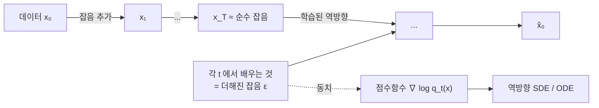

# 확산모형

# 개요

[변분 오토인코더](variational-autoencoder.md)(variational autoencoder, VAE)는 잠재변수에서 데이터로 가는 사상을 신경망 하나로 학습한다. 인코더와 디코더를 함께 학습하는 구조가 근사 사후분포의 품질에 묶여 표본이 흐릿해진다.

확산모형은 데이터에 잡음을 조금씩 더해 순수 잡음으로 만드는 전방 과정을 고정하고 그 역방향만 배운다. 각 단계는 조금 흐려진 것을 조금 선명하게 만드는 작은 문제이고, 생성은 그 단계를 수백에서 수천 번 반복하는 것이다.

잠재변수가 데이터와 같은 차원이고 전방 과정에 학습할 모수가 없는 계층적 VAE 이므로 같은 **ELBO**(evidence lower bound)가 목적함수로 나온다. 그 ELBO 를 전개하면 각 잡음 수준에서 더해진 잡음을 예측하는 최소제곱 회귀가 된다.

연속 극한에서는 [확률미분방정식](ito-calculus.md)(stochastic differential equation, SDE)이 된다. 전방 과정이 SDE 이고 생성이 시간역전 SDE 의 적분이며, 신경망이 배우는 대상은 각 시각 분포의 점수함수 $\nabla_x\log q_t(x)$ 다. 이산적인 잡음 제거 모형과 점수 기반 모형이 같은 것의 두 서술임이 2020 년에 정리되었다.

# 직관

## 잡음 수준의 열

데이터 분포에서 곧바로 표본을 뽑는 것은 어렵고, 잡음이 많이 섞인 분포는 거의 Gauss 라 뽑기 쉽다. 전방 과정을 잡음 수준의 열로 보면 각 단계에서 한 칸 아래로 내려가는 조건부 분포만 알면 된다. 잡음 증가분이 작으면 그 조건부 분포가 Gauss 로 근사되고 신경망이 그 평균을 예측한다.

## 점수함수

$q_t$ 를 시각 $t$ 의 분포라 하면 $\nabla_x\log q_t(x)$ 는 밀도가 커지는 방향이다. 잡음 낀 점에서 데이터가 있을 법한 쪽을 가리키는 벡터장이고 잡음 제거는 이 방향으로 조금 움직이는 것이다.

밀도 $q_t$ 는 정규화상수 때문에 다루기 어렵지만 로그를 미분하면 정규화상수가 사라지므로 점수함수는 그렇지 않다.

## 잡음 예측과 점수 추정의 동치

전방 과정이 $x_t=x_0+\sigma_t\epsilon$ 이면 Tweedie 공식이 다음을 준다.

$$
\mathbb E[x_0\mid x_t]=x_t+\sigma_t^2\thinspace\nabla_x\log q_t(x_t)
$$

잡음 낀 관측에서 원본의 조건부 평균과 점수함수가 서로를 결정한다. 신경망에 $\epsilon$ 을 예측하는 최소제곱 회귀를 시키면 그 최적해가 $-\sigma_t\nabla\log q_t$ 다.

ELBO 를 전개해 나오는 KL(Kullback–Leibler) 항들의 가중합이 이 회귀로 정리되면서 학습에 필요한 것은 데이터에 잡음을 더하고 그 잡음을 맞히는 것뿐이 되었다.

# 정의

## 전방 과정

분산 폭발(variance exploding, VE) 형식은 다음과 같다.

$$
x_t=x_0+\sqrt t\thinspace\epsilon,\qquad\epsilon\sim\mathcal N(0,I)
$$

$q_t$ 는 데이터 분포에 분산 $t$ 인 Gauss 를 합성곱한 것이고, $t$ 가 크면 $\mathcal N(0,tI)$ 와 구별되지 않는다.

실무에서는 분산 보존(variance preserving, VP) 형식을 쓴다.

$$
x_t=\sqrt{\bar\alpha_t}\thinspace x_0+\sqrt{1-\bar\alpha_t}\thinspace\epsilon
$$

$\bar\alpha_t$ 가 1 에서 0 으로 줄고 어느 $t$ 에서도 $x_t$ 의 분산이 대략 일정해 신경망 입력의 규모가 안정된다.

## SDE 서술

$$
dx=f(x,t)\thinspace dt+g(t)\thinspace dw
$$

VE 는 $f=0,\ g(t)=1$ 이고 VP 는 $f=-\tfrac12\beta(t)x,\ g=\sqrt{\beta(t)}$ 다. Anderson 의 시간역전 정리가 대응하는 역방향 SDE 를 준다.

$$
dx=\big[f(x,t)-g(t)^2\nabla_x\log q_t(x)\big]dt+g(t)\thinspace d\bar w
$$

$dt$ 가 음수이고 $\bar w$ 가 역시간 Brown 운동이다. 점수함수를 알면 생성이 이 SDE 의 수치적분이 된다.

## 확률흐름 ODE

같은 주변분포를 갖는 결정적 과정도 있다.

$$
\frac{dx}{dt}=f(x,t)-\tfrac12g(t)^2\nabla_x\log q_t(x)
$$

이 상미분방정식(ordinary differential equation, ODE)에는 잡음 항이 없어 잠재점과 표본이 일대일로 대응하고 가능도를 연속 정규화 흐름으로 정확히 계산할 수 있다. 고차 ODE 해법으로 단계 수를 줄이는 가속 표본기들이 이 형식 위에서 만들어진다.

## 학습 목적함수

$$
\mathcal L=\mathbb E_{t,x_0,\epsilon}\Big[w(t)\big\Vert\epsilon-\epsilon_\theta(x_t,t)\big\Vert^2\Big]
$$

$w(t)=1$ 은 ELBO 가중치와 다르지만 표본 품질이 더 좋다. 가중치는 잡음 수준 사이의 중요도를 조절하며, 정확한 가능도가 목표면 ELBO 가중치를 쓴다.

# 성질

## ELBO 와의 관계

확산모형의 ELBO 는 계층적 VAE 의 그것이고 전개하면 각 단계의 KL 항 합이다.

$$
\log p(x_0)\ \ge\ -\sum_t\mathrm{KL}\big(q(x_{t-1}\mid x_t,x_0)\thinspace\Vert\thinspace p_\theta(x_{t-1}\mid x_t)\big)+\cdots
$$

두 분포가 Gauss 이므로 각 KL 이 평균의 제곱거리로 닫히고 재매개화하면 잡음 예측 회귀가 나온다. 인코더가 학습 대상이 아니므로 상각 틈이 없고, 전방 과정이 고정되어 잠재변수가 항상 정보를 담으므로 사후 붕괴도 없다.

## 조건부 생성과 안내

조건 $y$ 가 있으면 Bayes 정리로 점수가 갈린다.

$$
\nabla_x\log q_t(x\mid y)=\nabla_x\log q_t(x)+\nabla_x\log q_t(y\mid x)
$$

둘째 항을 분류기로 근사하는 것이 분류기 안내다. 분류기 없는 안내는 조건부와 무조건부 모형을 함께 학습한 뒤

$$
\tilde\epsilon=\epsilon_\theta(x,t,\varnothing)+s\big(\epsilon_\theta(x,t,y)-\epsilon_\theta(x,t,\varnothing)\big)
$$

로 외삽한다. $s\gt 1$ 이면 조건에 충실한 표본이 나오고 다양성이 줄어든다. 분포의 봉우리를 뾰족하게 만드는 조작이며 텍스트 조건 이미지 생성의 품질을 좌우한다.

## 비용

표본 하나에 신경망을 수십에서 수천 번 통과시켜야 한다. 적대적 생성망이 한 번으로 끝나는 것과 대비된다.

단계를 줄이는 방법으로 결정적 표본기(denoising diffusion implicit model, DDIM), 고차 ODE 해법, 다단계 모형을 한두 단계로 압축하는 증류가 쓰인다. 일관성 모형처럼 한 단계 생성을 목표로 설계된 변형도 있다.

## 점수 추정 오차와 가능도 평가

점수함수의 추정 오차가 저밀도 영역에서 크다. 데이터가 거의 없는 곳의 $\nabla\log q$ 를 학습할 표본이 없기 때문이고, 여러 잡음 수준을 함께 쓰는 것이 이 문제를 메운다. 큰 잡음 수준에서는 분포가 퍼져 있어 어디서든 신호가 있다.

가능도 평가도 간접적이다. 확률흐름 ODE 로 정확한 가능도를 계산할 수 있지만 비용이 크고, 학습에 쓰는 단순 가중치는 가능도를 최적화하지 않는다.

# 활용

- 텍스트 조건 이미지 생성의 표준 구조다. 화소 공간 대신 VAE 로 압축한 잠재공간에서 확산을 돌리는 잠재 확산이 계산을 수십 배 줄였고 현재 대형 모형 대부분이 이 형태다. 음성에서는 파형이나 스펙트로그램을, 영상에서는 시간 축을 포함한 3 차원 텐서를 생성한다.
- 관측 $y=Ax+n$ 에서 $x$ 를 복원하는 역문제에 사전분포로 쓰인다. 학습된 점수함수가 $\nabla\log p(x)$ 를 주고 관측의 가능도 항을 더해 사후분포의 점수를 만든다. 의료 영상 재구성, 초해상, 인페인팅에 적용되며 사전분포 하나를 여러 관측 모형에 재사용한다.
- 단백질 구조 생성과 분자 설계에서는 회전과 평행이동에 대한 동변성을 신경망 구조에 넣어 3 차원 좌표를 생성한다. 편미분방정식의 해를 확률적으로 생성해 불확실성을 함께 추정하는 물리 시뮬레이션 대체 모형으로도 쓰인다.
- 확률흐름 ODE 는 잡음 분포에서 데이터 분포로 가는 결정적 수송 사상이다. 이를 일반화한 흐름 정합과 확률 보간은 두 분포를 잇는 경로를 직선으로 설계해 단계 수를 줄인다. 전방 과정을 Gauss 잡음으로 고정할 필요가 없고, 확산모형은 잡음 경로를 택한 특수한 경우다.

# 연관 문서

## 선수지식

- [변분 오토인코더](variational-autoencoder.md)
- [Itô 적분과 확률미분방정식](ito-calculus.md)

## 더 알아보기

- [흐름 정합](flow-matching.md)

#machine_learning #probability #analysis
