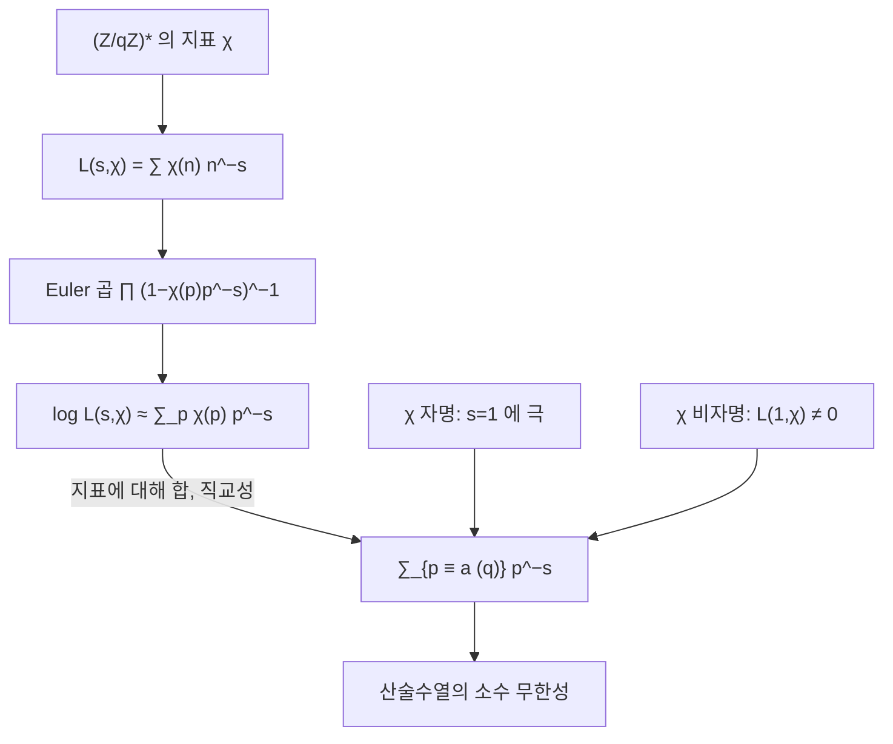

# Dirichlet 지표와 L 함수

# 개요

[소수 정리](prime-number-theorem.md)는 소수 전체의 밀도를 준다. 소수를 잉여류로 나누면 $4$ 로 나눈 나머지가 $1$ 인 소수와 $3$ 인 소수가 각각 얼마나 있는지를 묻게 된다.

Dirichlet 은 1837 년에 $\gcd(a,q)=1$ 이면 $a \bmod q$ 인 소수가 무한히 많음을 증명했다. 전략은 zeta 함수와 같이 소수의 정보를 담은 해석적 함수를 만들고 $s=1$ 근처의 행동을 읽는 것이다. $\zeta$ 는 모든 소수를 똑같이 취급하므로 잉여류를 구별하지 못한다.

잉여류를 골라내는 필터가 Dirichlet 지표이고, 지표를 붙여 만든 급수가 $L$ 함수다. 지표는 $(\mathbb Z/q\mathbb Z)^\times$ 라는 유한 아벨군의 [기약 표현의 지표](group-representations.md)이며, 유한군의 표현론이 소수의 분포를 결정하는 첫 사례다. 같은 구도가 Artin $L$ 함수와 Langlands 강령으로 이어진다.

# 직관

## 잉여류를 골라내는 필터

$(\mathbb Z/q\mathbb Z)^\times$ 는 아벨군이므로 모든 기약 표현이 1 차원이고 표현과 지표가 같다. 지표는 군에서 절댓값 1 인 복소수로 가는 준동형이며 서로 직교한다. 직교성에서

$$
\frac1{\varphi(q)}\sum_{\chi}\overline{\chi(a)}\thinspace\chi(n)=
\begin{cases}1&n\equiv a\pmod q\cr 0&\text{그 외}\end{cases}
$$

가 나온다. 유한군 위의 Fourier 급수를 한 점에 집중시킨 델타 함수다.

## 지표 전체에 대한 합

위 필터가 지표 전체의 합이므로 잉여류 하나를 다루려면 $\varphi(q)$ 개의 $L$ 함수를 한꺼번에 다뤄야 한다.

자명한 지표에 딸린 $L$ 함수는 사실상 $\zeta$ 이고 $s=1$ 에서 극을 가지며 이 극이 주항을 준다. 나머지 $\varphi(q)-1$ 개는 $s=1$ 에서 정칙이라 기여하지 않는다. 단 $L(1,\chi)\ne0$ 이어야 한다.

## $L(1,\chi)\ne0$

$\log L(s,\chi)$ 를 다루는데 $L(1,\chi)=0$ 이면 로그가 $-\infty$ 로 발산해 자명한 지표가 주는 $+\infty$ 를 상쇄한다. 그러면 소수가 유한하다는 결론이 남으므로 $L(1,\chi)\ne0$ 을 보여야 한다.

복소 지표 $\chi\ne\bar\chi$ 에서는 $L(1,\chi)=0$ 이면 켤레 $\bar\chi$ 에서도 $L(1,\bar\chi)=0$ 이라 0 점이 둘이 되고 자명한 지표의 극 하나로 감당이 안 되어 모순이다.

값이 $0,\pm1$ 인 실수 지표에서는 0 점이 하나뿐이라 이 셈이 통하지 않는다. 이 경우에 이차형식의 유수 공식이 등장하며, Siegel 0 점 문제의 뿌리도 이 지점이다.

# 정의

## Dirichlet 지표

법 $q$ 의 **Dirichlet 지표**는 다음을 만족하는 함수 $\chi:\mathbb Z\to\mathbb C$ 다.

- $\chi(n+q)=\chi(n)$
- $\chi(mn)=\chi(m)\chi(n)$
- $\gcd(n,q)\gt 1$ 이면 $\chi(n)=0$ 이고, 그렇지 않으면 $\chi(n)\ne0$

동치로, 군 준동형 $(\mathbb Z/q\mathbb Z)^\times\to\mathbb C^\times$ 를 $\mathbb Z$ 로 끌어올린 뒤 단원이 아닌 곳에서 $0$ 으로 확장한 것이다. 단원군이 유한하므로 $\chi(n)$ 은 $\varphi(q)$ 제곱근이고 $|\chi(n)|\in\lbrace 0,1\rbrace$ 이다.

법 $q$ 의 지표는 정확히 $\varphi(q)$ 개다. 유한 아벨군 $G$ 와 그 지표군 $\hat G$ 가 동형이기 때문이다. 모든 단원을 $1$ 로 보내는 지표를 주지표 $\chi_0$ 라 한다.

## 도체와 원시 지표

$\chi$ 가 법 $q$ 의 지표이고 $d\mid q$ 인 어떤 $d$ 와 법 $d$ 의 지표 $\chi'$ 가 있어 $\gcd(n,q)=1$ 일 때 $\chi(n)=\chi'(n)$ 이면 $\chi$ 는 $\chi'$ 에서 유도되었다고 한다. 이런 $d$ 중 최소가 $\chi$ 의 **도체**이고, 도체가 $q$ 와 같은 지표가 **원시 지표**다.

함수방정식은 원시 지표에서만 깔끔한 꼴이므로 이론적 서술은 원시 지표로 환원한다.

## Dirichlet $L$ 함수

$\mathrm{Re}\thinspace s\gt 1$ 에서 다음 급수가 절대수렴한다.

$$
L(s,\chi)=\sum_{n=1}^\infty\frac{\chi(n)}{n^s}
$$

$\chi=\chi_0$ 이면 $L(s,\chi_0)=\zeta(s)\prod_{p\mid q}(1-p^{-s})$ 이다. $\chi$ 가 비자명하면 한 주기의 합 $\sum_{n=1}^q\chi(n)=0$ 이라 부분합이 유계이고 급수가 $\mathrm{Re}\thinspace s\gt 0$ 에서 조건수렴한다.

## 일반화된 Riemann 가설

모든 Dirichlet 지표 $\chi$ 에 대해 $L(s,\chi)$ 의 비자명한 0 점이 전부 $\mathrm{Re}\thinspace s=1/2$ 위에 있다는 주장이다. $\chi=\chi_0$ 인 경우가 [Riemann 가설](riemann-hypothesis.md)이다.

# 성질

## 직교 관계

$$
\sum_{n \bmod q}\chi(n)\overline{\psi(n)}=
\begin{cases}\varphi(q)&\chi=\psi\cr 0&\text{그 외}\end{cases}
\qquad
\sum_{\chi \bmod q}\chi(n)\overline{\chi(a)}=
\begin{cases}\varphi(q)&n\equiv a\cr 0&\text{그 외}\end{cases}
$$

왼쪽이 지표의 직교성, 오른쪽이 그 쌍대다. 둘 다 유한 아벨군의 표현론에서 나오며 비자명한 $\chi$ 에 대한 $\sum_n\chi(n)=0$ 이 근거다[^1].

## Euler 곱

$\chi$ 가 완전 곱셈적이므로 유일분해가 작동한다.

$$
L(s,\chi)=\prod_p\Big(1-\frac{\chi(p)}{p^s}\Big)^{-1},\qquad \mathrm{Re}\thinspace s\gt 1
$$

로그를 취하면 소수에 대한 합이 나온다.

$$
\log L(s,\chi)=\sum_p\frac{\chi(p)}{p^s}+O(1)
$$

직교 관계를 적용하면 잉여류만 남는다.

$$
\sum_{p\equiv a\thinspace(q)}\frac1{p^s}=\frac1{\varphi(q)}\sum_\chi\overline{\chi(a)}\log L(s,\chi)+O(1)
$$

$s\to1^+$ 에서 우변의 $\chi_0$ 항이 $\frac1{\varphi(q)}\log\frac1{s-1}\to\infty$ 로 발산하고 나머지는 $L(1,\chi)\ne0$ 이므로 유계다. 좌변이 발산하므로 그 잉여류에 소수가 무한히 많다.

## 해석적 연속과 함수방정식

도체 $q$ 인 원시 지표 $\chi$ 에 대해 $L(s,\chi)$ 는 복소평면 전체로 정칙 연속되고, 완비화한 함수

$$
\Lambda(s,\chi)=\Big(\frac q\pi\Big)^{(s+\epsilon)/2}\Gamma\negthinspace\Big(\frac{s+\epsilon}2\Big)L(s,\chi),
\qquad \epsilon=\frac{1-\chi(-1)}2
$$

가 $\Lambda(s,\chi)=\frac{\tau(\chi)}{i^\epsilon\sqrt q}\thinspace\Lambda(1-s,\bar\chi)$ 를 만족한다. $\epsilon$ 은 $\chi$ 의 짝홀을 나타내고 $\tau(\chi)=\sum_{n \bmod q}\chi(n)e^{2\pi in/q}$ 는 Gauss 합이다. 원시 지표에서 $|\tau(\chi)|=\sqrt q$ 이므로 함수방정식의 상수가 절댓값 1 이다.

$\zeta$ 와 달리 $s\mapsto1-s$ 가 $\chi$ 를 $\bar\chi$ 로 바꾸고, 실수 지표에서만 자기 자신으로 돌아온다.

## 산술수열의 소수 정리

$\gcd(a,q)=1$ 일 때

$$
\pi(x;q,a)\sim\frac1{\varphi(q)}\cdot\frac x{\ln x}
$$

이고 소수가 $\varphi(q)$ 개의 잉여류에 고르게 나뉜다. 증명의 핵심은 $\mathrm{Re}\thinspace s=1$ 위에 $L$ 함수의 0 점이 없다는 것이다.

오차항을 $q$ 에 대해 고르게 잡는 것은 어렵다. Siegel–Walfisz 정리가 $q\le(\ln x)^A$ 범위에서 이를 주지만 상수가 비유효적이다. 실수 지표의 Siegel 0 점을 배제하지 못하기 때문이다. $q\le x^{1/2-\epsilon}$ 범위의 평균에 대해서는 Bombieri–Vinogradov 정리가 **GRH**(generalized Riemann hypothesis)에 준하는 결과를 무조건적으로 준다.

## 함수체의 경우

$\mathbb F_q$ 위의 다항식환 $\mathbb F_q[t]$ 는 유클리드 정역이고, 소수 대신 기약다항식이 있으며 대응하는 zeta 함수와 지표와 $L$ 함수가 있다.

차이는 계수가 유한하다는 점이다. $\mathbb F_q[t]$ 의 zeta 함수는 유리함수이고 유한체 위 곡선의 $L$ 함수는 다항식이라 0 점이 유한 개다. Weil 이 1948 년에 곡선에 대해, Deligne 이 1974 년에 일반 다양체에 대해 그 0 점들의 절댓값이 $q^{-1/2}$ 임을 증명했다.

증명이 정수로 옮겨 오지 않는 것은 도구가 기하적이기 때문이다. 유한체 위의 다양체에는 코호몰로지와 Frobenius 작용이 있고 0 점이 그 고윳값으로 나온다. $\mathrm{Spec}\thinspace\mathbb Z$ 에 대응하는 기하를 세우려는 시도는 아직 성공하지 못했다.

## Chebyshev 편향

$4k+1$ 과 $4k+3$ 소수의 개수 비는 $1$ 로 수렴하지만 차이의 부호는 대개 $3 \bmod 4$ 쪽이 앞선다.

명시 공식에서 이유가 읽힌다. 제곱수도 세는 $\psi(x;q,a)$ 에서는 $p^2\equiv1$ 이 항상 성립하므로 제곱 항이 $1 \bmod 4$ 쪽에만 $\sqrt x$ 만큼 더해지고, 소수만 세는 함수로 환산하면 그만큼 $1 \bmod 4$ 가 손해를 본다. 부호는 무한히 자주 바뀌지만 로그밀도로 재면 약 99.6% 의 시간 동안 $3 \bmod 4$ 가 앞선다. 이 서술은 GRH 와 0 점의 선형독립성을 가정해야 정리가 된다.

[^1]: $\chi(b)\ne1$ 인 $b$ 를 잡으면 $n\mapsto bn$ 이 잉여류의 치환이므로 $S=\sum_n\chi(n)$ 에 대해 $S=\chi(b)S$ 이고, 따라서 $S=0$ 이다.

# 활용

- 실수 원시 지표는 이차 수체 $\mathbb Q(\sqrt d)$ 와 일대일로 대응하고 그 지표가 Kronecker 기호다. $d\lt 0$ 에서 $L(1,\chi_d)=\frac{2\pi h(d)}{w\sqrt{|d|}}$ 이며 $h(d)$ 는 유수, $w$ 는 단원근의 개수다. 유수가 양의 정수이므로 $L(1,\chi_d)\gt 0$ 이 따라오고, 이것이 실수 지표의 난관을 뚫는 Dirichlet 의 해법이다. 해석적 양과 대수적 불변량을 잇는 같은 형식의 등식이 Birch–Swinnerton-Dyer 추측까지 이어진다.
- $p\equiv3\pmod4$ 인 소수는 제곱근 계산이 $a^{(p+1)/4}$ 한 번으로 끝나 [RSA](rsa-cryptosystem.md)(Rivest–Shamir–Adleman)의 Rabin 변형과 타원곡선 좌표 압축에 쓰이고, $p\equiv1\pmod{2^k}$ 인 소수는 $2^k$ 차 단위근을 가져 [고속 Fourier 변환](fft.md)을 유한체에서 수행하는 수론 변환의 법이 된다. 산술수열의 소수 정리가 밀도를 $1/\varphi(q)$ 로 보장하므로 후보를 무작위로 뽑아 소수판정을 반복하면 $\varphi(q)\ln x$ 번 남짓에 성공한다.
- 아벨이 아닌 Galois 군의 표현으로 같은 구성을 하면 Artin $L$ 함수, 타원곡선의 점 개수로 하면 Hasse–Weil $L$ 함수가 된다. Langlands 강령은 이 $L$ 함수들이 자기동형 표현의 $L$ 함수와 일치한다고 예측하며, 그 대응에서 해석적 연속과 함수방정식이 따라온다. Wiles 의 증명도 특정 타원곡선의 $L$ 함수가 모듈러 형식의 $L$ 함수와 같음을 보인 것이다.

# 연관 문서

## 선수지식

- [소수 정리](prime-number-theorem.md)
- [군의 표현과 지표](group-representations.md)
- [이차 상호법칙](quadratic-reciprocity.md)

## 더 알아보기

- [Chebotarev 밀도 정리](chebotarev.md)
- [Birch–Swinnerton-Dyer 추측](birch-swinnerton-dyer.md)
- [Gauss 합과 국소 근 수](gauss-sums.md)

#number_theory #complex_analysis #group_theory
