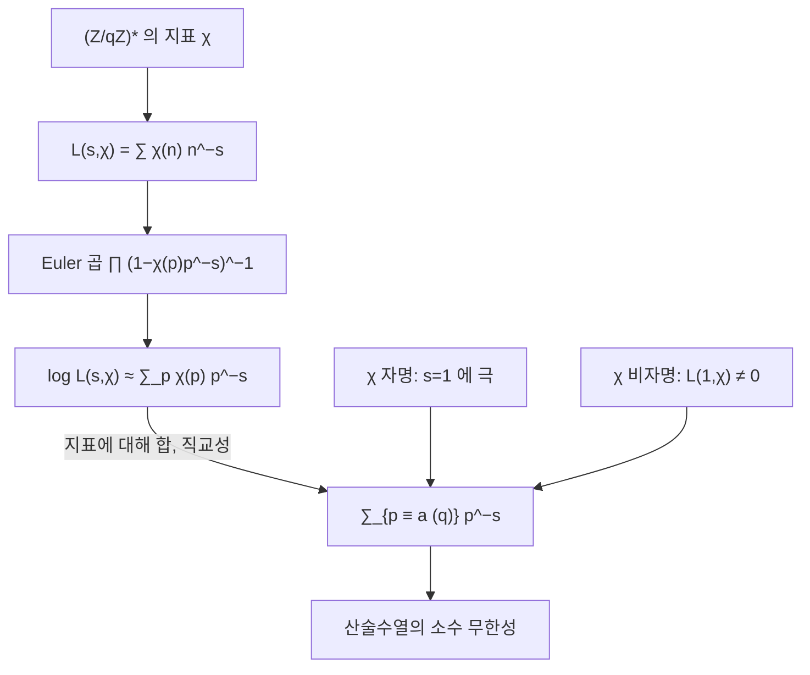

# Dirichlet 지표와 L 함수

# 개요

[소수 정리](prime-number-theorem.md)는 소수 전체의 밀도를 말해 준다. 그런데 소수를 나눠 보면 어떨까. `4` 로 나눈 나머지가 `1` 인 소수와 `3` 인 소수는 각각 몇 개씩인가. 애초에 둘 다 무한히 많기는 한가.

Dirichlet 이 1837 년에 답했다. `\gcd(a,q)=1` 이면 `a \bmod q` 인 소수가 무한히 많다. 증명의 전략은 zeta 함수와 같다. 소수의 정보를 담은 해석적 함수를 만들고, 그 함수의 `s=1` 근처 행동을 읽는다. 다만 하나의 함수로는 부족하다. `\zeta` 는 모든 소수를 똑같이 취급하므로 잉여류를 구별하지 못한다.

필요한 것은 잉여류를 골라내는 필터다. 그 필터가 Dirichlet 지표이고, 지표를 붙여 만든 급수가 `L` 함수다. 그리고 지표는 새로 발명된 대상이 아니다. `(\mathbb Z/q\mathbb Z)^\times` 라는 유한 아벨군의 [기약 표현의 지표](group-representations.md)가 바로 그것이다. 유한군의 표현론이 소수의 분포를 결정하는 도구로 쓰이는 첫 번째 사례이며, 이 구도가 뒤에 Artin `L` 함수와 Langlands 강령까지 이어진다.

# 직관

## 잉여류를 골라내는 필터

`n\equiv a \pmod q` 인 항만 남기고 나머지를 지우는 장치를 원한다. 유한 아벨군 위의 Fourier 해석이 정확히 그 장치를 준다.

`(\mathbb Z/q\mathbb Z)^\times` 는 아벨군이므로 모든 기약 표현이 1 차원이고, 표현과 지표가 같은 것이다. 지표는 군에서 단위원의 절댓값을 갖는 복소수로 가는 준동형이다. 지표들은 서로 직교하며, 그 직교성을 그대로 쓰면 다음이 나온다.

$$
\frac1{\varphi(q)}\sum_{\chi}\overline{\chi(a)}\,\chi(n)=
\begin{cases}1&n\equiv a\pmod q\\0&\text{그 외}\end{cases}
$$

원하는 잉여류만 `1`, 나머지는 `0` 이다. 유한군 위의 Fourier 급수를 한 점에 집중시킨 델타 함수라고 보면 된다.

## 왜 하나가 아니라 `\varphi(q)` 개인가

위 필터는 지표 전체에 대한 합이다. 그러므로 잉여류 하나를 다루려면 `\varphi(q)` 개의 `L` 함수를 한꺼번에 다뤄야 한다.

그중 자명한 지표(모든 단원을 `1` 로 보내는 것)에 딸린 `L` 함수는 사실상 `\zeta` 이고, `s=1` 에서 극을 가진다. 이 극이 주항을 준다. 나머지 `\varphi(q)-1` 개의 `L` 함수는 `s=1` 에서 정칙이므로 아무 기여도 하지 않는다 — 단, `L(1,\chi)\ne0` 일 때만 그렇다.

## 난관은 단 한 점이다

여기가 증명 전체의 급소다. `\log L(s,\chi)` 를 다루는데 `L(1,\chi)=0` 이면 로그가 `-\infty` 로 발산해서, 자명한 지표가 주는 `+\infty` 를 상쇄해 버린다. 그러면 소수가 유한할 수도 있다는 결론이 남는다. 따라서 `L(1,\chi)\ne0` 을 반드시 보여야 한다.

복소 지표(`\chi\ne\bar\chi`)에 대해서는 쉽다. `L(1,\chi)=0` 이면 켤레인 `\bar\chi` 에서도 `L(1,\bar\chi)=0` 이라 0 점이 둘이 되고, 자명한 지표의 극 하나로는 감당이 안 되어 모순이 나온다.

실수 지표(`\chi=\bar\chi`, 값이 `0,\pm1`)에서는 0 점이 하나뿐이라 이 셈이 통하지 않는다. 이 경우만 따로 다뤄야 하며, 여기서 이차형식의 유수 공식 같은 전혀 다른 도구가 등장한다. 100 년 넘게 남아 있는 Siegel 0 점 문제의 뿌리도 정확히 이 지점이다.



# 정의

## Dirichlet 지표

법 `q` 의 Dirichlet 지표는 다음을 만족하는 함수 `\chi:\mathbb Z\to\mathbb C` 다.

- `\chi(n+q)=\chi(n)`
- `\chi(mn)=\chi(m)\chi(n)`
- `\gcd(n,q)>1` 이면 `\chi(n)=0`, 그렇지 않으면 `\chi(n)\ne0`

동치인 서술로, 군 준동형 `(\mathbb Z/q\mathbb Z)^\times\to\mathbb C^\times` 를 `\mathbb Z` 로 끌어올린 뒤 단원이 아닌 곳에서 `0` 으로 확장한 것이다. 단원군이 유한하므로 `\chi(n)` 은 항상 `\varphi(q)` 제곱근이며, 특히 `|\chi(n)|\in\{0,1\}` 이다.

법 `q` 의 지표는 정확히 `\varphi(q)` 개다. 유한 아벨군 `G` 와 그 지표군 `\hat G` 가 (자연스럽지는 않게) 동형이기 때문이다.

모든 단원을 `1` 로 보내는 지표를 주지표 `\chi_0` 라 한다.

## 도체와 원시 지표

`\chi` 가 법 `q` 의 지표이고 `d\mid q` 인 어떤 `d` 와 법 `d` 의 지표 `\chi'` 가 있어 `\gcd(n,q)=1` 일 때 `\chi(n)=\chi'(n)` 이면, `\chi` 는 `\chi'` 에서 유도되었다고 한다. 이런 `d` 중 가장 작은 것이 `\chi` 의 도체이고, 도체가 `q` 와 같은 지표를 원시 지표라 한다.

함수방정식은 원시 지표에 대해서만 깔끔한 꼴을 가지므로, 이론적 서술에서는 늘 원시 지표로 환원한다.

## Dirichlet `L` 함수

`\mathrm{Re}\,s>1` 에서 다음 급수가 절대수렴한다.

$$
L(s,\chi)=\sum_{n=1}^\infty\frac{\chi(n)}{n^s}
$$

`\chi=\chi_0` 이면 `L(s,\chi_0)=\zeta(s)\prod_{p\mid q}(1-p^{-s})` 이므로 `\zeta` 와 극·0 점을 극히 일부만 달리한다. `\chi` 가 비자명하면 한 주기에 걸친 합 `\sum_{n=1}^q\chi(n)=0` 이므로 부분합이 유계이고, 급수가 `\mathrm{Re}\,s>0` 에서 조건수렴한다.

## 일반화된 Riemann 가설

모든 Dirichlet 지표 `\chi` 에 대해 `L(s,\chi)` 의 비자명한 0 점이 전부 `\mathrm{Re}\,s=1/2` 위에 있다는 주장이다. `\chi=\chi_0` 인 경우가 원래 Riemann 가설이다.

# 성질

## 직교 관계

$$
\sum_{n \bmod q}\chi(n)\overline{\psi(n)}=
\begin{cases}\varphi(q)&\chi=\psi\\0&\text{그 외}\end{cases}
\qquad
\sum_{\chi \bmod q}\chi(n)\overline{\chi(a)}=
\begin{cases}\varphi(q)&n\equiv a\\0&\text{그 외}\end{cases}
$$

왼쪽은 지표의 직교성이고 오른쪽은 그 쌍대다. 둘 다 유한 아벨군의 표현론에서 나오며, 비자명한 지표 `\chi` 에 대해 `\sum_n\chi(n)=0` 이라는 사실이 본질이다[^1].

## Euler 곱

`\chi` 가 완전 곱셈적이므로 유일분해가 그대로 작동한다.

$$
L(s,\chi)=\prod_p\Big(1-\frac{\chi(p)}{p^s}\Big)^{-1},\qquad \mathrm{Re}\,s>1
$$

로그를 취하면 소수에 대한 합이 나온다.

$$
\log L(s,\chi)=\sum_p\frac{\chi(p)}{p^s}+O(1)
$$

여기에 직교 관계를 적용하면 잉여류만 남는다.

$$
\sum_{p\equiv a\,(q)}\frac1{p^s}=\frac1{\varphi(q)}\sum_\chi\overline{\chi(a)}\log L(s,\chi)+O(1)
$$

`s\to1^+` 에서 우변의 `\chi_0` 항이 `\frac1{\varphi(q)}\log\frac1{s-1}\to\infty` 로 발산하고, 나머지 항은 `L(1,\chi)\ne0` 덕분에 유계다. 따라서 좌변이 발산하고, 그 잉여류에 소수가 무한히 많다. 이것이 Dirichlet 정리의 증명이다.

## 해석적 연속과 함수방정식

도체 `q` 인 원시 지표 `\chi` 에 대해 `L(s,\chi)` 는 복소평면 전체로 정칙 연속되고(비자명하면 극이 없다), 완비화한 함수

$$
\Lambda(s,\chi)=\Big(\frac q\pi\Big)^{(s+\epsilon)/2}\Gamma\!\Big(\frac{s+\epsilon}2\Big)L(s,\chi),
\qquad \epsilon=\frac{1-\chi(-1)}2
$$

가 함수방정식 `\Lambda(s,\chi)=\frac{\tau(\chi)}{i^\epsilon\sqrt q}\,\Lambda(1-s,\bar\chi)` 를 만족한다. `\epsilon` 은 `\chi` 가 짝인지 홀인지를 나타내고, `\tau(\chi)=\sum_{n \bmod q}\chi(n)e^{2\pi in/q}` 는 Gauss 합이다. 원시 지표에서 `|\tau(\chi)|=\sqrt q` 이며, 이 등식이 함수방정식의 상수를 절댓값 1 로 만든다.

`\zeta` 의 함수방정식과 달리 `s\mapsto1-s` 가 `\chi` 를 `\bar\chi` 로 바꾼다. 실수 지표에서만 자기 자신으로 돌아온다.

## 산술수열의 소수 정리

소수 정리를 그대로 옮기면 다음을 얻는다. `\gcd(a,q)=1` 일 때

$$
\pi(x;q,a)\sim\frac1{\varphi(q)}\cdot\frac x{\ln x}
$$

즉 소수가 `\varphi(q)` 개의 잉여류에 고르게 나뉜다. 증명의 핵심은 소수 정리와 같이 `\mathrm{Re}\,s=1` 위에 `L` 함수의 0 점이 없다는 것이다.

오차항을 `q` 에 대해 고르게 잡는 것은 훨씬 어렵다. Siegel–Walfisz 정리가 `q\le(\ln x)^A` 범위에서 이를 주지만, 상수가 비유효적이다. 실수 지표의 Siegel 0 점(있다면 `1` 에 매우 가까운 실수 0 점)을 배제하지 못하기 때문이며, 존재하지 않는다고 믿어지는 대상 때문에 정리의 상수를 계산할 수 없다는 기묘한 상황이다. 훨씬 넓은 `q\le x^{1/2-\epsilon}` 범위에서 평균적으로는 Bombieri–Vinogradov 정리가 GRH 에 준하는 결과를 무조건적으로 준다.

## 함수체에서는 이미 참이다

`\mathbb F_q` 위의 다항식환 `\mathbb F_q[t]` 는 `\mathbb Z` 와 놀랄 만큼 닮았다. 유클리드 정역이고, 소수 대신 기약다항식이 있고, 대응하는 zeta 함수와 지표와 `L` 함수가 있다.

차이는 이쪽이 유한한 대상의 계수라는 점이다. `\mathbb F_q[t]` 의 zeta 함수는 유리함수이고, 유한체 위의 곡선에 대한 `L` 함수도 다항식이 되어 0 점이 유한 개다. Weil 이 1948 년에 곡선에 대해, Deligne 이 1974 년에 일반 다양체에 대해 그 0 점들의 절댓값이 정확히 `q^{-1/2}` 임을 증명했다. 곧 함수체판 Riemann 가설은 정리다.

증명이 정수로 옮겨 오지 않는 이유는 도구가 기하적이기 때문이다. 유한체 위의 다양체에는 코호몰로지와 Frobenius 작용이 있고, 0 점이 그 작용의 고윳값으로 나온다. `\mathrm{Spec}\,\mathbb Z` 에 대응하는 기하를 세우려는 시도가 아직 성공하지 못했다. 그럼에도 구조적으로 같은 진술이 한쪽에서 참임은 강한 방증으로 여겨진다.

## 수치로 확인

```python
import cmath, math

def characters(q):
    """(Z/qZ)^* 가 순환군인 q 에 대해 지표를 명시적으로 만든다."""
    units = [a for a in range(1, q) if math.gcd(a, q) == 1]
    n = len(units)
    g = next(g for g in units
             if len({pow(g, k, q) for k in range(n)}) == n)      # 원시근
    idx = {pow(g, k, q): k for k in range(n)}                    # 이산로그
    def chi(j):
        def f(a):
            if math.gcd(a, q) != 1: return 0
            return cmath.exp(2j * cmath.pi * j * idx[a % q] / n)
        return f
    return [chi(j) for j in range(n)], units

X, U = characters(5)
print("q=5, 지표표 (행=지표, 열=1,2,3,4)")
for j, chi in enumerate(X):
    print(f"  chi_{j}: " + "  ".join(f"{chi(a):+.2f}" for a in U))

# 직교성: 서로 다른 지표의 내적은 0, 같으면 phi(q)
print("<chi_1, chi_3> =", round(abs(sum(X[1](a) * X[3](a).conjugate() for a in U)), 12))
print("<chi_1, chi_1> =", round(abs(sum(X[1](a) * X[1](a).conjugate() for a in U)), 12))

# 법 4 의 비자명 지표는 1,0,-1,0,... -> Leibniz 급수
chi4 = lambda a: 0 if a % 2 == 0 else (1 if a % 4 == 1 else -1)
L = sum(chi4(n) / n for n in range(1, 2_000_001))
print(f"L(1, chi_4) = {L:.6f},  pi/4 = {math.pi/4:.6f}")

# 산술수열 속 소수의 개수
N = 10**6
ok = bytearray([1]) * (N + 1); ok[0] = ok[1] = 0
for p in range(2, int(N**0.5) + 1):
    if ok[p]: ok[p*p::p] = bytearray(len(ok[p*p::p]))
cnt = {1: 0, 3: 0}
for p in range(3, N + 1, 2):
    if ok[p]: cnt[p % 4] += 1
print(f"x=10^6: 4k+1 소수 {cnt[1]}개, 4k+3 소수 {cnt[3]}개, 차 {cnt[3]-cnt[1]}")

# q=5, 지표표 (행=지표, 열=1,2,3,4)
#   chi_0: +1.00+0.00j  +1.00+0.00j  +1.00+0.00j  +1.00+0.00j
#   chi_1: +1.00+0.00j  +0.00+1.00j  -0.00-1.00j  -1.00+0.00j
#   chi_2: +1.00+0.00j  -1.00+0.00j  -1.00+0.00j  +1.00-0.00j
#   chi_3: +1.00+0.00j  -0.00-1.00j  +0.00+1.00j  -1.00+0.00j
# <chi_1, chi_3> = 0.0
# <chi_1, chi_1> = 4.0
# L(1, chi_4) = 0.785398,  pi/4 = 0.785398
# x=10^6: 4k+1 소수 39175개, 4k+3 소수 39322개, 차 147
```

지표표에서 `\chi_2` 만 값이 실수다. `(\mathbb Z/5\mathbb Z)^\times\cong\mathbb Z/4` 의 위수 2 인 원소에 해당하며, 이것이 법 5 의 유일한 실수 비자명 지표이자 Legendre 기호 `\left(\frac n5\right)` 다. `\chi_1` 과 `\chi_3` 은 서로 켤레라서 위의 "복소 지표는 쉽다" 논증이 적용되고, `\chi_2` 만 따로 다뤄야 한다.

`L(1,\chi_4)=\pi/4` 는 Leibniz 급수다. `0` 이 아니라는 사실을 눈으로 확인할 수 있는 가장 작은 사례이며, 일반적으로 이 값이 `0` 이 아님을 보이는 것이 앞서 말한 난관이다.

## Chebyshev 편향

위 출력에서 `4k+3` 소수가 `147` 개 더 많다. 두 잉여류의 개수 비는 `1` 로 수렴하지만, 차이의 부호는 압도적으로 자주 한쪽이다. 제곱잉여가 아닌 쪽(`3 \bmod 4`)이 앞선다.

이유는 명시 공식에 `\psi(x;q,a)` 를 넣어 보면 보인다. 제곱수도 세는 `\psi` 에서는 `p^2\equiv1` 이 항상 성립하므로 제곱 항이 `1 \bmod 4` 쪽에만 `\sqrt x` 만큼 더해지고, 소수만 세는 함수로 환산하면 그만큼 `1 \bmod 4` 가 손해를 본다. 부호가 무한히 자주 바뀌기는 하지만(소수 정리 문서의 Littlewood 사례와 같은 현상이다), 로그밀도로 재면 약 99.6% 의 시간 동안 `3 \bmod 4` 가 앞선다. 이 서술 자체가 GRH 와 0 점의 선형독립성을 가정해야 정리가 된다.

[^1]: `\chi(b)\ne1` 인 `b` 를 잡으면 `n\mapsto bn` 이 잉여류의 치환이므로 `S=\sum_n\chi(n)` 에 대해 `S=\chi(b)S`, 따라서 `S=0` 이다.

# 활용

## 이차 상호법칙과 유수 공식

실수 원시 지표는 이차 수체 `\mathbb Q(\sqrt d)` 와 일대일로 대응하고, 그 지표는 Kronecker 기호다. 이때 `L(1,\chi)` 가 그 수체의 유수와 판별식으로 표현된다.

$$
L(1,\chi_d)=\frac{2\pi h(d)}{w\sqrt{|d|}}\quad(d<0)
$$

여기서 `h(d)` 는 유수, `w` 는 단원근의 개수다. 유수가 양의 정수이므로 `L(1,\chi_d)>0` 이 즉시 따라온다. 실수 지표의 난관을 정면으로 뚫는 Dirichlet 의 원래 해법이 바로 이것이다. 해석적 양이 대수적 불변량과 같다는 첫 사례이며, 같은 형식의 등식이 Birch–Swinnerton-Dyer 추측까지 이어진다.

## 소수를 찾는 알고리즘

특정 잉여류의 소수가 필요할 때가 있다. `p\equiv3\pmod4` 인 소수는 제곱근 계산이 `a^{(p+1)/4}` 한 번으로 끝나서 [RSA](rsa-cryptosystem.md) 의 Rabin 변형과 타원곡선 좌표 압축에 쓰이고, `p\equiv1\pmod{2^k}` 인 소수는 `2^k` 차 단위근을 가져서 [고속 Fourier 변환](fft.md)을 유한체에서 수행하는 수론 변환의 법으로 쓰인다.

산술수열의 소수 정리가 이 탐색의 기대 시간을 보장한다. 밀도가 `1/\varphi(q)` 배로만 줄어들므로, 조건을 만족하는 후보를 무작위로 뽑아 소수판정을 반복하면 `\varphi(q)\ln x` 번 남짓에 성공한다. 이 보장이 없으면 "그런 소수가 충분히 많다" 를 가정한 채 돌리는 셈이 된다.

## 더 큰 `L` 함수들로

Dirichlet `L` 함수는 `(\mathbb Z/q\mathbb Z)^\times` 라는 아벨군의 지표에서 나왔다. 아벨이 아닌 Galois 군의 표현으로 같은 구성을 하면 Artin `L` 함수가 되고, 타원곡선의 점 개수로 하면 Hasse–Weil `L` 함수가 된다.

Langlands 강령은 이 모든 `L` 함수가 자기동형 표현에서 오는 `L` 함수와 일치한다고 예측한다. 그 대응이 성립하면 해석적 연속과 함수방정식이 자동으로 따라온다. Wiles 의 Fermat 마지막 정리 증명도 특정 타원곡선의 `L` 함수가 모듈러 형식의 `L` 함수와 같음을 보이는 것이었다. 아벨군의 직교성이라는 소박한 출발점이 현대 정수론의 뼈대가 된 셈이다.

# 연관 문서

## 선수지식

- [소수 정리와 Riemann zeta 함수](prime-number-theorem.md)
- [군의 표현과 지표](group-representations.md)
- [이차 상호법칙](quadratic-reciprocity.md)

## 더 알아보기

- [Chebotarev 밀도 정리](chebotarev.md)
- [Gauss 합과 국소 근 수](gauss-sums.md)

#number_theory #complex_analysis #group_theory
