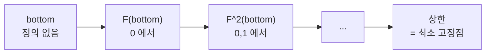

# 영역 이론과 Kleene 고정점 정리

# 개요

재귀적으로 정의된 프로그램은 자기 자신을 참조한다.

$$
\mathrm{fact}(n)=\begin{cases}1,&n=0\\ n\cdot\mathrm{fact}(n-1),&n>0\end{cases}
$$

이것은 정의가 아니라 **방정식**이다. 미지의 것이 좌우 양쪽에 있으므로, 이 식이 무엇을 뜻하는지 말하려면 방정식의 해를 지정해야 한다. 게다가 해는 여럿일 수 있고, 어떤 프로그램은 영영 끝나지 않으므로 전체함수를 해로 요구할 수도 없다.

영역 이론의 답은 이렇다. **부분함수들에 "정보가 더 많다" 는 순서를 주고, 그 순서에서 가장 작은 해를 택한다.** 프로그램 본문을 한 번 펼치는 조작을 $F$ 라 하면 방정식은 $f=F(f)$ 이고, 답은 최소 고정점이다. 그것을 계산하는 방법까지 정리가 말해 준다.

$$
\mathrm{lfp}(F)=\bigsqcup_{n\ge0}F^n(\bot)
$$

아무것도 정의되지 않은 함수 $\bot$ 에서 시작해 $F$ 를 반복 적용하고 극한을 취하면 된다. 이것이 **Kleene 고정점 정리**다.

[Galois 연결](galois-connections.md)에서 본 Knaster–Tarski 정리는 완비격자와 단조사상에서 고정점의 존재를 주었지만, 그 고정점이 무엇인지는 말하지 않았다. 여기서는 순서 구조를 조금 약화하는 대신 — 완비격자가 아니라 방향완비 부분순서 — 사상에 연속성을 요구해서 **고정점을 가산 반복으로 도달 가능한 것**으로 만든다. 존재 정리가 계산 절차가 되는 것이 이 교환의 요점이다. 그 덕에 재귀 프로그램의 의미가 정해지고, 정지하지 않는 [계산](computability.md)까지 하나의 틀에서 다루어진다.

# 직관

## 부분함수를 정보로 읽는다

$f\sqsubseteq g$ 를 "$f$ 가 정의된 곳에서는 $g$ 도 정의되고 값이 같다" 로 둔다. 그래프로 보면 포함관계다. 가장 작은 원소는 어디서도 정의되지 않은 함수 $\bot$ 이고, 위로 갈수록 정보가 늘어난다.

이 순서에서 정지하지 않음은 결함이 아니라 **정보가 없음**이다. $\bot$ 은 "아직 아무 답도 내놓지 않은 계산" 이고, 반복을 거듭할수록 답이 하나씩 채워진다.

## 반복이 답을 쌓아 올린다

계승의 본문을 한 번 펼치는 조작을 보자.

$$
F(f)(n)=\begin{cases}1,&n=0\\ n\cdot f(n-1),&n>0\ \text{이고}\ f(n-1)\ \text{가 정의됨}\end{cases}
$$

$\bot$ 에서 출발하면 $F(\bot)$ 은 $0$ 에서만 정의되고, $F^2(\bot)$ 은 $1$ 까지, $F^{k}(\bot)$ 은 $k-1$ 까지 정의된다. 각 단계는 이전 단계보다 정보가 많으므로 사슬이 만들어지고, 그 상한이 모든 자연수에서 정의된 계승 함수다. **재귀의 실행이 곧 고정점 반복**이라는 것이 이 그림의 내용이다.



## 왜 최소여야 하는가

고정점이 여럿일 수 있다. $\mathrm{loop}(n)=\mathrm{loop}(n)$ 은 정보를 전혀 더하지 않는 방정식이라 **어떤 함수든** 해가 된다. 상수함수 $0$ 도 해다. 그러나 이 프로그램을 실행하면 아무 값도 나오지 않으므로, 올바른 의미는 $\bot$ 이다.

최소 고정점만이 "프로그램이 실제로 만들어 내는 정보" 에 해당한다. 더 큰 고정점은 근거 없이 덧붙인 답이다. 최소성이 규약이 아니라 **연산적 타당성의 요구**라는 점이 중요하다.

## 연속성이 하는 일

단조성만으로는 $\bigsqcup_n F^n(\bot)$ 이 고정점이라는 보장이 없다. 극한을 취하고 $F$ 를 적용하는 것과, $F$ 를 적용하고 극한을 취하는 것이 같아야 한다. 그것이 **Scott 연속성**이다.

$$
F\Bigl(\bigsqcup_i x_i\Bigr)=\bigsqcup_i F(x_i)\qquad(\{x_i\}\ \text{는 방향집합})
$$

연산적으로 읽으면 "출력의 유한한 부분을 알려면 입력의 유한한 부분만 보면 된다" 는 유한성 조건이다. 실제 프로그램이 만드는 함수는 모두 이 성질을 갖는다. 무한한 입력을 다 읽고 나서야 첫 글자를 내놓는 계산은 없기 때문이다.

# 정의

## 방향완비 부분순서

부분순서집합 $D$ 의 부분집합 $A$ 가 **방향집합**이라는 것은 비어 있지 않고 임의의 두 원소가 $A$ 안에 상계를 갖는다는 뜻이다. 모든 방향집합이 상한을 가지면 $D$ 를 **dcpo** 라 하고, 최소원 $\bot$ 까지 있으면 **cpo** 라 한다.

완비격자는 cpo 지만 역은 아니다. 부분함수의 집합은 cpo 이되 완비격자가 아니다. 두 부분함수가 같은 입력에서 다른 값을 주면 상계가 없다.

## Scott 연속 사상

$F\colon D\to E$ 가 단조이고 모든 방향집합 $A\subseteq D$ 에 대해 $F(\bigsqcup A)=\bigsqcup F(A)$ 이면 **Scott 연속**이라 한다. 연속이면 단조다. 역은 성립하지 않는다.

## Kleene 고정점 정리

**정리.** $D$ 가 cpo 이고 $F\colon D\to D$ 가 Scott 연속이면 $F$ 는 최소 고정점을 가지며

$$
\mathrm{lfp}(F)=\bigsqcup_{n\ge0}F^n(\bot)
$$

이다. 나아가 $F(x)\sqsubseteq x$ 인 모든 $x$ 에 대해 $\mathrm{lfp}(F)\sqsubseteq x$ 다.

증명은 짧다. $\bot\sqsubseteq F(\bot)$ 이고 단조성으로 $F^n(\bot)$ 이 사슬이므로 상한 $x^*$ 이 존재한다. 연속성으로 $F(x^\ast)=\bigsqcup F^{n+1}(\bot)=x^\ast$ 이다. 최소성은 $F(x)\sqsubseteq x$ 에서 귀납으로 $F^n(\bot)\sqsubseteq x$ 를 얻어 나온다.

## Knaster–Tarski 와의 비교

| | Knaster–Tarski | Kleene |
|---|---|---|
| 구조 | 완비격자 | cpo |
| 사상 | 단조 | Scott 연속 |
| 고정점 | 전체가 완비격자 | 최소 고정점 |
| 최소점의 서술 | $\bigwedge\lbrace x:F(x)\le x\rbrace$ | $\bigsqcup_n F^n(\bot)$ |

Knaster–Tarski 는 구조를 더 요구하고 사상에는 덜 요구하며, 결과를 **위에서** 서술한다. Kleene 은 반대로 아래에서 쌓아 올린다. 계산하려면 아래에서 쌓아야 하므로 프로그램 의미론은 Kleene 쪽을 쓴다. [추상해석](abstract-interpretation.md)에서 정적 분석의 결과를 반복으로 구하는 절차도 같은 정리다.

## 왜 "영역" 이론인가

cpo 중에서도 **대수적** 또는 **연속적** 이라 불리는 것들 — 유한 근사원(compact element)들이 아래로 조밀한 것 — 을 영역이라 부른다. 유한 근사원이 "유한 시간에 관측되는 정보 조각" 에 해당하므로, 영역은 계산 가능한 대상의 위상적 모형이 된다. Scott 위상에서 열린집합이 "관측 가능한 성질" 이고, 연속사상이 곧 Scott 연속 사상이 되는 것이 이 관점의 결론이다.

Scott 이 이 이론을 만든 직접적 계기는 $D\cong D^D$ 를 만족하는 비자명한 $D$ 의 구성이었다. 집합에서는 농도 때문에 불가능하지만, 영역에서는 연속사상만 세므로 가능하다. 이것이 [lambda 계산](lambda-calculus.md)의 최초의 수학적 모형이 되었다.

# 성질

- **합성과 곱이 닫힌다.** 연속사상의 합성은 연속이고, cpo 의 곱과 연속사상 공간도 cpo 다. 그래서 프로그래밍 언어의 타입 구성자들이 이 범주 안에서 해석된다.
- **고정점 연산자도 연속이다.** $\mathrm{lfp}\colon[D\to D]\to D$ 자체가 Scott 연속이다. 재귀를 언어의 일급 구성으로 넣을 수 있는 근거다.
- **반복 횟수는 유한하지 않을 수 있다.** 계승 예처럼 각 인수에 대해서는 유한 단계에 값이 확정되지만, 전체 고정점에 도달하는 데는 $\omega$ 단계가 필요하다. 격자의 높이가 유한한 경우(추상해석의 많은 추상 영역)에만 유한 반복으로 끝난다.
- **정지 문제와의 관계.** 최소 고정점은 잘 정의되지만, 주어진 입력에서 그 값이 정의되는지 판정하는 것은 [계산 불가능](computability.md)하다. 의미를 주는 일과 그 의미를 판정하는 일은 다른 문제다.
- **Scott 위상은 $T_0$ 이되 Hausdorff 가 아니다.** 순서가 위상에서 복원되고(특수화 순서), 분리공리가 약한 것이 정보 순서를 반영한다.

# 활용

## 계승의 최소 고정점을 반복으로 만든다

부분함수를 `dict` 로 두면 순서가 그대로 포함관계다. 본문을 한 번 펼치는 $F$ 를 $\bot=\lbrace\rbrace$ 에 반복 적용한다.

```python
from math import factorial

def F(f, bound):
    """fact 의 본문을 한 번 펼친다. f 는 부분함수(정의된 곳만 담긴 dict)."""
    g = {0: 1}
    for n in range(1, bound + 1):
        if n - 1 in f:                                  # f(n-1) 이 정의되어야 쓸 수 있다
            g[n] = n * f[n - 1]
    return g

BOUND = 6
chain, f = [], {}                                       # f = bottom
while True:
    chain.append(dict(f))
    nxt = F(f, BOUND)
    if nxt == f:
        break
    assert set(f.items()) <= set(nxt.items()), "F 는 단조여야 한다"
    f = nxt

print(f"반복 {len(chain) - 1} 회 만에 고정점에 도달")
for i, g in enumerate(chain):
    print(f"  F^{i}(bottom) = {dict(sorted(g.items()))}")
assert f == F(f, BOUND)                                 # 고정점
assert f == {n: factorial(n) for n in range(BOUND + 1)}

# 종료하지 않는 재귀는 어떤가. loop(n) = loop(n) 은 정보를 전혀 더하지 않는다.
G = lambda f, bound: dict(f)
lfp = {}
assert G(lfp, BOUND) == lfp                             # 최소 고정점은 어디서도 정의되지 않은 함수
junk = {n: 0 for n in range(BOUND + 1)}
assert G(junk, BOUND) == junk                           # 전체함수도 고정점이지만 프로그램의 뜻이 아니다
print("loop 의 최소 고정점 :", lfp, "  (다른 고정점", junk, "도 있다)")
print("\n최소 고정점만이 프로그램이 실제로 계산하는 것을 뜻한다.")

# 반복 7 회 만에 고정점에 도달
#   F^0(bottom) = {}
#   F^1(bottom) = {0: 1}
#   F^2(bottom) = {0: 1, 1: 1}
#   F^3(bottom) = {0: 1, 1: 1, 2: 2}
#   F^4(bottom) = {0: 1, 1: 1, 2: 2, 3: 6}
#   F^5(bottom) = {0: 1, 1: 1, 2: 2, 3: 6, 4: 24}
#   F^6(bottom) = {0: 1, 1: 1, 2: 2, 3: 6, 4: 24, 5: 120}
#   F^7(bottom) = {0: 1, 1: 1, 2: 2, 3: 6, 4: 24, 5: 120, 6: 720}
# loop 의 최소 고정점 : {}   (다른 고정점 {0: 0, 1: 0, 2: 0, 3: 0, 4: 0, 5: 0, 6: 0} 도 있다)
#
# 최소 고정점만이 프로그램이 실제로 계산하는 것을 뜻한다.
```

사슬의 각 항이 이전 항을 포함하며 한 칸씩 자란다. $\mathrm{BOUND}$ 를 잘라 두었으므로 유한 단계에 끝나지만, 자르지 않으면 $F^k(\bot)$ 은 $k-1$ 까지만 정의된 부분함수이고 고정점은 그 상한으로만 존재한다. $\omega$ 단계가 필요한 전형적 예다.

두 번째 예가 최소성이 왜 규약이 아닌지를 보여 준다. $\mathrm{loop}$ 의 방정식은 모든 함수를 해로 받아들이므로, 해의 집합만으로는 프로그램의 뜻이 정해지지 않는다. $\bot$ 을 고르는 것만이 "이 프로그램은 아무 답도 내놓지 않는다" 는 사실과 맞는다.

## 어디에 쓰이는가

- **표시적 의미론.** 프로그래밍 언어의 각 구문에 영역의 원소를 대응시키고, 재귀와 반복은 최소 고정점으로 해석한다. `while` 루프도 $F$ 하나로 적히므로 같은 정리가 적용된다.
- **[추상해석](abstract-interpretation.md).** 정적 분석은 추상 영역 위의 단조 사상의 최소 고정점을 구하는 일이다. 영역의 높이가 무한하면 widening 으로 수렴을 강제한다.
- **양상논리와 $\mu$ 계산.** 최소·최대 고정점 연산자를 갖는 논리의 의미론이 이 정리로 주어지고, 모형 검사 알고리즘이 곧 고정점 반복이다.
- **재귀적 자료형.** 리스트나 트리처럼 자기참조적으로 정의된 타입도 영역 방정식의 해로 구성된다. $D\cong D^D$ 의 해가 lambda 계산의 모형을 준 것이 그 시작이었다.

[^1]: D. S. Scott, *Continuous lattices*, Toposes, Algebraic Geometry and Logic, LNM 274 (1972), 97–136. 영역과 Scott 위상의 도입.

[^2]: S. Abramsky, A. Jung, *Domain Theory*, Handbook of Logic in Computer Science, vol. 3 (1994). dcpo, 연속영역, 고정점 정리의 표준 정리본.

[^3]: G. Winskel, *The Formal Semantics of Programming Languages*, MIT Press (1993), 5–8 장. 최소 고정점으로 재귀와 `while` 을 해석하는 절차.

# 연관 문서

## 선수지식

- [Galois 연결과 완비 격자](galois-connections.md)
- [계산 가능성과 정지 문제](computability.md)

## 더 알아보기

- [최단경로와 Bellman 방정식](shortest-paths.md)

#order_theory #computation #logic
