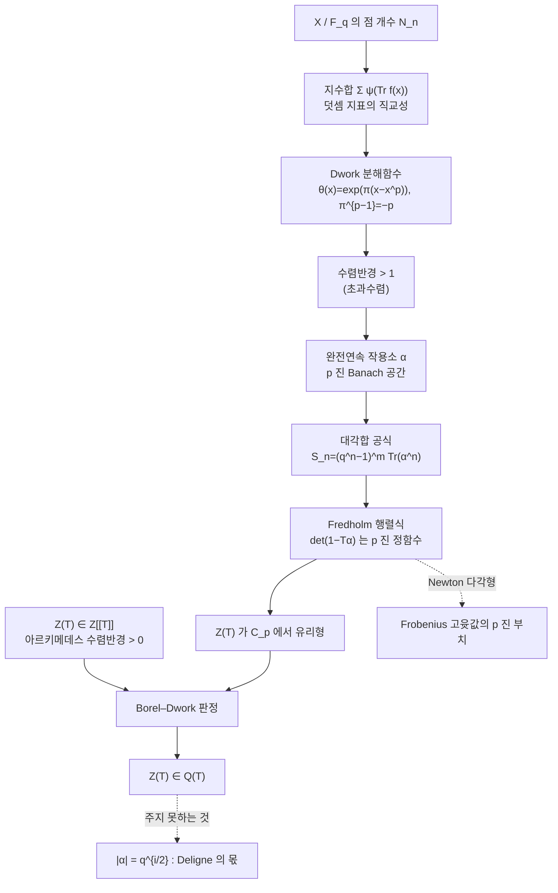

# Dwork 의 유리성 정리와 지수합

# 개요

[Galois 표현과 에탈 코호몰로지](galois-representations.md)에서 Weil 추측 셋을 코호몰로지로 설명했다. 그 그림에서 유리성과 함수방정식은 코호몰로지 이론이 있기만 하면 형식적으로 따라 나오고, Riemann 가설 하나만 어렵다. 유리성은 제일 값싼 항목이다.

역사는 반대로 갔다. Weil 이 추측을 낸 1949 년부터 11 년 동안 아무도 그 코호몰로지를 만들지 못했다. 1960 년에 Dwork 가 먼저 도착했는데, 코호몰로지 없이 **유리성만** 증명했다. 도구도 뜻밖이었다. `\ell\ne p` 인 `\ell` 진 계수가 아니라 표수와 **같은** `p` 의 `p` 진 해석학이었다.

$$
Z(X/\mathbb F_q,T)=\exp\!\Big(\sum_{n\ge1}\frac{\#X(\mathbb F_{q^n})}{n}T^n\Big)\in\mathbb Q(T)
$$

`X` 는 아무 대수집합이어도 된다. 매끄럽지 않아도, 사영이 아니어도, 특이점이 있어도 된다. 코호몰로지 증명이 요구하는 가정이 하나도 없다. 이 일반성은 지금도 Dwork 의 방법만 주는 것이다.[^1]

왜 `p` 진인가. 유리성은 결국 계수열 `N_n=\#X(\mathbb F_{q^n})` 이 **선형점화식**을 만족한다는 말이고, 선형점화식은 "어떤 작용소의 `n` 제곱의 대각합" 이라는 형태에서 나온다. Dwork 는 점 개수를 덧셈 지표의 지수합으로 바꾸고, 그 지표를 `p` 진 해석함수의 값으로 실현해서, 지수합을 무한차원 `p` 진 Banach 공간 위 작용소의 대각합으로 만들었다. 유한차원 코호몰로지 대신 무한차원이지만 **완전연속**인 작용소를 쓴 것이다. 완전연속 작용소의 Fredholm 행렬식은 `p` 진 정함수이므로, `Z` 는 정함수의 비가 되어 `p` 진 유리형이 된다. 여기에 Borel–Dwork 판정을 대면 유리함수가 떨어진다.

이 문서는 그 경로를 따라간다. 부모가 둘인 이유가 여기 있다. Weil 추측의 진술과 Frobenius 고윳값 언어는 [Galois 표현](galois-representations.md) 쪽에서, 유한체의 덧셈·곱셈 지표를 섞는 지수합의 기본형과 그 `p` 진 부치는 [Gauss 합](gauss-sums.md) 쪽에서 온다. Dwork 의 `\pi` 는 `\pi^{p-1}=-p` 를 만족하는 수인데, 이것은 Stickelberger 정리에 나오는 바로 그 `\pi` 다.

Dwork 가 주지 **못한** 것도 분명히 해 두자. 그의 방법은 `Z` 가 유리함수임을 주고 Frobenius 고윳값의 `p` 진 부치를 정확히 준다. 하지만 복소 절댓값 `|\alpha|=q^{i/2}` 는 주지 않는다. 그것이 Riemann 가설이고 Deligne 의 몫으로 남았다.

# 직관

## 점을 세는 일은 지수합이다

유한체에서 방정식의 해를 세는 표준 기법은 덧셈 지표다. `\psi:\mathbb F_p\to\mu_p` 를 비자명한 덧셈 지표라 하면 직교성이 지시함수를 준다.

$$
\frac1p\sum_{t\in\mathbb F_p}\psi(tu)=
\begin{cases}1&u=0\\0&u\ne0\end{cases}
$$

그러므로 `f\in\mathbb F_q[x_1,\dots,x_m]` 의 영점 개수는

$$
\#\{x:f(x)=0\}=\frac1q\sum_{t\in\mathbb F_q}\sum_{x}\psi\big(\mathrm{Tr}_{\mathbb F_q/\mathbb F_p}(tf(x))\big)
$$

가 된다. 기하 문제가 **지수합** 문제로 바뀌었다. 이제 상대해야 하는 것은 `\sum_x\psi(\mathrm{Tr}\,f(x))` 꼴의 합 하나뿐이다. [Gauss 합](gauss-sums.md)은 `f(x)=ax` 에 곱셈 지표를 곁들인 가장 단순한 사례이고, 아래에서 다룰 Kloosterman 합은 `f(x)=ax+b/x` 다.

## 지표를 해석함수로 만든다

지수합이 다루기 어려운 이유는 `\psi` 가 **이산적**이기 때문이다. `\psi` 는 유한군 위의 함수라 미분도 급수전개도 없다. 복소수 쪽에서 보면 `\psi` 의 값 `e^{2\pi ik/p}` 는 단위원 위에 흩어진 점이고 그 사이에 아무 구조도 없다.

Dwork 의 핵심은 `p` 진 세계에서는 `\psi` 가 **해석함수의 값으로 실현된다**는 것이다. `\pi\in\mathbb C_p` 를 `\pi^{p-1}=-p` 인 원소로 잡는다. 그러면 `\mathrm{ord}_p\pi=\frac1{p-1}` 이고, `\zeta_p=1+\pi+O(\pi^2)` 꼴의 `p` 제곱근이 존재한다. 소박하게 `\exp(\pi x)` 를 쓰고 싶지만 `p` 진 지수함수는 `\mathrm{ord}_p(x)>\frac1{p-1}` 에서만 수렴하므로 `\exp(\pi x)` 의 수렴반경은 `1` 에 못 미친다. Teichmüller 대표원은 절댓값이 정확히 `1` 이라 그 원 위에서 써야 하는데 딱 걸린다.

Dwork 의 **분해함수**가 이 벽을 넘는다.

$$
\theta(x)=\exp\big(\pi(x-x^p)\big)=\sum_{m\ge0}\theta_mx^m,
\qquad
\mathrm{ord}_p\theta_m\ \ge\ \frac{(p-1)m}{p^2}
$$

`-\pi x^p` 항을 더한 것뿐인데 수렴반경이 `p^{(p-1)/p^2}>1` 로 늘어난다. 닫힌 단위원판을 **넘어서** 수렴하는 것이 결정적이다. 이 초과수렴(overconvergence)이 나중에 작용소를 완전연속으로 만든다.

분모가 왜 사라지는가. 같은 현상을 가장 깨끗하게 보여 주는 것이 Artin–Hasse 지수함수다.

$$
E_p(x)=\exp\Big(\sum_{k\ge0}\frac{x^{p^k}}{p^k}\Big)\in\mathbb Z_{(p)}[[x]]
$$

`\exp(x)` 의 계수 `1/n!` 은 `p` 를 분모에 끌고 오는데, `x^p/p+x^{p^2}/p^2+\cdots` 를 **더해** 주면 그 분모가 전부 상쇄된다. 아래 코드가 이것을 직접 확인한다. Dwork 의 `\theta` 는 같은 상쇄를 `\pi` 라는 `p` 의 `(p-1)` 제곱근 위에서 일으키고, 그래서 수렴반경이 `1` 을 넘는다.

## 유리성은 대각합의 문제다

`\theta` 를 손에 넣으면 지수합이 해석적 대상이 된다. Dwork 의 대각합 공식은 토러스 `(\mathbb F_{q^n}^\times)^m` 위의 지수합을 하나의 작용소로 정리한다.

$$
S_n(f)=\sum_{x\in(\mathbb F_{q^n}^\times)^m}\psi\big(\mathrm{Tr}_{\mathbb F_{q^n}/\mathbb F_p}f(x)\big)
=(q^n-1)^m\,\mathrm{Tr}(\alpha^n)
$$

여기서 `\alpha` 는 `\theta` 로 만든 급수를 곱한 뒤 `p` 제곱근을 취하는 작용소이고, 무한차원 공간 위에서 **완전연속**이다. 완전연속이면 Fredholm 행렬식 `\det(1-T\alpha)` 가 정의되고 `p` 진 정함수이며

$$
\det(1-T\alpha)^{-1}=\exp\Big(\sum_{n\ge1}\frac{\mathrm{Tr}(\alpha^n)}{n}T^n\Big)
$$

가 성립한다. `(q^n-1)^m` 을 이항전개해서 넣으면 `L` 함수가 정함수의 유한 곱과 비로 표현된다.

$$
L(f,T)=\exp\Big(\sum_{n\ge1}\frac{S_n}{n}T^n\Big)
=\prod_{j=0}^{m}\det(1-q^jT\alpha)^{(-1)^{m-j+1}\binom mj}
$$

오른쪽은 `p` 진으로 `\mathbb C_p` 전체에서 유리형이다. 유리함수라는 결론까지는 한 걸음 남았고 그 걸음이 Borel–Dwork 판정이다.



# 정의

## zeta 함수

`X` 를 `\mathbb F_q` 위의 유한형 스킴이라 하고 `N_n=\#X(\mathbb F_{q^n})` 이라 둔다.

$$
Z(X/\mathbb F_q,T)=\exp\Big(\sum_{n\ge1}\frac{N_n}{n}T^n\Big)
=\prod_{x\in|X|}\big(1-T^{\deg x}\big)^{-1}
$$

오른쪽 곱은 닫힌점 `x` 전체에 걸친 것이다. 이 곱 표현이 `Z\in\mathbb Z[[T]]` 를 공짜로 준다. 정수 계수라는 사실이 나중에 Borel–Dwork 판정의 가설로 쓰인다.

## Dwork 분해함수

`\pi\in\mathbb C_p` 는 `\pi^{p-1}=-p` 의 근이고, `\theta(x)=\exp(\pi(x-x^p))` 다. 성질은 두 가지다.

- `\theta` 는 `|x|_p<p^{(p-1)/p^2}` 에서 수렴한다. 이 반경은 `1` 보다 크다.
- `\theta(1)=\zeta_p` 는 원시 `p` 제곱근이고, Teichmüller 대표원 `\hat a` 에 대해 `\psi(a)=\theta(\hat a)` 가 `\mathbb F_p` 의 덧셈 지표가 된다.

`\mathbb F_q` (`q=p^s`) 로 올릴 때는 `\Theta(x)=\prod_{i=0}^{s-1}\theta(x^{p^i})` 를 쓴다. 그러면 `\Theta(\hat a)=\psi(\mathrm{Tr}_{\mathbb F_q/\mathbb F_p}a)` 다.

## 완전연속 작용소와 Fredholm 행렬식

`p` 진 Banach 공간 `B` 위의 연속선형작용소 `\alpha` 가 **완전연속**(completely continuous, Serre 의 용어)이라 함은 유한계수 작용소의 노름극한이라는 뜻이다. 이때 `\alpha` 의 행렬 `(a_{ij})` 에 대해

$$
\det(1-T\alpha)=\sum_{k\ge0}(-1)^kc_kT^k,
\qquad
c_k=\sum_{i_1<\dots<i_k}\det\big(a_{i_\mu i_\nu}\big)_{1\le\mu,\nu\le k}
$$

가 잘 정의되고 `T` 의 정함수다. 고윳값 이론이 유한차원처럼 돌아간다는 것이 Serre 의 정리다.

## Kloosterman 합

`a,b\in\mathbb F_q^\times` 에 대해

$$
\mathrm{Kl}_n(a,b)=\sum_{x\in\mathbb F_{q^n}^\times}\psi\Big(\mathrm{Tr}_{\mathbb F_{q^n}/\mathbb F_p}\big(ax+bx^{-1}\big)\Big)
$$

이다. `f(x)=ax+bx^{-1}` 은 토러스 `\mathbb G_m` 위의 함수이므로 위의 `m=1` 사례에 정확히 들어맞는다. 이 합의 `L` 함수가 Dwork 이론의 가장 작은 비자명 예다.

# 성질

## Dwork 의 정리

> **정리 (Dwork, 1960).**
> `\mathbb F_q` 위의 모든 유한형 스킴 `X` 에 대해 `Z(X/\mathbb F_q,T)` 는 `\mathbb Q(T)` 의 원소다.

증명의 골격은 네 단계다.

1. **정수성.** `Z\in\mathbb Z[[T]]` 이고 `N_n\le Cq^{nd}` 이므로 아르키메데스 수렴반경이 `q^{-d}>0` 이상이다.
2. **환원.** 아핀 조각으로 자르고 포함배제를 쓰면 초곡면의 경우로 환원되고, 다시 위의 지시함수 항등식으로 토러스 위의 지수합 `L` 함수로 환원된다.
3. **`p` 진 유리형성.** 분해함수 `\theta` 로 지수합을 완전연속 작용소의 대각합으로 쓰고, Fredholm 행렬식으로 `L(f,T)` 를 정함수의 곱과 비로 표현한다. 따라서 `Z` 는 `\mathbb C_p` 전체에서 유리형이다.
4. **판정.** Borel–Dwork 를 적용한다.

## Borel–Dwork 유리성 판정

> `f(T)=\sum a_nT^n`, `a_n\in\mathbb Z` 라 하자. `f` 가 복소해석적으로 `|T|<r` 에서 수렴하고 `p` 진 해석적으로 `|T|_p<R` 에서 유리형이며 `rR>1` 이면 `f\in\mathbb Q(T)` 다.

Dwork 의 경우 `R=\infty` 이므로 `r>0` 이기만 하면 된다. 정수 계수라는 것이 두 절댓값을 한 판정에 묶는 접착제다. 유리수는 곱공식 때문에 모든 자리에서 동시에 작을 수 없고, 그 긴장이 계수를 유한한 점화식에 가둔다.

형식적인 쪽의 고전적 판정은 Kronecker 의 Hankel 행렬식 조건이다.

$$
f\in K(T)
\iff
\exists\,m_0\ \ \forall m\ge m_0,\ \forall s\ge0:\quad
H_m^{(s)}=\det\big(a_{s+i+j}\big)_{0\le i,j\le m}=0
$$

행렬식이 `0` 이 되는 최소 `m` 이 분모의 차수다. Dwork 가 이 조건을 직접 확인하지는 않는다. `p` 진 유리형성을 거쳐 우회하는 것이 그의 발명이다. 다만 계산에서는 Hankel 판정이 유리성을 눈으로 확인하는 가장 짧은 길이고, 아래 코드가 그 길을 쓴다.

## Kloosterman 합의 구조

> **정리 (Weil).** `a,b\in\mathbb F_q^\times` 이면 `\alpha\beta=q` 이고 `|\alpha|=|\beta|=\sqrt q` 인 `\alpha,\beta` 가 있어
> $$\mathrm{Kl}_n(a,b)=-(\alpha^n+\beta^n),\qquad\text{따라서}\qquad|\mathrm{Kl}_1(a,b)|\le2\sqrt q$$

동치로 `L` 함수가 정확히 차수 `2` 의 다항식이다.

$$
L(T)=\exp\Big(\sum_{n\ge1}\frac{\mathrm{Kl}_n}{n}T^n\Big)=(1-\alpha T)(1-\beta T)=1+\mathrm{Kl}_1\,T+qT^2
$$

여기서 두 절댓값이 서로 다른 일을 한다.

- **아르키메데스.** `|\alpha|=|\beta|=\sqrt q` 는 Weil 의 곡선 Riemann 가설이다. Dwork 의 방법으로는 나오지 않는다.
- **`p` 진.** `\mathrm{Kl}_1` 은 `p` 진 단위다. `\psi` 의 값이 전부 `1\bmod\pi` 이므로 `\mathrm{Kl}_1\equiv q-1\equiv-1\pmod\pi` 다. 그러면 `1+\mathrm{Kl}_1T+qT^2` 의 Newton 다각형이 `(0,0),(1,0),(2,1)` 의 아래쪽 볼록포이고 기울기가 `0` 과 `1` 이다. 즉 `\mathrm{ord}_q\alpha=0`(단위근), `\mathrm{ord}_q\beta=1` 이다.

단위근의 존재는 Dwork 이론이 거저 주는 것이고, Weil 의 상계는 완전히 다른 증명을 요구한다. 이 대비가 "Dwork 는 유리성까지" 라는 문장의 구체적인 내용이다.

## Newton 다각형과 Frobenius 부치

`p` 진 부치가 유리성보다 더 미세한 정보를 준다. 다항식 `\sum c_iT^i` 의 Newton 다각형은 점 `(i,\mathrm{ord}_p c_i)` 의 아래쪽 볼록포이고, 기울기의 목록이 근의 `\mathrm{ord}_p` 의 목록(부호 반대)이다. 타원곡선의 `P(T)=1-a_pT+pT^2` 에서 바로 보인다.

| 경우 | `\mathrm{ord}_p a_p` | 기울기 | 이름 |
|---|---|---|---|
| `p\nmid a_p` | `0` | `0,\ 1` | 보통(ordinary) |
| `p\mid a_p` | `\ge1` | `\tfrac12,\ \tfrac12` | 초특이(supersingular) |

기울기 `0` 인 근이 단위근이고, 그 존재 여부가 형식군의 높이를 결정한다. Dwork 의 작용소가 이 부치를 계산해 주는 기계이며, 여러 변수 지수합에서 Newton 다각형의 아래쪽 한계를 Adolphson–Sperber 가 Newton 다면체로 준 것이 이 줄기의 현대적 정리다.

## Gauss 합과 만나는 자리

`\pi^{p-1}=-p` 는 Dwork 만의 수가 아니다. `\mathbb Q(\zeta_p)` 에서 `p` 위의 유일한 소 아이디얼이 `(\zeta_p-1)` 이고 `\pi` 는 그 생성원과 결부되는 수다. [Gauss 합](gauss-sums.md)의 `p` 진 크기를 주는 것이 Stickelberger 정리다. `\omega` 를 Teichmüller 지표라 할 때

$$
\mathrm{ord}_p\,g(\omega^{-a})=\frac{a}{p-1},\qquad 0\le a<p-1
$$

이고, Gross–Koblitz 정리는 값 자체를 `p` 진 감마함수 `\Gamma_p` 로 준다. 증명이 Dwork 의 분해함수에서 나온다. 곧 Gauss 합은 "한 점짜리 Dwork 이론" 이고, 그 `p` 진 부치가 Newton 다각형의 기울기다. 절댓값 `\sqrt p` 라는 아르키메데스 쪽 사실과 `\mathrm{ord}_p=a/(p-1)` 이라는 `p` 진 쪽 사실이 같은 수의 두 얼굴이다.

# 활용

## 점 개수에서 zeta 함수를 복원한다

`E:y^2=x^3+x+1` 을 `\mathbb F_5` 위에서 놓고 `\mathbb F_{5^n}` (`n=1,\dots,6`) 의 유리점을 전부 센다. 그 수열만 가지고 `Z(T)` 의 계수를 정확한 유리수로 만든 다음, 유리함수인지, 분모가 무엇인지를 확인한다. 답을 미리 넣지 않는다.

```python
from fractions import Fraction
from itertools import product

# ---- F_{p^n} = F_p[x]/(f) : 계수 튜플, 낮은 차수 먼저 ----
def pmul(a, b, f, p):                      # f 는 monic, deg f = n
    n = len(f) - 1
    r = [0] * (len(a) + len(b) - 1)
    for i, ai in enumerate(a):
        if ai:
            for j, bj in enumerate(b):
                r[i + j] = (r[i + j] + ai * bj) % p
    for i in range(len(r) - 1, n - 1, -1):
        c = r[i]
        if c:
            r[i] = 0
            for j in range(n):
                r[i - n + j] = (r[i - n + j] - c * f[j]) % p
    return tuple(r[:n]) + (0,) * (n - len(r))

def ppow(a, e, f, p):
    r = (1,) + (0,) * (len(f) - 2)
    while e:
        if e & 1:
            r = pmul(r, a, f, p)
        a, e = pmul(a, a, f, p), e >> 1
    return r

def pgcd(a, b, p):                          # F_p[x] 의 gcd
    a, b = list(a), list(b)
    while a and a[-1] == 0: a.pop()
    while b and b[-1] == 0: b.pop()
    while b:
        inv = pow(b[-1], p - 2, p)
        while len(a) >= len(b):
            c, off = a[-1] * inv % p, len(a) - len(b)
            for j, bj in enumerate(b):
                a[off + j] = (a[off + j] - c * bj) % p
            while a and a[-1] == 0: a.pop()
            if not a: break
        a, b = b, a
    return a

def irreducible(f, p):                      # 차수 n/2 이하 인수가 없는가
    n = len(f) - 1
    if n == 1: return True
    x = (0, 1) + (0,) * (n - 2)
    for d in range(1, n // 2 + 1):
        g = list(ppow(x, p ** d, f, p)); g[1] = (g[1] - 1) % p
        if len(pgcd(g, f, p)) > 1: return False
    return True

def field(p, n):
    f = (0, 1) if n == 1 else next(t + (1,) for t in product(range(p), repeat=n)
                                  if irreducible(t + (1,), p))
    return f, [tuple(reversed(c)) for c in product(range(p), repeat=n)]

# ---- E : y^2 = x^3 + ax + b 의 F_{p^n} 유리점 개수 ----
def count(p, n, a, b):
    f, elems = field(p, n)
    q, one, zero = p ** n, (1,) + (0,) * (n - 1), (0,) * n
    A, B = (a % p,) + (0,) * (n - 1), (b % p,) + (0,) * (n - 1)
    cnt = 1                                                    # 무한원점
    for x in elems:
        c = pmul(pmul(x, x, f, p), x, f, p)
        c = tuple((u + v + w) % p for u, v, w in zip(c, pmul(A, x, f, p), B))
        cnt += 1 if c == zero else (2 if ppow(c, (q - 1) // 2, f, p) == one else 0)
    return cnt

p, DEG = 5, 6
N = [count(p, n, 1, 1) for n in range(1, DEG + 1)]
print("N_n =", N)

# ---- Z(T) = exp(Σ N_n T^n / n) 의 계수를 유리수로 정확히 ----
Z = [Fraction(1)] + [Fraction(0)] * DEG
for k in range(1, DEG + 1):
    Z[k] = sum(Fraction(N[j - 1]) * Z[k - j] for j in range(1, k + 1)) / k
print("Z_n =", [str(c) for c in Z])
print("정수 계수 :", all(c.denominator == 1 for c in Z))

# ---- 유리성 : (1-T)(1-pT) 를 곱하면 차수 2 에서 끊긴다 ----
P = [Z[k] - 6 * Z[k - 1] + 5 * Z[k - 2] if k >= 2 else
     (Z[1] - 6 * Z[0] if k == 1 else Z[0]) for k in range(DEG + 1)]
print("Z(T)(1-T)(1-5T) =", [str(c) for c in P])
print("차수 2 초과 계수가 모두 0 :", all(c == 0 for c in P[3:]))
print(f"P(T) = 1 + ({int(P[1])})T + ({int(P[2])})T^2,  a_p = {-int(P[1])},"
      f"  T^2 계수가 q=5 : {int(P[2]) == p}")

# ---- Kronecker 의 Hankel 판정 ----
def det(M):
    M, d = [r[:] for r in M], Fraction(1)
    for i in range(len(M)):
        piv = next((r for r in range(i, len(M)) if M[r][i] != 0), None)
        if piv is None: return Fraction(0)
        if piv != i: M[i], M[piv], d = M[piv], M[i], -d
        d *= M[i][i]
        for r in range(i + 1, len(M)):
            fac = M[r][i] / M[i][i]
            for c in range(i, len(M)): M[r][c] -= fac * M[i][c]
    return d

for s in (0, 1):
    print(f"  H_m^({s}) = det(Z_{{{s}+i+j}}) :",
          "  ".join(f"m={m}:{det([[Z[s+i+j] for j in range(m+1)] for i in range(m+1)])}"
                    for m in range(3)))

# N_n = [9, 27, 108, 675, 3069, 15552]
# Z_n = ['1', '9', '54', '279', '1404', '7029', '35154']
# 정수 계수 : True
# Z(T)(1-T)(1-5T) = ['1', '3', '5', '0', '0', '0', '0']
# 차수 2 초과 계수가 모두 0 : True
# P(T) = 1 + (3)T + (5)T^2,  a_p = -3,  T^2 계수가 q=5 : True
#   H_m^(0) = det(Z_{0+i+j}) : m=0:1  m=1:-27  m=2:-2025
#   H_m^(1) = det(Z_{1+i+j}) : m=0:9  m=1:-405  m=2:0
```

읽을 것이 셋이다.

- `Z(T)` 의 계수가 전부 정수다. 곱 표현이 예언한 대로다.
- `(1-T)(1-5T)` 를 곱하면 차수 `2` 에서 정확히 끊긴다. 곧 `Z(T)=\frac{1+3T+5T^2}{(1-T)(1-5T)}` 이고, 분자의 최고차 계수가 `q=5` 인 것이 함수방정식이다. `a_p=-3` 은 `N_1=5+1-(-3)=9` 와 맞는다.
- Hankel 행렬식이 `s\ge1`, `m\ge2` 에서 `0` 이 된다. Kronecker 판정이 말하는 분모 차수 `2` 다. `s=0` 에서 `H_2\ne0` 인 것은 분자 차수가 분모 차수와 같아서 생기는 자리밀림이고, 판정은 큰 `s` 에서의 소멸을 요구한다.

무한히 많은 `N_n` 을 여섯 개가 결정했다. 이것이 유리성의 실질적 의미다.

## Kloosterman 합의 두 절댓값

같은 정의를 그대로 써서 지수합 쪽을 확인한다. `\mathrm{Kl}_1` 만 계산한 뒤 `\alpha+\beta=-\mathrm{Kl}_1`, `\alpha\beta=p` 로 `\alpha,\beta` 를 정하고, 확대체에서 직접 센 값과 `-(\alpha^n+\beta^n)` 을 비교한다.

```python
from cmath import exp as cexp, pi
# 앞 블록의 field / pmul / ppow 를 그대로 쓴다

def trace(a, f, p, n):                      # Tr_{F_{p^n}/F_p}
    t, cur = (0,) * n, a
    for _ in range(n):
        t = tuple((u + v) % p for u, v in zip(t, cur))
        cur = ppow(cur, p, f, p)
    assert all(c == 0 for c in t[1:])
    return t[0]

def K(p, n, a, b):                          # Σ_{x∈F_{p^n}^*} ψ(Tr(ax + b/x))
    f, elems = field(p, n)
    q, zero = p ** n, (0,) * n
    A, B = (a % p,) + (0,) * (n - 1), (b % p,) + (0,) * (n - 1)
    s = 0j
    for x in elems:
        if x == zero: continue
        t = tuple((u + v) % p for u, v in
                  zip(pmul(A, x, f, p), pmul(B, ppow(x, q - 2, f, p), f, p)))
        s += cexp(2j * pi * trace(t, f, p, n) / p)
    return s

print("Weil 한계  max_{a,b≠0} |K_1(a,b)| <= 2√p :")
for p in [5, 7, 11, 13, 17, 19, 23]:
    vals = [abs(K(p, 1, a, b)) for a in range(1, p) for b in range(1, p)]
    print(f"  p={p:3d}  max|K| = {max(vals):8.5f}   2√p = {2*p**0.5:8.5f}"
          f"   {max(vals) <= 2*p**0.5 + 1e-9}")

print("\n확대체 : K_n = -(α^n + β^n),  α+β = -K_1,  αβ = p")
for (p, a, b, NN) in [(5, 1, 1, 4), (7, 1, 1, 3), (11, 2, 3, 3)]:
    K1 = K(p, 1, a, b).real
    d = complex(K1 * K1 - 4 * p) ** 0.5
    al, be = (-K1 + d) / 2, (-K1 - d) / 2
    print(f"  p={p:2d} (a,b)=({a},{b})  K_1={K1:+9.5f}   "
          f"|α|=|β|={abs(al):.5f}   √p={p**0.5:.5f}")
    for n in range(2, NN + 1):
        brute, pred = K(p, n, a, b), -(al ** n + be ** n)
        print(f"     n={n}  직접={brute.real:+13.5f}   -(α^n+β^n)={pred.real:+13.5f}"
              f"   {abs(brute - pred) < 1e-6}")

# Weil 한계  max_{a,b≠0} |K_1(a,b)| <= 2√p :
#   p=  5  max|K| =  3.23607   2√p =  4.47214   True
#   p=  7  max|K| =  4.49396   2√p =  5.29150   True
#   p= 11  max|K| =  5.71695   2√p =  6.63325   True
#   p= 13  max|K| =  6.29623   2√p =  7.21110   True
#   p= 17  max|K| =  7.96035   2√p =  8.24621   True
#   p= 19  max|K| =  7.60973   2√p =  8.71780   True
#   p= 23  max|K| =  7.96069   2√p =  9.59166   True
#
# 확대체 : K_n = -(α^n + β^n),  α+β = -K_1,  αβ = p
#   p= 5 (a,b)=(1,1)  K_1= +0.38197   |α|=|β|=2.23607   √p=2.23607
#      n=2  직접=     +9.85410   -(α^n+β^n)=     +9.85410   True
#      n=3  직접=     -5.67376   -(α^n+β^n)=     -5.67376   True
#      n=4  직접=    -47.10333   -(α^n+β^n)=    -47.10333   True
#   p= 7 (a,b)=(1,1)  K_1= +2.04892   |α|=|β|=2.64575   √p=2.64575
#      n=2  직접=     +9.80194   -(α^n+β^n)=     +9.80194   True
#      n=3  직접=    -34.42578   -(α^n+β^n)=    -34.42578   True
#   p=11 (a,b)=(2,3)  K_1= -4.45741   |α|=|β|=3.31662   √p=3.31662
#      n=2  직접=     +2.13145   -(α^n+β^n)=     +2.13145   True
#      n=3  직접=    +58.53233   -(α^n+β^n)=    +58.53233   True
```

`n=1` 하나가 모든 확대체의 값을 결정한다. `L` 함수가 차수 `2` 라는 것, 곧 유리성의 가장 구체적인 모습이다. `|\alpha|=|\beta|=\sqrt p` 가 판별식 `\mathrm{Kl}_1^2-4p<0` 에서 나오고 이것이 Weil 한계와 같은 진술이다. `p=17` 에서 최댓값 `7.96` 이 한계 `8.246` 에 거의 닿는 것이 이 상계가 최선에 가깝다는 증거다.

## 분모가 사라지는 것을 본다

`\theta` 가 단위원판 밖까지 수렴하는 이유를, 같은 상쇄가 일어나는 Artin–Hasse 지수함수에서 확인한다.

```python
from fractions import Fraction

def artin_hasse(p, deg):
    L = [Fraction(0)] * (deg + 1)
    pk = 1
    while pk <= deg:
        L[pk] = Fraction(1, pk); pk *= p
    E = [Fraction(1)] + [Fraction(0)] * deg
    for m in range(1, deg + 1):
        E[m] = sum(j * L[j] * E[m - j] for j in range(1, m + 1)) / m
    return E

for p in [2, 3, 5, 7]:
    E = artin_hasse(p, 40)
    bad = [m for m, c in enumerate(E) if c.denominator % p == 0]
    print(f"p={p:2d}  deg<=40  모든 계수가 Z_(p) 안 : {not bad}   반례 {bad}")
print("p=5 처음 계수 :", [str(c) for c in artin_hasse(5, 7)])
print("비교 : exp(x) 의 1/5! = 1/120 은 분모에 5 가 있다")

# p= 2  deg<=40  모든 계수가 Z_(p) 안 : True   반례 []
# p= 3  deg<=40  모든 계수가 Z_(p) 안 : True   반례 []
# p= 5  deg<=40  모든 계수가 Z_(p) 안 : True   반례 []
# p= 7  deg<=40  모든 계수가 Z_(p) 안 : True   반례 []
# p=5 처음 계수 : ['1', '1', '1/2', '1/6', '1/24', '5/24', '29/144', '101/1008']
# 비교 : exp(x) 의 1/5! = 1/120 은 분모에 5 가 있다
```

`p=5` 에서 `x^5` 의 계수가 `1/120` 이 아니라 `5/24` 다. `x^5/5` 를 지수 안에 더한 덕분에 분모의 `5` 가 사라졌다. 차수 `40` 까지 분모에 `p` 가 한 번도 나타나지 않는다. Dwork 의 `\theta` 에서 일어나는 일이 정확히 이것이고, 그 결과가 수렴반경 `p^{(p-1)/p^2}>1` 이다.

## 어디로 이어지는가

- **점 세기 알고리즘.** Dwork 의 방법을 Monsky–Washnitzer 코호몰로지로 다듬은 것이 Kedlaya 알고리즘(2001)이다. 초타원곡선의 zeta 함수를 `p` 진 정밀도로 계산하며, 비용이 `p` 에 선형이고 확대차수에 다항식이라 **작은 `p`, 큰 `n`** 영역을 맡는다. 큰 `p` 를 맡는 Schoof–Elkies–Atkin 과 정확히 상보적이다. Lauder–Wan 은 일반 다양체로 확장했다.
- **암호.** 위 알고리즘이 곡선 암호의 군 위수를 정하는 실무 도구다. [타원곡선](elliptic-curves.md) 위수를 모르면 안전성을 논할 수 없다.
- **해석적 정수론.** Kloosterman 합은 Kloosterman 자신이 사원 이차형식의 표현수를 다루려고 원법에 넣으면서 나왔다. Weil 한계 `2\sqrt q` 가 원법의 오차항을 결정하고, Kuznetsov 공식을 거쳐 모듈러 형식의 해석적 이론으로 들어간다.
- **Newton 다각형의 기하.** 지수합의 `p` 진 부치를 다면체로 예측하는 Adolphson–Sperber 이론, 그리고 Katz 가 제기한 Newton 다각형의 도약 문제가 이 줄기에서 이어진다.
- **남은 항목.** Dwork 이후에도 Riemann 가설은 열려 있었다. Grothendieck 의 에탈 코호몰로지가 유리성과 함수방정식을 다시 증명하고, 1974 년 Deligne 이 마지막 항목을 닫았다.

[^1]: Dwork 의 원논문은 B. Dwork, *On the rationality of the zeta function of an algebraic variety*, Amer. J. Math. **82** (1960), 631–648. 교과서 서술은 N. Koblitz, *p-adic Numbers, p-adic Analysis, and Zeta-Functions* (2판, 1984) 5장이 가장 접근하기 쉽고, 완전연속 작용소와 Fredholm 행렬식은 J.-P. Serre, *Endomorphismes complètement continus des espaces de Banach p-adiques*, Publ. IHÉS **12** (1962). 지수합의 Newton 다각형은 A. Adolphson, S. Sperber, *Exponential sums and Newton polyhedra*, Ann. of Math. **130** (1989). Kedlaya 알고리즘은 K. Kedlaya, *Counting points on hyperelliptic curves using Monsky–Washnitzer cohomology*, J. Ramanujan Math. Soc. **16** (2001). 본문의 수치 계산은 직접 한 것이다.

# 연관 문서

## 선수지식

- [Galois 표현과 에탈 코호몰로지](galois-representations.md)
- [Gauss 합과 국소 근 수](gauss-sums.md)

## 더 알아보기

아직 연결한 문서가 없다.

#number_theory #analysis #theorem #computation
