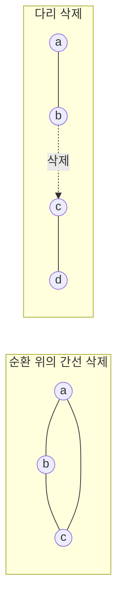

# 동적 연결성

# 개요

그래프가 고정되어 있으면 연결 성분은 한 번의 탐색으로 끝난다. 간선이 계속 들어오고 나가면 매번 처음부터 탐색할 때 변경 하나에 $O(n+m)$ 이 든다.

[서로소 집합 자료구조](union-find.md)는 간선 추가만 있는 경우를 거의 상수 시간에 처리하지만, 삭제에는 무력하다. 합치면서 버린 정보를 되살릴 수 없기 때문이다.

어떤 간선을 지우면 성분이 갈라지고 어떤 간선을 지우면 그렇지 않은지는 그래프 전체의 구조에 달렸다. 이 문제를 다루는 방법이 동적 그래프 자료구조의 중심 주제이고, [Link-cut tree](link-cut-trees.md)가 숲(forest)인 경우의 해답이다.

# 직관

## 추가와 삭제의 비대칭

간선 추가는 두 성분이 하나가 되었다는 사실만 기록하면 되고 그 기록은 되돌릴 일이 없다.

삭제에서는 지우려는 간선이 순환에 속하면 연결성이 그대로이고 다리라면 성분이 갈라진다. 둘을 구별하려면 다른 길의 존재를 알아야 하는데 union-find 는 그 길의 모양을 저장하지 않는다.

왼쪽에서 $a - b$ 를 지워도 $a - c - b$ 가 남고, 오른쪽에서 $b - c$ 를 지우면 $\lbrace a,b\rbrace$ 와 $\lbrace c,d\rbrace$ 로 갈라진다.

## 신장 숲의 관리

그래프 전체가 아니라 신장 숲 하나만 명시적으로 관리한다. 연결성 질의는 숲 안에서 같은 트리에 있는지만 보면 되므로 숲을 빠르게 다루면 질의가 해결된다.

간선은 숲에 속한 트리 간선과 속하지 않은 비트리 간선으로 나뉜다. 비트리 간선의 삭제는 숲을 바꾸지 않고, 트리 간선의 삭제는 트리를 둘로 자르므로 두 조각을 다시 이을 대체 간선을 찾아야 한다.

문제는 대체 간선을 빨리 찾는 것으로 압축된다. 그래프가 처음부터 숲이면 비트리 간선이 없어 link-cut tree 만으로 충분하다.

# 정의

## 간선 갱신과 연결 질의

정점 집합이 고정된 무향 그래프에 대해 다음을 처리한다.

- `INSERT(u,v)` 는 간선 $\lbrace u,v\rbrace$ 를 추가한다.
- `DELETE(u,v)` 는 기존 간선 $\lbrace u,v\rbrace$ 를 제거한다.
- `CONNECTED(u,v)` 는 $u$ 와 $v$ 사이에 경로가 있는지 반환한다.

## 세 가지 모형

| 모형 | 허용 연산 | 대표 해법 |
|---|---|---|
| incremental | INSERT, CONNECTED | union-find, $O(\alpha(n))$ |
| decremental | DELETE, CONNECTED | 문제별 기법 |
| fully dynamic | 셋 다 | Holm–de Lichtenberg–Thorup, $O(\log^2 n)$ |

변경 순서를 미리 다 아는 경우가 offline, 하나씩 도착하는 경우가 online 이며 이 구분이 해법을 바꾼다.

## 비용의 기준

$n$ 은 정점 수, $m$ 은 현재 간선 수다. 갱신과 질의의 비용을 따로 재고 대개 amortized 비용으로 말한다. 아래 $O(\log^2 n)$ 도 갱신당 amortized 값이다.

# 성질

## incremental 의 해법

`INSERT(u,v)` 에서 두 성분을 합치고 `CONNECTED(u,v)` 에서 두 대표원을 비교한다. 경로 압축과 랭크 병합을 함께 쓰면 연산당 amortized $O(\alpha(n))$ 이고 $\alpha$ 는 역 Ackermann 함수다.

## 숲에서의 연결성

그래프가 항상 숲이면 link-cut tree 로 각 트리를 표현한다. `LINK` 는 서로 다른 두 트리를 잇고 `CUT` 은 트리 간선을 지우며, 연결성은 두 정점의 대표 조상이 같은지로 판정한다. splay tree 기반 구현이 연산당 amortized $O(\log n)$ 을 준다[^1].

Euler tour tree 도 같은 일을 한다. 트리를 Euler 순회 수열로 보고 균형 이진 탐색 트리에 담으면 `LINK` 와 `CUT` 이 수열의 분할과 결합이 된다. 경로 질의에는 약하고 부분트리 크기 같은 집계에는 편하다.

## 일반 그래프의 대체 간선

일반 그래프에서 트리 간선이 지워지면 대체 간선을 찾아야 한다. 갈라진 한쪽 조각에 닿는 모든 비트리 간선을 훑으면 한 번에 $O(m)$ 이 든다.

Holm, de Lichtenberg, Thorup 의 해법은 각 간선에 레벨을 붙여 비용을 상환한다. 간선은 레벨 $\lfloor\log n\rfloor$ 에서 시작해 대체 간선 탐색에 실패할 때마다 레벨이 하나씩 내려가고 올라가지는 않는다. 레벨 $i$ 의 간선이 속한 성분의 크기가 $n/2^i$ 이하라는 불변식을 유지하므로 한 간선이 내려갈 수 있는 횟수가 $O(\log n)$ 이고, 레벨별 숲의 탐색 비용까지 합치면 갱신당 amortized $O(\log^2 n)$ 이다[^2].

각 레벨의 숲은 Euler tour tree 로 관리하고, 부분트리 안에 대체 간선 후보가 있는지를 집계로 저장해 탐색을 안내한다.

## offline 질의

모든 연산을 미리 알면 삭제를 없앨 수 있다. 각 간선이 살아 있는 시간 구간을 구하고 시간 축을 세그먼트 트리로 나눈 뒤, 각 간선을 자신의 구간을 덮는 $O(\log q)$ 개의 노드에 붙인다. 세그먼트 트리를 깊이우선으로 순회하면서 노드에 붙은 간선을 union 하고 돌아 나올 때 되돌리면 각 시점의 그래프가 재현된다.

되돌리기 때문에 경로 압축을 쓸 수 없고 랭크 병합만 쓰므로 union 하나가 $O(\log n)$ 이고 전체가 $O(q \log q \log n)$ 이다. 구현이 짧아 널리 쓰인다.

## 하한

Pătraşcu 와 Demaine 은 셀 탐색 모형에서 갱신과 질의 비용의 최댓값이 $\Omega(\log n)$ 임을 보였다. $O(\log^2 n)$ 은 최적에서 로그 하나 차이 안에 있다. 무작위화를 허용하면 갱신 $O(\log^2 n)$ 에 질의 $O(\log n / \log\log n)$ 같은 개선이 알려져 있다.

# 활용

- 통신망의 회선 개통과 장애, 도로의 개통과 폐쇄, 온라인 그래프 편집기의 실시간 검증에서 변경이 잦은 그래프의 연결 상태를 즉시 답한다.
- 동적 최소 신장트리, 동적 2-간선 연결성, 동적 최소 절단이 같은 레벨 기법 위에 세워진다. 대체 간선 탐색이라는 구조를 공유하기 때문이다.
- 오프라인 동적 연결성은 다른 알고리즘의 부품으로 쓰인다. 매개변수를 이분 탐색하면서 그래프를 조금씩 바꾸는 계산이 그 예다.

[^1]: MIT 6.851 Advanced Data Structures, Lecture 19, https://courses.csail.mit.edu/6.851/spring12/lectures/L19.html. link-cut tree 의 `LINK` 와 `CUT` 과 amortized $O(\log n)$ 을 다룬다.
[^2]: Holm, de Lichtenberg, Thorup, *Poly-logarithmic deterministic fully-dynamic algorithms for connectivity, minimum spanning tree, 2-edge, and biconnectivity* (JACM 2001). 레벨 기법과 $O(\log^2 n)$ 상환 분석.

# 연관 문서

## 선수지식

- [그래프](graphs.md)
- [서로소 집합 자료구조](union-find.md)

## 더 알아보기

- [Link-cut tree](link-cut-trees.md)

#algorithms #data_structures #graph_theory
