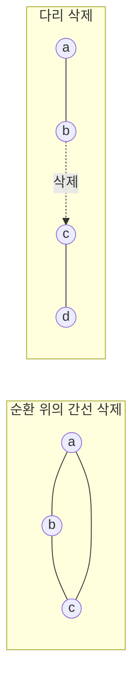

# 동적 연결성

# 개요

그래프가 고정되어 있으면 연결 성분은 한 번의 탐색으로 끝난다. 간선이 계속 들어오고 나가는 상황은 다르다. 매번 처음부터 탐색하면 변경 하나에 `O(n+m)` 이 들고, 변경이 많은 응용에서는 감당할 수 없다.

[서로소 집합 자료구조](union-find.md)는 이 문제의 절반을 이미 푼다. 간선 추가만 있으면 거의 상수 시간에 처리된다. 그런데 삭제가 들어오는 순간 이 자료구조는 무력해진다. 합치면서 버린 정보를 되살릴 방법이 없기 때문이다.

삭제가 어려운 이유는 명확하다. 어떤 간선을 지우면 성분이 갈라지고 어떤 간선을 지우면 아무 일도 없는지가 그래프 전체의 구조에 달려 있다. 이 문제를 어떻게 다루느냐가 동적 그래프 자료구조의 중심 주제이며, [Link-cut tree](link-cut-trees.md)는 그 첫 단계인 forest 경우의 해답이다.

# 직관

## 추가와 삭제의 비대칭

간선 추가는 정보를 잃지 않는다. 두 성분이 하나가 되었다는 사실만 기록하면 되고, 그 기록은 되돌릴 일이 없다.

삭제는 반대다. 지우려는 간선이 순환에 속하면 연결성이 그대로지만, 다리라면 성분이 둘로 갈라진다. 둘을 구별하려면 "이 간선 말고 다른 길이 있는가" 를 알아야 하는데, union-find 는 그 길이 어떻게 생겼는지를 저장하지 않는다.

왼쪽에서 `a—b` 를 지워도 `a—c—b` 가 남는다. 오른쪽에서 `b—c` 를 지우면 `{a,b}` 와 `{c,d}` 로 갈라진다. 같은 연산이 전혀 다른 결과를 낳는다.

## 신장 forest 를 들고 다닌다

핵심 아이디어는 그래프 전체가 아니라 신장 forest 하나만 명시적으로 관리하는 것이다. 연결성 질의는 forest 안에서 같은 트리에 있는지만 보면 되므로, forest 를 빠르게 다룰 수 있으면 질의가 해결된다.

간선은 두 종류로 나뉜다. forest 에 속한 트리 간선과, 속하지 않은 비트리 간선이다.

- 비트리 간선의 삭제는 아무 일도 아니다. forest 가 변하지 않는다.
- 트리 간선의 삭제는 트리를 둘로 자른다. 이때 두 조각을 다시 이을 비트리 간선, 즉 대체 간선을 찾아야 한다.

문제 전체가 "대체 간선을 어떻게 빨리 찾는가" 하나로 압축된다. 그래프가 처음부터 forest 라면 비트리 간선이 없으므로 이 질문이 사라지고, link-cut tree 만으로 충분해진다.

# 정의

## 연산

정점 집합이 고정된 무향 그래프에 대해 다음을 처리한다.

- `INSERT(u,v)`: 간선 `{u,v}` 를 추가한다.
- `DELETE(u,v)`: 기존 간선 `{u,v}` 를 제거한다.
- `CONNECTED(u,v)`: `u` 와 `v` 사이에 경로가 있는지 반환한다.

## 세 가지 모형

| 모형 | 허용 연산 | 대표 해법 |
|---|---|---|
| incremental | INSERT, CONNECTED | union-find, `O(α(n))` |
| decremental | DELETE, CONNECTED | 문제별 기법 |
| fully dynamic | 셋 다 | Holm–de Lichtenberg–Thorup, `O(\log^2 n)` |

변경 순서를 미리 다 아는 경우를 offline, 하나씩 도착하는 경우를 online 이라 한다. 이 구분이 실제 해법을 크게 바꾼다.

## 비용의 기준

`n` 은 정점 수, `m` 은 현재 간선 수다. 갱신과 질의의 비용을 따로 재며, 대개 amortized 비용으로 말한다. 아래 `O(\log^2 n)` 도 갱신당 amortized 값이다.

# 성질

## incremental 은 union-find 로 끝난다

`INSERT(u,v)` 에서 두 성분을 합치고, `CONNECTED(u,v)` 에서 두 대표원을 비교한다. 경로 압축과 랭크 병합을 함께 쓰면 연산당 amortized `O(α(n))` 이다. `α` 는 역 Ackermann 함수로 실질적으로 상수다.

## forest 라면 link-cut tree

그래프가 항상 forest 임이 보장되면 link-cut tree 로 각 트리를 표현한다. `LINK` 는 서로 다른 두 트리를 잇고, `CUT` 은 트리 간선을 지우며, 연결성은 두 정점의 대표 조상이 같은지로 판정한다. splay tree 기반 구현이 연산당 amortized `O(\log n)` 을 준다[^1].

Euler tour tree 도 같은 일을 한다. 트리를 Euler 순회 수열로 보고 균형 이진 탐색 트리에 담으면, `LINK` 와 `CUT` 이 수열의 분할과 결합이 된다. 경로 질의에는 약하지만 부분트리 크기 같은 집계에는 오히려 편하다.

## 일반 그래프의 대체 간선

일반 그래프에서는 forest 를 관리하다가 트리 간선이 지워지면 대체 간선을 찾아야 한다. 소박하게 하면 갈라진 한쪽 조각에 닿는 모든 비트리 간선을 훑어야 하므로 한 번에 `O(m)` 이 들 수 있다.

Holm, de Lichtenberg, Thorup 의 해법은 각 간선에 레벨을 붙여 이 비용을 상환한다. 간선은 레벨 `\lfloor\log n\rfloor` 에서 시작해 대체 간선 탐색에 실패할 때마다 레벨이 하나씩 내려가고, 레벨은 절대 올라가지 않는다. 레벨 `i` 의 간선이 속한 성분의 크기가 `n/2^i` 이하라는 불변식을 유지하므로 한 간선이 내려갈 수 있는 횟수가 `O(\log n)` 으로 제한되고, 레벨별로 forest 를 따로 두어 탐색 비용까지 합치면 갱신당 amortized `O(\log^2 n)` 이 된다[^2].

각 레벨의 forest 는 Euler tour tree 로 관리하며, 부분트리 안에 대체 간선 후보가 있는지를 집계로 저장해 탐색을 안내한다.

## offline 이면 다시 쉬워진다

모든 연산을 미리 알면 삭제를 없앨 수 있다. 각 간선이 살아 있는 시간 구간을 구하고, 시간 축을 세그먼트 트리로 나눈 뒤, 각 간선을 자신의 구간을 덮는 `O(\log q)` 개의 노드에 붙인다. 세그먼트 트리를 깊이우선으로 순회하면서 노드에 붙은 간선을 union 하고 돌아 나올 때 되돌리면, 각 시점의 그래프가 정확히 재현된다.

되돌리기가 필요하므로 경로 압축을 쓸 수 없고 랭크 병합만 쓴다. 그래서 union 하나가 `O(\log n)` 이고 전체가 `O(q \log q \log n)` 이다. 구현이 짧아 대회와 실무에서 널리 쓰인다.

## 하한

동적 연결성은 갱신과 질의 비용의 최댓값이 `\Omega(\log n)` 이라는 셀 탐색 모형 하한을 가진다. Pătraşcu 와 Demaine 의 결과다. 따라서 `O(\log^2 n)` 은 최적에서 로그 하나 차이 안에 있다. 무작위화를 허용하면 갱신 `O(\log^2 n)` 에 질의 `O(\log n / \log\log n)` 같은 개선이 알려져 있다.

# 활용

## 변화하는 네트워크

통신망의 회선 개통과 장애, 도로의 개통과 폐쇄, 온라인 그래프 편집기의 실시간 검증에서 연결 상태를 즉시 답해야 한다. 매번 전체 탐색을 다시 하기에는 변경이 잦다.

## 다른 동적 문제의 부품

동적 최소 신장트리, 동적 2-간선 연결성, 동적 최소 절단 같은 문제들이 같은 레벨 기법 위에 세워진다. 대체 간선 탐색이라는 뼈대가 공유되기 때문이다.

## 알고리즘 내부의 자료구조

오프라인 동적 연결성은 그 자체가 목적이 아니라 다른 알고리즘의 부품으로도 쓰인다. 매개변수를 이분 탐색하면서 그래프를 조금씩 바꾸는 계산이 전형적인 예다.

[^1]: MIT 6.851 Advanced Data Structures, Lecture 19, https://courses.csail.mit.edu/6.851/spring12/lectures/L19.html. link-cut tree 의 `LINK`/`CUT` 과 amortized `O(\log n)`.
[^2]: Holm, de Lichtenberg, Thorup, *Poly-logarithmic deterministic fully-dynamic algorithms for connectivity, minimum spanning tree, 2-edge, and biconnectivity* (JACM 2001). 레벨 기법과 `O(\log^2 n)` 상환 분석.

# 연관 문서

## 선수지식

- [그래프](graphs.md)
- [서로소 집합 자료구조](union-find.md)

## 더 알아보기

- [Link-cut tree](link-cut-trees.md)

#algorithms #data_structures #graph_theory
