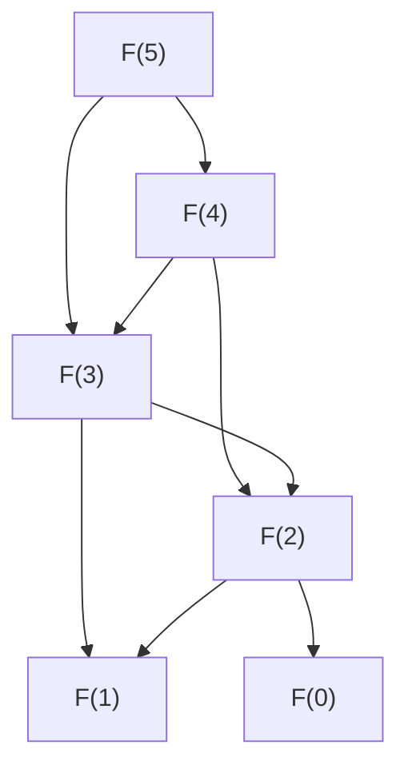

# 동적 계획법

# 개요

동적 계획법은 문제를 부분문제로 쪼개고, 각 부분문제를 정확히 한 번만 풀어 그 답을 재사용하는 설계 기법이다.

이 기법의 정체를 가장 정확히 말하면 "[DAG](dag-topological.md) 위의 계산" 이다. 부분문제를 정점으로, "`A` 를 풀려면 `B` 의 답이 필요하다" 를 간선으로 삼으면 의존 관계 그래프가 만들어진다. 이 그래프에 순환이 없어야 계산이 끝나고, 순환이 없으면 위상순서가 존재하므로 그 순서대로 한 번씩 채워 나가면 된다. 재귀가 무한히 돌지 않는 이유, 표를 어느 방향으로 채워야 하는지, 전체 시간이 왜 정점 수와 간선 수의 합인지가 모두 이 한 문장에서 나온다.

# 직관

## 같은 질문을 두 번 묻지 않기

피보나치 수를 정의 그대로 재귀로 계산하면 `F(n−2)` 를 여러 번 다시 계산한다. 호출 트리는 지수적으로 커지지만, 서로 다른 질문은 `F(0)` 부터 `F(n)` 까지 `n+1` 개뿐이다. 트리처럼 보이던 것이 실은 DAG 였고, 같은 정점을 여러 경로로 여러 번 방문하고 있었을 뿐이다. 답을 적어 두면 정점마다 한 번씩만 계산하게 되어 지수 시간이 선형 시간이 된다.



## 두 가지 조건

동적 계획법이 통하려면 두 가지가 필요하다.

- **최적 부분구조.** 전체의 최적해가 부분문제의 최적해로 조립된다.
- **중복 부분문제.** 같은 부분문제가 여러 번 등장한다.

둘 중 하나만 있어도 소용이 없다. 중복이 없으면 그냥 분할 정복이고, 최적 부분구조가 없으면 부분의 최적을 모아도 전체의 최적이 되지 않는다. 후자의 대표적 반례가 최장 단순경로다. 두 조각 각각에서 가장 긴 경로를 골라 이어 붙이면 정점이 겹쳐 단순경로가 아니게 될 수 있다. 그래서 최단경로에는 동적 계획법이 통하고 최장 단순경로에는 통하지 않는다.

# 정의

## 부분문제 그래프와 Bellman 방정식

문제를 상태의 집합으로 기술하고, 각 상태의 값을 다른 상태의 값으로 표현하는 점화식을 세운다.

$$
\mathrm{val}(s)=\min_{a\in A(s)}\Big[c(s,a)+\mathrm{val}(\delta(s,a))\Big]
$$

`s` 에서 `δ(s,a)` 로 간선을 그으면 부분문제 그래프가 된다. 이 그래프가 DAG 이면 값은 유일하게 정해지고, 위상역순으로 한 번씩 계산하면 된다. 순환이 있으면(예: 일반 그래프의 최단경로) 한 번의 순회로는 끝나지 않고 반복법이나 우선순위 큐가 필요해진다.

## 두 가지 구현 방향

- **하향식(메모이제이션).** 재귀를 그대로 쓰되 계산한 값을 표에 적어 둔다. 실제로 필요한 부분문제만 방문한다.
- **상향식(표 채우기).** 위상순서를 직접 정해 반복문으로 표를 채운다. 재귀 호출이 없어 빠르고, 이전 몇 줄만 남기는 식으로 메모리를 줄이기 쉽다.

같은 점화식이라면 두 방식의 결과는 같다. 방문하는 정점 집합과 상수 인자만 다르다.

## 비용

부분문제 하나를 푸는 데 드는 시간이 그 정점의 나가는 간선 수에 비례하므로 전체 시간은 다음과 같다.

$$
T=\Theta(\lvert V\rvert+\lvert E\rvert)=\Theta(\text{상태 수}\times\text{상태당 전이 수})
$$

따라서 설계의 핵심은 상태를 무엇으로 잡느냐다. 상태를 너무 많이 잡으면 시간이 폭발하고, 너무 적게 잡으면 최적 부분구조가 깨진다.

# 성질

## 의사다항시간이라는 함정

배낭 문제의 표준 점화식은 `O(nW)` 에 끝난다. 그런데 배낭 문제는 NP-난해다. 모순이 아닌 이유는 `W` 가 입력의 크기가 아니라 입력에 적힌 수이기 때문이다. `W` 를 이진수로 적으면 자릿수는 `log W` 이므로 `O(nW)` 는 입력 길이에 대해 지수적이다. 이런 알고리즘을 의사다항시간이라 한다. 수의 크기가 작을 때만 실용적이고, 큰 경우에는 [근사 알고리즘](approximation-algorithms.md)으로 넘어간다. 배낭 문제에 FPTAS 가 있는 것도 이 표를 값 쪽으로 반올림해 크기를 줄이는 발상이다.

## 해의 복원

값만 계산하면 "얼마나 좋은가" 만 알 뿐 "무엇인가" 는 모른다. 각 상태에서 최적을 준 전이를 함께 기록해 두고 역추적하면 실제 해가 나온다. 부분문제 그래프에서 최적 전이만 남긴 부분 그래프를 따라 시작점에서 끝점까지 걸어가는 일이며, 메모리가 부족하면 값만 계산하고 분할 정복으로 경로를 재구성하는 방법(Hirschberg 기법)을 쓴다.

## 탐욕법과의 관계

탐욕 알고리즘은 각 단계에서 하나의 전이만 보고 결정한다. 이것이 정당하려면 교환 논증이나 matroid 구조 같은 추가 성질이 필요하다. 동적 계획법은 모든 전이를 살펴보므로 그런 성질 없이도 옳지만 대가로 상태 전체를 저장한다. 탐욕이 통하는 문제는 동적 계획법으로도 풀리지만 그 역은 아니다.

## 코드로 확인

배낭 문제의 표 채우기가 전수 탐색과 같은 답을 주는지, 최장 공통 부분수열에서 부분문제 개수가 격자 크기로 억제되는지 본다.

```python
from functools import lru_cache

items, W = [(3, 4), (4, 5), (2, 3), (5, 8)], 9      # (무게, 가치)

def knap_dp(items, W):
    best = [0] * (W + 1)                            # best[w] = 용량 w 의 최적값
    for wt, val in items:                           # 물건을 하나씩 추가한다
        for w in range(W, wt - 1, -1):              # 역순: 같은 물건을 두 번 쓰지 않는다
            best[w] = max(best[w], best[w - wt] + val)
    return best[W]

def knap_brute(items, W):
    n = len(items)
    return max(sum(items[i][1] for i in range(n) if m >> i & 1)
               for m in range(1 << n)
               if sum(items[i][0] for i in range(n) if m >> i & 1) <= W)

print(knap_dp(items, W), knap_brute(items, W))      # 13 13

def lcs(a, b):
    @lru_cache(None)                                # 메모이제이션 = 정점 방문 표시
    def f(i, j):
        if i == len(a) or j == len(b):
            return 0
        if a[i] == b[j]:
            return 1 + f(i + 1, j + 1)
        return max(f(i + 1, j), f(i, j + 1))
    return f(0, 0), f.cache_info().currsize

print(lcs("AGGTAB", "GXTXAYB"))                     # (4, 46)
print((len("AGGTAB") + 1) * (len("GXTXAYB") + 1))   # 56
```

LCS 의 재귀는 분기가 둘이라 메모 없이는 호출 수가 지수적으로 늘지만, 서로 다른 상태는 `(i, j)` 격자의 56 칸뿐이고 실제로 방문한 것은 46 칸이다. 하향식이 상향식보다 적게 방문하는 경우가 이렇게 생긴다. 배낭 쪽 코드에서 용량을 역순으로 도는 이유도 부분문제 그래프에서 읽어야 할 것이다. 정순으로 돌면 방금 갱신한 값을 다시 써서 같은 물건을 여러 번 담게 된다.

# 활용

## 문자열과 생물정보학

편집거리, 최장 공통 부분수열, 서열 정렬이 모두 격자 DAG 위의 최단·최장경로다. 유사도 점수를 바꾸면 같은 틀에서 다른 정렬이 나오고, 지역 정렬은 시작점을 자유롭게 두는 변형이다.

## 확률모형의 추론

은닉 Markov 모형에서 가장 그럴듯한 상태열을 찾는 Viterbi 알고리즘, 관측 확률을 구하는 forward 알고리즘이 동적 계획법이다. 상태 공간 위의 전이 그래프가 시간 축을 따라 펼쳐지면서 DAG 가 되고, 시간마다 상태 수에 비례하는 표를 채운다.

## 제어와 강화학습

Bellman 방정식은 원래 동적 계획법에서 나온 식이고, 유한 시계 문제는 시간 역순으로 한 번에 풀린다. 무한 시계에서는 부분문제 그래프에 순환이 생기므로 한 번의 순회가 불가능해지고, 축약사상 성질을 이용한 가치반복으로 넘어간다. 상태 공간이 너무 크면 표 대신 함수 근사를 쓰는데, 이때 정확성 보장이 약해지는 것이 현대 강화학습의 어려움이다.

# 연관 문서

## 선수지식

- [DAG와 위상정렬](dag-topological.md)

## 더 알아보기

아직 연결한 문서가 없다.

#algorithms #computation
