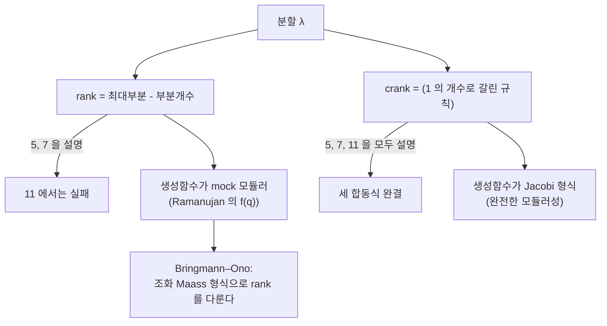

# Dyson 의 rank 와 crank

# 개요

Ramanujan 이 [분할수](partitions.md) 표를 보다 찾아낸 세 합동식이 있다.

$$
p(5n+4)\equiv0\ (\mathrm{mod}\ 5),\qquad p(7n+5)\equiv0\ (\mathrm{mod}\ 7),\qquad p(11n+6)\equiv0\ (\mathrm{mod}\ 11)
$$

증명은 생성함수 조작으로 나온다. 그런데 이런 증명은 **왜** 그런지를 말해 주지 않는다. $p(5n+4)$ 개의 분할이 5 로 나누어떨어진다면, 그 분할들을 다섯 무더기로 똑같이 나누는 방법이 있어야 자연스럽다.

1944 년 학부생이던 Freeman Dyson 이 그 무더기를 짓는 통계량을 제안했다. **rank** 다.

$$
\mathrm{rank}(\lambda)=(\text{가장 큰 부분})-(\text{부분의 개수})
$$

Dyson 의 추측은 $5n+4$ 개짜리 분할들을 rank 의 법 $5$ 잉여로 나누면 다섯 무더기의 크기가 정확히 같다는 것이었다. 법 $7$ 에서도 마찬가지다. 두 경우 모두 참이고 1954 년에 Atkin–Swinnerton-Dyer 가 증명했다.

문제는 $11$ 이었다. rank 는 $11n+6$ 에서 균등 분포하지 않는다. Dyson 은 세 합동식을 모두 설명할 다른 통계량이 있을 것이라 예상하며 그것을 미리 **crank** 라 이름 붙였다. 정의는 모른 채 이름만 붙인 것이다. 40 년 뒤인 1988 년에 Andrews 와 Garvan 이 찾아냈다.

이 문서는 두 통계량을 정의하고 균등 분포를 전수 계산으로 확인한다. 그리고 rank 의 생성함수가 왜 [mock 모듈러 형식](mock-modular-forms.md)인지 — 즉 Ramanujan 의 마지막 편지와 Dyson 의 학부생 시절 착상이 같은 대상을 가리키고 있었는지 — 를 본다.

# 직관

## 왜 통계량으로 나누는가

$p(4)=5$ 는 $5$ 로 나누어떨어진다. 다섯 분할은 이렇다.

$$
4,\quad 3+1,\quad 2+2,\quad 2+1+1,\quad 1+1+1+1
$$

rank 를 계산하면 순서대로 $4-1=3$, $3-2=1$, $2-2=0$, $2-3=-1$, $1-4=-3$ 이고, 법 $5$ 로 줄이면 $3,1,0,4,2$ 다. 다섯 잉여류가 하나씩 나온다. 우연이 아니고 모든 $n$ 에서 그렇다.

이런 설명을 **조합적 설명**이라 한다. "개수가 $5$ 의 배수" 라는 산술적 사실을 "다섯 개의 같은 크기 상자로 실제로 나눌 수 있다" 는 구성적 사실로 바꾼 것이다. 후자가 더 많은 것을 말해 준다. 나눈 뒤에도 각 상자 안의 구조를 물을 수 있기 때문이다.

## crank 는 왜 더 복잡한가

rank 가 $11$ 에서 실패하는 것을 보면 정의를 손봐야 한다는 것을 알 수 있다. Andrews–Garvan 의 답은 $1$ 을 특별 취급하는 것이다. 분할 $\lambda$ 에서 $1$ 의 개수를 $\omega$, $\omega$ 보다 큰 부분의 개수를 $\mu$ 라 하면

$$
\mathrm{crank}(\lambda)=\begin{cases}\text{가장 큰 부분}&\omega=0\\ \mu-\omega&\omega>0\end{cases}
$$

정의가 rank 보다 인위적으로 보이지만, 생성함수 쪽에서 보면 오히려 crank 쪽이 깔끔하다.

$$
\sum_{\lambda}z^{\mathrm{crank}(\lambda)}q^{|\lambda|}=\prod_{n\ge1}\frac{1-q^n}{(1-zq^n)(1-z^{-1}q^n)}
$$

이것은 완전한 Jacobi 형식이다. 반면 rank 쪽 생성함수는

$$
\sum_{\lambda}z^{\mathrm{rank}(\lambda)}q^{|\lambda|}=\sum_{n\ge0}\frac{q^{n^2}}{(zq;q)_n(z^{-1}q;q)_n}
$$

이고, $z$ 를 $1$ 의 거듭제곱근에 두면 Ramanujan 의 mock theta 함수가 나온다. 두 통계량의 차이가 "진짜 모듈러인가 mock 인가" 의 차이인 셈이다.

그러므로 crank 의 정의가 복잡해 보이는 것은 잘못 짚은 것이다. 자연스러운 것은 생성함수 쪽이고, 그 무한곱을 조합적으로 읽어낸 결과가 $1$ 의 개수를 따지는 규칙이었을 뿐이다.

## 두 통계량이 가리키는 곳



Dyson 이 rank 를 정의했을 때 그 생성함수가 Ramanujan 의 유작과 같은 대상이라는 것은 아무도 몰랐다. 두 이야기가 합쳐진 것은 2000 년대이고, 그때 Bringmann–Ono 가 조화 Maass 형식의 기법으로 rank 의 계수에 정확 공식을 세우면서 Andrews–Dragonette 추측이 풀렸다.

# 정의

## rank 와 그 개수 함수

분할 $\lambda=(\lambda_1\ge\lambda_2\ge\cdots\ge\lambda_\ell)$ 에 대해

$$
\mathrm{rank}(\lambda)=\lambda_1-\ell
$$

$N(m,n)$ 을 $n$ 의 분할 가운데 rank 가 $m$ 인 것의 개수, $N(r,t,n)$ 을 rank 가 $r\pmod t$ 인 것의 개수라 한다. 켤레 분할이 rank 의 부호를 뒤집으므로 $N(m,n)=N(-m,n)$ 이다.

**정리 (Atkin–Swinnerton-Dyer, 1954)**

$$
N(r,5,5n+4)=\frac{p(5n+4)}{5}\ (0\le r\le4),\qquad N(r,7,7n+5)=\frac{p(7n+5)}{7}\ (0\le r\le6)
$$

법 $11$ 에서는 성립하지 않는다.

## crank 와 세 합동식

$\omega(\lambda)$ 를 $1$ 인 부분의 개수, $\mu(\lambda)$ 를 $\omega(\lambda)$ 보다 큰 부분의 개수라 하고

$$
\mathrm{crank}(\lambda)=\begin{cases}\lambda_1&\omega(\lambda)=0\\[2pt]\mu(\lambda)-\omega(\lambda)&\omega(\lambda)>0\end{cases}
$$

**정리 (Andrews–Garvan, 1988)** crank 는 $5n+4$, $7n+5$, $11n+6$ 에서 각각 법 $5,7,11$ 로 균등 분포한다. 즉 세 Ramanujan 합동식을 모두 조합적으로 설명한다.

$n=1$ 은 예외로 손봐야 한다. $p(1)=1$ 이고 균등 분포가 불가능하므로 관례상 그 경우를 따로 다룬다.

## 생성함수

두 통계량의 두 변수 생성함수를 나란히 둔다.

$$
R(z;q)=\sum_{n\ge0}\sum_m N(m,n)z^mq^n=\sum_{n\ge0}\frac{q^{n^2}}{(zq;q)_n(z^{-1}q;q)_n}
$$

$$
C(z;q)=\sum_{n\ge0}\sum_m M(m,n)z^mq^n=\prod_{n\ge1}\frac{1-q^n}{(1-zq^n)(1-z^{-1}q^n)}
$$

여기서 $(a;q)_n=\prod_{j=0}^{n-1}(1-aq^j)$ 다. $z=1$ 을 넣으면 둘 다 $\sum p(n)q^n$ 으로 돌아온다.

$z=-1$ 에서 $R(-1;q)$ 가 Ramanujan 의 세 번째 차수 mock theta 함수 $f(q)$ 다. 이것이 rank 를 mock 모듈러 형식에 연결하는 지점이고, 일반적으로 $z$ 가 $1$ 의 $k$ 제곱근이면 $R(z;q)$ 가 무게 $1/2$ 의 mock 모듈러 형식이 된다. shadow 는 그 $k$ 에 따른 theta 급수다.

# 성질

## 균등 분포가 주는 것

균등 분포는 합동식보다 강하다. $N(r,5,5n+4)$ 가 $r$ 에 무관하다는 것은 $p(5n+4)\equiv0\pmod5$ 를 함의하지만 역은 아니다. 나아가 균등 분포의 증명 자체가 생성함수의 $1$ 의 거듭제곱근에서의 거동을 요구하고, 그 거동이 mock 모듈러성과 직결된다.

## $11$ 에서 rank 가 실패하는 이유

$R(z;q)$ 를 $z=\zeta_{11}$ 에서 보면 $\Gamma_0(11)$ 관련 준위에서 shadow 가 $0$ 이 아닌 mock 형식이 되고, 균등 분포에 필요한 소멸이 일어나지 않는다. 반면 $C(z;q)$ 는 $z$ 가 어떤 $1$ 의 거듭제곱근이어도 eta 몫으로 표현되어 순수 모듈러성을 유지한다. 실패의 원인이 "정칙성을 얼마나 포기했는가" 에 있다는 점에서, $11$ 에서의 실패는 결함이 아니라 rank 가 더 깊은 대상이라는 신호였다.

## 더 큰 합동식과 Atkin, Ono

Ramanujan 합동식은 고립된 세 개가 아니다. $p(n)$ 은 $5^a7^b11^c$ 꼴의 법에서 합동식 족을 갖고(Watson, Atkin), 나아가 Ono 는 $5$ 이상의 모든 소수 $\ell$ 에 대해 $p(An+B)\equiv0\pmod\ell$ 인 산술급수가 존재함을 보였다. 증명은 분할 생성함수를 반정수 무게 모듈러 형식으로 보고 Galois 표현과 Serre 의 소멸 정리를 쓰는 것이다. 조합적 설명이 있는 것은 여전히 작은 법뿐이다.

## crank 쪽의 후속

crank 의 모멘트 $\sum_m m^{2k}M(m,n)$ 과 rank 의 모멘트 차이가 양수라는 것이 Andrews 의 정리이고, 그 차이가 또 다른 조합적 대상($k$-marked Durfee 기호)을 센다. 두 통계량의 차이 자체가 셀 만한 것을 세고 있다는 뜻이며, 이 방향의 연구가 지금도 이어진다.

# 활용

## 균등 분포를 전수 계산으로 확인한다

작은 $n$ 에서 분할을 모두 생성해 rank 와 crank 의 잉여 분포를 직접 센다. $5n+4$ 와 $7n+5$ 에서 rank 가 균등한 것, $11n+6$ 에서는 깨지는 것, crank 는 세 경우 모두 균등한 것을 한 번에 본다.

```python
from collections import Counter

def partitions(n, maxp=None):
    if maxp is None:
        maxp = n
    if n == 0:
        yield ()
        return
    for p in range(min(n, maxp), 0, -1):
        for rest in partitions(n - p, p):
            yield (p,) + rest

def rank(lam):
    return lam[0] - len(lam)

def crank(lam):
    ones = sum(1 for x in lam if x == 1)
    if ones == 0:
        return lam[0]
    mu = sum(1 for x in lam if x > ones)      # 1 의 개수보다 큰 부분의 수
    return mu - ones

def distribution(n, stat, t):
    c = Counter(stat(l) % t for l in partitions(n))
    return [c[i] for i in range(t)]

def uniform(d):
    return len(set(d)) == 1

print("rank :  5n+4 에서 법 5")
for n in (4, 9, 14, 19):
    d = distribution(n, rank, 5)
    print(f"  n={n:2d}  p(n)={sum(d):4d}  {d}  {'균등' if uniform(d) else '깨짐'}")

print("rank :  7n+5 에서 법 7")
for n in (5, 12, 19):
    d = distribution(n, rank, 7)
    print(f"  n={n:2d}  p(n)={sum(d):4d}  {d}  {'균등' if uniform(d) else '깨짐'}")

print("rank :  11n+6 에서 법 11  — 여기서 실패한다")
for n in (6, 17):
    d = distribution(n, rank, 11)
    print(f"  n={n:2d}  p(n)={sum(d):4d}  {d}  {'균등' if uniform(d) else '깨짐'}")

print("crank : 같은 세 경우 모두")
for n, t in ((4, 5), (9, 5), (5, 7), (12, 7), (6, 11), (17, 11)):
    d = distribution(n, crank, t)
    print(f"  n={n:2d} 법 {t:2d}  p(n)={sum(d):4d}  {d}  {'균등' if uniform(d) else '깨짐'}")

assert all(uniform(distribution(n, rank, 5)) for n in (4, 9, 14, 19))
assert all(uniform(distribution(n, rank, 7)) for n in (5, 12, 19))
assert not uniform(distribution(6, rank, 11))
assert all(uniform(distribution(n, crank, t))
           for n, t in ((4, 5), (9, 5), (5, 7), (12, 7), (6, 11), (17, 11)))
print("\nrank 는 11 에서만 깨지고 crank 는 세 경우 모두 설명한다")
```

출력의 핵심 줄은 이렇다.

```
rank :  5n+4 에서 법 5
  n=19  p(n)= 490  [98, 98, 98, 98, 98]  균등
rank :  11n+6 에서 법 11  — 여기서 실패한다
  n= 6  p(n)=  11  [1, 2, 1, 1, 0, 1, 1, 0, 1, 1, 2]  깨짐
crank : 같은 세 경우 모두
  n= 6 법 11  p(n)=  11  [1, 1, 1, 1, 1, 1, 1, 1, 1, 1, 1]  균등
```

$n=6$ 에서 $p(6)=11$ 이고, rank 로 나누면 잉여류 둘이 비어 있고 다른 둘에는 둘씩 들어간다. crank 로 나누면 정확히 하나씩이다. Dyson 이 이름만 붙여 두고 40 년을 기다린 통계량이 하는 일이 이 한 줄에 다 있다.

## 어디에 쓰이는가

- **합동식의 조합적 증명**: 생성함수 항등식 대신 분할들을 실제로 짝지어 합동식을 증명한다. 같은 전략이 다른 조합 수열의 합동식에도 적용된다.
- **mock 모듈러 형식의 원천**: $R(z;q)$ 가 $1$ 의 거듭제곱근에서 mock 이 되는 현상이 Ramanujan 의 mock theta 함수를 조합적으로 설명한다. 두 이야기가 만나는 자리다.
- **점근 공식**: Bringmann–Ono 는 조화 Maass 형식의 원법으로 $N(m,n)$ 의 정확 공식을 세웠고, 그로부터 rank 가 $n\to\infty$ 에서 어떤 분포로 수렴하는지가 나온다.
- **통계물리**: crank 생성함수의 무한곱은 자유 보손 분배함수와 같은 꼴이고, rank/crank 통계가 격자 모형의 관측량으로 재해석된다.

[^1]: F. J. Dyson, *Some guesses in the theory of partitions*, Eureka 8 (1944). rank 의 도입과 crank 라는 이름의 예언.
[^2]: A. O. L. Atkin, H. P. F. Swinnerton-Dyer, *Some properties of partitions*, Proc. LMS 4 (1954). rank 균등 분포의 증명.
[^3]: G. E. Andrews, F. G. Garvan, *Dyson's crank of a partition*, Bull. AMS 18 (1988). crank 의 발견.

# 연관 문서

## 선수지식

- [분할수와 원법](partitions.md)
- [Mock 모듈러 형식과 Zwegers 이론](mock-modular-forms.md)

## 더 알아보기

아직 연결한 문서가 없다.

#combinatorics #number_theory #complex_analysis
