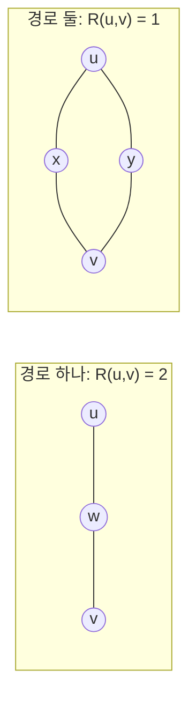

# 유효저항

# 개요

그래프에서 두 정점이 얼마나 가까운지를 재는 가장 흔한 척도는 최단 경로 길이다. 그런데 이 척도는 경로가 하나뿐인지 백 개인지를 구별하지 못한다. 두 정점을 잇는 유일한 다리와, 백 갈래로 갈라진 두꺼운 연결이 같은 거리 2 를 받는다.

유효저항은 이 구별을 담는다. 그래프를 전기 회로로 보고, 간선 가중치를 전도도로 삼아 두 정점 사이에 단위 전류를 흘릴 때 생기는 전위차를 잰다. 경로가 많으면 전류가 나뉘어 흐르므로 저항이 낮아진다. 즉 최단 거리가 아니라 연결의 두께를 재는 양이다.

계산은 [그래프 Laplacian](graph-laplacian.md)의 선형방정식 하나로 끝난다. Laplacian 이 회로의 Kirchhoff 법칙을 그대로 표현하기 때문이다. 이 양은 무작위 행보의 도달 시간, 신장트리의 개수, 간선의 중요도 샘플링으로 이어진다.

# 직관

## 병렬 경로가 저항을 낮춘다

모든 간선의 저항이 1 인 두 그래프를 비교한다.



왼쪽은 저항 1 인 간선 둘이 직렬이므로 $R=2$ 다. 오른쪽은 저항 2 짜리 경로 둘이 병렬이므로 $R=1$ 이다. 두 그래프 모두 $u$ 와 $v$ 의 최단 경로 길이는 2 다. 최단 경로가 보지 못하는 차이를 유효저항이 본다.

극단적인 경우가 다리 간선이다. 우회로가 전혀 없으면 모든 전류가 그 간선을 지나야 하므로 유효저항이 그 간선의 저항과 같아지고, 이는 가능한 최댓값이다.

## 왜 Laplacian 인가

각 정점에서 흘러 나가는 전류의 합은 외부에서 주입한 양과 같아야 한다. 간선 $(i,j)$ 에 흐르는 전류는 Ohm 법칙으로 $w_{ij}(\varphi_i - \varphi_j)$ 이므로, 정점 $i$ 의 순유출은 다음과 같다.

$$
\sum_{j\sim i} w_{ij}(\varphi_i-\varphi_j)=(L\varphi)_i
$$

이것이 정확히 Laplacian 을 전위 벡터에 적용한 결과다. 그래서 Kirchhoff 의 전류 법칙이 $L\varphi = b$ 한 줄이 된다. 전기 회로는 Laplacian 방정식의 물리적 모형이고, 거꾸로 Laplacian 계산에 회로의 직관을 빌려 올 수 있다.

# 정의

## 전위 방정식

연결된 유한 무향 그래프의 각 간선 가중치 $w_{ij}>0$ 을 전도도로 본다. 간선의 저항은 $1/w_{ij}$ 다. $L$ 을 그래프 Laplacian, $u \ne v$ 를 두 정점이라 한다.

$b = e_u - e_v$ 는 $u$ 좌표가 1, $v$ 좌표가 $-1$ , 나머지가 0 인 벡터다. 전위 $\varphi$ 는 다음을 만족한다.

$$
L\varphi=b
$$

$u$ 에서 전류 1 을 넣고 $v$ 에서 1 을 빼며, 나머지 정점에서는 순유입이 0 이라는 조건이다. 유효저항은 그때의 전위차다.

$$
R(u,v)=\varphi_u-\varphi_v
$$

## 유일성

$L$ 은 특이행렬이므로 $\varphi$ 는 유일하지 않다. 그래프가 연결되어 있으면 $L$ 의 핵은 상수 벡터뿐이고, $b$ 는 상수 벡터와 직교하므로 해가 존재한다. 두 해는 상수만큼 다르므로 전위차 $\varphi_u - \varphi_v$ 는 유일하게 결정된다. 기준 정점의 전위를 0 으로 고정하면 $\varphi$ 자체도 유일해진다.

## 유사역행렬 표현

$L^+$ 를 $L$ 의 Moore–Penrose 유사역행렬이라 하면 $\varphi = L^+ b$ 를 택할 수 있고, 다음 닫힌 꼴을 얻는다.

$$
R(u,v)=b^{\mathsf T}L^{+}b=L^{+}_{uu}-2L^{+}_{uv}+L^{+}_{vv}
$$

$L$ 의 고유분해 $L = \sum_k \lambda_k q_k q_k^{\mathsf T}$ 를 쓰면 0 이 아닌 고유값에 대한 합으로도 쓸 수 있다.

$$
R(u,v)=\sum_{k:\lambda_k>0}\frac{\left(q_k(u)-q_k(v)\right)^2}{\lambda_k}
$$

작은 고유값의 고유벡터가 두 정점을 크게 갈라놓을수록 저항이 커진다. 병목이 저항으로 나타나는 것이 이 식에서 보인다.

## 계산

```python
import numpy as np

def effective_resistance(W):
    """W: 대칭 가중치 행렬(전도도). 모든 정점 쌍의 유효저항을 반환한다."""
    L = np.diag(W.sum(axis=1)) - W
    Lp = np.linalg.pinv(L)
    d = np.diag(Lp)
    return d[:, None] - 2 * Lp + d[None, :]

path = np.array([[0, 1, 0], [1, 0, 1], [0, 1, 0]], dtype=float)
print(effective_resistance(path)[0, 2])      # 2.0

parallel = np.array([[0, 1, 1, 0], [1, 0, 0, 1],
                     [1, 0, 0, 1], [0, 1, 1, 0]], dtype=float)
print(effective_resistance(parallel)[0, 3])  # 1.0
```

두 직관 예시의 값이 그대로 나온다.

# 성질

## 에너지 해석

전위 방정식에서 바로 다음이 나온다.

$$
\varphi^{\mathsf T}L\varphi=\varphi^{\mathsf T}b=\varphi_u-\varphi_v=R(u,v)
$$

왼쪽은 회로가 소비하는 에너지 $\sum_{(i,j)} w_{ij}(\varphi_i-\varphi_j)^2$ 다. 즉 단위 전류를 흘릴 때의 소비 에너지가 유효저항과 같다.

이 에너지는 변분 성질을 가진다. Thomson 원리에 따르면 유효저항은 $u$ 에서 $v$ 로 단위 전류를 보내는 모든 흐름 가운데 최소 에너지이며, Dirichlet 원리에 따르면 그 역수는 전위 함수에 대한 최소화로 얻어진다.

$$
R(u,v)^{-1}=\min\Big\{\varphi^{\mathsf T}L\varphi\ :\ \varphi_u-\varphi_v=1\Big\}
$$

## Rayleigh 단조성

간선을 추가하거나 전도도를 높이면 유효저항은 증가하지 않는다. Thomson 원리에서 바로 나온다. 기존 최적 흐름은 새 회로에서도 그대로 가능한 흐름이고, 최솟값을 취하는 집합이 넓어졌으므로 최소 에너지가 커질 수 없다.

반대로 간선을 끊으면 저항이 줄지 않는다. 이 단조성이 유효저항을 연결성의 척도로 쓸 수 있게 하는 근거다.

## 거리이다

$R$ 은 정점 집합 위의 거리함수다. 대칭성과 $R(u,v) = 0 \iff u = v$ 는 정의에서 바로 나오고, 삼각부등식은 에너지의 볼록성 또는 아래 매장에서 따라온다.

$$
R(u,w)\le R(u,v)+R(v,w)
$$

더 강하게, $R$ 은 제곱 유클리드 거리로 매장된다. $x_v=(L^+)^{1/2}e_v$ 로 두면 $R(u,v)=\lVert x_u-x_v\rVert^2$ 이므로, 유효저항은 유클리드 공간에 놓인 점들의 제곱거리다. 이 사실이 저항을 기반으로 한 차원 축소와 임베딩에 쓰인다.

## 신장트리와의 관계

Kirchhoff 의 행렬-트리 정리와 결합하면 조합적 해석이 나온다. 간선 $e=(u,v)$ 에 대해 다음이 성립한다.

$$
w_e\,R(u,v)=\Pr[\,e\in T\,]
$$

여기서 $T$ 는 가중치에 비례하는 확률로 뽑은 무작위 신장트리다. 즉 간선의 전도도 곱하기 유효저항은 그 간선이 무작위 신장트리에 포함될 확률이다.

모든 간선에 대해 더하면 Foster 정리를 얻는다. 신장트리의 간선 수가 항상 $n-1$ 이기 때문이다.

$$
\sum_{e=(u,v)\in E}w_e\,R(u,v)=n-1
$$

이 항등식이 저항 기반 샘플링의 표본 크기를 결정한다. 중요도의 총합이 정점 수로 고정되어 있으므로 필요한 표본 수가 간선 수가 아니라 정점 수에 비례한다.

## 무작위 행보와의 관계

$u$ 에서 출발해 $v$ 를 방문하고 돌아오는 데 걸리는 기대 시간, 즉 왕복시간이 유효저항에 비례한다.

$$
C(u,v)=2\,m\,R(u,v)\qquad(m=\textstyle\sum_e w_e)
$$

확률적 대상과 전기적 대상이 같은 방정식을 만족하기 때문이다. 두 언어의 사전은 [Random walk와 전기 네트워크](random-walks.md)에서 다룬다.

# 활용

## 간선의 중요도

간선의 가중치가 크다고 중요한 것이 아니다. 양 끝 사이에 우회로가 많으면 그 간선 하나를 지워도 연결 구조가 거의 변하지 않는다. $w_eR(u,v)$ 는 정확히 이 중요도이며, 값이 1 에 가까울수록 대체 불가능하고 0 에 가까울수록 잉여다.

이것이 [spectral sparsification](spectral-sparsification.md)의 샘플링 확률이 된다. 유효저항에 비례해 간선을 뽑으면 $O(n \log n / \epsilon^2)$ 개의 간선만으로 Laplacian 이차형식을 근사하는 부분그래프를 얻는다[^1].

## 네트워크 분석

유효저항 거리는 전염, 정보 확산, 혼잡을 다룰 때 최단 경로보다 적절한 경우가 많다. 실제 흐름이 한 경로에 몰리지 않고 분산되기 때문이다. 모든 쌍의 저항 합 $\sum_{u<v} R(u,v)$ 을 Kirchhoff 지표라 하며 네트워크의 전체적 견고함을 재는 값으로 쓴다.

## 수치 계산

정확한 유효저항은 $L^+$ 를 요구하므로 큰 그래프에서는 비싸다. 실제로는 Johnson–Lindenstrauss 사영과 Laplacian 방정식의 빠른 해법을 결합해 모든 간선의 저항을 근사하고, 이 근사값으로 곧바로 샘플링한다.

[^1]: Spielman, Srivastava, *Graph Sparsification by Effective Resistances* (2008), https://arxiv.org/abs/0803.0929. 전기적 해석과 저항 기반 샘플링의 연결, Foster 정리의 역할. 전위 방정식과 Schur 보수의 관계는 Spielman 의 강의 노트 https://www.cs.yale.edu/homes/spielman/561/lect08-15.pdf 를 참고했다.

# 연관 문서

## 선수지식

- [그래프 Laplacian](graph-laplacian.md)

## 더 알아보기

- [논문: Graph Sparsification by Effective Resistances](spectral-sparsification.md)
- [Random walk와 전기 네트워크](random-walks.md)

#graph_theory #linear_algebra
