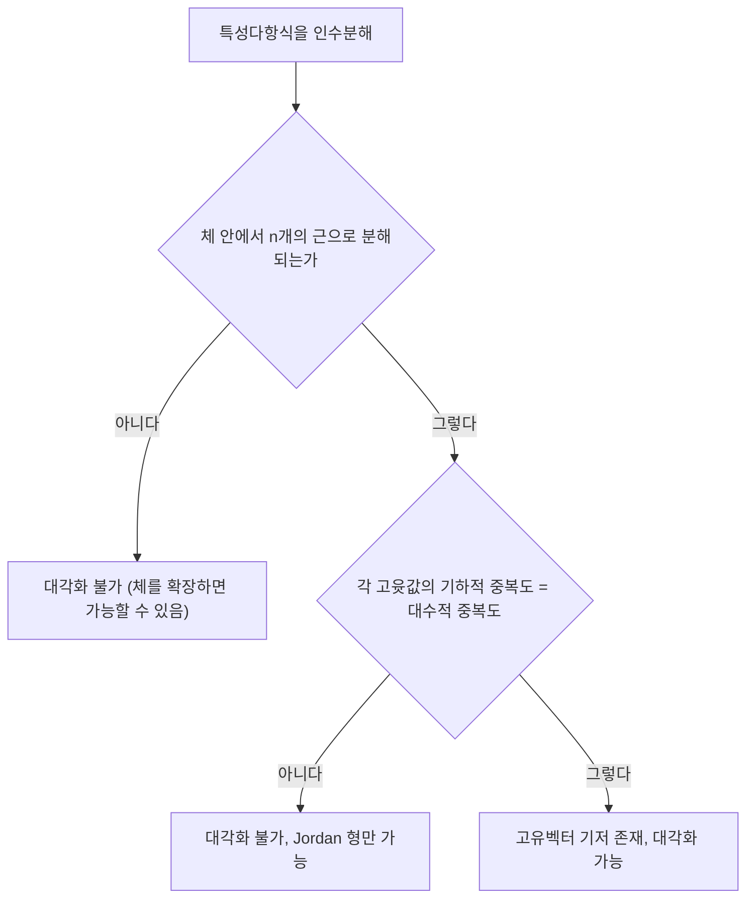

# 고윳값과 고유벡터

# 개요

고유벡터는 선형사상이 방향을 바꾸지 않고 배율만 곱하는 벡터이고, 그 배율이 고윳값이다. 고유벡터로 된 기저를 잡으면 사상은 대각행렬이 되어, 거듭제곱·지수·점화식 같은 반복 적용 문제가 스칼라 계산으로 분해된다. 고윳값은 특성다항식의 근으로 계산되고, 대각화 가능성은 각 고윳값의 기하적 중복도와 대수적 중복도가 같은지로 판정된다[^1]. 대각화가 안 되는 경우에도 Cayley–Hamilton 정리와 Jordan 형이 구조를 준다.

# 직관

행렬이 벡터를 늘이고 돌리는 가운데, 돌지 않고 늘어나기만 하는 방향이 고유벡터다. 2차 행렬 A의 성분이 첫 행 (2,1), 둘째 행 (1,2)이면 (1,1) 방향은 3배로, (1,-1) 방향은 1배로 간다. 이 두 방향을 축으로 삼으면 A는 대각행렬 diag(3,1)이고, A를 k번 적용한 결과는 각 축에서 3^k배와 1배다. 즉 고유벡터 기저는 "사상이 가장 단순해 보이는 좌표계"다.

반대로 첫 행 (0,1), 둘째 행 (0,0)인 행렬은 고윳값 0만 갖고 고유벡터가 한 방향뿐이라 대각화되지 않는다. 판정 흐름은 다음과 같다.



# 정의

V를 체 F 위의 유한차원 [벡터 공간](vector-spaces.md), T를 V에서 V로 가는 선형사상이라 하자. 0이 아닌 벡터 v와 스칼라 λ가 다음을 만족하면 λ를 고윳값, v를 그에 대한 고유벡터라 한다.

$$
Tv=\lambda v,\qquad v\neq 0
$$

고윳값 λ의 고유공간은 λI-T의 kernel이고, 그 차원이 기하적 중복도다.

$$
E_\lambda=\ker(\lambda I-T),\qquad
m_{\mathrm{geo}}(\lambda)=\dim E_\lambda
$$

n차 정사각행렬 A의 특성다항식은 [행렬식](determinants.md)으로 정의되는 n차 monic 다항식이며, 그 근이 정확히 고윳값이다. λ가 근으로 등장하는 중복도가 대수적 중복도다.

$$
\chi_A(\lambda)=\det(\lambda I-A)
$$

가역행렬 P가 존재하여 P⁻¹AP가 대각행렬이면 A가 대각화 가능하다고 한다. 이때 P의 열이 고유벡터, 대각 성분이 대응하는 고윳값이다.

$$
A=P\,\mathrm{diag}(\lambda_1,\dots,\lambda_n)\,P^{-1}
$$

# 성질

## 고유벡터의 선형독립

서로 다른 고윳값에 대응하는 고유벡터들은 선형독립이다. 최소 개수의 반례 관계식을 잡고 양변에 (T - λ₁I)를 적용하면 λ₁ 항이 사라져 더 짧은 관계식이 나오는데, 이는 최소성에 모순이다. 따라서 서로 다른 고윳값이 n개면 자동으로 대각화 가능하다.

## 중복도 부등식과 대각화 판정

기하적 중복도는 대수적 중복도를 넘지 않는다. 따라서 대각화 가능은 다음 두 조건이 함께 성립하는 것과 동치다[^1]: 특성다항식이 F 안에서 일차식들의 곱으로 완전히 분해되고(대수적 중복도의 합이 n), 각 고윳값에서 기하적 중복도가 대수적 중복도와 같다.

$$
1\le m_{\mathrm{geo}}(\lambda)\le m_{\mathrm{alg}}(\lambda)
$$

첫 조건만 깨지는 예로 실수 위의 회전행렬(첫 행 (0,-1), 둘째 행 (1,0))은 실고윳값이 없지만 복소수 위에서는 ±i로 대각화된다. 두 번째 조건이 깨지는 예가 위의 nilpotent 행렬이다. 후자의 경우에도 대수적으로 닫힌 체 위에서는 Jordan 표준형으로 "대각 + 상삼각 1"의 블록 꼴까지 갈 수 있다[^3].

## 대각합과 행렬식

특성다항식의 계수 비교로 얻는다. 고윳값을 중복도까지 세면 합이 대각합, 곱이 행렬식이다. 이는 대각화 여부와 무관하게 대수적으로 닫힌 체 위에서 성립한다.

$$
\operatorname{tr}A=\sum_{i=1}^{n}\lambda_i,\qquad
\det A=\prod_{i=1}^{n}\lambda_i
$$

특히 A가 가역인 것은 0이 고윳값이 아닌 것과 동치다.

## Cayley–Hamilton

모든 정사각행렬은 자기 자신의 특성다항식을 만족한다[^1][^3].

$$
\chi_A(A)=0
$$

증명 개요: 대각화 가능한 행렬에 대해서는 각 고유방향에서 χ_A(λᵢ)=0이므로 자명하고, 일반 행렬은 대각화 가능한 행렬의 극한(또는 대수적 닫힘 위에서 삼각화)으로 다루거나 adjugate 항등식 (λI-A)·adj(λI-A) = χ_A(λ)I를 다항식 화에서 전개해 얻는다. 실용적 결과로 Aⁿ이 더 낮은 차수의 거듭제곱들로 표현되고, 가역행렬의 역행렬이 A의 다항식이 된다.

## 유사불변량

P⁻¹AP는 A와 같은 특성다항식, 같은 고윳값, 같은 중복도를 갖는다. 반대로 같은 특성다항식을 가져도 유사하지 않을 수 있다(위의 nilpotent 행렬과 영행렬은 특성다항식이 모두 λ²이다). 완전한 분류는 Jordan 형 또는 최소다항식·불변인자가 한다.

# 활용

## 거듭제곱과 점화식

대각화된 행렬의 k제곱은 대각 성분의 k제곱이다.

$$
A^k=P\,\mathrm{diag}(\lambda_1^k,\dots,\lambda_n^k)\,P^{-1}
$$

Fibonacci 점화식은 첫 행 (1,1), 둘째 행 (1,0)인 행렬의 거듭제곱이고, 그 고윳값이 황금비와 그 켤레이므로 Binet 공식이 바로 나온다.

$$
\lambda_{\pm}=\frac{1\pm\sqrt5}{2},\qquad
F_k=\frac{\lambda_+^k-\lambda_-^k}{\sqrt5}
$$

## 확률과 동역학

[Markov chain](markov-chains.md)의 전이행렬은 고윳값 1과 그에 대응하는 정상분포를 가지며, 두 번째로 큰 고윳값의 절댓값이 수렴 속도를 지배한다. 연속시간에서는 [상미분방정식](ordinary-differential-equations.md) 선형계의 해가 고윳값의 지수함수로 분해되고, 실부의 부호가 안정성을 결정한다.

$$
x'=Ax\ \Longrightarrow\ x(t)=\sum_i c_i e^{\lambda_i t}v_i
$$

## 그래프와 수치계산

[그래프 Laplacian](graph-laplacian.md)의 고윳값은 연결성과 확장성을 재고, [유효저항](effective-resistance.md)과 random walk의 혼합시간이 이 스펙트럼으로 표현된다. 수치적으로는 특성다항식의 근을 구하지 않고 QR 알고리즘이나 power iteration을 쓴다.

```python
import numpy as np
A = np.array([[2., 1.], [1., 2.]])
vals, vecs = np.linalg.eig(A)
print(vals)            # [3. 1.]
print(vecs[:, 0])      # (1,1) 방향의 단위벡터
```

대칭행렬처럼 구조가 있으면 고유벡터를 직교로 고를 수 있는데, 이것이 [스펙트럼 정리](spectral-theorem.md)다[^2].

[^1]: Irena Penev, Linear Algebra 2, Lecture 19 — The Cayley–Hamilton theorem, Diagonalization, Charles University. https://iuuk.mff.cuni.cz/~ipenev/LA2S2023Lecture19slides.pdf
[^2]: Oliver Knill, Math 21b — Diagonalization, Harvard University. https://abel.math.harvard.edu/archive/21b_fall_03/handouts/diagonalization.pdf
[^3]: Gabriel Day, The Cayley–Hamilton and Jordan Normal Form Theorems, University of Chicago REU 2017. https://math.uchicago.edu/~may/REU2017/REUPapers/Day.pdf

# 연관 문서

## 선수지식

- [행렬식](determinants.md)
- [선형사상](linear-maps.md)

## 더 알아보기

- [스펙트럼 정리](spectral-theorem.md)
- [군의 표현과 지표](group-representations.md)

#linear_algebra
