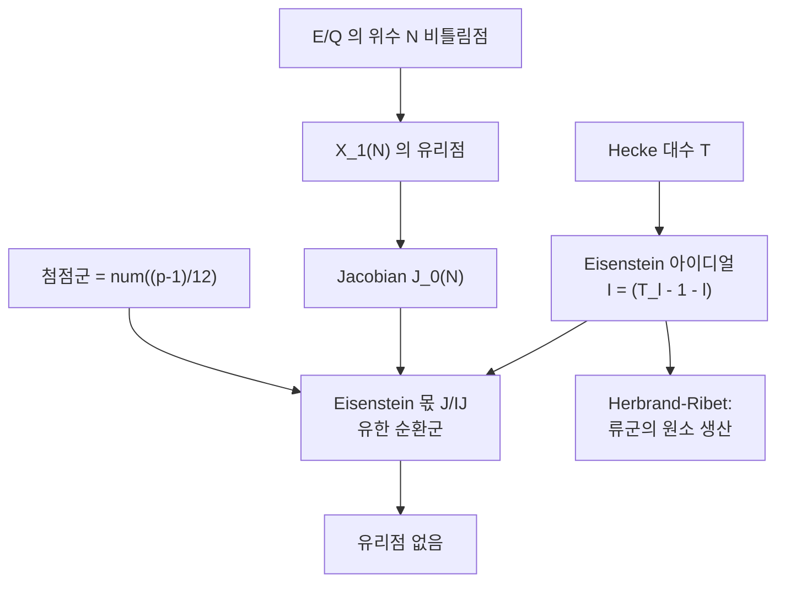

# Eisenstein 아이디얼과 Mazur 의 비틀림점 정리

# 개요

$\mathbb Q$ 위 타원곡선의 비틀림 부분군으로 무엇이 가능한가. 실험적으로는 답이 작다는 것이 오래전부터 알려져 있었지만, 목록이 유한하다는 것조차 1977 년 Mazur 의 정리 전까지는 증명되지 않았다.

**정리(Mazur).** $E/\mathbb Q$ 의 비틀림군은 다음 15 개 중 하나다.

$$
\mathbb Z/n\ (1\le n\le10,\ n=12),\qquad
\mathbb Z/2\times\mathbb Z/2m\ (1\le m\le4)
$$

증명의 전략은 문제를 곡선 하나에 대한 물음에서 **모듈러 곡선의 유리점** 문제로 바꾸는 것이다. $E$ 가 위수 $N$ 의 유리점을 가지면 $X_1(N)$ 의 유리점이 생기므로, 그런 점이 없음을 보이면 된다. [모듈러 곡선](modular-curves.md) $X_0(N)$ 은 $N$ 이 클 때 종수가 크고 Faltings 이전에는 유리점 유한성조차 없었으니, 다른 길이 필요했다.

Mazur 가 연 길이 **Eisenstein 아이디얼**이다. Hecke 대수 $\mathbb T$ 안에서

$$
I=\big(T_\ell-1-\ell\ :\ \ell\nmid N\big)\subset\mathbb T
$$

가 Eisenstein 급수의 고유값을 자르는 아이디얼이다. $J_0(N)$ 의 $I$ 소멸 부분 $J_0(N)[I]$ 는 첨점의 차이가 생성하는 유한 순환군(Eisenstein 상)과 밀접하고, 그 구조를 정밀하게 계산하면 유리점의 존재가 곧바로 모순으로 이어진다. [Herbrand–Ribet](herbrand-ribet.md) 에서 본 "Eisenstein 합동이 표현을 가약으로 만든다" 는 원리가 여기서는 Jacobian 의 산술을 통제하는 데 쓰인다.

# 직관

## 비틀림점을 모듈러 곡선의 점으로 바꾼다

$(E,P)$ 를 "타원곡선과 위수 $N$ 인 점" 의 쌍이라 하면 그 동형류가 $Y_1(N)$ 의 점이다. 그러므로

$$
\exists\,E/\mathbb Q\ \text{with}\ P\in E(\mathbb Q)\ \text{of order}\ N
\iff
Y_1(N)(\mathbb Q)\ne\emptyset
$$

이다. 오른쪽은 한 곡선에 대한 유리점 문제이고, 왼쪽은 무한히 많은 곡선에 대한 문제다. **모듈러 곡선은 무한 족의 문제를 하나의 기하 대상으로 압축한다.**

문제는 유리점이 없음을 증명하는 일이다. 종수 0 이나 1 이면 고전적으로 처리되지만 $N$ 이 커지면 종수도 커지고, 곡선 위의 유리점을 배제할 일반적 수단이 없다. Mazur 는 곡선 대신 **Jacobian 을 본다**.

## Jacobian 의 작은 몫으로 내려보낸다

$X$ 를 종수 $g\ge1$ 인 곡선, $J$ 를 그 Jacobian 이라 하자. 유리점 $x$ 와 기준점 $\infty$ 를 잡으면 $x-\infty\in J(\mathbb Q)$ 다. 만약

- $J(\mathbb Q)$ 가 유한이고
- 그 유한군을 어떤 소수 $p$ 에서의 환원으로 완전히 파악할 수 있다면

$x$ 의 후보가 유한 개로 줄고, 하나씩 배제할 수 있다. 첫 조건이 Mordell–Weil 계수 0 을 요구하는데, 일반적으로는 확인하기 어렵다. 여기서 Eisenstein 아이디얼이 등장한다.

$$
J_0(N)\ \longrightarrow\ J_0(N)/IJ_0(N)=:\ \text{Eisenstein 몫}
$$

으로 내려보내면, 이 몫이 유한한 순환군이고 그 위수가 첨점의 차수 차이로 명시적으로 계산된다. **계수가 0 임을 증명할 필요가 없다. 계수가 0 인 몫으로 옮기면 된다.**

## 첨점이 만드는 유한 순환군

$N=p$ 가 소수일 때 $X_0(p)$ 의 첨점은 $0$ 과 $\infty$ 둘뿐이고, 그 차이가 $J_0(p)$ 안에서 유한 위수를 갖는다. 위수는

$$
n=\mathrm{num}\!\left(\frac{p-1}{12}\right)
$$

이며 이 군을 **첨점군**이라 한다. 분자에 $p-1$ 이 나오는 것은 Eisenstein 급수 $E_2$ 의 상수항에서 오고, $12$ 는 판별식 $\Delta$ 의 무게에서 온다. Mazur 의 정리는 $J_0(p)[I]$ 가 정확히 이 첨점군과 같다는 것, 곧 **Eisenstein 부분에는 첨점밖에 없다**는 것이다.

이 등식이 증명되면 유리점 $x$ 가 주는 $x-\infty$ 의 Eisenstein 몫에서의 상이 첨점군 안에 놓이고, 그 위수가 작으므로 $x$ 가 첨점이거나 특별한 점임이 강제된다. 특별한 점들은 CM 곡선에 대응하고 손으로 검사할 수 있다.

## Herbrand–Ribet 과 같은 도구, 반대 용도

[Herbrand–Ribet](herbrand-ribet.md) 에서는 Eisenstein 합동으로 **류군의 원소를 만들었다**. 여기서는 같은 합동으로 **Jacobian 의 유리점을 없앤다**. 같은 대수 구조(Eisenstein 극대 아이디얼에서의 Hecke 대수)를 쓰지만 쓰임이 반대다.

공통점은 둘 다 "Eisenstein 아이디얼 근처에서 Hecke 대수가 얼마나 큰가" 를 묻는다는 점이다. Mazur 는 $\mathbb T/I\cong\mathbb Z/n$ 임을 보였고, 그 완전한 계산이 두 응용의 바탕이다.

# 정의

## Hecke 대수와 Eisenstein 아이디얼

$\mathbb T=\mathbb Z[T_\ell:\ell\nmid N]\subset\mathrm{End}\big(J_0(N)\big)$ 를 무게 2, 레벨 $N$ 의 Hecke 대수라 하자.

$$
I=\big(T_\ell-1-\ell\ :\ \ell\nmid N\big)+\big(U_q-1\ :\ q\mid N\big)
$$

를 **Eisenstein 아이디얼**이라 한다. 생성원은 $E_2$ 형 Eisenstein 급수의 고유값 $1+\ell$ 을 빼는 원소다. 극대 아이디얼 $\mathfrak m\supset I$ 를 **Eisenstein 극대 아이디얼**이라 한다.

## 첨점군

$N=p$ 소수일 때 $C=\langle(0)-(\infty)\rangle\subset J_0(p)(\mathbb Q)$ 를 첨점군이라 하고

$$
\#C=n=\mathrm{num}\!\left(\frac{p-1}{12}\right)
$$

이다. $C$ 는 $I$ 에 의해 소멸된다.

## Mazur 의 정리들

**정리 A.** $J_0(p)[I]=C$ 이고 $\mathbb T/I\cong\mathbb Z/n$ 이다.

**정리 B.** Eisenstein 몫 $\tilde J=J_0(p)/IJ_0(p)$ 는 $\mathbb Q$ 위 계수 0 이다. 곧 $\tilde J(\mathbb Q)$ 가 유한이다.

**정리 C(비틀림점).** 개요의 15 개 목록이 $\mathbb Q$ 위 타원곡선 비틀림군의 전부다.

정리 B 가 핵심 기술이다. Eisenstein 몫의 $L$ 함수가 $s=1$ 에서 소멸하지 않음을 보이는 대신, Mazur 는 $\tilde J$ 의 $\mathbb Q$ 유리점을 직접 통제한다.

# 성질

## 왜 계수가 0 인가

$\tilde J$ 위의 유리점은 $I$ 를 소멸시키는 Galois 표현을 준다. 그런 표현은 가약이고 그 반단순화가 $1\oplus\chi_{\mathrm{cyc}}$ 다. 만약 계수가 양수라면 $\mathbb Q$ 위에서 $\mathbb Z$ 만큼의 점이 있어야 하는데, 하강을 Eisenstein 방향으로 수행하면 그 점들이 순환체의 불분기 확대를 만들어 낸다. 첨점군의 위수가 작다는 계산이 그런 확대의 존재를 막는다.

곧 **정리 A 의 정밀한 계산이 정리 B 의 유한성으로 번역된다.** 순환체의 산술(류군이 작다)이 Jacobian 의 산술(계수가 0)을 강제하는 구조이고, 여기서 다시 [Bernoulli 수](bernoulli-numbers.md)와 $\frac{p-1}{12}$ 의 분자가 등장한다.

## 유리점의 제거

$x\in X_0(p)(\mathbb Q)$ 가 첨점이 아니라 하자. $\tilde J$ 로 내려보내고 좋은 환원을 갖는 소수 $\ell$ 에서 환원하면

$$
\tilde J(\mathbb Q)\ \hookrightarrow\ \tilde J(\mathbb F_\ell)
$$

가 단사다(비틀림이 좋은 환원에서 단사). 오른쪽은 유한군이고 위수가 계산된다. $x-\infty$ 의 상이 첨점군에 놓이므로, $x$ 의 $\bmod\ \ell$ 환원이 첨점의 환원과 같아야 한다. 여러 $\ell$ 에 대해 이 조건을 걸면 남는 가능성이 없다.

$p$ 가 작을 때는 이 논법이 통하지 않고 실제로 유리점이 있다. $X_0(p)$ 가 유리점을 갖는 소수는

$$
p=2,3,5,7,11,13,17,19,37,43,67,163
$$

이며, 마지막 여섯은 CM 점에 대응한다. $163$ 이 여기 나타나는 것과 $e^{\pi\sqrt{163}}$ 이 거의 정수인 것은 같은 사실의 두 얼굴이다.

## $\mathbb T$ 의 구조

Mazur 의 계산은 Eisenstein 극대 아이디얼에서의 완비화 $\mathbb T_{\mathfrak m}$ 이 Gorenstein 이고 $\mathbb Z_p$ 위 유한평탄이라는 것까지 준다. 이 성질이 뒤에

- Wiles 의 $R=T$ 논법에서 Gorenstein 성질의 사용,
- Ribet 의 레벨 낮추기,
- Skinner–Urban 의 Eisenstein 합동

에서 반복적으로 쓰인다. **Hecke 대수의 국소 구조를 정확히 아는 것이 현대 정수론의 표준 자산이 된 출발점**이 이 논문이다.

## 일반화와 한계

| 물음 | 상태 |
|---|---|
| $\mathbb Q$ 위 비틀림 | 해결 (Mazur) |
| 이차체 위 비틀림 | 해결 (Kamienny, Kenku–Momose) |
| 차수 $d$ 수체 위 일양 유계성 | 해결 ([Merel](merel-theorem.md)) |
| 명시적 목록 ($d\ge3$) | 부분적으로만 |
| 아벨 다양체의 비틀림 | 대부분 열림 |

Merel 의 정리는 목록을 주지 않고 유계만 준다. 명시적 목록은 $d=3$ 정도까지 알려져 있고, 계산량이 급격히 커진다.

# 활용

## 타원곡선의 분류와 계산

비틀림군이 15 개뿐이라는 사실은 타원곡선 데이터베이스의 기본 구조를 결정한다. 주어진 곡선의 비틀림군은 Nagell–Lutz 나 좋은 환원에서의 위수 계산으로 빠르게 확정되고, Mazur 의 목록이 후보를 미리 잘라 준다. [BSD](birch-swinnerton-dyer.md) 공식에서 비틀림 항이 분모에 들어가므로 순위 계산의 전처리이기도 하다.

## Fermat 방정식으로 가는 길

Frey 곡선의 $\bmod\ p$ 표현이 기약임을 보이는 단계에서 Mazur 의 정리가 쓰인다. 표현이 가약이면 Eisenstein 상황이 되고 위 목록이 그 가능성을 배제한다. Ribet 의 레벨 낮추기와 Wiles 의 모듈러성 사이를 잇는 조각 중 하나다.

## Eisenstein 합동의 현대적 용법

$\mathbb T/I$ 의 크기를 $L$ 값으로 계산하는 방식은 이후 모든 "합동으로 Selmer 원소를 만든다" 논법의 틀이 되었다. [Iwasawa 주추측](iwasawa-main-conjecture.md)의 Mazur–Wiles 증명이 직접적인 후속이고, 고차 계수의 아벨 다양체와 자기동형 형식으로의 확장이 현재 진행형이다.

[^1]: B. Mazur, *Modular curves and the Eisenstein ideal*, Publ. Math. IHES **47** (1977), 33–186. 비틀림 정리는 같은 논문과 *Rational isogenies of prime degree*, Invent. Math. **44** (1978). 일양 유계성은 L. Merel, Invent. Math. **124** (1996). 해설로는 J. Silverman, *Advanced Topics in the Arithmetic of Elliptic Curves* 와 Darmon–Diamond–Taylor 의 FLT 해설을 보라.

# 연관 문서

## 선수지식

- [Herbrand–Ribet 정리와 Eisenstein 합동](herbrand-ribet.md)
- [모듈러 곡선 X_0(N)](modular-curves.md)

## 더 알아보기

- [Merel 의 일양 유계성 정리](merel-theorem.md)

#number_theory #theorem #algebraic_topology
