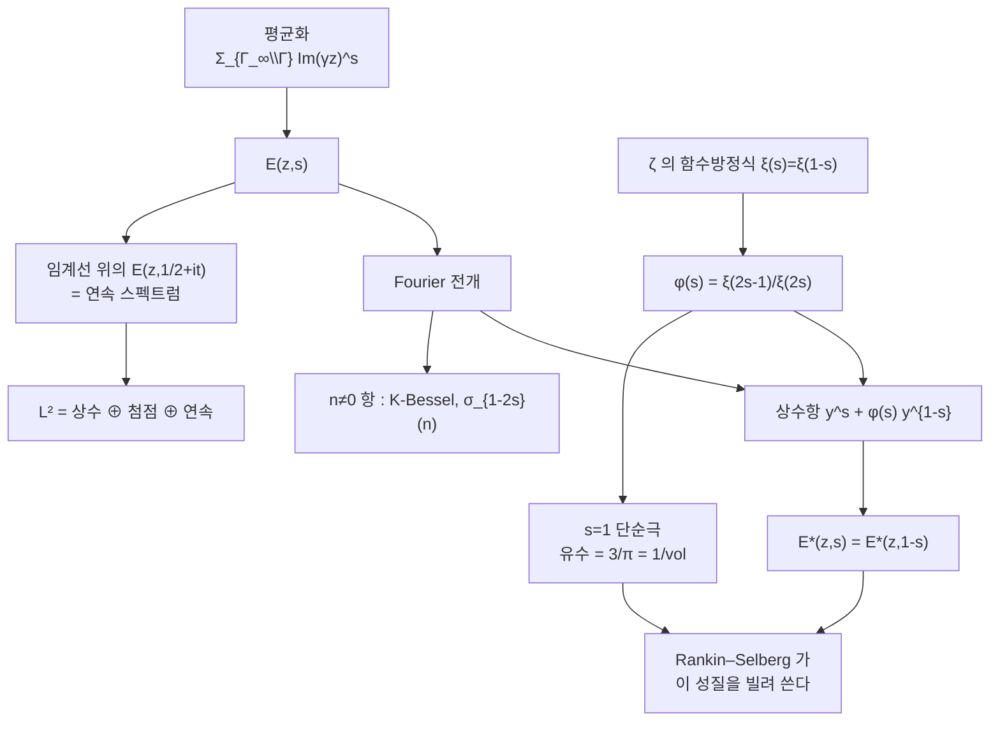

# Eisenstein 급수와 스펙트럼 분해

# 개요

[모듈러 형식](modular-forms.md)의 공간은 두 조각으로 나뉜다.

$$
M_k(\mathrm{SL}_2(\mathbb Z))=S_k\;\oplus\;\mathbb C\,E_k
$$

첨점형식 $S_k$ 는 첨점에서 사라지는 쪽이고, Eisenstein 급수 $E_k$ 는 사라지지 않는 쪽이다. 첨점형식이 깊은 산술을 담는다면 Eisenstein 급수는 그 반대다. 계수가 $\sigma_{k-1}(n)=\sum_{d\mid n}d^{k-1}$ 이라 완전히 명시적이고, 신비가 없다.

바로 그 명시성이 쓸모다. Eisenstein 급수는 **알려진 것**이고, 알려진 것을 지렛대 삼아 모르는 것을 다룬다.

- $E_4^3-E_6^2=1728\Delta$ 처럼, 명시적인 것들의 조합으로 첨점형식이 만들어진다.
- 무게 대신 복소 매개변수 $s$ 를 넣은 **실해석적 Eisenstein 급수** $E(z,s)$ 는 $\mathrm{SL}_2(\mathbb Z)\backslash\mathbb H$ 의 Laplace 작용소의 **연속 스펙트럼**을 전부 만든다. 이산 스펙트럼(Maass 형식)이 아직도 미지인 것과 대조적으로, 연속 쪽은 $\zeta$ 함수로 완전히 기술된다.
- $E(z,s)$ 의 해석적 접속과 함수방정식은 $\zeta$ 의 그것에서 직접 나온다. 그리고 이 성질을 [Rankin–Selberg 적분](rankin-selberg.md)이 통째로 빌려 쓴다. 아무것도 모르던 $L$ 함수가 해석적 성질을 얻는 것은 $E(z,s)$ 가 그 성질을 이미 갖고 있기 때문이다.

$$
E^*(z,s)=\xi(2s)E(z,s)\qquad\Longrightarrow\qquad E^*(z,s)=E^*(z,1-s)
$$

Riemann zeta 함수의 함수방정식이 상반평면 위의 함수의 대칭으로 옮겨 앉은 것이다. $\zeta$ 의 해석학이 자기동형 형식의 해석학으로 들어오는 통로가 Eisenstein 급수다.

# 직관

## 평균을 내서 불변량을 만든다

$\Gamma$ 불변 함수를 만드는 가장 소박한 방법은 평균이다. 아무 함수 $f$ 나 잡고 $\sum_{\gamma\in\Gamma}f(\gamma z)$ 를 만들면 불변이다. 문제는 수렴이다.

$\Gamma$ 전체에 대한 합은 대개 발산한다. 그래서 $f$ 를 어떤 부분군 $\Gamma_\infty$ 에 대해 이미 불변이도록 고르고, 잉여류에 대해서만 합한다. $\mathrm{Im}(z)^s$ 는 $z\mapsto z+1$ 에 대해 불변이므로 $\Gamma_\infty=\left\lbrace\pm\bigl(\begin{smallmatrix}1&n\cr 0&1\end{smallmatrix}\bigr)\right\rbrace$ 에 대한 불변함수이고,

$$
E(z,s)=\sum_{\gamma\in\Gamma_\infty\backslash\Gamma}\mathrm{Im}(\gamma z)^s
$$

가 $\mathrm{Re}(s)>1$ 에서 수렴한다. 정칙 쪽도 같은 구성이다. $1$ 을 $(cz+d)^{-k}$ 라는 자기형 인자로 평균 내면 $E_k$ 가 나온다.

이 구성의 값은 **명시성**이다. 무엇을 평균 냈는지 알기 때문에 Fourier 계수를 끝까지 계산할 수 있다. 첨점형식은 이런 식으로 만들어지지 않는다. 평균의 잔재를 모두 빼고 남는 것이 첨점형식이다.

## 상수항이 두 개다

$E(z,s)$ 의 Fourier 전개에서 $n=0$ 항, 곧 $x$ 에 대한 평균은 $y$ 의 함수다. 그런데 이것이 한 항이 아니라 두 항이다.

$$
a_0(y,s)=y^s+\varphi(s)\,y^{1-s},
\qquad
\varphi(s)=\frac{\xi(2s-1)}{\xi(2s)}
$$

첫 항 $y^s$ 는 평균을 내기 전의 함수 그 자체, 곧 $\gamma=1$ 인 항에서 온다. 둘째 항은 나머지 전부가 모여 만든 것이다. 그리고 두 지수 $s$ 와 $1-s$ 는 Laplace 작용소의 같은 고윳값

$$
\Delta_{\mathbb H}=-y^2\Bigl(\partial_x^2+\partial_y^2\Bigr),
\qquad
\Delta_{\mathbb H}\,y^s=s(1-s)\,y^s
$$

을 주는 두 해다. 곧 상수항은 고윳값 $s(1-s)$ 의 2 차원 해공간 안에 있고, $\varphi(s)$ 는 두 해가 섞이는 비율이다.

여기서 함수방정식이 왜 나오는지가 보인다. $E(z,s)$ 와 $E(z,1-s)$ 는 같은 고윳값을 갖는 같은 종류의 함수이고, 상수항을 보면 $s$ 와 $1-s$ 의 역할만 바뀌어 있다. 두 함수가 서로 상수배여야 하고, 그 상수가 $\varphi(s)$ 다. 산란 행렬이 1 × 1 인 산란 이론이라 불러도 좋다. $\varphi(s)\varphi(1-s)=1$ 은 "들어간 것이 다 나온다" 는 유니터리성이다.

## 연속 스펙트럼

$\mathrm{SL}_2(\mathbb Z)\backslash\mathbb H$ 는 콤팩트가 아니다. 첨점이 하나 뚫려 있다. 콤팩트 다양체였다면 Laplace 작용소의 스펙트럼이 이산이겠지만, 첨점이 있으면 연속 스펙트럼이 생긴다.

$$
L^2(\Gamma\backslash\mathbb H)=
\underbrace{\mathbb C\cdot 1}_{\text{상수}}
\;\oplus\;
\underbrace{L^2_{\mathrm{cusp}}}_{\text{Maass 첨점형식}}
\;\oplus\;
\underbrace{\int_{\mathrm{Re}(s)=1/2}^{\oplus}\mathbb C\,E(z,s)\,ds}_{\text{연속 스펙트럼}}
$$

연속 부분을 만드는 것이 바로 임계선 위의 $E(z,s)$ 다. $E(z,\tfrac12+it)$ 는 $L^2$ 에 속하지 않지만(상수항이 $y^{1/2}$ 크기라 첨점에서 적분 발산), 자유 입자의 평면파처럼 연속 스펙트럼의 "일반화 고유함수" 노릇을 한다. Selberg 의 스펙트럼 분해 정리가 이 분해를 정확히 서술한다.

첨점형식 쪽은 존재조차 자명하지 않다(Selberg 의 대각합 공식이 무한히 많음을 보인다). 반면 연속 쪽은 $\zeta$ 함수로 완전히 손에 잡힌다. 아는 쪽과 모르는 쪽이 이렇게 갈린다.

## s=1 의 극과 부피

$\varphi(s)=\xi(2s-1)/\xi(2s)$ 의 분자는 $\xi$ 의 $w=1$ 극에서 오는 $s=1$ 의 단순극을 갖는다. 유수를 계산하면

$$
\mathrm{Res}_{s=1}E(z,s)=\frac{1}{2\xi(2)}=\frac{3}{\pi}
=\frac1{\mathrm{vol}(\Gamma\backslash\mathbb H)}
$$

이고 $z$ 에 의존하지 않는 **상수함수**다. 당연하다. 유수도 $\Gamma$ 불변이고 고윳값이 $s(1-s)\to0$ 이므로 조화함수이며, 유계인 조화함수는 상수다.

이 상수가 부피의 역수라는 것이 Rankin–Selberg 방법의 급소다. $f\bar g y^k$ 에 $E(z,s)$ 를 곱해 적분한 것의 $s=1$ 유수가 Petersson 내적 $\langle f,g\rangle/\mathrm{vol}$ 이 되는 이유가 여기 있다.



# 정의

## 정칙 Eisenstein 급수

짝수 $k\ge4$ 에 대해

$$
G_k(z)=\sum_{(m,n)\ne(0,0)}\frac1{(mz+n)^k},
\qquad
E_k(z)=\frac{G_k(z)}{2\zeta(k)}
$$

로 두면 $E_k\in M_k(\mathrm{SL}_2(\mathbb Z))$ 이고 $E_k(\infty)=1$ 이다. Fourier 전개는

$$
E_k(z)=1-\frac{2k}{B_k}\sum_{n\ge1}\sigma_{k-1}(n)\,q^n,
\qquad q=e^{2\pi iz}
$$

이고 $B_k$ 는 Bernoulli 수다. $k=4,6$ 이면 계수가 각각 $240\sigma_3(n)$ 과 $-504\sigma_5(n)$ 이다. $k=2$ 에서는 합이 조건수렴이라 $E_2$ 가 모듈러가 아니다(준모듈러 형식).

## 실해석적 Eisenstein 급수

$\Gamma=\mathrm{SL}\_2(\mathbb Z)$ 로 두고 $\Gamma_\infty$ 를 $\pm\bigl(\begin{smallmatrix}1&*\cr 0&1\end{smallmatrix}\bigr)$ 들의 군이라 하자.

$$
E(z,s)=\sum_{\gamma\in\Gamma_\infty\backslash\Gamma}\mathrm{Im}(\gamma z)^s
=\frac12\sum_{\substack{(c,d)\in\mathbb Z^2\\ \gcd(c,d)=1}}\frac{y^s}{\lvert cz+d\rvert^{2s}}
$$

$\mathrm{Re}(s)>1$ 에서 절대수렴한다. **완비화**는 $\xi(s)=\pi^{-s/2}\Gamma(s/2)\zeta(s)$ 를 써서 $E^*(z,s)=\xi(2s)E(z,s)$ 로 정의한다.

$E(z,s)$ 는 $\Gamma$ 불변이고 $\Delta_{\mathbb H}E=s(1-s)E$ 를 만족하지만 $L^2$ 에는 속하지 않는다.

## Fourier 전개

$$
E^*(z,s)=\xi(2s)\,y^s+\xi(2s-1)\,y^{1-s}
+4\sqrt y\sum_{n\ge1}n^{s-\frac12}\sigma_{1-2s}(n)\,K_{s-\frac12}(2\pi ny)\cos(2\pi nx)
$$

$K_\nu$ 는 변형 Bessel 함수이고 $K_\nu=K_{-\nu}$ 다. 이 전개에서 모든 성질이 읽힌다. 오른쪽 전체가 $s\mapsto1-s$ 에서 대칭이므로 함수방정식이 나오고, $\xi(2s-1)$ 의 극에서 $s=1$ 의 극이 나온다.

# 성질

## 함수방정식과 극

> $E^\ast(z,s)$ 는 $s\in\mathbb C$ 전체로 유리형 접속되고
> $$
> E^*(z,s)=E^*(z,1-s)
> $$
> 를 만족한다. 극은 $s=0$ 과 $s=1$ 의 단순극뿐이고, $\mathrm{Res}_{s=1}E(z,s)=3/\pi$ 다.[^1]

정규화하지 않은 꼴로는 $E(z,s)=\varphi(s)E(z,1-s)$ 이고 $\varphi(s)=\xi(2s-1)/\xi(2s)$ 이며 $\varphi(s)\varphi(1-s)=1$ 이다. $\varphi$ 를 **산란 행렬**이라 부른다. 첨점이 여러 개인 경우 $\varphi$ 가 첨점 개수 크기의 행렬이 되고, 그 행렬식의 극이 잉여 스펙트럼을 준다.

$\varphi(s)$ 의 0 점과 극은 $\zeta$ 의 0 점과 직결된다. 이 때문에 $E(z,s)$ 의 해석적 성질을 개선하는 일과 $\zeta$ 의 0 점을 이해하는 일이 같은 문제가 된다.

## 정칙 쪽 : 명시적인 것에서 첨점형식을 만든다

$M_k$ 의 차원이 작다는 사실과 $E_k$ 의 명시성을 합치면 첨점형식이 손에 들어온다. $M_{12}$ 는 2 차원이고 $E_4^3$ 과 $E_6^2$ 가 모두 상수항 1 을 가지므로 차가 첨점형식이다. 차원이 1 이므로 $\Delta$ 의 상수배일 수밖에 없다.

$$
\Delta=\frac{E_4^3-E_6^2}{1728}
$$

정수 계수로 정확히 확인한다.

```python
from fractions import Fraction
N = 60

def eis(k, B):                               # E_k = 1 - (2k/B_k) Σ σ_{k-1}(n) q^n
    c = [Fraction(0)]*(N+1); c[0] = Fraction(1)
    for n in range(1, N+1):
        s = sum(d**(k-1) for d in range(1, n+1) if n % d == 0)
        c[n] = -Fraction(2*k)/B * s
    return c

def mul(a, b):
    r = [Fraction(0)]*(N+1)
    for i in range(N+1):
        if a[i] == 0: continue
        for j in range(N+1-i): r[i+j] += a[i]*b[j]
    return r

E4 = eis(4, Fraction(-1, 30))                # B_4 = -1/30
E6 = eis(6, Fraction(1, 42))                 # B_6 = 1/42
lhs = [x - y for x, y in zip(mul(mul(E4, E4), E4), mul(E6, E6))]

d = [0]*(N+1); d[0] = 1                      # Δ = q ∏ (1-q^n)^24
for n in range(1, N+1):
    for _ in range(24):
        new = d[:]
        for k in range(n, N+1): new[k] -= d[k-n]
        d = new
tau = [0] + [d[k] for k in range(N)]

print("E4 계수", [int(E4[i]) for i in range(5)])
print("E6 계수", [int(E6[i]) for i in range(5)])
print("(E4^3-E6^2) == 1728·Δ :", all(lhs[n] == 1728*tau[n] for n in range(N+1)))
print("처음 6개 tau :", tau[1:7])

# E4 계수 [1, 240, 2160, 6720, 17520]
# E6 계수 [1, -504, -16632, -122976, -532728]
# (E4^3-E6^2) == 1728·Δ : True
# 처음 6개 tau : [1, -24, 252, -1472, 4830, -6048]
```

$\tau(n)$ 의 불규칙함이 $\sigma_3$ 과 $\sigma_5$ 라는 단순한 함수들의 조합에서 나온다. Ramanujan 의 합동 $\tau(n)\equiv\sigma_{11}(n)\pmod{691}$ 도 여기서 나온다. $691$ 은 $B_{12}$ 의 분자이고, $E_{12}$ 와 $E_4^3$ 의 차이를 재면 그 소수가 튀어나온다.

## Hecke 고유형식이다

$E_k$ 도 [Hecke 작용소](hecke-operators.md)의 고유형식이다. $\sigma_{k-1}$ 이 곱셈적이고

$$
T_pE_k=(1+p^{k-1})E_k
$$

이므로 Satake 매개변수가 $\alpha=p^{(k-1)/2}$ 이고 $\beta=p^{-(k-1)/2}$ 다. 절댓값이 1 이 아니므로 **온도적이 아니다**. 첨점형식이 Ramanujan 추측을 만족하는 것과 정확히 대조된다.

이것이 일반적 현상이다. 자기동형 표현 가운데 Eisenstein 쪽(더 작은 군에서 유도된 것)은 온도성을 깨고, 첨점 쪽만 온도적일 것으로 기대된다. Arthur 의 분류에서 이 구분이 $A$ 매개변수와 $L$ 매개변수의 차이로 나타난다.

## 일반화

- **레벨과 첨점.** $\Gamma_0(N)$ 은 첨점이 여러 개이고 각 첨점마다 Eisenstein 급수가 있다. 산란 행렬이 진짜 행렬이 되고, 그 행렬식이 스펙트럼 이론의 중심 대상이 된다.
- **더 높은 계수.** $\mathrm{GL}_n$ 에서는 포물 부분군 $P$ 마다, 그 Levi 위의 첨점형식 $\sigma$ 마다 Eisenstein 급수 $E(g,s;\sigma,P)$ 가 있다. Langlands 가 이들의 해석적 접속을 증명했고, 그것이 $L^2(\mathrm{GL}_n(\mathbb Q)\backslash\mathrm{GL}_n(\mathbb A))$ 의 스펙트럼 분해를 준다.
- **Langlands–Shahidi 방법.** 그 Eisenstein 급수의 상수항에 자기동형 $L$ 함수들이 인자로 나타난다. $\mathrm{GL}_2$ 에서 $\varphi(s)=\xi(2s-1)/\xi(2s)$ 에 $\zeta$ 가 나온 것의 일반화다. 상수항의 해석적 성질에서 $L$ 함수의 해석적 성질을 읽는 것이 이 방법이다.

# 활용

## Rankin–Selberg 의 재료

[Rankin–Selberg 적분](rankin-selberg.md)이 쓰는 것은 $E(z,s)$ 의 세 성질뿐이다.

1. 정의가 $\Gamma_\infty\backslash\Gamma$ 위의 합이다 — 펼치기가 가능한 이유.
2. 해석적 접속과 함수방정식이 있다 — $L$ 함수가 그것을 물려받는다.
3. $s=1$ 에 극이 있고 유수가 $1/\mathrm{vol}$ 이다 — 극 판정과 Petersson 내적의 출처.

셋 다 이 문서에서 확인한 것이다. $L$ 함수의 해석적 성질이 결국 $\zeta$ 의 함수방정식 하나로 환원되는 셈이다.

## 스펙트럼 이론과 Selberg 대각합 공식

Selberg 대각합 공식은 $\Gamma\backslash\mathbb H$ 의 Laplace 스펙트럼과 닫힌 측지선의 길이를 잇는다. 좌변의 스펙트럼 쪽에는 이산 스펙트럼뿐 아니라 연속 스펙트럼의 기여가 들어가는데, 그 기여가 정확히 $\varphi'/\varphi(s)$ 로 적힌다. 곧 $\zeta'/\zeta$ 다.

$$
-\frac1{4\pi}\int_{-\infty}^{\infty}h(t)\,\frac{\varphi'}{\varphi}\Bigl(\tfrac12+it\Bigr)dt
$$

Weyl 법칙으로 Maass 첨점형식의 개수를 셀 때 이 항을 빼야 하고, 그래서 $\zeta$ 의 0 점 분포에 대한 지식이 자기동형 형식의 개수 세기에 끼어든다.

## 유수와 부피 계산

$E(z,s)$ 의 유수가 상수라는 사실을 거꾸로 쓰면 기본영역의 부피가 계산된다. 더 일반적으로 Langlands 의 Eisenstein 급수 이론에서 잉여 스펙트럼을 계산하면 산술 군의 공변량 부피(Siegel–Weil, Langlands 부피 공식)가 나온다. 부피와 $\zeta$ 특수값이 얽히는 현상 — $\mathrm{vol}(\mathrm{SL}_2(\mathbb Z)\backslash\mathbb H)=\pi/3$ 에 $\zeta(2)=\pi^2/6$ 가 숨어 있는 것 — 의 출발점이다.

## 반복되는 구도

명시적으로 아는 대상을 만들어 두고, 그것과의 관계에서 미지의 대상을 다룬다는 구도는 여기서 그치지 않는다.

- 해석적 정수론에서 $\zeta$ 를 아는 것으로 두고 $L$ 함수를 다룬다.
- 표현론에서 유도표현을 아는 것으로 두고 초첨점 표현을 다룬다.
- 대수기하에서 사영공간을 아는 것으로 두고 일반 다양체를 다룬다.

Eisenstein 급수는 이 구도의 자기동형 형식판이고, Langlands 강령이 "Eisenstein 쪽은 이미 알므로 첨점 쪽만 새롭다" 는 원리 위에 세워져 있다.

[^1]: 함수방정식과 Fourier 전개는 H. Iwaniec, *Spectral Methods of Automorphic Forms* (2 판, 2002) 3장과 6장. 스펙트럼 분해는 같은 책 4장, 또는 A. Selberg, *Harmonic analysis and discontinuous groups*, J. Indian Math. Soc. **20** (1956). 정칙 쪽과 $691$ 합동은 J.-P. Serre, *A Course in Arithmetic* (1973) 7장. $\mathrm{GL}_n$ 의 Eisenstein 급수는 R. Langlands, *On the Functional Equations Satisfied by Eisenstein Series*, Lecture Notes in Math. 544 (1976), 해설은 C. Mœglin, J.-L. Waldspurger, *Spectral Decomposition and Eisenstein Series* (1995). 본문의 두 계산은 직접 한 것이다.

# 연관 문서

## 선수지식

- [모듈러 형식](modular-forms.md)
- [소수 정리와 Riemann zeta 함수](prime-number-theorem.md)

## 더 알아보기

- [Maass 형식과 Laplace 스펙트럼](maass-forms.md)
- [Mock 모듈러 형식과 Zwegers 이론](mock-modular-forms.md)
- [Rankin–Selberg 적분](rankin-selberg.md)
- [Selberg 대각합 공식](selberg-trace-formula.md)
- [Siegel–Weil 공식과 이차형식의 표현수](siegel-weil.md)

#number_theory #complex_analysis #analysis #computation
