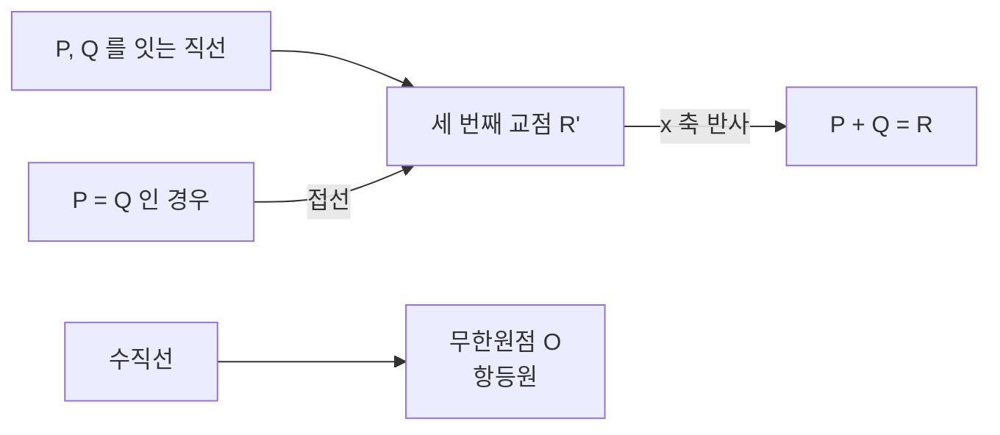

# 타원곡선과 군 구성

# 개요

[이산로그](discrete-logarithm.md)의 난이도는 어떤 군을 쓰느냐에 달렸다. `(\mathbb Z/p\mathbb Z)^\times` 에서는 원소가 정수로 표현되는 성질을 이용한 지표 계산법이 준지수 시간을 주지만, 그런 구조가 없는 군에서는 `O(\sqrt N)` 이 최선으로 남는다.

타원곡선이 그런 군을 준다. [유한체](finite-fields.md) 위의 삼차 곡선에 놓인 점들에 기하적인 덧셈을 정의하면 아벨군이 되고, 이 군에는 "작은 소수로 쪼개진다" 에 해당하는 개념이 없다. 그 결과 같은 안전성에 훨씬 짧은 키를 쓸 수 있다.

수학적으로는 암호보다 훨씬 오래된 대상이다. 유리수 위의 타원곡선은 Mordell–Weil 정리로 유한생성 아벨군이 되고, 그 계수를 예측하는 Birch–Swinnerton-Dyer 추측이 밀레니엄 문제 중 하나다. Fermat 마지막 정리의 증명도 타원곡선과 모듈러 형식의 대응을 통해 이루어졌다. 하나의 대상이 순수수학의 중심 문제와 실무 암호를 동시에 떠받친다.

# 직관

## 현과 접선이 군을 만든다

곡선 위의 두 점을 잇는 직선은 삼차 곡선과 세 점에서 만난다. 세 번째 교점을 `x` 축에 대해 반사한 것을 두 점의 합으로 정의한다.

같은 점 둘을 더할 때는 직선 대신 접선을 쓴다. 직선이 수직이면 세 번째 교점이 없는데, 이때를 위해 무한원점 `O` 를 더하고 이것을 항등원으로 삼는다.



## 왜 결합법칙이 성립하는가

닫힘, 항등원, 역원, 교환법칙은 정의에서 바로 보인다. 결합법칙만 어렵다. 좌표로 전개하면 거대한 다항식 항등식이 되고, 직접 확인은 가능하지만 아무것도 설명해 주지 않는다.

제대로 된 이유는 곡선의 점들과 인자류군의 대응에 있다. 점 `P` 를 인자 `[P]-[O]` 에 대응시키면, 세 점이 한 직선 위에 있다는 조건이 그 인자들의 합이 주인자라는 조건이 된다. 군 연산이 인자류군의 덧셈에서 물려받은 것이므로 결합법칙이 공짜로 따라온다. 기하적 정의가 임의적으로 보이지만 사실 유일하게 자연스러운 것이라는 뜻이다.

## 왜 지표 계산법이 통하지 않는가

`(\mathbb Z/p\mathbb Z)^\times` 에서 지표 계산법은 원소를 작은 소수들의 곱으로 쪼갠다. 정수의 소인수분해라는 추가 구조가 있기 때문에 가능하다.

타원곡선군의 원소는 좌표쌍일 뿐 곱으로 쪼개지지 않는다. "작은 원소" 라는 개념도 없다. 그래서 일반 군 알고리즘밖에 없고 `O(\sqrt N)` 이 남는다. 이것이 암호에서 타원곡선을 쓰는 유일한 실질적 이유다.

# 정의

## Weierstrass 형

표수가 2, 3 이 아닌 체 `K` 위에서 타원곡선은 다음 방정식과 무한원점으로 이루어진다.

$$
E:\ y^2=x^3+ax+b,\qquad a,b\in K
$$

판별식이 0 이 아니어야 한다.

$$
\Delta=-16\big(4a^3+27b^2\big)\ne0
$$

이 조건은 곡선이 특이점을 가지지 않는다는 뜻이다. 특이점이 있으면 접선이 정의되지 않아 군 구조가 깨진다.

## 덧셈 공식

`P=(x_1,y_1)`, `Q=(x_2,y_2)`, `P+Q=(x_3,y_3)` 일 때 기울기를 다음으로 정한다.

$$
\lambda=\begin{cases}\dfrac{y_2-y_1}{x_2-x_1}&P\ne Q\\[2mm]\dfrac{3x_1^2+a}{2y_1}&P=Q\end{cases}
$$

$$
x_3=\lambda^2-x_1-x_2,\qquad y_3=\lambda(x_1-x_3)-y_1
$$

`x_1=x_2` 이고 `y_1=-y_2` 이면 `P+Q=O` 다. 역원은 `-(x,y)=(x,-y)` 다.

## 스칼라 곱

`kP` 는 `P` 를 `k` 번 더한 것이며, 반복 제곱과 같은 방식으로 `O(\log k)` 번의 군 연산에 계산된다. 타원곡선 이산로그 문제는 `Q=kP` 에서 `k` 를 찾는 것이다.

## 계산

```python
p, a, b = 1009, 2, 3            # y^2 = x^3 + 2x + 3 over F_1009
O = None                        # 무한원점

def add(P, Q):
    if P is O: return Q
    if Q is O: return P
    (x1, y1), (x2, y2) = P, Q
    if x1 == x2 and (y1 + y2) % p == 0:
        return O
    if P == Q:
        lam = (3 * x1 * x1 + a) * pow(2 * y1, -1, p) % p
    else:
        lam = (y2 - y1) * pow(x2 - x1, -1, p) % p
    x3 = (lam * lam - x1 - x2) % p
    return (x3, (lam * (x1 - x3) - y1) % p)

pts = [O] + [(x, y) for x in range(p) for y in range(p)
             if (y * y - x**3 - a * x - b) % p == 0]
N = len(pts)
print("위수 N =", N, " Hasse 구간:", (p + 1 - int(2 * p**0.5), p + 1 + int(2 * p**0.5)))

def mul(k, P):
    R, Q = O, P
    while k:
        if k & 1: R = add(R, Q)
        Q = add(Q, Q); k >>= 1
    return R

G = pts[1]
print("결합법칙 표본 검사:",
      all(add(add(pts[i], pts[j]), pts[k]) == add(pts[i], add(pts[j], pts[k]))
          for i in range(1, 12) for j in range(1, 12) for k in range(1, 12)))
print("N*G = O :", mul(N, G) is O)

# 타원곡선 Diffie-Hellman
ka, kb = 271, 823
print("공유 비밀 일치:", mul(ka, mul(kb, G)) == mul(kb, mul(ka, G)))
# 위수 N = 1068  Hasse 구간: (947, 1073)
# 결합법칙 표본 검사: True
# N*G = O : True
# 공유 비밀 일치: True
```

위수가 Hasse 구간 안에 있고, 표본 검사에서 결합법칙이 성립하며, Lagrange 정리대로 `NG=O` 다. 마지막 줄이 타원곡선 Diffie–Hellman 이며 곡선만 바꾸었을 뿐 프로토콜은 그대로다.

# 성질

## Hasse 정리

유한체 `\mathbb F_q` 위의 타원곡선의 점 개수는 `q+1` 근처에 있다.

$$
\big|\,\#E(\mathbb F_q)-(q+1)\,\big|\le2\sqrt q
$$

각 `x` 에 대해 `x^3+ax+b` 가 제곱수일 확률이 대략 절반이고 그때 `y` 가 둘이므로 평균적으로 점이 `q` 개 남짓이라는 어림이 맞다는 것이 이 정리의 내용이다. 오차가 `\sqrt q` 규모라는 것은 유한체 위의 Riemann 가설에 해당하며, Hasse 가 증명하고 Weil 이 일반화했다.

`\#E(\mathbb F_q)` 를 정확히 세는 것은 Schoof 알고리즘으로 다항시간에 가능하다. 암호용 곡선을 만들 때 위수가 큰 소인수를 가지는지 확인하는 절차가 이것이다.

## 군 구조

$$
E(\mathbb F_q)\cong\mathbb Z/n_1\mathbb Z\times\mathbb Z/n_2\mathbb Z,\qquad n_2\mid n_1,\ n_2\mid q-1
$$

대개 순환군이거나 순환군에 작은 인자가 붙은 형태다. 암호에서는 위수가 큰 소수인 순환 부분군을 골라 생성원으로 쓴다. [Pohlig–Hellman](discrete-logarithm.md) 때문에 위수에 작은 소인수가 많으면 안 되기 때문이다.

## Mordell–Weil 정리

유리수체 위에서는 사정이 다르다. `E(\mathbb Q)` 는 유한생성 아벨군이다.

$$
E(\mathbb Q)\cong\mathbb Z^r\times T
$$

`T` 는 유한한 비틀림 부분군이고 `r` 을 계수라 한다. Mazur 의 정리가 `T` 로 가능한 군을 15 가지로 완전히 분류했다. 반면 `r` 은 계산하기 어렵고, 얼마나 커질 수 있는지조차 알려져 있지 않다.

Birch–Swinnerton-Dyer 추측은 `r` 이 곡선의 `L` 함수가 `s=1` 에서 가지는 0 의 차수와 같다고 말한다. 산술적 대상과 해석적 대상을 잇는다는 점에서 [소수 정리](prime-number-theorem.md)와 같은 계열의 진술이다.

## 왜 ECDLP 가 더 어려운가

| | 유한체 곱셈군 | 타원곡선군 |
|---|---|---|
| 최선 공격 | 지표 계산법, 준지수 | Pollard rho, `O(\sqrt N)` |
| 128 비트 보안 | 3072 비트 | 256 비트 |
| 연산 비용 | 모듈러 곱셈 | 여러 번의 모듈러 곱셈 |
| 취약 사례 | 작은 표수 유한체 | 이상 곡선, 작은 매장 차수 |

타원곡선의 이점은 키 길이이지 연산의 단순함이 아니다. 한 번의 점 덧셈이 여러 번의 체 연산이므로 연산 자체는 더 무겁지만, 다루는 수가 훨씬 작아 전체적으로 이득이다.

취약한 곡선도 있다. `\#E(\mathbb F_p)=p` 인 이상 곡선에서는 가법군으로의 동형이 존재해 이산로그가 다항시간에 풀린다. 매장 차수가 작으면 Weil 쌍으로 문제를 유한체로 옮기는 MOV 공격이 통한다. 그래서 표준 곡선을 쓰거나 생성 시 이 조건들을 검사한다.

## 쌍선형 쌍

Weil 쌍과 Tate 쌍은 곡선의 점 둘을 받아 유한체의 원소를 내놓는 쌍선형 사상이다.

$$
e:E[n]\times E[n]\to\mu_n,\qquad e(aP,bQ)=e(P,Q)^{ab}
$$

원래는 공격 도구로 발견되었지만, 이 성질이 새로운 암호를 가능하게 했다. 신원 기반 암호, 짧은 서명, 세 사람의 한 번 키 교환이 모두 쌍선형성에서 나온다. 판정적 Diffie–Hellman 이 쉬우면서 계산적 Diffie–Hellman 은 어려운 군의 실제 사례이기도 하다.

# 활용

## 실무 암호

TLS, SSH, 비트코인, Signal 이 모두 타원곡선을 쓴다. 키 교환에는 X25519, 서명에는 Ed25519 나 ECDSA 가 표준이다. Curve25519 계열은 상수 시간 구현이 쉽고 잘못 쓰기 어렵게 설계되어 널리 채택되었다.

부채널 공격이 실질적 위협이다. 스칼라 곱에서 비트에 따라 다른 연산을 하면 시간과 전력 소비로 비밀이 새어 나간다. Montgomery 사다리처럼 비트와 무관하게 같은 연산을 수행하는 구현이 표준이다.

## 소인수분해와 소수 판정

Lenstra 의 타원곡선 소인수분해는 합성수를 법으로 하는 곡선에서 연산하다가 역원 계산이 실패하는 지점을 이용한다. 곡선을 바꿔 가며 반복할 수 있다는 유연성 덕분에 중간 크기 인수를 찾는 데 여전히 최선이다.

타원곡선 소수 증명은 위수 계산을 이용해 소수성의 증명서를 만든다. 확률적 판정과 달리 검증 가능한 증명을 남긴다.

## 순수수학에서의 위치

Fermat 마지막 정리의 증명은 가상의 반례에서 타원곡선을 만들고, 그 곡선이 모듈러일 수 없음을 보이는 방식이었다. 모든 유리 타원곡선이 모듈러라는 모듈러성 정리가 Wiles 와 Taylor 의 결과이며, Langlands 강령의 한 조각이다.

합동수 문제, 즉 어떤 정수가 유리 직각삼각형의 넓이가 되는지도 특정 타원곡선의 계수가 양수인지의 문제로 번역된다. 고전적인 산술 문제들이 이 언어로 재구성된다.

## 후양자 시대

Shor 알고리즘은 타원곡선 이산로그도 다항시간에 푼다. 오히려 키가 짧아 필요한 큐비트 수가 적으므로 RSA 보다 먼저 깨질 가능성이 있다.

역설적으로 타원곡선은 후양자 암호의 후보이기도 하다. 곡선들 사이의 아이소제니 그래프에서 경로를 찾는 문제는 양자 공격에 대한 다항시간 알고리즘이 알려져 있지 않다. SIDH 계열이 2022 년에 깨졌지만 CSIDH 와 SQIsign 같은 후속 구성이 연구되고 있다.

# 연관 문서

## 선수지식

- [이산로그와 Diffie–Hellman](discrete-logarithm.md)
- [유한체](finite-fields.md)

## 더 알아보기

- [Weil 쌍과 쌍선형 암호](pairing-based-cryptography.md)
- [Selmer 군과 Tate–Shafarevich 군](selmer-groups.md)
- [Langlands 강령](langlands-program.md)
- [모듈러 곡선 X_0(N)](modular-curves.md)
- [복소 곱셈과 허수이차체의 유체론](complex-multiplication.md)

#number_theory #cryptography #group_theory
