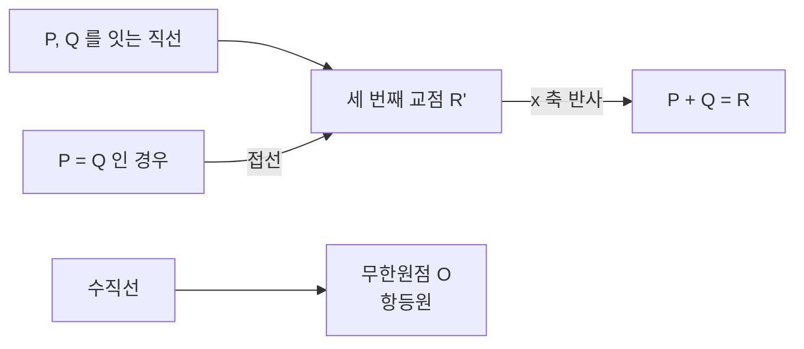

# 타원곡선

# 개요

[이산로그](discrete-logarithm.md)의 난이도는 군에 달렸다. $(\mathbb Z/p\mathbb Z)^\times$ 에서는 원소가 정수로 표현되는 성질을 이용한 지표 계산법이 준지수 시간을 주고, 그런 구조가 없는 군에서는 $O(\sqrt N)$ 이 최선이다.

[유한체](finite-fields.md) 위의 삼차 곡선에 놓인 점들에 기하적인 덧셈을 정의하면 아벨군이 되고, 이 군에는 작은 소수로 쪼개진다는 개념이 없다. 그래서 같은 안전성에 훨씬 짧은 키를 쓴다.

유리수 위의 타원곡선은 Mordell–Weil 정리로 유한생성 아벨군이 되고, 그 계수를 예측하는 [Birch–Swinnerton-Dyer 추측](birch-swinnerton-dyer.md)이 밀레니엄 문제 중 하나다. Fermat 마지막 정리의 증명도 타원곡선과 [모듈러 형식](modular-forms.md)의 대응을 통해 이루어졌다.

# 직관

## 현과 접선

곡선 위의 두 점을 잇는 직선은 삼차 곡선과 세 점에서 만난다. 세 번째 교점을 $x$ 축에 대해 반사한 것이 두 점의 합이다.

같은 점 둘을 더할 때는 직선 대신 접선을 쓴다. 직선이 수직이면 세 번째 교점이 없으므로 무한원점 $O$ 를 더하고 항등원으로 삼는다.

## 결합법칙의 근거

닫힘, 항등원, 역원, 교환법칙은 정의에서 보인다. 결합법칙은 좌표로 전개하면 거대한 다항식 항등식이 된다.

제대로 된 이유는 곡선의 점들과 인자류군의 대응에 있다. 점 $P$ 를 인자 $[P]-[O]$ 에 대응시키면 세 점이 한 직선 위에 있다는 조건이 그 인자들의 합이 주인자라는 조건이 된다. 군 연산이 인자류군의 덧셈에서 물려받은 것이므로 결합법칙이 따라온다.

## 지표 계산법의 부재

$(\mathbb Z/p\mathbb Z)^\times$ 의 지표 계산법은 원소를 작은 소수들의 곱으로 쪼갠다. 정수의 소인수분해라는 추가 구조가 있기 때문이다.

타원곡선군의 원소는 좌표쌍이라 곱으로 쪼개지지 않고 작은 원소라는 개념도 없다. 일반 군 알고리즘만 남아 $O(\sqrt N)$ 이 최선이며, 이것이 암호에서 타원곡선을 쓰는 실질적 이유다.

# 정의

## Weierstrass 형

표수가 2, 3 이 아닌 체 $K$ 위에서 **타원곡선**은 다음 방정식과 무한원점으로 이루어진다.

$$
E:\ y^2=x^3+ax+b,\qquad a,b\in K
$$

판별식이 0 이 아니어야 한다.

$$
\Delta=-16\big(4a^3+27b^2\big)\ne0
$$

곡선이 특이점을 가지지 않는다는 조건이다. 특이점이 있으면 접선이 정의되지 않아 군 구조가 깨진다.

## 덧셈 공식

$P=(x_1,y_1)$ , $Q=(x_2,y_2)$ , $P+Q=(x_3,y_3)$ 일 때 기울기는 다음과 같다.

$$
\lambda=\begin{cases}\dfrac{y_2-y_1}{x_2-x_1}&P\ne Q\cr\dfrac{3x_1^2+a}{2y_1}&P=Q\end{cases}
$$

$$
x_3=\lambda^2-x_1-x_2,\qquad y_3=\lambda(x_1-x_3)-y_1
$$

$x_1=x_2$ 이고 $y_1=-y_2$ 이면 $P+Q=O$ 다. 역원은 $-(x,y)=(x,-y)$ 다.

## 스칼라 곱

$kP$ 는 $P$ 를 $k$ 번 더한 것이고 반복 제곱과 같은 방식으로 $O(\log k)$ 번의 군 연산에 계산된다. 타원곡선 이산로그 문제는 $Q=kP$ 에서 $k$ 를 찾는 것이다.

# 성질

## Hasse 정리

유한체 $\mathbb F_q$ 위 타원곡선의 점 개수는 $q+1$ 근처에 있다.

$$
\big|\thinspace\char35{}E(\mathbb F_q)-(q+1)\thinspace\big|\le2\sqrt q
$$

각 $x$ 에 대해 $x^3+ax+b$ 가 제곱수일 확률이 대략 절반이고 그때 $y$ 가 둘이므로 점이 평균 $q$ 개 남짓이라는 어림이 맞다는 진술이다. 오차가 $\sqrt q$ 규모라는 것이 유한체 위의 [Riemann 가설](riemann-hypothesis.md)에 해당하며 Hasse 가 증명하고 Weil 이 일반화했다.

$\char35{}E(\mathbb F_q)$ 는 Schoof 알고리즘으로 다항시간에 정확히 센다. 암호용 곡선의 위수가 큰 소인수를 갖는지 확인하는 절차가 이것이다.

## 군 구조

$$
E(\mathbb F_q)\cong\mathbb Z/n_1\mathbb Z\times\mathbb Z/n_2\mathbb Z,\qquad n_2\mid n_1,\ n_2\mid q-1
$$

대개 순환군이거나 순환군에 작은 인자가 붙은 형태다. 암호에서는 위수가 큰 소수인 순환 부분군을 골라 생성원으로 쓴다. Pohlig–Hellman 때문에 위수에 작은 소인수가 많으면 안 된다.

## Mordell–Weil 정리

$E(\mathbb Q)$ 는 유한생성 아벨군이다.

$$
E(\mathbb Q)\cong\mathbb Z^r\times T
$$

$T$ 는 유한한 비틀림 부분군이고 $r$ 이 계수다. Mazur 의 정리가 $T$ 로 가능한 군을 15 가지로 분류했다. $r$ 은 계산하기 어렵고, $\mathbb Q$ 위의 곡선들에서 계수가 유계인지도 알려져 있지 않다[^1].

Birch–Swinnerton-Dyer 추측은 $r$ 이 곡선의 $L$ 함수가 $s=1$ 에서 갖는 0 의 차수와 같다고 말한다.

## 두 군의 비교

| | 유한체 곱셈군 | 타원곡선군 |
|---|---|---|
| 최선 공격 | 지표 계산법, 준지수 | Pollard rho, $O(\sqrt N)$ |
| 128 비트 보안 | 3072 비트 | 256 비트 |
| 연산 비용 | 모듈러 곱셈 | 여러 번의 모듈러 곱셈 |
| 취약 사례 | 작은 표수 유한체 | 이상 곡선, 작은 매장 차수 |

타원곡선의 이점은 키 길이다. 한 번의 점 덧셈이 여러 번의 체 연산이라 연산 자체는 무겁지만 다루는 수가 작아 전체적으로 이득이다.

$\char35{}E(\mathbb F_p)=p$ 인 이상 곡선에서는 가법군으로의 동형이 있어 이산로그가 다항시간에 풀리고, 매장 차수가 작으면 Weil 쌍으로 문제를 유한체로 옮기는 MOV(Menezes–Okamoto–Vanstone) 공격이 통한다. 그래서 표준 곡선을 쓰거나 생성 시 이 조건들을 검사한다.

## 쌍선형 쌍

Weil 쌍과 Tate 쌍은 곡선의 점 둘을 받아 유한체의 원소를 내놓는 쌍선형 사상이다.

$$
e:E[n]\times E[n]\to\mu_n,\qquad e(aP,bQ)=e(P,Q)^{ab}
$$

공격 도구로 발견되었지만 이 성질이 신원 기반 암호, 짧은 서명, 세 사람의 한 번 키 교환을 가능하게 했다. 판정적 Diffie–Hellman 이 쉬우면서 계산적 Diffie–Hellman 은 어려운 군의 사례이기도 하다.

# 활용

- TLS(transport layer security), SSH(secure shell), 비트코인, Signal 이 타원곡선을 쓴다. 키 교환에 X25519, 서명에 Ed25519 나 ECDSA(elliptic curve digital signature algorithm)가 표준이고, Curve25519 계열은 상수 시간 구현이 쉽게 설계되었다. 스칼라 곱에서 비트에 따라 다른 연산을 하면 시간과 전력으로 비밀이 새므로 Montgomery 사다리처럼 비트와 무관한 구현을 쓴다.
- Lenstra 의 타원곡선 소인수분해는 합성수를 법으로 하는 곡선에서 역원 계산이 실패하는 지점을 이용하며, 곡선을 바꿔 가며 반복할 수 있어 중간 크기 인수를 찾는 데 최선이다. 타원곡선 소수 증명은 위수 계산으로 검증 가능한 증명서를 만든다.
- Fermat 마지막 정리의 증명은 가상의 반례에서 타원곡선을 만들고 그 곡선이 모듈러일 수 없음을 보인다. 모든 유리 타원곡선이 모듈러라는 모듈러성 정리가 Wiles 와 Taylor 의 결과다. 합동수 문제도 특정 타원곡선의 계수가 양수인지의 문제로 번역된다.
- Shor 알고리즘은 타원곡선 이산로그도 다항시간에 풀고, 키가 짧아 필요한 큐비트 수가 적다. 한편 곡선들 사이의 아이소제니 그래프에서 경로를 찾는 문제는 양자 다항시간 알고리즘이 알려져 있지 않아 CSIDH(commutative supersingular isogeny Diffie–Hellman)와 SQIsign 같은 후양자 구성이 연구되고 있다[^2].

[^1]: J. Park, B. Poonen, J. Voight, M. M. Wood, *A heuristic for boundedness of ranks of elliptic curves*, Journal of the European Mathematical Society **21** (2019), 2859–2903. 계수의 유계성이 판정되지 않은 채임을 밝히고 유계라고 예측하는 휴리스틱을 세운다.
[^2]: W. Castryck, T. Lange, C. Martindale, L. Panny, J. Renes, *CSIDH: An Efficient Post-Quantum Commutative Group Action*, ASIACRYPT 2018, LNCS **11274**, 395–427. 아이소제니 경로 찾기에 알려진 양자 알고리즘의 비용을 안전성 근거로 정리한다.

# 연관 문서

## 선수지식

- [이산로그](discrete-logarithm.md)
- [유한체](finite-fields.md)

## 더 알아보기

### 유리점의 산술

- [Néron–Tate 높이와 Mordell–Weil 정리](canonical-height.md)
- [Selmer 군과 Tate–Shafarevich 군](selmer-groups.md)
- [Siegel 의 정수점 정리](siegel-integral-points.md)

### 고차원 일반화

- [아벨 다양체](abelian-varieties.md)

### 모듈러성과 복소 곱셈

- [모듈러 곡선](modular-curves.md)
- [복소 곱셈](complex-multiplication.md)
- [Langlands 강령](langlands-program.md)

### 암호에서의 쓰임

- [쌍선형 암호](pairing-based-cryptography.md)

#number_theory #cryptography #group_theory
