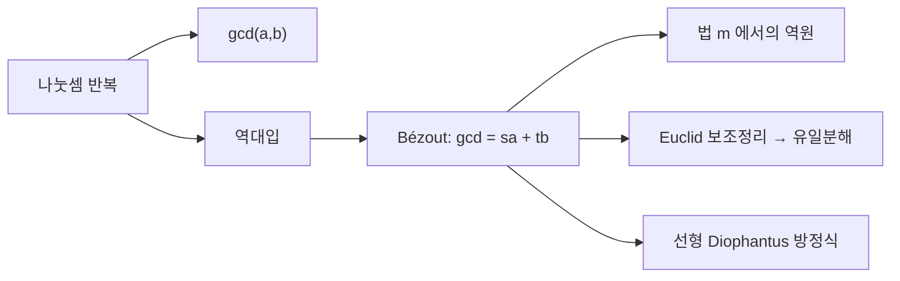

# 유클리드 알고리즘

# 개요

유클리드 알고리즘은 소인수분해 없이 두 정수의 최대공약수를 구한다. 나머지 있는 나눗셈만 반복하며, 나눗셈 횟수는 자릿수에 선형이다.

계산을 거꾸로 되짚으면 최대공약수를 두 입력의 정수 선형결합으로 적을 수 있다. 이 Bézout 항등식이 [합동](modular-arithmetic.md)에서 역원의 존재를 증명하고 [소수](primes.md)의 유일분해를 떠받친다.

# 직관

$a$ 와 $b$ 를 모두 나누는 수는 $a-b$ 도 나눈다. 뺄셈을 한 번의 나눗셈으로 몰면 나머지가 나오고, 공약수 집합은 그대로인 채 수만 작아진다. 두 사실이 각각 정확성과 종료를 준다.

되돌아가는 방향에서는 최대공약수를 $sa+tb$ 로 적는 방법이 나온다. $\gcd(a,m)=1$ 일 때 $sa+tm=1$ 을 $\bmod m$ 으로 읽으면 $sa\equiv 1$ 이므로 $s$ 가 $a$ 의 역원이다. 서로소이면 역원이 있다는 명제의 증명이 곧 역원을 구하는 알고리즘이다.

# 정의

## 최대공약수와 나눗셈 정리

$a \ge b \gt 0$ 인 정수를 모두 나누는 양의 정수 중 가장 큰 것이 최대공약수 $\gcd(a,b)$ 다. $\gcd(a, 0) = a$ 로 약속한다.

나눗셈 정리에 의해 유일한 몫 $q$ 와 나머지 $r$ 이 있다.

$$
a=qb+r,\qquad 0\le r\lt b
$$

## 알고리즘

핵심 변환은

$$
\gcd(a,b)=\gcd(b,r)
$$

이다. 나머지가 $0$ 이 될 때까지 $(a,b)$ 를 $(b,r)$ 로 바꾸고, 마지막으로 $0$ 이 아닌 나머지를 반환한다.

## Bézout 항등식

정수 $s,t$ 가 존재해

$$
\gcd(a,b)=sa+tb
$$

를 만족한다. 더 정확히는 $\lbrace sa + tb : s,t \in \mathbb{Z}\rbrace$ 가 $\gcd(a,b)$ 의 배수 전체와 같다. 확장 유클리드 알고리즘은 최대공약수와 계수 $s, t$ 를 함께 계산한다.

# 성질

## 정확성과 종료

$a$ 와 $b$ 의 공약수는 $r=a-qb$ 도 나눈다. 역으로 $b$ 와 $r$ 의 공약수는 $a=qb+r$ 도 나눈다. 따라서 $\lbrace a,b\rbrace$ 의 공약수 집합과 $\lbrace b,r\rbrace$ 의 공약수 집합이 같고 최대값도 같다.

나머지는 이전 단계의 작은 수보다 엄밀히 작으므로 음이 아닌 정수의 감소열이 되고 반드시 끝난다.

$252$ 와 $105$ 에 적용하면

$$
\begin{aligned}
252&=2\cdot105+42\cr
105&=2\cdot42+21\cr
42&=2\cdot21+0
\end{aligned}
$$

이므로 $\gcd=21$ 이다. 역대입하면

$$
21=105-2\cdot42=105-2(252-2\cdot105)=-2\cdot252+5\cdot105
$$

## 반복 횟수

Lamé 정리에 따르면 작은 쪽 수의 십진 자릿수를 $d$ 라 할 때 나눗셈 횟수는 $5d$ 를 넘지 않는다. 최악의 경우는 연속한 Fibonacci 수이고, 이때 매 단계의 몫이 모두 $1$ 이라 감소가 가장 느리다.

나눗셈 횟수는 값에 대해 $O(\log \min(a,b))$ 다. 자릿수 $n$ 의 나눗셈 한 번의 비용을 세면 전체 비트 복잡도는 $O(n^2)$ 이고, 이를 줄이는 것이 이진 GCD 와 Lehmer 알고리즘이다.

## 선형 Diophantus 방정식

$ax+by=c$ 가 정수해를 갖는 것과 $\gcd(a,b)\mid c$ 인 것은 동치다. 해가 있으면 Bézout 계수를 $c/g$ 배해 특수해를 얻고, 일반해는

$$
x=x_0+\frac bg k,\qquad y=y_0-\frac ag k,\qquad k\in\mathbb{Z}
$$

다. 동전 문제, 격자점 문제, 주기가 다른 두 사건이 겹치는 시점 계산이 이 형태로 환원된다.

## Euclid 보조정리

$\gcd(p,a)=1$ 인 소수 $p$ 가 $ab$ 를 나누면 $sp+ta=1$ 의 양변에 $b$ 를 곱해 $p\mid b$ 를 얻는다. 이것이 [소수](primes.md)의 유일분해를 증명하는 핵심 단계이며, 나머지 있는 나눗셈이 되는 환(유클리드 정역)이 특별한 까닭이다.

## 다른 환으로의 확장

같은 절차가 체 위의 다항식환에서도 작동한다. 차수가 나머지의 크기를 대신하고, 최대공약다항식과 Bézout 항등식이 같은 형태로 나온다. 부분분수 분해, 유한체 구현의 역원 계산, [Reed–Solomon 부호](error-correcting-codes.md)의 복호 알고리즘이 이를 쓴다. Gauss 정수 $\mathbb{Z}[i]$ 에서도 노름을 크기로 삼아 작동한다.

# 활용

- RSA 의 개인키 지수는 $ed \equiv 1 \pmod{\varphi(n)}$ 의 해이므로 확장 유클리드 알고리즘 한 번으로 얻는다. 타원곡선 암호의 점 연산, [중국인의 나머지 정리](chinese-remainder-theorem.md)를 이용한 복호 가속, 유한체 산술의 나눗셈도 이 절차에 의존한다.
- 분수 약분은 분자와 분모를 최대공약수로 나누는 것이다. 나눗셈의 몫들을 순서대로 모으면 연분수 전개가 되고, 그 절단이 최적의 유리수 근사를 준다. 달력의 윤년 규칙, 기어비 설계, Stern–Brocot 트리의 유리수 탐색이 그 응용이다.
- 불변량으로 정확성을 보이고 감소하는 양으로 종료를 보이는 증명 방식이 반복 알고리즘 분석의 표준 틀이다.[^1]

[^1]: MIT 6.042J, *Number Theory I: GCDs*, Chapter 8.1–8.5. 최대공약수, 유클리드 알고리즘의 정확성, Bézout 항등식. https://ocw.mit.edu/courses/6-042j-mathematics-for-computer-science-spring-2015/mit6_042js15_session12.pdf

# 연관 문서

## 선수지식

- [정수의 합동과 나머지 연산](modular-arithmetic.md)

## 더 알아보기

- [소수와 유일분해](primes.md)

#number_theory #algorithms
