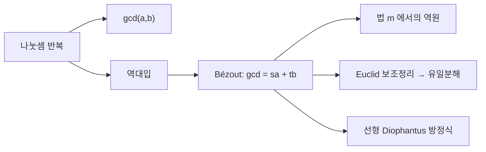

# 유클리드 알고리즘

# 개요

두 정수의 최대공약수를 구하는 방법으로 가장 먼저 떠오르는 것은 각각을 소인수분해해 공통 인수를 모으는 것이다. 그런데 소인수분해는 어렵다. 수백 자리 정수에서는 현실적으로 불가능하다.

유클리드 알고리즘은 분해를 전혀 하지 않고 최대공약수를 구한다. 나머지 있는 나눗셈만 반복하면 되고, 자릿수에 대해 선형 시간이면 끝난다. 기원전 문헌에 등장하는 이 절차가 여전히 현대 암호 구현의 내부에 들어 있는 이유다.

더 중요한 것은 부산물이다. 계산을 거꾸로 되짚으면 최대공약수를 두 입력의 정수 선형결합으로 적을 수 있다. 이 Bézout 항등식이 [합동](modular-arithmetic.md)에서 역원의 존재를 증명하고, [소수](primes.md)의 유일분해를 떠받친다. 알고리즘 하나가 정수론의 기초 정리들을 공급하는 셈이다.

# 직관

## 큰 수를 작은 수로 갈아 끼운다

`a` 와 `b` 를 모두 나누는 수는 `a - b` 도 나눈다. 그러니 공약수를 잃지 않으면서 수를 작게 만들 수 있다. `a - b` 를 반복해 빼는 대신 한 번의 나눗셈으로 몰아서 하면 나머지가 나온다.

이 관찰만으로 알고리즘이 완성된다. 매 단계에서 공약수의 집합이 그대로 유지되고 수는 반드시 작아진다. 두 사실이 각각 정확성과 종료를 증명한다.

## 역방향에서 나오는 것

앞으로 가면 최대공약수를 얻고, 되돌아가면 그것을 $sa + tb$ 로 적는 방법을 얻는다. 이 표현이 왜 중요한가. $\gcd(a, m) = 1$ 일 때 $sa + tm = 1$ 을 $\bmod m$ 으로 읽으면 $sa \equiv 1$ 이므로 $s$ 가 $a$ 의 역원이다.

즉 "서로소이면 역원이 있다" 는 명제의 증명이 곧 역원을 구하는 알고리즘이다. 존재 증명이 구성적이라는 점이 이 정리의 실용적 가치를 결정한다.



# 정의

## 최대공약수와 나눗셈 정리

$a \ge b > 0$ 인 정수에 대해 둘을 모두 나누는 양의 정수 중 가장 큰 것을 최대공약수라 하고 $\gcd(a,b)$ 로 쓴다. $\gcd(a, 0) = a$ 로 약속한다.

나눗셈 정리에 의해 유일한 몫 `q` 와 나머지 `r` 이 있다.

$$
a=qb+r,\qquad 0\le r<b
$$

## 알고리즘

핵심 변환은

$$
\gcd(a,b)=\gcd(b,r)
$$

이다. 나머지가 `0` 이 될 때까지 `(a,b)` 를 `(b,r)` 로 바꾸고, 마지막으로 `0` 이 아닌 나머지를 반환한다.

## Bézout 항등식

정수 `s, t` 가 존재해

$$
\gcd(a,b)=sa+tb
$$

를 만족한다. 더 정확히는 $\{sa + tb : s,t \in \mathbb{Z}\}$ 가 $\gcd(a,b)$ 의 배수 전체와 같다. 확장 유클리드 알고리즘은 최대공약수와 계수 $s, t$ 를 함께 계산한다.

# 성질

## 정확성과 종료

`a` 와 `b` 의 공약수는 `r = a - qb` 도 나눈다. 역으로 `b` 와 `r` 의 공약수는 `a = qb + r` 도 나눈다. 따라서 `{a, b}` 의 공약수 집합과 `{b, r}` 의 공약수 집합이 같고, 최대값도 같다.

나머지는 이전 단계의 작은 수보다 엄밀히 작으므로 음이 아닌 정수의 감소열이 되고 반드시 끝난다. 정확성 보존과 종료가 함께 알고리즘의 정확성을 이룬다. 이 두 갈래로 나누는 논증 구조는 반복 알고리즘의 증명에서 표준이며, 감소하는 양을 잡는 것이 종료 증명의 일반적 기법이다.

`252` 와 `105` 에 적용하면

$$
\begin{aligned}
252&=2\cdot105+42\\
105&=2\cdot42+21\\
42&=2\cdot21+0
\end{aligned}
$$

이므로 `gcd = 21` 이다. 역대입하면

$$
21=105-2\cdot42=105-2(252-2\cdot105)=-2\cdot252+5\cdot105
$$

## 반복 횟수

Lamé 정리에 따르면 작은 쪽 수의 십진 자릿수를 `d` 라 할 때 나눗셈 횟수는 `5d` 를 넘지 않는다. 최악의 경우는 연속한 Fibonacci 수이며, 이때 매 단계의 몫이 모두 `1` 이라 감소가 가장 느리다.

따라서 나눗셈 횟수는 자릿수에 대해 선형, 즉 값에 대해 $O(\log \min(a,b))$ 다. 다만 큰 정수 한 번의 나눗셈 비용을 상수로 가정하면 안 된다. 자릿수 $n$ 의 나눗셈은 그 자체로 비용이 들므로 전체 비트 복잡도는 $O(n^2)$ 이고, 이를 줄이는 것이 이진 GCD 와 Lehmer 알고리즘의 목적이다.

```python
def egcd(a, b):
    """gcd 와 Bezout 계수를 함께 반환한다. a*s + b*t = g."""
    old_r, r = a, b
    old_s, s = 1, 0
    old_t, t = 0, 1
    while r != 0:
        q = old_r // r
        old_r, r = r, old_r - q * r
        old_s, s = s, old_s - q * s
        old_t, t = t, old_t - q * t
    return old_r, old_s, old_t


g, s, t = egcd(252, 105)
print(g, s, t, s * 252 + t * 105)        # 21 -2 5 21


def inverse_mod(a, m):
    g, s, _ = egcd(a % m, m)
    if g != 1:
        raise ValueError(f"{a} 는 법 {m} 에서 가역이 아니다")
    return s % m


print(inverse_mod(3, 7))                  # 5
print(inverse_mod(17, 3120))              # RSA 예제의 개인키 지수
```

## 선형 Diophantus 방정식

`ax + by = c` 가 정수해를 갖는 것과 `gcd(a,b) | c` 인 것은 동치다. 해가 있으면 Bézout 계수를 `c/g` 배해 특수해를 얻고, 일반해는

$$
x=x_0+\frac bg k,\qquad y=y_0-\frac ag k,\qquad k\in\mathbb{Z}
$$

다. 동전 문제, 격자점 문제, 주기가 다른 두 사건이 겹치는 시점 계산이 모두 이 형태로 환원된다.

## Euclid 보조정리

`gcd(p, a) = 1` 인 소수 `p` 가 `ab` 를 나누면 `sp + ta = 1` 의 양변에 `b` 를 곱해 `p | b` 를 얻는다. 이것이 [소수](primes.md)의 유일분해를 증명하는 핵심 단계다. 유일분해라는 정수론의 기초 정리가 나눗셈 알고리즘에서 나온다는 사실은, 나머지 있는 나눗셈이 되는 환(유클리드 정역)이 왜 특별한지를 설명한다.

## 다른 환으로의 확장

같은 절차가 체 위의 다항식환에서도 작동한다. 차수가 나머지의 크기를 대신하고, 최대공약다항식과 Bézout 항등식이 같은 형태로 나온다. 이것이 부분분수 분해, 유한체 구현의 역원 계산, [Reed–Solomon 부호](error-correcting-codes.md)의 복호 알고리즘에 쓰인다. Gauss 정수 $\mathbb{Z}[i]$ 에서도 노름을 크기로 삼아 작동한다.

# 활용

## 암호와 산술

RSA 의 개인키 지수는 $ed \equiv 1 \pmod{\varphi(n)}$ 을 푸는 것이므로 확장 유클리드 알고리즘 한 번이다. 타원곡선 암호의 점 연산, [중국인의 나머지 정리](chinese-remainder-theorem.md)를 이용한 복호 가속, 유한체 산술의 나눗셈도 모두 이 절차에 의존한다. 큰 수를 다루는 암호 라이브러리에서 가장 자주 호출되는 정수 루틴 중 하나다.

## 유리수와 근사

분수 약분은 분자와 분모를 최대공약수로 나누는 것이다. 나눗셈의 몫들을 순서대로 모으면 연분수 전개가 되고, 그 절단이 최적의 유리수 근사를 준다. 달력의 윤년 규칙, 기어비 설계, Stern–Brocot 트리를 이용한 유리수 탐색이 이 근사의 응용이다.

## 알고리즘 설계의 원형

"문제를 정확성을 보존하면서 엄밀히 작은 문제로 바꾼다" 는 구조는 이후 수많은 알고리즘이 따르는 틀이다. 불변량으로 정확성을 보이고 감소하는 양으로 종료를 보이는 증명 방식도 여기서 시작한다. 가장 오래된 알고리즘이 알고리즘 분석의 교과서적 예로 남아 있는 이유다.[^1]

[^1]: MIT 6.042J, *Number Theory I: GCDs*, Chapter 8.1–8.5. 최대공약수, 유클리드 알고리즘의 정확성, Bézout 항등식. https://ocw.mit.edu/courses/6-042j-mathematics-for-computer-science-spring-2015/mit6_042js15_session12.pdf

# 연관 문서

## 선수지식

- [정수의 합동과 나머지 연산](modular-arithmetic.md)
- [명제와 증명](proofs.md)

## 더 알아보기

- [소수와 유일분해](primes.md)

#number_theory #algorithms
