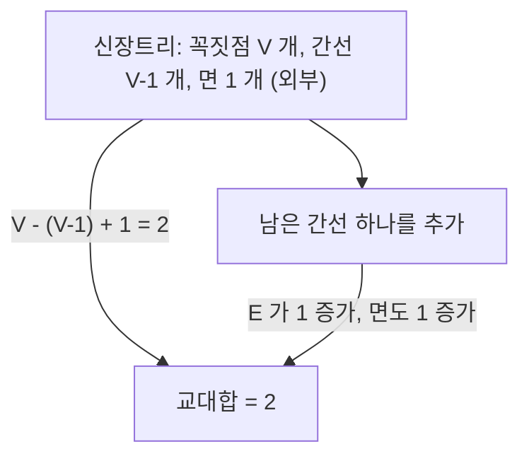

# Euler 지표

# 개요

Euler 지표는 도형을 조각으로 나누었을 때 조각 수의 교대합으로 정의되는 정수다. 평면에 그린 연결 그래프에서는 꼭짓점 수에서 간선 수를 빼고 면 수를 더하면 항상 2가 되고, 볼록다면체는 모두 이 값을 가진다. 놀라운 점은 이 값이 어떻게 쪼갰는지에 무관하다는 것, 즉 위상 불변량이라는 것이다. [단체 호몰로지](homology.md)의 언어로는 Betti 수의 교대합과 같고, 곡률의 총합과도 일치한다(Gauss–Bonnet). 정다면체가 정확히 다섯 개라는 사실이 이 한 등식에서 나온다.

# 직관

한 덩어리의 지도를 생각하자. 나라(면), 국경선(간선), 국경이 만나는 점(꼭짓점)을 센다. 국경선을 하나 더 그으면 나라가 하나 늘거나(그 선이 고리를 만들 때), 아니면 새 꼭짓점이 하나 늘어난다(막다른 선을 붙일 때). 어느 경우든 더하고 빼는 양이 상쇄되어 교대합은 변하지 않는다.



즉 그래프를 신장트리까지 줄여 놓고 값을 확인한 뒤, 간선을 되돌려 붙이며 값이 보존됨을 보는 것이 증명의 골격이다. 같은 불변성이 삼각화를 세분해도, 면을 합쳐도 유지된다.

# 정의

## 조합적 정의

K를 유한 [단체복합체](homology.md)라 하고 m_n을 n차원 단체의 개수라 하자. Euler 지표는 다음 교대합이다.

$$
\chi(K)=\sum_{n\ge 0}(-1)^{n}m_n=m_0-m_1+m_2-m_3+\cdots
$$

2차원에서 꼭짓점·간선·면의 개수를 V, E, F로 쓰면 다음과 같다.

$$
\chi=V-E+F
$$

이 정의는 삼각형보다 일반적인 다각형 조각(CW 분할)으로 나누어도 같은 값을 준다.

## 호몰로지적 정의

β_n을 n번째 Betti 수라 하면 다음이 성립한다[^1].

$$
\chi(K)=\sum_{n\ge 0}(-1)^{n}\beta_n
$$

오른쪽은 쪼개는 방식에 전혀 의존하지 않으므로, 이 등식이 곧 왼쪽의 불변성을 증명한다. 증명은 각 차원에서 rank를 세는 계산이다. m_n은 n-사슬군의 rank이고 rank는 핵과 상으로 분해되므로

$$
m_n=\operatorname{rank}\ker\partial_n+\operatorname{rank}\operatorname{im}\partial_n,\qquad
\beta_n=\operatorname{rank}\ker\partial_n-\operatorname{rank}\operatorname{im}\partial_{n+1}
$$

이고, 교대합을 취하면 상의 rank들이 인접 항끼리 상쇄된다.

# 성질

## 평면 그래프의 Euler 공식

G를 평면에 교차 없이 그린 연결 [그래프](graphs.md)라 하고, 그림이 평면을 나눈 영역(외부 무한 영역 포함)의 개수를 F라 하자. 그러면 다음이 성립한다.

$$
V-E+F=2
$$

증명. G의 신장트리 T를 잡는다([최소 신장트리](minimum-spanning-tree.md)). T는 간선이 V-1개이고 고리가 없으므로 평면을 나누지 않아 면이 1개다. 따라서 교대합은 V-(V-1)+1=2다. 이제 G의 남은 간선을 하나씩 T에 되돌려 넣는다. 각 간선은 이미 연결된 두 점을 잇기 때문에 새 고리를 만들고, 어떤 면 하나를 정확히 둘로 나눈다. 그러므로 E와 F가 동시에 1씩 늘어 교대합이 보존된다. 남은 간선을 모두 넣으면 G가 되고 값은 여전히 2다.

연결이 아니면 성립하지 않는다. 연결성분이 c개면 V-E+F=1+c다.

## 볼록다면체

볼록다면체의 표면은 2차원 구면과 위상동형이고, 한 면의 내부에서 사영하면 평면 그래프가 되므로 Euler 공식이 그대로 적용된다. 정사면체는 4-6+4, 정육면체는 8-12+6, 정십이면체는 20-30+12로 모두 2다.

## 정다면체가 다섯 개뿐인 이유

각 면이 정p각형이고 각 꼭짓점에 q개의 면이 모이는 볼록다면체를 생각하자. 면마다 변이 p개이고 각 변은 두 면이 공유하므로, 또 꼭짓점마다 간선이 q개이고 각 간선은 두 꼭짓점을 잇으므로 다음이 성립한다.

$$
pF=2E=qV
$$

이를 Euler 공식에 대입한다.

$$
\frac{2E}{q}-E+\frac{2E}{p}=2\ \Longrightarrow\ E\left(\frac{2}{p}+\frac{2}{q}-1\right)=2
$$

E가 양수이므로 왼쪽 괄호가 양수여야 하고, 조건은 다음과 같다[^2].

$$
\frac{1}{p}+\frac{1}{q}>\frac{1}{2},\qquad p\ge 3,\ q\ge 3
$$

p나 q가 6 이상이면 나머지가 3일 때조차 합이 1/2을 넘지 못하므로 두 값은 3, 4, 5로 제한되고, 정수해는 (3,3), (3,4), (4,3), (3,5), (5,3)의 다섯 개뿐이다. 각각 정사면체·정팔면체·정육면체·정이십면체·정십이면체이며, 이 조건은 존재의 필요조건일 뿐이므로 다섯 경우가 실제로 실현됨은 따로 구성해서 확인한다.

## 곡면의 분류

compact 연결 곡면은 구면, 원환면의 연결합, 실사영평면의 연결합 중 하나와 위상동형이다[^3]. Euler 지표는 다음과 같다.

$$
\chi=2-2g\ (\text{방향지음 가능, genus } g),\qquad \chi=2-k\ (\text{방향지음 불가능, 사영평면 } k \text{개})
$$

구면은 2, 원환면은 0, Klein 병은 0, 실사영평면은 1이다. 방향지음 가능 여부와 Euler 지표라는 두 정보가 compact 연결 곡면을 완전히 분류한다. 위상 불변량만으로 분류가 끝나는 드문 경우다. 원환면의 Betti 수 1, 2, 1로 교대합을 계산해도 1-2+1=0이 나와 조합적 계산과 일치한다.

## 곱과 합의 규칙

$$
\chi(X\times Y)=\chi(X)\,\chi(Y),\qquad \chi(X\cup Y)=\chi(X)+\chi(Y)-\chi(X\cap Y)
$$

두 번째 식은 두 조각이 부분복합체로 맞물릴 때 성립하며, [포함배제](inclusion-exclusion.md)의 위상판이다. 원의 지표가 0이므로 곱 규칙에서 원환면의 지표가 0임이 바로 나온다.

## Gauss–Bonnet

compact 방향지음 가능 곡면에서 Gauss 곡률의 총합은 Euler 지표로 결정된다([곡률](curvature.md)).

$$
\iint_{M}K\,dA=2\pi\chi(M)
$$

기하적으로 자유로운 양인 곡률의 적분이 순수하게 위상적인 정수로 고정된다. 다면체판에서는 각 꼭짓점의 각도 결손(2π에서 그 꼭짓점에 모인 면각의 합을 뺀 값)을 모두 더하면 2π의 χ배가 된다(Descartes의 결손 정리).

# 활용

- 평면성 판정의 상한: 평면 단순그래프는 V가 3 이상일 때 E가 3V-6 이하다. 각 면이 최소 3개의 간선으로 둘러싸이고 각 간선이 두 면에 속하므로 2E가 3F 이상이고, 이를 Euler 공식에 대입하면 얻어진다. 완전그래프 K5는 V=5, E=10으로 이를 위반하므로 평면그래프가 아니다.
- 지도 색칠: 위 상한에서 차수가 5 이하인 꼭짓점이 반드시 존재함이 따르고, 이것이 5색 정리 증명의 출발점이다.
- 메쉬 처리: 삼각망의 V, E, F에서 지표를 계산해 구멍의 개수를 추정하고 위상 오류를 검출한다. 닫힌 삼각망에서는 2E=3F이므로 지표가 V-F/2로 계산된다.
- 조합론: 교대합으로 불변량을 얻는 논법은 [포함배제](inclusion-exclusion.md)와 [생성함수](generating-functions.md)에서 반복되며, 지표는 그 위상적 대응물이다.

```python
# 정다면체 열거: 1/p + 1/q > 1/2 의 정수해
for p in range(3, 8):
    for q in range(3, 8):
        if 1 / p + 1 / q > 0.5:
            E = 2 / (2 / p + 2 / q - 1)
            V, F = 2 * E / q, 2 * E / p
            print(p, q, int(V), int(E), int(F), int(V - E + F))
# 3 3 -> 4 6 4 2 | 3 4 -> 6 12 8 2 | 3 5 -> 12 30 20 2
# 4 3 -> 8 12 6 2 | 5 3 -> 20 30 12 2
```

[^1]: 삼각화의 단체 개수 교대합이 Betti 수의 교대합과 같다는 진술. J. R. Munkres, *Elements of Algebraic Topology*, §22. 요약: "Euler characteristic", Schools Wikipedia. https://landsurvival.com/schools-wikipedia/wp/e/Euler_characteristic.htm
[^2]: 정다면체 다섯 개의 분류를 Euler 공식과 pF=2E=qV에서 얻는 논법. Wolfram MathWorld, "Platonic Solid". https://mathworld.wolfram.com/PlatonicSolid.html
[^3]: compact 연결 곡면의 분류와 genus g 방향지음 가능 곡면의 지표가 2-2g라는 사실. Wolfram MathWorld, "Surface Classification Theorem". https://mathworld.wolfram.com/SurfaceClassificationTheorem.html

# 연관 문서

## 선수지식

- [그래프](graphs.md)
- [단체 호몰로지](homology.md)

## 더 알아보기

- [평면 그래프](planar-graphs.md)
- [곡면의 분류](classification-of-surfaces.md)
- [Gauss–Bonnet 정리](gauss-bonnet.md)

#topology
