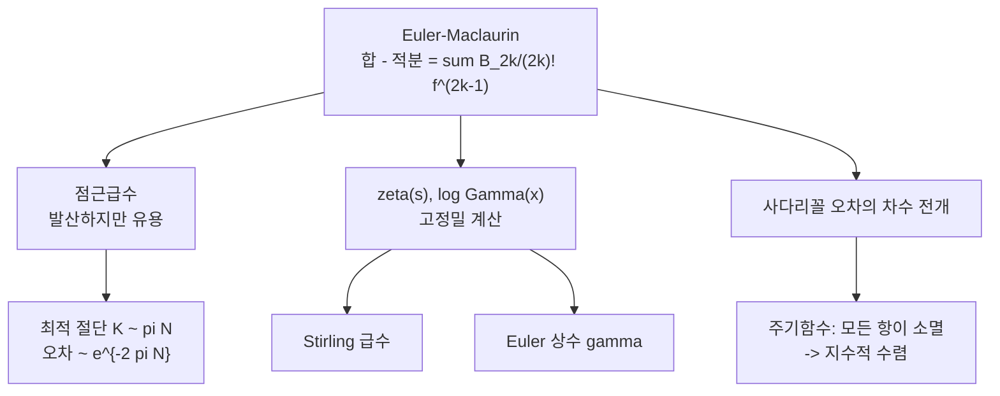

# Euler–Maclaurin 공식과 점근급수

# 개요

합과 적분은 둘 다 "다 더한다" 는 조작이지만 정확히 같지는 않다. Euler–Maclaurin 공식은 그 **차이를 완전히 전개한다**.

$$
\sum_{a=M}^{N}f(a)
=\int_M^{N}f(x)\,dx+\frac{f(M)+f(N)}2
+\sum_{k=1}^{K}\frac{B_{2k}}{(2k)!}\Big(f^{(2k-1)}(N)-f^{(2k-1)}(M)\Big)+R_K
$$

계수로 나오는 것이 [Bernoulli 수](bernoulli-numbers.md)다. 이 공식은 방향에 따라 두 가지로 읽힌다.

- **합 $\to$ 적분.** 유한합이나 급수의 꼬리를 적분과 몇 개의 보정항으로 바꾼다. $\zeta(s)$ 나 $\log\Gamma(x)$ 의 고정밀 계산, Stirling 급수가 전부 이 방향이다.
- **적분 $\to$ 합.** 사다리꼴 규칙의 오차를 차수별로 분해한다. 왜 주기함수에서는 사다리꼴이 갑자기 지수적으로 정확해지는지가 여기서 설명된다.

그런데 $K\to\infty$ 로 보내면 우변의 급수는 거의 언제나 **발산한다**. 수렴하지 않는 급수가 어떻게 20 자리 계산을 주는가. 이 물음의 답이 **점근급수**이고, Euler–Maclaurin 은 그 개념의 원형이다. 유한한 $K$ 에서 끊으면 오차는 $K$ 를 늘릴수록 줄다가 어느 지점에서 최소를 찍고 다시 늘어난다. 최소값은 $e^{-2\pi N}$ 규모이고, **그 최적점이 이 공식이 줄 수 있는 정확도의 한계**다.

# 직관

## 사다리꼴의 오차를 되풀이해 고친다

한 칸 $[0,1]$ 에서 시작한다. $B_1(x)=x-\tfrac12$ 로 [부분적분](fundamental-calculus.md)을 하면

$$
\frac{f(0)+f(1)}2-\int_0^1 f(x)\,dx=\int_0^1 B_1(x)f'(x)\,dx
$$

좌변은 사다리꼴 규칙의 오차다. 우변을 다시 부분적분한다. $B_1=\tfrac12 B_2'$ 이고 $B_2(0)=B_2(1)=B_2$ 이므로

$$
\int_0^1 B_1f'=\frac{B_2}{2}\big(f'(1)-f'(0)\big)-\frac12\int_0^1 B_2(x)f''(x)\,dx
$$

첫 항이 $\tfrac1{12}(f'(1)-f'(0))$ 곧 사다리꼴 오차의 주항이다. 남은 적분을 또 부분적분하면 다음 보정이 나온다. **Euler–Maclaurin 은 이 되풀이를 끝까지 적어 놓은 것**이고, 각 단계에서 튀어나오는 상수가 $B_2,B_4,B_6,\dots$ 다.

## 톱니파가 계수를 만든다

칸을 이어 붙이면 $B_n(x)$ 대신 주기 1 로 반복되는 $\tilde B_n(x)=B_n(\lbrace x\rbrace)$ 가 들어온다. $\tilde B_1$ 은 톱니파고, 높은 $n$ 일수록 매끄러운 주기함수다. 실은

$$
\tilde B_n(x)=-\frac{n!}{(2\pi i)^{n}}\sum_{m\ne0}\frac{e^{2\pi imx}}{m^{n}}
$$

이므로 **Euler–Maclaurin 의 계수는 정수격자의 [Fourier 급수](fourier-series.md)를 차수별로 푼 것**이다. 이 식에 $x=0$ 과 $n=2k$ 를 넣으면 $B_{2k}$ 와 $\zeta(2k)$ 의 관계가 그대로 나온다.

$$
\frac{|B_{2k}|}{(2k)!}=\frac{2\zeta(2k)}{(2\pi)^{2k}}\ \approx\ \frac{2}{(2\pi)^{2k}}
$$

이 한 줄이 뒤에 나올 모든 오차 평가의 뼈대다. 그리고 $n\ge3$ 이 홀수면 $B_n=0$ 이므로 보정항에는 **홀수 계 도함수만** 나타난다. 짝수 쪽이 사라지는 것은 톱니파의 대칭성 때문이다.

## 왜 발산하는가

항의 크기는 $\dfrac{2}{(2\pi)^{2k}}\big|f^{(2k-1)}(N)-f^{(2k-1)}(M)\big|$ 정도다. 앞의 인자는 기하급수적으로 작아지지만, **고계 도함수는 보통 계승 속도로 커진다**. $f(x)=x^{-s}$ 면 $f^{(2k-1)}$ 에 $(2k-2)!$ 가 붙는다. 계승은 어떤 기하급수도 이기므로 항은 결국 커지고 급수의 수렴반경은 0 이다.

$$
\text{항}_k\ \approx\ \frac{2\,(2k-2)!}{(2\pi N)^{2k}}\cdot N\ \longrightarrow\ \infty
$$

다만 처음 한동안은 $(2k-2)!$ 가 $(2\pi N)^{2k}$ 를 이기지 못한다. 두 힘이 맞서다 역전되는 지점이 있고, 항이 최소가 되는 곳은 $2k\approx 2\pi N$ 곧 $k\approx\pi N$ 이다. 그때 항의 크기가 $e^{-2\pi N}$ 규모다. **급수를 거기서 끊으면 그것이 얻을 수 있는 최선**이고, 더 더하면 오히려 나빠진다.

이것은 [멱급수](power-series.md)와 정반대의 태도다. 멱급수는 "다 더해야 값" 이지만 점근급수는 "적당히 끊어야 값" 이다. 수렴하는 급수가 없는 자리에서 정확도를 얻는 대신, 정확도의 상한을 받아들이는 거래다.



# 정의

## 주기 Bernoulli 함수

Bernoulli 다항식 $B_n(x)$ 를 주기 1 로 반복시킨 것을

$$
\tilde B_n(x)=B_n(x-\lfloor x\rfloor)
$$

로 둔다. $n\ge2$ 면 $B_n(0)=B_n(1)=B_n$ 이므로 $\tilde B_n$ 은 연속이고, $\tilde B_1$ 만 정수점에서 튄다. 기본 성질은 $B_n'(x)=nB_{n-1}(x)$ 와 $n\ge1$ 일 때의 $\int_0^1 B_n(x)\thinspace dx=0$ 둘이다.

## Euler–Maclaurin 공식

$M<N$ 이 정수이고 $f$ 가 $[M,N]$ 에서 $2K$ 번 연속미분가능하면

$$
\sum_{a=M}^{N}f(a)
=\int_M^{N}f+\frac{f(M)+f(N)}2
+\sum_{k=1}^{K}\frac{B_{2k}}{(2k)!}\Big(f^{(2k-1)}(N)-f^{(2k-1)}(M)\Big)+R_K
$$

$$
R_K=-\frac1{(2K)!}\int_M^{N}\tilde B_{2K}(x)\,f^{(2K)}(x)\,dx
$$

**나머지항이 명시적 적분으로 주어진다는 점**이 이 공식의 힘이다. 급수가 발산하더라도 각 $K$ 마다 등식이 정확하므로, 오차를 추정하는 것이 아니라 계산할 수 있다.

## 점근전개

함수 $f$ 와 형식적 급수 $\sum_{n\ge0}a_nx^{-n}$ 에 대해

$$
f(x)\sim\sum_{n\ge0}\frac{a_n}{x^{n}}\quad(x\to\infty)
\iff
\forall N:\ f(x)-\sum_{n=0}^{N}\frac{a_n}{x^{n}}=o\!\left(x^{-N}\right)
$$

이면 우변을 $f$ 의 **점근전개**라 한다(Poincaré). 조건은 $N$ 을 고정하고 $x\to\infty$ 로 보내는 것이지 $x$ 를 고정하고 $N\to\infty$ 로 보내는 것이 아니다. 이 순서를 바꾸지 않는 것이 점근급수를 다루는 유일한 규칙이라고 해도 된다.

# 성질

## 나머지항의 크기

$\tilde B_{2K}$ 의 최대값이 끝점에서 나오므로 $\max_x|\tilde B_{2K}(x)|=|B_{2K}|$ 이고

$$
|R_K|\le\frac{|B_{2K}|}{(2K)!}\int_M^{N}\big|f^{(2K)}(x)\big|\,dx
=\frac{2\zeta(2K)}{(2\pi)^{2K}}\int_M^{N}\big|f^{(2K)}\big|
$$

여기서 $f^{(2K)}$ 가 구간에서 **부호를 바꾸지 않으면** $\int|f^{(2K)}|=|f^{(2K-1)}(N)-f^{(2K-1)}(M)|$ 이므로, 우변이 곧 급수의 다음 항의 크기다.

> **나머지는 첫 번째로 버린 항보다 크지 않다.**

교대급수에서 익숙한 성질이 여기서도 성립한다. $f=x^{-s},\ f=\log x,\ f=e^{-x}$ 처럼 실제로 쓰는 함수는 대부분 도함수의 부호가 일정하므로 이 판정을 그대로 쓸 수 있다. **계산 중에 다음 항을 하나 더 만들어 보는 것이 곧 오차 막대**다.

## 최적 절단과 초점근 정확도

항의 크기 $t_k\approx 2(2k-2)!\thinspace(2\pi N)^{-2k}N$ 에서 $t_{k+1}/t_k\approx (2k)(2k-1)/(2\pi N)^2$ 이므로 비가 1 이 되는 곳이

$$
k^{*}\approx\pi N,\qquad t_{k^{*}}\ \sim\ e^{-2\pi N}
$$

이다. $N$ 을 두 배로 늘리면 지수가 두 배가 되므로, 정확도를 올리는 정상적인 방법은 급수를 더 더하는 것이 아니라 **$N$ 을 키우는 것**이다. 뒤의 코드가 $N=4$ 에서 $K\approx12$ 일 때 오차 $3.8\times10^{-11}$ 을 얻는데, $e^{-8\pi}=1.2\times10^{-11}$ 과 규모가 맞는다.

## 점근급수는 함수를 결정하지 않는다

점근전개의 계수는 $f$ 로부터 유일하게 정해진다. $a_0=\lim f$ 와 $a_1=\lim x(f-a_0)$ 처럼 차례로 뽑으면 된다. 그러나 **역은 성립하지 않는다**.

$$
e^{-x}\sim 0+\frac0x+\frac0{x^{2}}+\cdots\quad(x\to\infty)
$$

이므로 $f$ 와 $f+e^{-x}$ 는 같은 점근전개를 갖는다. 전개가 놓치는 $e^{-x}$ 같은 항을 **지수적으로 작은 항**이라 부르고, 정확히 이것이 최적 절단에서 남는 오차 $e^{-2\pi N}$ 의 정체다. 점근급수에서 이런 항을 되살리는 이론이 [Stokes 현상과 재합산](stokes-phenomenon.md)이며, 출발점은 언제나 Euler–Maclaurin 형태의 나머지항 적분이다.

## 주기함수에서는 모든 항이 사라진다

$f$ 가 주기 $N-M$ 인 매끄러운 함수면 모든 $k$ 에 대해 $f^{(2k-1)}(N)=f^{(2k-1)}(M)$ 이므로 보정항이 전부 0 이 된다. 남는 것은 나머지항뿐이고,

$$
\text{사다리꼴 오차}=R_K=O\!\left(h^{2K}\right)\quad\text{모든 }K
$$

곧 **오차가 모든 차수보다 빨리 감소한다**. $f$ 가 해석적이면 실제 감소는 지수적이다. 사다리꼴 규칙은 일반적으로 2 차 정확도밖에 없는 가장 조잡한 수치적분인데, 주기함수 위에서는 어떤 고차 공식보다 낫다. 이것이 [Fourier](fourier.md) 계산과 격자합에서 사다리꼴이 표준인 이유다.

```python
# 주기 해석함수에서 사다리꼴은 지수적으로 수렴한다
from math import exp, cos, pi, factorial
f = lambda t: exp(cos(t))
trap = lambda n: sum(f(2 * pi * j / n) for j in range(n)) * (2 * pi / n)
true = 2 * pi * sum(0.25 ** k / factorial(k) ** 2 for k in range(30))   # 2 pi I_0(1)

for n in (4, 6, 8, 10, 12, 16):
    print(n, "%.1e" % abs(trap(n) - true))
# 4 3.4e-02 / 6 2.8e-04 / 8 1.3e-06 / 10 3.5e-09 / 12 6.5e-12 / 16 0.0e+00
```

# 활용

## $\zeta(s)$ 의 고정밀 계산

급수 $\sum n^{-s}$ 는 $s$ 가 1 에 가까우면 쓸모없을 만큼 느리고 $\operatorname{Re}s\le1$ 에서는 아예 발산한다. 앞의 $N-1$ 항만 직접 더하고 **꼬리를 Euler–Maclaurin 으로 바꾸면** 두 문제가 한꺼번에 풀린다.

$$
\zeta(s)=\sum_{n=1}^{N-1}\frac1{n^{s}}
+\frac{N^{1-s}}{s-1}+\frac1{2N^{s}}
+\sum_{k=1}^{K}\frac{B_{2k}}{(2k)!}\,\frac{\Gamma(s+2k-1)}{\Gamma(s)}\,N^{-s-2k+1}+R_K
$$

우변은 $s=1$ 의 극점만 빼면 **$s$ 의 정칙함수로 그대로 정의되므로**, 이 식 자체가 $\zeta$ 의 해석적 연속이기도 하다. $\zeta(-1)=-\tfrac1{12}$ 같은 값도 같은 코드로 나온다.

```python
from fractions import Fraction as F
from math import comb, factorial, pi

M = 40                                              # Bernoulli 수 준비
B = [F(0)] * (M + 1); B[0] = F(1)
for n in range(1, M + 1):
    B[n] = -sum(comb(n + 1, k) * B[k] for k in range(n)) / F(n + 1)

def zeta(s, N=10, K=8):
    t = sum(n ** (-s) for n in range(1, N)) + N ** (1.0 - s) / (s - 1.0) + 0.5 * N ** (-s)
    for k in range(1, K + 1):
        poch = 1.0                                  # s(s+1)...(s+2k-2)
        for j in range(2 * k - 1):
            poch *= s + j
        t += float(B[2 * k]) / factorial(2 * k) * poch * N ** (-s - 2 * k + 1)
    return t

print(zeta(2.0) - pi * pi / 6)      # 0.0        <- 배정밀도 한계까지 일치
print(zeta(0.5))                    # -1.4603545088095877   (임계선 왼쪽)
print(zeta(-1.0))                   # -0.0833333333333333   = -1/12

for K in range(1, 20):              # N=4 고정, K 를 늘리면 최소를 찍고 되돌아선다
    print(K, "%.1e" % abs(zeta(2.0, N=4, K=K) - pi * pi / 6))
# 1 3.1e-05 ... 11 3.9e-11  12 3.8e-11  13 4.2e-11 ... 19 1.1e-09
```

마지막 표가 점근급수의 성격을 그대로 보여 준다. $K=12$ 근처에서 최소이고 이론값 $k^{*}\approx\pi N=12.6$ 과 맞으며, 최소 오차는 $e^{-8\pi}$ 규모다. **$K$ 를 더 키우는 것은 손해**다.

## Stirling 급수

$f=\log x$ 에 공식을 적용하면 $\log n!$ 의 전개가 나온다. 정수를 벗어나 [감마 함수](gamma-function.md)로 쓰면

$$
\log\Gamma(x)=\Big(x-\tfrac12\Big)\log x-x+\tfrac12\log2\pi
+\sum_{k=1}^{K}\frac{B_{2k}}{2k(2k-1)\,x^{2k-1}}+R_K
$$

$\tfrac12\log2\pi$ 만 Euler–Maclaurin 이 주지 못하고 Wallis 곱이나 [유수 계산](residue-theorem.md)으로 따로 정한다. 적분상수가 공식 바깥에서 와야 한다는 점은 점근전개의 일반적인 사정이다. 여기서도 최적 절단은 $k^{*}\approx\pi x$ 이고 최소 오차는 $e^{-2\pi x}$ 이며, $x$ 가 작으면 $\Gamma(x+m)$ 으로 올린 뒤 되돌리는 식으로 $x$ 를 키워 쓴다.

## Euler 상수

$f=1/x$ 로 두면

$$
\sum_{a=1}^{n}\frac1a=\log n+\gamma+\frac1{2n}-\sum_{k=1}^{K}\frac{B_{2k}}{2k\,n^{2k}}+R_K
$$

$\gamma$ 는 공식이 만들어 내는 적분상수이고, 이 식이 곧 $\gamma$ 를 고정밀로 얻는 표준 방법이다. $n=10$ 과 $K=6$ 만으로 이미 $10^{-15}$ 까지 맞는다. 조화수가 $\log n$ 에서 얼마나 벗어나는지를 **모든 차수로 답하는 것**이 이 전개다.

## 격자합과 이산화 오차

물리와 수치해석에서 격자 위의 합을 적분으로 바꿀 때 생기는 보정이 모두 이 공식이다. 격자 간격 $h$ 로 쓰면 보정항은 $h^{2k}$ 의 급수가 되고, 이를 이용해 낮은 차수 항을 소거하는 것이 Richardson 외삽과 Romberg 적분이다. 반대로 경계에서 도함수가 일치하는 상황—주기 경계, 급감쇠 함수, 변수변환으로 끝을 눌러 놓은 tanh–sinh 구적법—에서는 보정항이 통째로 사라져 지수적 정확도가 나온다. **어디에 오차가 있는지를 경계항으로 국소화하는 것**이 Euler–Maclaurin 의 실질적 쓸모다.[^1]

[^1]: 표준 참고는 N. G. de Bruijn, *Asymptotic Methods in Analysis* 3 장과 R. L. Graham, D. E. Knuth, O. Patashnik, *Concrete Mathematics* 9.5 절. $\zeta$ 의 Euler–Maclaurin 계산은 H. Cohen, *Number Theory II: Analytic and Modern Tools* 10.3 절에 정리되어 있다. 본문의 수치는 모두 직접 실행해 확인했다.

# 연관 문서

## 선수지식

- [Bernoulli 수와 von Staudt–Clausen 정리](bernoulli-numbers.md)

## 더 알아보기

- [감마 함수와 Stirling 근사](gamma-function.md)
- [Poisson 합 공식](poisson-summation.md)

#analysis #computation #number_theory
