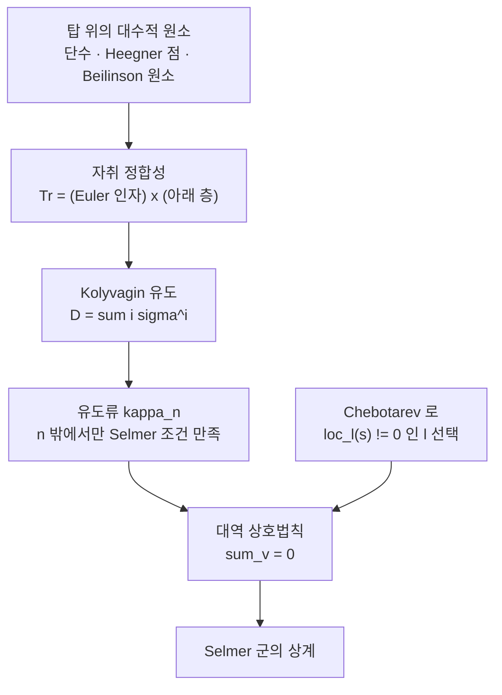

# Euler 계와 Kolyvagin 유도류

# 개요

[Selmer 군](selmer-groups.md)은 계산되는 군이지만 순위에 대해 **상한**만 준다. 실제 순위를 확정하려면 반대 방향, 곧 "Selmer 군이 생각보다 작다" 를 증명해야 하는데 이쪽은 원리적으로 어렵다. Selmer 군은 국소 조건으로 잘라낸 부분군이라 정의상 "무엇이 들어 있지 않은가" 를 말해 주지 않기 때문이다.

**Euler 계**는 이 방향을 뚫는 거의 유일한 도구다. 착상은 한 문장이다.

> 대역 코호몰로지 류 하나는 Selmer 군 위에 선형 방정식 한 줄을 부과한다. 방정식을 충분히 모으면 군이 죽는다.

방정식의 출처는 대역 상호법칙이다. [유체론](class-field-theory.md)의 핵심 진술인 "국소 불변량의 합은 0" 이 코호몰로지 판으로 올라가면, 두 대역류의 국소 짝들이 자리마다 나타나 합이 0 이라는 항등식이 된다. 대역류 $c$ 를 하나 쥐고 있으면 미지의 Selmer 원소 $s$ 에 대해

$$
\sum_v \big\langle \mathrm{loc}_v(c),\ \mathrm{loc}_v(s)\big\rangle_v=0
$$

이 성립하고, 오른쪽 항 대부분이 자동으로 0 이 되도록 $c$ 를 고르면 남은 한 항이 $s$ 의 국소 성분을 강제로 0 으로 만든다. 그런 $c$ 를 원하는 자리마다 하나씩 공급하는 장치가 Euler 계다.

문제는 그런 류를 만드는 일이다. Euler 계의 정의는 만들기 쉬운 대상 — 수체의 탑 위에 얹힌 대수적 원소들 — 이 **자취 정합성**을 만족하기만 하면 되도록 짜여 있고, 자취 관계에서 실제로 필요한 류를 뽑아내는 것이 **Kolyvagin 유도 연산자**다. [Heegner 점](heegner-points.md)의 족이 이 도식의 원형이며, 거기서 나오는 결론이 해석적 순위 $\le1$ 인 [BSD](birch-swinnerton-dyer.md) 다.

# 직관

## Selmer 군에는 방정식이 없다

$\mathrm{Sel}_p(E/K)\subset H^1(K,E[p])$ 는 "모든 자리에서 국소 조건을 만족하는 류" 로 정의된다. 이런 정의는 원소를 **거르는** 데는 좋지만 원소가 **없다** 를 보이는 데는 무력하다. 조건을 다 통과한 류가 정말 있는지는 다른 정보가 있어야 안다.

비유하자면 Selmer 군은 부등식으로만 주어진 볼록집합이다. 유한 개의 선형 방정식을 더하면 차원이 떨어진다. Euler 계가 하는 일이 바로 그 방정식을 공급하는 것인데, 방정식은 공짜로 얻어지지 않고 **대역적으로 존재하는 코호몰로지 류**에서만 나온다. 그러니 "대수적으로 만들 수 있는 류가 몇 개나 있는가" 가 곧 "Selmer 군을 얼마나 누를 수 있는가" 다.

## 쓸모 있는 류는 Selmer 안에 있으면 안 된다

상호법칙의 항등식 $\sum_v\langle \mathrm{loc}_v c,\mathrm{loc}_v s\rangle_v=0$ 에서 $c$ 와 $s$ 가 모두 Selmer 군에 있으면 모든 항이 0 이다. Selmer 조건이 국소 짝에 대해 자기쌍대이기 때문이다. 즉 **Selmer 군 안의 류는 아무 정보도 주지 않는다.**

필요한 것은 딱 한 자리 $\ell$ 에서만 조건을 어기는 류다. 그러면 항등식이

$$
\big\langle \mathrm{loc}_\ell(c),\ \mathrm{loc}_\ell(s)\big\rangle_\ell=0
$$

하나로 줄고, $\mathrm{loc}\_\ell(c)\ne0$ 이면 $\mathrm{loc}\_\ell(s)$ 가 그 짝에 대해 직교하도록 강제된다. $\ell$ 자리의 국소 코호몰로지가 $p$ 위에서 2 차원이고 두 조각이 서로 소멸자이므로, 이 직교성은 $\mathrm{loc}\_\ell(s)=0$ 을 뜻한다. 여기에 [Chebotarev](chebotarev.md) 를 써서 $\mathrm{loc}\_\ell(s)\ne0$ 인 $\ell$ 을 미리 골라 두면 모순이 나고 $s=0$ 이 된다.

그러므로 Euler 계 논법의 전부는 **"한 자리에서만 어긋난 대역류를, 자리를 마음대로 골라 가며 만들어 내는 일"** 이다.

## 자취 정합성에서 어긋난 류를 만든다

자연에서 얻어지는 대수적 원소들은 보통 Selmer 조건을 잘 만족한다. 순환체의 단수 $1-\zeta_n$ 과 타원곡선의 Heegner 점 $y_n$ 과 모듈러 곡선의 Beilinson 원소 — 전부 대역적으로 존재하는 진짜 원소라서 어긋난 곳이 없다. 그대로는 쓸모가 없다.

돌파구는 이 원소들이 탑 위에서 **자취로 이어져 있다**는 사실이다. Heegner 점이라면

$$
\mathrm{Tr}_{K_{n\ell}/K_n}\big(y_{n\ell}\big)=a_\ell\,y_n
$$

이다. 자취가 Hecke 고유값이라는 숫자로 떨어진다는 점이 결정적이다. $p\mid a_\ell$ 인 소수 $\ell$ 을 고르면 자취가 $p$ 를 법으로 **0** 이 되고, 그 순간 $y_{n\ell}$ 은 "자취가 사라지는 원소" 가 된다. 자취가 0 인 원소에는 군환에서 나눗셈 비슷한 조작이 가능해지고, 그 조작의 결과가 어긋난 류다.

## 유도 연산자의 정체는 텔레스코핑이다

$G=\langle\sigma\rangle$ 가 위수 $m$ 인 순환군이라 하자. 군환 $\mathbb Z[G]$ 안에서

$$
D=\sum_{i=1}^{m-1} i\,\sigma^{i},\qquad N=\sum_{i=0}^{m-1}\sigma^{i}
$$

로 두면 다음 항등식이 성립한다.

$$
(\sigma-1)\,D\;=\;m-N
$$

증명은 지수를 한 칸 밀어 상쇄시키는 것뿐이다. 이 한 줄이 Kolyvagin 유도의 전부다. 점 $y$ 에 $D$ 를 씌우고 $\sigma-1$ 을 먹이면

$$
(\sigma-1)Dy=m\,y-Ny=m\,y-\mathrm{Tr}(y)
$$

이므로, $p\mid m$ 이고 $p\mid \mathrm{Tr}(y)$ 이면 $(\sigma-1)Dy\in p\thinspace E(K_\ell)$ 이다. 곧 $Dy$ 는 $p$ 를 법으로 **Galois 불변**이 된다. 대역 불변이라는 성질이 코호몰로지 류로 내려가는 통로를 열어 준다.

$m=\ell+1$ 이 $p$ 로 나뉘고 $a_\ell$ 이 $p$ 로 나뉘는 소수 $\ell$ — 이것이 **Kolyvagin 소수**의 두 조건이다. 조건이 두 개인 이유가 항등식의 두 항에 정확히 대응한다.

```python
# (sigma - 1) D = m - N  을 Z[G]/(sigma^m - 1) 에서 직접 확인한다
def check(m):
    D = [0] * m                       # D = sum_{i=1}^{m-1} i sigma^i
    for i in range(1, m):
        D[i] = i

    out = [0] * m                     # (sigma - 1) D
    for i in range(m):
        out[(i + 1) % m] += D[i]
        out[i] -= D[i]

    want = [-1] * m                   # m - N,  N = sum_j sigma^j
    want[0] += m
    return out == want

assert all(check(m) for m in range(2, 50))
```

## 왜 "Euler" 라는 이름인가

자취 관계에 나타나는 계수는 우연한 숫자가 아니다. 일반적인 형태는

$$
\mathrm{Tr}_{K(n\ell)/K(n)}\big(c_{n\ell}\big)=P_\ell\!\left(\mathrm{Fr}_\ell^{-1}\right)\,c_n,
\qquad
P_\ell(x)=\det\!\left(1-\mathrm{Fr}_\ell\,x\ \middle|\ T^{*}\right)
$$

이고, $P_\ell$ 은 바로 그 표현의 $L$ 함수의 **$\ell$ 번째 Euler 인자**다. 즉 Euler 계란 $L$ 함수의 Euler 곱을 계수로 지니고 탑 위에 놓인 원소들의 열이다. $L$ 함수와 Selmer 군을 잇는 다리가 이 계수 안에 숨어 있고, 그래서 BSD 나 Iwasawa 주추측처럼 "해석적 양이 산술적 군을 제어한다" 는 진술의 증명이 여기서 나온다.



# 정의

## Euler 계

$K$ 를 수체, $T$ 를 $G_K$ 가 작용하는 유한생성 $\mathbb Z_p$ 가군이라 하자. $\mathcal N$ 을 적당한 조건을 만족하는 제곱없는 정수들의 집합, $K(n)/K$ 를 도체 $n$ 에 붙는 아벨 확대의 족이라 하자.

**정의.** 류의 족 $c=\lbrace c_n\rbrace_{n\in\mathcal N}$ 으로 $c_n\in H^1(K(n),T)$ 인 것이 **Euler 계**라는 것은 모든 $n$ 과 $\ell\nmid n$ 에 대해

$$
\mathrm{cor}_{K(n\ell)/K(n)}\big(c_{n\ell}\big)=P_\ell\!\left(\mathrm{Fr}_\ell^{-1}\right)c_n
$$

를 만족한다는 뜻이다. 여기서 $\mathrm{cor}$ 는 코제한(자취)이고 $P_\ell(x)=\det(1-\mathrm{Fr}_\ell x\mid T^{*})$ 다.

$T=\mathbb Z_p(1)$ 이면 $P_\ell(x)=1-x$ 이고 $H^1(K(n),\mathbb Z_p(1))$ 은 단수군의 완비화이므로, 순환체의 단수 $1-\zeta_n$ 이 이 정의를 만족한다. $T=T_pE$ 면 $P_\ell(x)=1-a_\ell x+\ell x^{2}$ 다.

## 반순환 변형: Heegner 점의 경우

[Heegner 점](heegner-points.md)의 자취 관계에는 $a_\ell$ 만 나타나고 $\ell x^{2}$ 항이 없다. 탑이 순환체가 아니라 허수이차체 $K$ 위의 **링 유체**, 곧 반순환 방향의 탑이기 때문이다. 이 방향에서는 $\ell$ 이 $K$ 에서 관성일 때 $\mathrm{Gal}(K_{n\ell}/K_n)$ 이 위수 $\ell+1$ 인 순환군이고, 자취 관계가 한 항으로 줄어든다.

이 변형을 Howard 는 **이분 Euler 계**(bipartite Euler system)라 불렀다. 자취 관계가 성립하는 층과 명시적 상호법칙이 성립하는 층이 번갈아 나타나는 구조여서, 순환체 위의 고전적 Euler 계와는 논법의 짜임이 다르다. 아래에서는 Kolyvagin 의 원래 경우를 따라간다.

## Kolyvagin 소수

$E/\mathbb Q$ 가 도체 $N$ 인 [타원곡선](elliptic-curves.md), $K$ 가 Heegner 가정을 만족하는 허수이차체, $p$ 가 $E[p]$ 의 [Galois 표현](galois-representations.md)이 전사인 소수라 하자. 소수 $\ell$ 이 **Kolyvagin 소수**라는 것은

$$
\ell\nmid N\,p\,\mathrm{disc}(K),\qquad
\ell\ \text{은 }K\text{ 에서 관성},\qquad
p\mid \ell+1,\qquad p\mid a_\ell
$$

를 만족한다는 뜻이다. 마지막 두 조건은 $\mathrm{Fr}_\ell$ 이 $\mathbb Q(E[p],\mu_p)$ 위에서 복소켤레와 공액이라는 한 조건으로 묶인다. 그러므로 Chebotarev 에 의해 이런 $\ell$ 은 양의 밀도로 무한히 많고, **추가 조건을 붙여 가며 고를 수 있다.** 논법에서 실제로 쓰는 것은 이 선택의 자유다.

$n$ 을 Kolyvagin 소수들의 곱이라 하고 $K_n$ 을 도체 $n$ 의 링 유체, $G_n=\mathrm{Gal}(K_n/K_1)\cong\prod_{\ell\mid n}G_\ell$ 라 쓴다. $G_\ell$ 은 위수 $\ell+1$ 인 순환군이다.

## 유도류 $\kappa_n$

$G_\ell$ 의 생성원 $\sigma_\ell$ 에 대해 $D_\ell=\sum_{i=1}^{\ell}i\thinspace\sigma_\ell^{\thinspace i}$ 로 두고 $D_n=\prod_{\ell\mid n}D_\ell$ 라 하자. Heegner 점 $y_n\in E(K_n)$ 에 대해 다음이 성립한다.

- 앞의 텔레스코핑 항등식과 자취 관계에서 $D_n y_n$ 의 상은 $E(K_n)/pE(K_n)$ 안에서 $G_n$ 불변이다.
- $E[p]$ 가 기약이므로 $H^1(G_n,E(K_n)[p])=0$ 이고, 따라서 $D_n y_n$ 은 $E(K_1)/p$ 의 원소로 유일하게 내려온다. 다시 $K_1/K$ 로 내려 $\mathcal P_n\in E(K)/pE(K)$ 를 얻는다.
- Kummer 사상으로 $\mathcal P_n$ 을 보낸 것을 $\kappa_n\in H^1(K,E[p])$ 라 쓴다.

$n=1$ 이면 $\kappa_1$ 은 원래 Heegner 점 $y_K$ 의 Kummer 상이고 Selmer 군에 들어 있다. $n>1$ 일 때가 핵심이다.

## Selmer 구조와 국소 조건

각 자리 $v$ 에서 부분군 $H^1_{\mathcal F}(K_v,E[p])\subset H^1(K_v,E[p])$ 를 고르는 것을 **Selmer 구조**라 하고

$$
\mathrm{Sel}_{\mathcal F}(K,E[p])=\left\{\,s\in H^1(K,E[p])\ :\ \mathrm{loc}_v(s)\in H^1_{\mathcal F}(K_v,E[p])\ \ \forall v\,\right\}
$$

를 그 Selmer 군이라 한다. 표준 선택은 $H^1_f(K_v,E[p])=\mathrm{im}\big(E(K_v)/p\big)$ 이고 이때 Selmer 군이 보통의 $\mathrm{Sel}^p(E/K)$ 다.

Kolyvagin 소수 $\ell$ 에서는 $H^1(K_\lambda,E[p])$ 이 $\mathbb F_p$ 위 2 차원이고 두 개의 1 차원 부분공간으로 자연히 쪼개진다.

| 이름 | 기호 | 정체 |
|---|---|---|
| 유한부(비분기) | $H^1_f(K_\lambda,E[p])$ | $H^1(\mathrm{Fr}\_\lambda\text{ 불변})$ 이고 $E(K_\lambda)/p$ 의 상 |
| 특이부(가로지름) | $H^1_s(K_\lambda,E[p])$ | 몫 $H^1/H^1_f$ 이고 분기류의 잔여 |

$p\mid\ell+1$ 과 $p\mid a_\ell$ 이라는 조건 덕에 $E[p]$ 위의 $\mathrm{Fr}_\lambda$ 작용이 $\pm1$ 을 고윳값으로 갖고, 그래서 두 조각이 각각 1 차원이 된다. 국소 Tate 짝 $H^1_f\times H^1_s\to\mathbb F_p$ 는 완전 짝이다.

# 성질

## 유도류가 어디서 어긋나는가

$\kappa_n$ 의 국소 성분은 다음과 같다.

$$
\mathrm{loc}_v(\kappa_n)\in H^1_f(K_v,E[p])\quad(v\nmid n),\qquad
\mathrm{loc}_\ell(\kappa_n)\ \text{는 }\ell\mid n\text{ 에서 분기할 수 있다}
$$

즉 $\kappa_n$ 은 **$n$ 을 나누는 자리에서만** Selmer 조건을 어긴다. 이것이 유도 연산자를 쓴 대가이자 목적이다. $D_\ell$ 이 $\ell$ 자리에서 관성군을 건드리기 때문에 그 자리에서만 흔적이 남는다.

더 정확히는 두 개의 **명시적 상호법칙**이 성립한다.

$$
\mathrm{loc}_\ell^{\,f}(\kappa_{n\ell})\ \doteq\ \mathrm{loc}_\ell^{\,f}(\kappa_n)\ \text{의 정보},
\qquad
\mathrm{loc}_\ell^{\,s}(\kappa_{n\ell})\ \doteq\ \mathrm{loc}_\ell^{\,f}(\kappa_n)
$$

앞의 것을 제 1 상호법칙, 뒤의 것을 제 2 상호법칙이라 부른다. 요점은 **한 층 위의 류의 특이부가 한 층 아래 류의 유한부로 계산된다**는 것이다. 그래서 $\kappa_n$ 이 0 이 아닌 한 $\kappa_{n\ell}$ 의 특이부도 0 이 아니고, 귀납이 돌아간다.

## 대역 상호법칙

[Brauer 군](brauer-groups.md)과 [국소 유체론](local-class-field-theory.md)에서 본 "국소 불변량의 합은 0" 이 Poitou–Tate 완전열의 형태로 코호몰로지에 올라간다. $c,s\in H^1(K,E[p])$ 가 모두 대역류면

$$
\sum_v \big\langle \mathrm{loc}_v(c),\ \mathrm{loc}_v(s)\big\rangle_v=0
$$

이다. 합은 유한 개 항만 0 이 아니다. 이 항등식 하나가 Euler 계 논법의 유일한 대역 입력이며, 나머지는 전부 국소 계산과 Chebotarev 다.

## Kolyvagin 의 정리

**정리.** $E/\mathbb Q$ 가 모듈러이고 $K$ 가 Heegner 가정을 만족한다고 하자. Heegner 점 $y_K\in E(K)$ 가 무한위수이면

$$
\mathrm{rank}\,E(K)=1,\qquad \#\text{Ш}(E/K)<\infty
$$

이다.

**증명의 뼈대.** $s\in \mathrm{Sel}^p(E/K)$ 가 $\kappa_1$ 이 생성하는 부분군 밖에 있다고 하자. Chebotarev 로 Kolyvagin 소수 $\ell$ 을 골라 $\mathrm{loc}\_\ell(s)\ne0$ 이면서 $\mathrm{loc}\_\ell^{\thinspace f}(\kappa_1)\ne0$ 이 되게 한다. 상호법칙을 $c=\kappa_\ell$ 과 $s$ 에 적용하면 $\ell$ 을 뺀 모든 자리에서 두 류가 서로 소멸자에 놓이므로 항이 죽고

$$
\big\langle \mathrm{loc}_\ell^{\,s}(\kappa_\ell),\ \mathrm{loc}_\ell^{\,f}(s)\big\rangle_\ell=0
$$

만 남는다. 제 2 상호법칙으로 왼쪽 성분이 $\mathrm{loc}\_\ell^{\thinspace f}(\kappa_1)\ne0$ 과 같고 국소 짝이 완전하므로 $\mathrm{loc}\_\ell(s)=0$ 이다. $\ell$ 을 고른 방식과 모순이다. 따라서 $\mathrm{Sel}^p(E/K)$ 는 $\kappa_1$ 이 생성하는 것에 가깝고, $y_K$ 가 무한위수라는 가정과 합쳐 계수 1 과 $\text{Ш}$ 의 유한성이 나온다. $\square$

$\gamma$ 를 $K$ 의 복소켤레라 하면 $E(K)$ 와 $\mathrm{Sel}$ 이 $\pm$ 고유공간으로 쪼개지고 $y_K$ 는 한쪽에만 산다. Kolyvagin 소수의 조건이 $\mathrm{Fr}_\ell$ 을 복소켤레와 묶어 두는 이유가 여기에 있다. 부호가 맞지 않으면 상호법칙의 항이 자동으로 죽어 정보가 사라진다.

## 명시적 상계: Kolyvagin 지표

정리는 유한성만이 아니라 크기의 상계를 준다. $M_n$ 을 $\mathcal P_n$ 이 $E(K)/p^{M}$ 에서 소멸하지 않는 최대의 $M$ 이라 하고 $M_\infty=\min_n M_n$ 이라 하자. 그러면

$$
\mathrm{ord}_p\,\#\text{Ш}(E/K)[p^\infty]\ \le\ 2\,\big(M_\infty-\mathrm{ord}_p[E(K):\mathbb Z y_K]\big)
$$

꼴의 부등식이 나온다. $\text{Ш}$ 가 교대 짝을 가져 위수가 제곱수라는 사실과 맞물려, 실제로는 이 상계가 BSD 가 예측하는 값과 자주 일치한다. 그러므로 Heegner 점의 $p$ 로 나누어떨어짐 정도를 재는 것이 $\text{Ш}$ 를 재는 일이 된다.

## 알려진 Euler 계는 몇 안 된다

| Euler 계 | 계수 $T$ | 얻는 결과 |
|---|---|---|
| 순환체 단수 $1-\zeta_n$ | $\mathbb Z_p(1)$ | Mazur–Wiles 의 재증명, 순환체 Iwasawa 주추측(Rubin) |
| 타원 단수 | 허수이차체의 $\mathbb Z_p(1)$ | 허수이차체 위의 주추측 |
| Heegner 점 | $T_pE$ (반순환) | 해석적 순위 $\le1$ 인 BSD, $\text{Ш}$ 유한 |
| Beilinson–Kato 원소 | 모듈러 형식의 $T$ | $L(E,1)\ne0\Rightarrow$ 순위 0, 주추측의 한쪽 나눔 |
| Rubin–Stark 원소 | 일반 $\mathbb Z_p(1)$ 꼬임 | 추측 단계 |

Kato 의 Euler 계는 모듈러 곡선의 $K_2$ 안의 Beilinson 원소에서 오고, Heegner 점과 달리 $K$ 나 CM 을 쓰지 않아 [모듈러 형식](modular-forms.md) 일반으로 곧장 확장된다. 대신 얻는 방향이 반대다. Heegner 쪽이 "$L'\ne0\Rightarrow$ 순위 1" 을 주는 데 비해 Kato 쪽은 "$L\ne0\Rightarrow$ 순위 0" 과 주추측의 한쪽 나눔을 준다. 나머지 한쪽은 Skinner–Urban 이 Eisenstein 합동으로 채웠다.

**핵심적인 한계는 목록이 짧다는 것이다.** Bloch–Kato 가 예측하는 일반적인 동기에 대해 Euler 계가 존재하는지는 열린 문제이고, 순위 2 이상에서 Selmer 군을 누르는 방법은 알려져 있지 않다. BSD 가 $r_{\mathrm{an}}\ge2$ 에서 멈춰 있는 이유가 바로 여기다.

## Kolyvagin 계로의 추상화

Mazur 와 Rubin 은 유도류만 남기고 원래의 Euler 계를 지워 버리는 형식화를 제안했다. **Kolyvagin 계**란 $\kappa=\lbrace\kappa_n\rbrace$ 의 족으로, 각 $\kappa_n$ 이 $n$ 에서 변형된 Selmer 군에 속하고 위의 제 2 상호법칙에 해당하는 관계를 공리로 만족하는 것이다.

이 관점에서 정리의 형태가 깔끔해진다. Selmer 구조 $\mathcal F$ 에 **핵심계수**(core rank) $\chi(\mathcal F)$ 라는 정수가 붙고, 이 수 하나가 Kolyvagin 계 전체가 이루는 가군을 결정한다. $\chi=1$ 이면 그 가군이 자유 순위 $1$ 이고 생성원 하나가 Selmer 군의 구조를 완전히 결정한다. 곧

$$
\chi(\mathcal F)=1\ \Longrightarrow\ \text{Kolyvagin 계}\ \leftrightarrow\ \text{Selmer 군의 크기}
$$

가 일대일 대응이 된다. "Euler 계가 있으면 Selmer 가 작다" 가 아니라 "충분히 좋은 Kolyvagin 계는 Selmer 를 **정확히** 계산한다" 로 진술이 강해지는 것이다. 핵심계수가 국소 데이터만으로 계산된다는 점, 그래서 "이 상황에서 논법이 통하는가" 가 유한한 선형대수가 된다는 점이 이 형식화의 실질적 이득이다. 자세한 내용은 [Kolyvagin 계와 핵심계수](kolyvagin-systems.md)에 있다. 남은 어려움은 여전히 존재성 쪽에 있다.

# 활용

## 순환체 Iwasawa 주추측

Rubin 은 순환체 단수의 Euler 계로 Mazur–Wiles 의 주추측을 다시 증명했다. $\mathbb Q(\mu_{p^\infty})$ 의 이데알류군의 $\chi$ 성분이 이루는 Iwasawa 가군의 특성 아이디얼이 $p$ 진 [Dirichlet $L$ 함수](dirichlet-l-functions.md)가 생성하는 아이디얼과 같다는 진술인데, Euler 계 쪽 증명은 단수와 순환체 단수의 지표가 유수라는 고전적 사실(Kummer, Sinnott)에서 출발해 한쪽 나눔을 얻고 해석적 유수 공식으로 반대쪽을 채운다. 원래의 Iwasawa 이론적 증명보다 짧고 구조가 드러난다.

## BSD 의 $r_{\mathrm{an}}\le1$

Gross–Zagier 가 $L'(E/K,1)\ne0\iff y_K$ 무한위수를 주고 Kolyvagin 이 $y_K$ 무한위수 $\Rightarrow$ 순위 1 과 $\text{Ш}$ 유한을 준다. 둘을 붙이면 해석적 순위가 0 이거나 1 인 모듈러 타원곡선에서 BSD 의 계수 부분이 증명된다. 순위 0 인 경우는 비소실 꼬임을 골라 순위 1 인 상황으로 옮겨 처리하거나, Kato 의 Euler 계로 직접 처리한다.

## $\text{Ш}$ 의 위수를 실제로 재기

Kolyvagin 지표는 계산 가능한 양이다. Heegner 점을 수치적으로 구하고 $\mathcal P_n$ 들이 $p$ 로 몇 번 나뉘는지 보면 $\text{Ш}[p^\infty]$ 의 위수 상계가 나온다. BSD 공식의 다른 항(실주기, Tamagawa 수, 조절자)을 독립적으로 계산해 얻은 예측값과 비교하면, 많은 곡선에서 상계와 예측이 일치해 $\text{Ш}$ 의 위수가 확정된다. 이 방식이 순위 1 곡선의 $\text{Ш}$ 계산의 표준 절차다.

## Selmer 군 계산의 일반 틀

Kolyvagin 계의 형식화는 타원곡선을 벗어나서도 쓰인다. 변형환의 접공간 계산, [모듈러 기호](modular-symbols.md)가 주는 $p$ 진 $L$ 함수와 Selmer 군의 비교, 고차 무게 모듈러 형식의 Bloch–Kato 추측이 모두 같은 문법을 쓴다. "국소 조건을 하나 바꾸면 Selmer 군의 크기가 얼마나 변하는가" 라는 물음이 공통의 기술적 심장이고, 그 답이 핵심계수라는 불변량으로 정리된다.

[^1]: V. Kolyvagin, *Euler systems*, in **The Grothendieck Festschrift II**, Birkhäuser (1990), 435–483. 체계적 서술은 K. Rubin, *Euler Systems* (Annals of Math. Studies 147, 2000) 과 B. Mazur, K. Rubin, *Kolyvagin Systems* (Memoirs AMS 168, 2004). Kato 의 구성은 K. Kato, *p-adic Hodge theory and values of zeta functions of modular forms*, Astérisque **295** (2004). 이분 Euler 계는 B. Howard, *Bipartite Euler systems*, J. reine angew. Math. **597** (2006). 본문의 군환 항등식과 코드는 직접 확인한 것이다.

# 연관 문서

## 선수지식

- [Heegner 점과 Gross–Zagier 공식](heegner-points.md)
- [Poitou–Tate 완전열과 대역 상호법칙](poitou-tate.md)

## 더 알아보기

- [Iwasawa 주추측과 순환체 단수](iwasawa-main-conjecture.md)
- [Kolyvagin 계와 핵심계수](kolyvagin-systems.md)
- [Kolyvagin–Logachev 정리와 겨냥 몫](kolyvagin-logachev.md)

#number_theory #theorem #algebra
