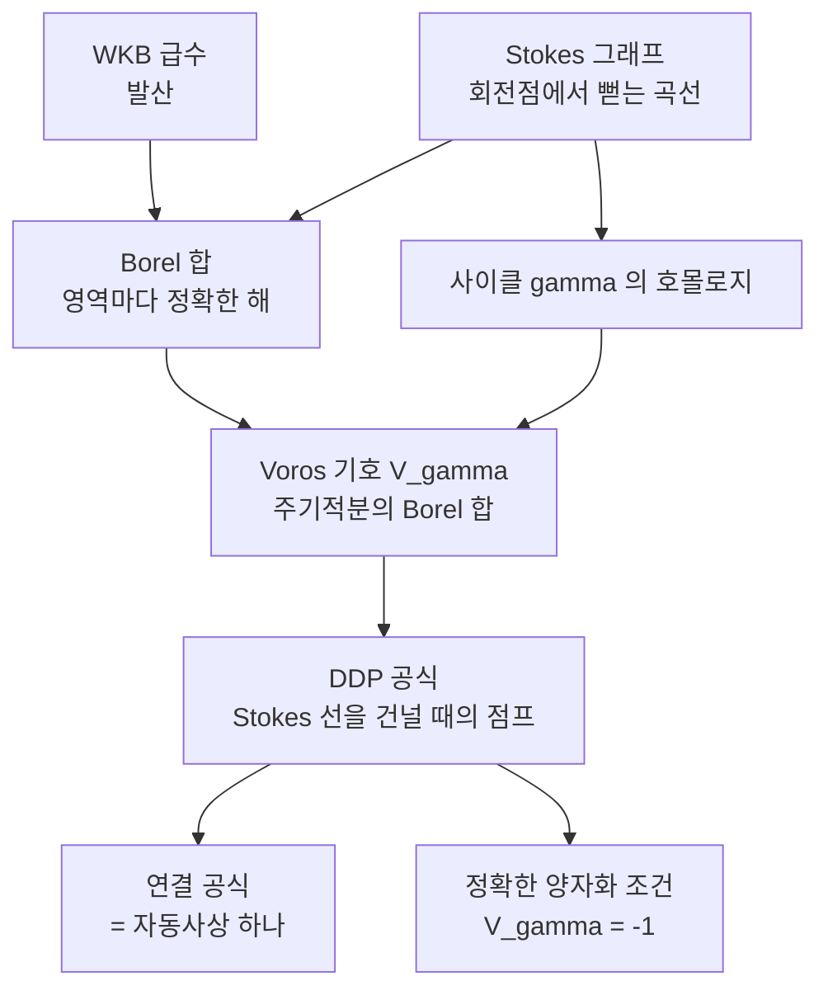

# 정확한 WKB 와 Voros 기호

# 개요

[WKB 근사](wkb-approximation.md)는 이름 그대로 근사였다. 급수를 어디선가 자르고, 회전점에서 Airy 함수로 국소적으로 이어 붙이고, 그렇게 얻은 연결 공식을 규칙처럼 외워 썼다. 급수 자체는 발산하므로 자르지 않으면 의미가 없어 보였다.

[Padé 근사와 Borel 재합산](borel-pade.md)과 [resurgence](resurgence.md)가 그 전제를 무너뜨린다. 발산급수는 자르는 것이 아니라 **Borel 합**하는 것이고, 합한 결과는 실제 해다. WKB 급수 전체를 이렇게 다루는 이론이 **정확한 WKB**(exact WKB)이며, Voros 가 시작하고 Écalle 의 resurgence 가 언어를 준 뒤 Delabaere–Dillinger–Pham 이 정리했다.

그러면 두 가지가 달라진다. 첫째, "근사해" 대신 각 영역에서 정의된 **정확한 해**를 얻는다. 둘째, 연결 공식이 외워야 할 규칙이 아니라 계산되는 대상이 된다. 회전점을 감싸는 주기 적분을 Borel 합한 **Voros 기호**를 좌표로 잡으면, Stokes 선을 건너는 일이 이 좌표들 사이의 한 줄짜리 변환식으로 압축된다. WKB 의 $\pi/4$ 위상은 그 변환식의 한 특수한 경우로 재해석된다.

부모를 셋 둔 이유가 여기서 드러난다. 다룰 급수가 WKB 급수이고, 그것을 합하는 방법이 Borel–Padé 이며, 합한 것들이 어떻게 점프하는지를 기술하는 대수가 alien 미분이다.

# 직관

## 자르는 대신 합한다

WKB 급수 $\sum_n \epsilon^n S_n(x)$ 의 계수는 $n!$ 규모로 커진다. 최적 절단에서 멈추면 오차가 $e^{-A/\epsilon}$ 규모로 남고, 그 남는 것이 바로 반대쪽 지수해다. 정확한 WKB 는 이 오차를 없애려 하지 않는다. 급수를 Borel 평면으로 옮기고, 특이점을 피해 적분하고, 그 결과를 해로 삼는다. 남던 $e^{-A/\epsilon}$ 은 사라지는 것이 아니라 **적분 경로를 어느 쪽으로 피했는가**로 기록된다.

경로 선택이 답을 바꾼다는 사실은 결함이 아니라 이 이론의 내용 전부다. 두 선택의 차이가 Stokes 자동사상이고, 연결 공식이란 그 자동사상을 구체적으로 적어 놓은 것이다.

## 평면을 나누는 그림

$\epsilon^2 y'' = Q(x)y$ 에서 회전점 $Q(x_0) = 0$ 마다 세 개의 곡선이 뻗어 나간다. 조건은

$$
\operatorname{Im}\int_{x_0}^{x}\sqrt{Q(t)}\thinspace dt = 0
$$

이다. 이 곡선 위에서 두 WKB 해 $e^{\pm\phi/\epsilon}$ 의 크기 비가 최대로 벌어지므로, 작은 쪽의 계수가 결정되지 않는다. 이 곡선들이 **Stokes 곡선**이고, 전체 그림을 **Stokes 그래프**라 한다. 그래프가 복소평면을 영역으로 나누고, 각 영역 안에서는 Borel 합이 문제없이 정의되어 정확한 해가 산다. 영역을 옮길 때만 무언가 일어난다.

## Voros 기호는 좌표다

각 영역에서 해가 정의되지만 그 해를 직접 비교하기는 번거롭다. 대신 회전점들을 감싸는 닫힌 경로 $\gamma$ 마다

$$
V_\gamma = \exp\left(\oint_\gamma S_{\mathrm{odd}}(x,\epsilon)\thinspace dx\right)
$$

라는 수 하나를 붙인다. 이것이 **Voros 기호**다. 지수 안은 발산급수이고, Borel 합을 취해 비로소 수가 된다. 경로를 연속적으로 움직여도 값이 변하지 않으므로 호몰로지류 $\gamma$ 만이 중요하고, 따라서 유한 개의 수가 문제 전체를 기술한다. 해의 무한한 자유도를 몇 개의 좌표로 압축한 셈이다.

# 정의

## Riccati 방정식과 홀수부

$y = \exp\bigl(\epsilon^{-1}\negthinspace\int^x S\thinspace dt\bigr)$ 를 $\epsilon^2y'' = Qy$ 에 넣으면

$$
\epsilon\thinspace S' + S^2 = Q
$$

라는 Riccati 방정식이 나온다. $S = \sum_{n\ge0}\epsilon^n S_n$ 으로 풀면 $S_0 = \pm\sqrt{Q}$ 이고 나머지는

$$
S_n = \frac{1}{2S_0}\left(-S_{n-1}' - \sum_{k=1}^{n-1}S_kS_{n-k}\right)
$$

로 차례로 결정된다. 부호 두 선택을 $S^{\pm}$ 라 하고

$$
S_{\mathrm{odd}} = \frac{S^{+} - S^{-}}{2}, \qquad S_{\mathrm{even}} = \frac{S^{+} + S^{-}}{2}
$$

로 나눈다. Riccati 방정식에서 $S_{\mathrm{even}} = -\tfrac12\thinspace\partial_x\log S_{\mathrm{odd}}$ 가 따라오므로, 해가

$$
y_{\pm}(x) = \frac{1}{\sqrt{S_{\mathrm{odd}}}}\exp\left(\pm\frac1\epsilon\int_{x_0}^{x} S_{\mathrm{odd}}\thinspace dt\right)
$$

로 $S_{\mathrm{odd}}$ 하나에 의해 완전히 쓰인다. 모든 정보가 홀수부에 들어 있다는 것이 이 정리의 실질적 내용이고, 이후 모든 계산이 $S_{\mathrm{odd}}$ 로만 이루어지는 이유다. 아래 첨자 $x_0$ 는 보통 회전점으로 잡으며, 이때 적분이 수렴하도록 $S_{\mathrm{odd}}$ 의 특이부를 따로 떼어 낸다.

## Voros 주기 기호

$S_{\mathrm{odd}}$ 는 $\sqrt{Q}$ 의 홀수 거듭제곱으로만 이루어지므로 회전점 주위에서 부호가 바뀐다. 따라서 회전점 두 개를 감싸는 닫힌 경로 $\gamma$ 위에서는 단일값이고, 적분

$$
\oint_\gamma S_{\mathrm{odd}}\thinspace dx = \sum_{m\ge0}\epsilon^{2m-1}\oint_\gamma S_{2m}\thinspace dx
$$

가 뜻을 가진다. 홀수 차수 $S_{2m+1}$ 은 모두 완전미분이라 주기적분에 기여하지 않는다. 우변의 급수를 Borel 합한 값의 지수가 **Voros 주기 기호** $V_\gamma$ 다. 서로 다른 회전점을 잇는 열린 경로에 대해서도 같은 방식으로 기호를 정의할 수 있고, 이 둘을 합쳐 놓으면 곱셈에 대해 $V_{\gamma_1+\gamma_2} = V_{\gamma_1}V_{\gamma_2}$ 가 성립하는 군 준동형이 된다.

## 안장 연결

Stokes 곡선 하나가 회전점 두 개를 직접 잇는 배치를 **안장 연결**(saddle connection)이라 한다. 일반적인 $Q$ 에서는 일어나지 않지만, 매개변수를 움직이면 어떤 값에서 반드시 지나간다. 정확한 WKB 에서 흥미로운 일은 전부 이 순간에 일어난다. 안장 연결을 지날 때 Stokes 그래프의 위상이 바뀌고, Voros 기호들이 아래의 공식대로 점프한다. 대상이 연속적으로 변하는데 그것을 기술하는 좌표계가 불연속적으로 갈아 끼워지는 구조이며, 클러스터 대수의 뒤집기와 같은 형식이다.

# 성질

## DDP 공식

Stokes 곡선이 회전점 $a$ 에서 나와 회전점 $b$ 로 들어가는 안장 연결을 $\epsilon$ 의 위상을 돌려 통과시키면, Voros 기호가

$$
V_\gamma \thickspace\longmapsto\thickspace V_\gamma\thinspace\bigl(1 + V_{\gamma_0}\bigr)^{\langle\gamma,\gamma_0\rangle}
$$

로 바뀐다. $\gamma_0$ 는 그 안장 연결이 결정하는 사이클이고 $\langle\cdot,\cdot\rangle$ 는 교차수다.[^1] 이것이 **Delabaere–Dillinger–Pham 공식**이다. 세 가지를 눈여겨볼 만하다.

- 변환이 $V$ 들의 유리함수이며 계수가 정수다. 초월적 대상들 사이의 관계가 대수적으로 닫힌다.
- 교차수가 0 인 사이클은 변하지 않는다. 지역적인 사건이 지역적으로만 영향을 준다는 뜻이고, alien 미분이 특이점 하나에만 반응하던 것과 같은 성질이다.
- 여러 안장 연결을 차례로 지나면 변환이 합성되고, 결과는 지나온 순서에 의존한다. 이 비가환성이 Stokes 자동사상들이 이루는 군의 구조다.

## 연결 공식은 자동사상 하나다

단순 회전점 하나를 놓고 DDP 공식을 적용하면 [Airy 함수](airy-functions.md)의 Stokes 자료가 그대로 나오고, 이를 파동함수 수준에서 풀어 쓰면 WKB 의 연결 공식이 된다. 감쇠해에서 진동해로 갈 때 붙던 계수 $\tfrac12$ 과 위상 $\pi/4$ 가 자동사상의 행렬 성분으로 자리를 잡는다.

방향에 따라 규칙이 달랐던 이유도 설명된다. 큰 항이 지배하는 쪽에서는 작은 항의 계수가 Borel 합 이전에는 정의되지 않았고, 그래서 규칙이 한 방향으로만 안전했다. Borel 합을 하고 나면 양쪽 모두 정확한 해이므로 변환이 가역이 되고, 비대칭은 사라진다. 근사 단계에서 생긴 인위적 제약이었던 셈이다.

## 언제 합할 수 있는가

$Q$ 가 다항식이고 회전점이 모두 단순하면 WKB 급수가 실제로 Borel 합가능하다는 것이 Koike–Schäfke 의 정리다. 일반적으로 성립하는 이야기가 아니라 증명이 필요한 사실이며, 이것이 있어야 위의 구성이 형식적 유희가 아니게 된다.

회전점이 겹치거나($Q$ 가 이중근을 가짐) $Q$ 에 극점이 있으면 상황이 달라진다. 단순 극점은 Langer 수정으로 다룰 수 있고, 이중 극점은 그 자리에서 국소적으로 Bessel 방정식이 되어 기호가 하나 더 붙는다. 회전점 두 개가 합류하는 극한에서는 Airy 대신 Weber 방정식이 모형이 되고, 기호들 사이에 추가 관계가 생긴다.

## 정확한 양자화 조건

우물 하나에 갇힌 상태의 조건은 우물을 감싸는 사이클 $\gamma$ 에 대해

$$
V_\gamma = -1
$$

이다. 지수를 풀면 $\oint_\gamma S_{\mathrm{odd}}\thinspace dx = 2\pi i\thinspace(n + \tfrac12)$ 이고, 최저 차수만 남기면 정확히 Bohr–Sommerfeld 조건이다. 차이는 좌변이 잘라 쓴 근사가 아니라 Borel 합한 정확한 값이라는 데 있다. 원리적으로 이 한 줄이 스펙트럼 전체를 정확히 결정한다.

우물이 둘이면 사이클도 둘이고, 조건은 두 Voros 기호의 관계식이 된다. 이중우물의 준위 분열이 장벽 사이클 $V_{\gamma_B}$ 의 크기로 나오며, 그것이 instanton 기여의 정확한 판본이다. 섭동급수와 instanton 급수가 서로의 애매성을 지운다는 이야기가 여기서는 기호 사이의 항등식으로 나타난다.

# 활용

## 스펙트럼 결정 문제

정확한 양자화 조건은 퍼텐셜에서 스펙트럼으로 가는 명시적 사상이다. 반대 방향, 즉 스펙트럼에서 퍼텐셜을 복원하는 문제에서도 Voros 기호가 자연스러운 자료가 된다. 준위 전체를 알면 모든 사이클의 기호를 읽을 수 있고, 기호들이 만족하는 관계식이 퍼텐셜의 계수를 제약한다.

특히 $-\psi'' + x^{2M}\psi = E\psi$ 류에서 Voros 기호가 만족하는 함수방정식이 가해 격자모형의 Bethe 방정식과 같은 꼴이 된다는 것이 **ODE–IM 대응**이다. 미분방정식 하나의 스펙트럼 자료가 전혀 다른 곳에서 온 적분가능계의 방정식을 만족하는 현상이며, 발견 이후 두 분야를 잇는 통로가 되었다.

## 좌표로서의 Voros 기호

DDP 공식의 형태는 클러스터 변수의 뒤집기 규칙과 같다. 이 관찰을 밀고 나가면 Stokes 그래프는 곡면 위의 삼각분할, Voros 기호는 그 삼각분할에 붙은 좌표, 안장 연결의 통과는 뒤집기가 된다. 매개변수 공간을 도는 동안 좌표계가 갈아 끼워지는 전체 구조가 하나의 기하 대상으로 정리되는 것이다.

물리 쪽에서는 이 그림이 스펙트럼 네트워크라는 이름으로 4 차원 게이지 이론의 BPS 상태 세기와 같은 자료를 기술한다. 발산하는 근사 급수를 어떻게 합할 것인가라는 질문에서 출발한 이론이, 어떤 대상이 불연속적으로 나타났다 사라지는가를 세는 도구로 이어진 것이 이 주제의 현재 위치다.

[^1]: André Voros, *The return of the quartic oscillator: the complex WKB method*, Annales de l'I.H.P. Physique théorique 39 (1983), §§3–6. 주기 기호의 정의, quartic 진동자에서의 정확한 양자화 조건, 기호가 만족하는 함수방정식. DDP 공식의 형태와 안장 연결에서의 점프는 Eric Delabaere, Hervé Dillinger, Frédéric Pham, *Résurgence de Voros et périodes des courbes hyperelliptiques*, Annales de l'Institut Fourier 43 (1993), §§2–3.

# 연관 문서

## 선수지식

- [WKB 근사와 연결 공식](wkb-approximation.md)
- [Resurgence 와 alien 미분](resurgence.md)
- [Padé 근사와 Borel 재합산](borel-pade.md)

## 더 알아보기

아직 연결한 문서가 없다.

#analysis #complex_analysis #computation
