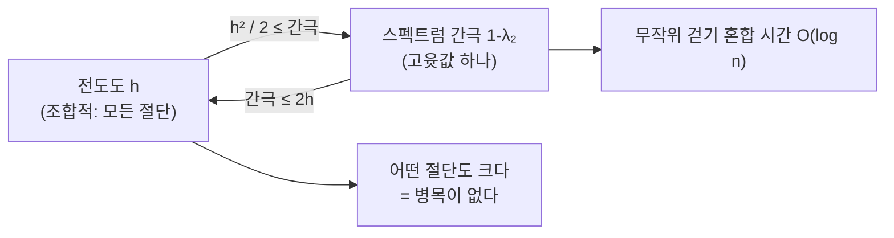

# Expander 그래프와 스펙트럼 간극

# 개요

간선은 적게 쓰면서 연결은 튼튼한 그래프를 원한다고 하자. 두 요구는 서로 밀어낸다. 완전그래프는 튼튼하지만 간선이 $n^2$ 개이고, 나무는 간선이 $n$ 개지만 하나만 끊어도 갈라진다.

**Expander** 는 두 요구를 동시에 만족시킨다. 차수는 상수로 묶여 있는데($3$ 이나 $4$ 로 충분하다) 어떤 방식으로 잘라도 잘린 면이 크다. 그래서 정점 수가 아무리 늘어도 "어디서나 잘 섞이는" 성질을 유지한다.

이 성질을 재는 방법이 둘 있고, 둘이 사실상 같다는 것이 이론의 핵심이다.

- **조합적**: 전도도 $h$ — 임의의 부분집합을 잘랐을 때 밖으로 나가는 간선의 비율 중 최솟값.
- **스펙트럼**: 인접행렬의 두 번째 [고윳값](eigenvalues.md) $\lambda_2$ 와 최대 고윳값의 차이, 곧 **스펙트럼 간극**.

Cheeger 부등식이 둘을 묶는다.

$$
\frac{h^2}{2}\le 1-\lambda_2\le 2h
$$

왼쪽은 "고윳값이 크게 벌어져 있으면 어떤 절단도 크다", 오른쪽은 "절단이 다 크면 고윳값이 벌어진다" 를 말한다. 조합적 성질을 선형대수 계산으로 확인할 수 있게 되고, 이것이 expander 를 실용적 도구로 만든다. 부분집합 $2^n$ 개를 다 보는 대신 행렬 하나의 고윳값을 보면 된다.

부등식의 좌변에 나오는 간극은 [그래프 Laplacian](graph-laplacian.md)의 두 번째로 작은 고윳값이기도 하다. Laplacian 을 아는 독자는 이 문서를 "그 고윳값이 무엇을 뜻하는가" 에 대한 답으로 읽으면 된다. Expander 는 그래프 이론의 대상이면서 여러 분야의 엔진으로 쓰인다. 무작위성을 아껴 쓰는 알고리즘, 오류정정부호, 그리고 PCP 정리의 조합적 증명에서 간극을 증폭하는 장치가 전부 expander 다.

# 직관

## 무작위 걷기가 빨리 섞인다

$d$ 정규 그래프 위에서 무작위로 이웃을 골라 걷는다. 분포가 균등분포에 얼마나 빨리 가까워지는가는 전이행렬 $M=A/d$ 의 고윳값으로 정해진다. 최대 고윳값은 항상 $1$ 이고 고유벡터는 균등분포다. 나머지 고윳값의 절댓값 최대를 $\lambda$ 라 하면, $t$ 걸음 뒤의 편차가 $\lambda^t$ 로 줄어든다.

$$
\|M^t x-\pi\|\le\lambda^{t}\|x-\pi\|
$$

그러므로 $\lambda$ 가 $1$ 에서 떨어져 있으면 $O(\log n)$ 걸음 만에 섞인다. 이것이 expander 의 실용적 정의다. **상수 차수인데 로그 시간에 섞인다.**

원형 그래프 $C_n$ 은 정반대다. $\lambda_2=\cos(2\pi/n)\approx1-2\pi^2/n^2$ 라 간극이 $n^{-2}$ 로 사라지고, 섞이는 데 $n^2$ 걸음이 든다. 한 바퀴 도는 데 걸리는 시간이 그대로 나타난다.

## 왜 두 측도가 같은 것을 재는가

전도도가 작다는 것은 그래프에 병목이 있다는 뜻이다. 두 덩어리 사이를 잇는 간선이 적다면, 한쪽 덩어리에서 $+1$ 이고 다른 쪽에서 $-1$ 인 벡터를 만들면 그 벡터는 $M$ 을 먹여도 거의 변하지 않는다. 경계에서만 값이 바뀌는데 경계가 작기 때문이다. 그러므로 $1$ 에 가까운 고윳값이 존재한다. 이것이 부등식의 쉬운 쪽, 곧 $1-\lambda_2\le2h$ 다.

어려운 쪽은 반대다. 고윳값이 $1$ 에 가까우면 병목이 있음을 보여야 하는데, 고유벡터는 일반적으로 $\pm1$ 값이 아니라 실수다. 증명은 고유벡터의 값으로 정점을 정렬하고 **어디선가 자르는** 것이다. 적절한 절단 하나가 반드시 $h\le\sqrt{2(1-\lambda_2)}$ 를 만족한다. 실수 벡터를 절단으로 반올림하는 이 논법이 스펙트럼 그래프 분할 알고리즘의 원형이기도 하다.

## 얼마나 좋아질 수 있는가

간극을 무한정 키울 수는 없다. $d$ 정규 그래프에서

$$
\lambda_2\ge\frac{2\sqrt{d-1}}{d}-o(1)
$$

이 성립한다(Alon–Boppana). 이 한계를 달성하는 그래프를 **Ramanujan 그래프**라 한다. 이름은 구성에 Ramanujan 추측(정확히는 Deligne 이 증명한 그 명제)이 쓰이기 때문이다. Lubotzky–Phillips–Sarnak 의 구성이 사원수 대수와 모듈러 형식의 계수 평가에 의존한다.

여기에 역설적인 사실이 있다. **무작위** $d$ 정규 그래프는 거의 확실히 좋은 expander 다(Friedman 의 정리로 거의 Ramanujan 이다). 그러므로 expander 는 흔하다. 그런데 구체적으로 하나를 **써 내려면** 정수론이 필요했다. 무작위성을 없애려는 목적에 쓰이는 대상 자체가 무작위로는 쉽게 얻어지고 명시적으로는 어렵다는 것이 이 주제의 성격을 잘 보여 준다.

# 정의

## 전도도와 expander 족

$d$ 정규 그래프 $G=(V,E)$ 와 $|V|=n$ 에 대해

$$
h(G)=\min_{0<|S|\le n/2}\frac{|E(S,\bar S)|}{d\,|S|}
$$

를 **전도도**(Cheeger 상수)라 한다. 그래프 족 $\lbrace G_i\rbrace$ 가 $|V_i|\to\infty$ 이고 차수가 상수 $d$ 로 고정되며 $h(G_i)\ge\varepsilon>0$ 인 상수 $\varepsilon$ 이 있으면 **expander 족**이라 한다.

핵심은 $\varepsilon$ 이 $i$ 에 무관한 상수라는 점이다. 고정된 하나의 그래프에 대해서는 언제나 $h>0$ 이므로(연결이면) 무한족에 대해서만 의미가 있다.

## 스펙트럼 간극

인접행렬 $A$ 의 고윳값을 $d=\mu_1\ge\mu_2\ge\cdots\ge\mu_n$ 라 하고 정규화해 $\lambda_i=\mu_i/d$ 로 둔다. $\lambda_1=1$ 이고 고유벡터는 전체 $1$ 벡터다. **스펙트럼 간극**은 $1-\lambda_2$ 다.

$\lambda_n=-1$ 일 필요충분조건은 그래프가 이분이라는 것이다. 무작위 걷기의 수렴을 다룰 때는 $\max(|\lambda_2|,|\lambda_n|)$ 을 봐야 하고, 전도도와의 관계에서는 $\lambda_2$ 만 보면 된다.

## Cheeger 부등식

$$
\frac{h(G)^2}{2}\le 1-\lambda_2\le 2h(G)
$$

미분기하의 Cheeger 부등식(다양체의 등주 상수와 Laplace 작용소 첫 고윳값)의 이산 판본이고, 증명 구조도 평행하다.

## Alon–Boppana 와 Ramanujan 그래프

$d$ 를 고정하고 $n\to\infty$ 일 때

$$
\lambda_2\ge\frac{2\sqrt{d-1}}{d}-o_n(1)
$$

이다. $\max(|\lambda_2|,|\lambda_n|)\le\frac{2\sqrt{d-1}}{d}$ 인 그래프를 **Ramanujan 그래프**라 한다. 무한족의 구성은 $d=p+1$ ($p$ 소수)에서 LPS 가 주었고, 모든 $d\ge3$ 에 대한 이분 Ramanujan 족의 존재는 Marcus–Spielman–Srivastava 가 교대 다항식 방법으로 증명했다.

# 성질

## 혼합 보조정리

expander 에서는 임의의 두 집합 사이 간선 수가 무작위 그래프에서의 기댓값에 가깝다. $S,T\subseteq V$ 에 대해

$$
\left|\,|E(S,T)|-\frac{d|S||T|}{n}\,\right|\le\lambda\, d\sqrt{|S||T|}
$$

여기서 $\lambda=\max(|\lambda_2|,|\lambda_n|)$ 다. 이것이 expander 를 "유사무작위" 그래프라 부르는 이유다. 간선 분포가 무작위 그래프와 구별되지 않을 만큼 고르다. 조합론에서 expander 논법의 대부분이 이 한 부등식을 쓴다.

## 무작위성 절약

무작위 알고리즘의 오류 확률을 $2^{-k}$ 로 줄이려면 독립 반복 $k$ 번에 무작위 비트가 $k$ 배 든다. expander 위를 걷는 것으로 대신하면, 첫 걸음에만 $O(\log n)$ 비트를 쓰고 이후 각 걸음은 $O(1)$ 비트만 쓰면서도 오류 확률이 지수적으로 떨어진다(Ajtai–Komlós–Szemerédi). 무작위 비트가 비싼 자원이라는 관점에서 이 절약이 $\mathsf{RL}\subseteq\mathsf{L}$ 방향 연구의 핵심 도구가 되었고, Reingold 의 무향 연결성 로그공간 알고리즘이 그 정점이다.

## PCP 증명에서의 역할

[PCP 정리](pcp-theorem.md)의 Dinur 증명은 제약 그래프의 간극을 한 라운드에 두 배씩 키운다. 그래프를 $t$ 거듭제곱해 길이 $t$ 경로를 제약 하나로 묶는 것이 증폭의 본체인데, 그래프에 병목이 있으면 경로가 한 덩어리에 갇혀 증폭이 실패한다. 그래서 매 라운드 앞에서 그래프를 expander 로 바꾼다. 스펙트럼 간극이 "경로가 온 그래프를 고르게 훑는다" 를 보장하고, 그 보장이 곧 간극 증폭의 양적 결론이 된다.

## 부호와의 관계

expander 그래프에서 만든 부호(expander code, Sipser–Spielman)는 선형 시간 복호가 가능하면서 상수 비율과 상수 상대 거리를 갖는다. 최근의 양자 LDPC 부호와 상수 비율 국소 검사 가능 부호 구성도 expander 계열의 대상(제곱 복합체, 좌우 Cayley 복합체) 위에서 이루어졌다. 그래프의 확장성이 부호의 거리로 번역되는 것이 공통 원리다.

# 활용

## 어디에 쓰이는가

- **무작위성 절약**: expander 걷기로 증폭하면 무작위 비트를 상수 개씩만 더 쓰고도 오류가 지수적으로 준다.
- **PCP 와 근사 하한**: Dinur 의 간극 증폭이 expander 화를 매 라운드 수행한다.
- **오류정정부호**: expander 부호는 선형 시간 복호가 가능하고, 최근의 국소 검사 가능 부호와 양자 LDPC 구성의 뼈대다.
- **분산 시스템과 네트워크**: 상수 차수로 지름이 로그인 위상은 통신망과 P2P 오버레이의 이상적 설계다.
- **스펙트럼 클러스터링**: Cheeger 부등식의 증명에 나오는 "고유벡터로 정렬하고 자른다" 가 그대로 알고리즘이 된다.

# 연관 문서

## 선수지식

- [그래프 Laplacian](graph-laplacian.md)
- [고윳값과 고유벡터](eigenvalues.md)

## 더 알아보기

- [PCP 정리와 근사 불가능성](pcp-theorem.md)
- [Ramanujan 그래프의 명시적 구성](ramanujan-graphs.md)

#graph_theory #linear_algebra #algorithms #complexity
