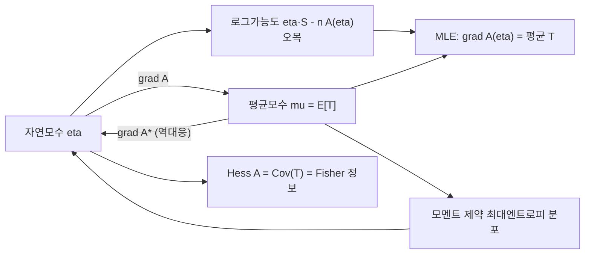

# 지수족과 충분통계량

# 개요

지수족(exponential family)은 밀도가

$$
p(x \mid \eta) = h(x)\,\exp\!\big(\eta^{\top}T(x) - A(\eta)\big)
$$

꼴로 쓰이는 분포족이다. Bernoulli, Poisson, 정규, Gamma, Beta, 다항분포 등 표준적인 분포 대부분이 여기에 들어간다.

이 형태 하나에서 통계학의 여러 사실이 한꺼번에 따라 나온다. 데이터가 아무리 많아도 추론에 필요한 요약은 $T$ 의 합뿐이고(충분통계량), 로그분배함수 $A$ 의 미분이 $T$ 의 모멘트를 생성하며, $A$ 의 볼록성이 로그가능도의 오목성을 주어 [최대가능도 추정](maximum-likelihood.md)이 유일한 모멘트 매칭 문제가 된다. 켤레사전분포, 일반화선형모형, 최대엔트로피 분포도 모두 같은 구조의 다른 이름이다.

# 직관

관측을 백만 개 모았다고 하자. Poisson 모형이라면 모수 추정에 필요한 것은 관측값의 합 하나뿐이다. 나머지 정보는 모수에 대해 아무것도 말해 주지 않는다. 이렇게 "표본 크기가 커져도 요약의 차원이 고정"되는 성질이 지수족의 정의적 특징에 가깝다.

두 번째 직관은 $A$ 의 역할이다. $A(\eta)$ 는 밀도를 1 로 만들기 위해 치러야 하는 정규화 비용이고, 이 비용이 $\eta$ 에 따라 어떻게 변하는지가 곧 분포의 모멘트다. 기울기가 평균, 곡률이 분산이다. 곡률이 양반정부호이므로 $A$ 는 볼록하고, 로그가능도는 오목해서 최적화가 쉬운 문제가 된다.

세 번째 직관은 좌표 변환이다. 같은 분포족을 자연모수 $\eta$ 로 볼 수도 있고 평균모수 $\mu = E[T]$ 로 볼 수도 있다. 둘은 $\nabla A$ 로 오가는 서로 다른 좌표계이며, 그 사이의 대응이 Legendre 변환이다. MLE 는 평균모수 좌표에서 보면 그냥 "표본평균을 그대로 쓴다"가 된다.



# 정의

## 지수족

기준측도 $\nu$ 가 주어진 표본공간 $\mathcal X$ 위에서, 가측함수 $h : \mathcal X \to [0, \infty)$ 와 $T : \mathcal X \to \mathbb R^k$ 를 고정한다. 자연모수 $\eta \in \mathbb R^k$ 에 대해

$$
A(\eta) \;=\; \log \int_{\mathcal{X}} h(x)\,e^{\eta^{\top}T(x)}\, d\nu(x)
$$

를 로그분배함수(log-partition function) 또는 cumulant 생성함수라 하고, 자연모수공간을

$$
\mathcal{N} = \{\eta \in \mathbb{R}^{k} : A(\eta) < \infty\}
$$

로 둔다. $\eta \in \mathcal N$ 에 대해

$$
p(x \mid \eta) = h(x)\exp\!\big(\eta^{\top}T(x) - A(\eta)\big)
$$

가 확률밀도가 되며, 이렇게 얻은 분포족을 지수족이라 한다. $T$ 를 충분통계량, $h$ 를 기저측도(carrier)라 부른다.

$\mathcal N$ 이 열린집합이면 정칙(regular), $T$ 의 성분들과 상수함수 1 이 $\nu$ 거의 어디서나 아핀독립이면 최소(minimal) 표현이라 한다. 최소가 아니면 서로 다른 $\eta$ 가 같은 분포를 주므로 항등가능성이 깨진다. 모수가 $\eta = \eta(\theta)$ 로 $k$ 보다 낮은 차원의 다양체를 훑으면 곡선지수족(curved exponential family)이라 한다.

## 예

| 분포 | $T(x)$ | 자연모수 $\eta$ | $A(\eta)$ |
| --- | --- | --- | --- |
| Bernoulli(p) | $x$ | $\log(p/(1-p))$ | $\log(1 + e^{\eta})$ |
| Poisson(λ) | $x$ | $\log \lambda$ | $e^{\eta}$ |
| 정규 (분산 기지) | $x$ | $\mu/\sigma^2$ | $\sigma^2\eta^2/2$ |
| 정규 (둘 다 미지) | $(x, x^2)$ | $(\mu/\sigma^2, -1/(2\sigma^2))$ | $-\eta_1^2/(4\eta_2) - (1/2)\log(-2\eta_2)$ |
| Gamma(α, β) | $(\log x, x)$ | $(\alpha - 1, -\beta)$ | $\log \Gamma(\eta_1+1) - (\eta_1+1)\log(-\eta_2)$ |

지수분포는 Gamma 의 특수경우이고, 범주형·다항분포는 지시벡터를 $T$ 로 두면 지수족이다. 반면 균등분포 $U(0, \theta)$ 는 지지집합이 모수에 의존해서 지수족이 아니고, Cauchy 분포와 자유도가 미지인 t 분포도 아니다.

## 독립표본

$x_1, \dots, x_n$ 이 독립이면

$$
p(x_{1:n} \mid \eta) = \Big(\prod_{i=1}^{n} h(x_i)\Big)\exp\!\Big(\eta^{\top}\sum_{i=1}^{n}T(x_i) - nA(\eta)\Big)
$$

이므로 표본 전체도 같은 자연모수를 갖는 지수족이고, 충분통계량은 합

$$
S_n = \sum_{i=1}^{n} T(x_i)
$$

이다. 차원이 $n$ 에 무관하게 $k$ 로 고정된다는 점이 핵심이다.

## 충분통계량과 인수분해

통계량 $T$ 가 모수 $\theta$ 에 대해 충분(sufficient)하다는 것은, $T(X)$ 가 주어졌을 때 $X$ 의 조건부분포가 $\theta$ 에 의존하지 않는다는 뜻이다. Fisher–Neyman 인수분해 정리는 이것이 밀도의 형태로 판정된다고 말한다.

$$
T \text{ 가 충분} \iff p(x \mid \theta) = g\big(T(x),\, \theta\big)\, h(x) \quad \text{(모든 } x, \theta\text{)}.
$$

지수족의 정의식이 정확히 이 형태이므로 $T$ 는 즉시 충분통계량이다. 증명 스케치(이산의 경우): 충분이면 $p(x \mid \theta) = \Pr(X=x \mid T=t)\Pr(T=t \mid \theta)$ 로 쪼개지고 앞쪽이 $\theta$ 무관이므로 인수분해가 나온다. 역으로 인수분해가 있으면 조건부확률을 계산할 때 $g(T(x), \theta)$ 가 분자와 분모에서 약분되어 $\theta$ 가 사라진다.

# 성질

## 로그분배함수의 미분이 모멘트

$\eta$ 가 $\mathcal N$ 의 내부점이면 $A$ 는 그 근방에서 해석적이고 적분과 미분을 교환할 수 있다. 그러면

$$
\nabla A(\eta) = \mathbb{E}_{\eta}[T(X)], \qquad \nabla^{2} A(\eta) = \mathrm{Cov}_{\eta}\big(T(X)\big).
$$

첫 식의 계산은 다음과 같다.

$$
\nabla A(\eta) = \frac{\int h(x)\,T(x)\,e^{\eta^{\top}T(x)}d\nu}{\int h(x)\,e^{\eta^{\top}T(x)}d\nu} = \mathbb{E}_{\eta}[T(X)].
$$

한 번 더 미분하면 두 번째 식이 나온다. 고차 미분은 고차 cumulant 를 준다. 예를 들어 Poisson 에서 $A(\eta) = e^{\eta}$ 이므로 모든 차수의 cumulant 가 $\lambda = e^{\eta}$ 로 같고, Bernoulli 에서 $A'(\eta) = e^{\eta}/(1+e^{\eta})$ 는 로지스틱 함수이며 $A''(\eta) = p(1-p)$ 다.

## 볼록성

$\nabla^2 A = \operatorname{Cov}(T)$ 는 공분산행렬이므로 양반정부호다. 따라서 $A$ 는 $\mathcal N$ 위에서 볼록하고([볼록성](convexity.md)), 최소 표현이면 $\operatorname{Cov}(T)$ 가 양정부호라 엄격볼록이다. $\mathcal N$ 자체도 Hölder 부등식으로 볼록집합임을 보인다.

## MLE 는 모멘트 매칭이고 유일하다

로그가능도는

$$
\ell(\eta) = \eta^{\top}S_n - nA(\eta) + \text{const}
$$

로 $\eta$ 의 오목함수다(선형 항에서 볼록함수를 뺀 것). 내부 최대점의 조건은

$$
\nabla \ell(\eta) = S_n - n\nabla A(\eta) = 0
\quad\Longleftrightarrow\quad
\mathbb{E}_{\hat\eta}[T(X)] = \frac{1}{n}\sum_{i=1}^{n} T(x_i).
$$

즉 **모형의 이론적 모멘트를 표본 모멘트에 맞추는 것**이 MLE 다. 최소 표현에서는 $\ell$ 이 엄격오목이므로 해가 존재하면 유일하다. 존재는 표본 평균 $S_n/n$ 이 평균모수 공간의 내부에 있을 때 보장된다. 경계에 있으면(예: Bernoulli 표본이 전부 1) MLE 가 발산한다. 로지스틱 회귀에서 데이터가 완전분리될 때 계수가 무한으로 가는 현상이 이 경우다.

Fisher 정보는 $I(\eta) = \nabla^2 A(\eta) = \operatorname{Cov}(T)$ 이므로 점근분산도 같은 함수의 곡률에서 읽는다. Newton 방법을 쓰면 Hessian 이 공분산이라 자연스럽게 Fisher scoring 과 일치한다. 차원이 커서 $A$ 를 못 구하면 [경사하강법](gradient-descent.md) 계열을 쓴다.

## Legendre 쌍대와 Bregman divergence

$\nabla A$ 는 최소·정칙 지수족에서 자연모수공간의 내부를 평균모수공간의 내부로 보내는 전단사이고, 그 역이 볼록켤레

$$
A^{*}(\mu) = \sup_{\eta}\big(\eta^{\top}\mu - A(\eta)\big)
$$

의 기울기다. $A^*$ 는 음의 엔트로피에 해당한다([Shannon entropy](entropy.md)). 또한 두 분포 사이의 [KL divergence](kl-divergence.md)는 $A$ 가 만드는 Bregman divergence 로 정확히 표현된다.

$$
D_{\mathrm{KL}}\big(p_{\eta_1} \,\|\, p_{\eta_2}\big) = A(\eta_2) - A(\eta_1) - \nabla A(\eta_1)^{\top}(\eta_2 - \eta_1).
$$

이 항등식이 지수족에서의 정보기하(선형족과 지수족의 직교성, Pythagoras 항등식)를 떠받친다.[^1]

## 충분성의 귀결

- **Rao–Blackwell**: 임의의 불편추정량을 충분통계량으로 조건화하면 분산이 줄거나 같다. 즉 좋은 추정량은 $T$ 의 함수로 찾으면 된다.
- **완비성과 Lehmann–Scheffé**: 최소 표현의 정칙 지수족에서 $T$ 는 완비충분통계량이다. 따라서 $T$ 의 함수인 불편추정량은 유일한 UMVU 추정량이다.
- **Pitman–Koopman–Darmois 정리**: 지지집합이 모수에 의존하지 않는 매끄러운 모수족 중에서, 표본크기와 무관하게 차원이 고정된 충분통계량을 갖는 것은 지수족뿐이다. 지수족의 특별함이 우연이 아님을 말해 준다.
- **검정**: 단조가능도비 성질이 따라 나와 단측 검정의 UMP 성이 보장된다([가설검정과 p-값](hypothesis-testing.md)).

## 켤레사전분포

가능도가 지수족이면

$$
\pi(\eta \mid \tau, n_0) \;\propto\; \exp\!\big(\eta^{\top}\tau - n_0 A(\eta)\big)
$$

족이 켤레다. 관측 $x$ 를 보면 $\tau \leftarrow \tau + T(x)$ 와 $n_0 \leftarrow n_0 + 1$ 로 갱신되므로 사후분포가 같은 족에 머문다. Beta–Binomial, Gamma–Poisson, Normal–Normal 이 모두 이 한 줄의 특수경우다([Bayes 추론과 사후분포](bayesian-inference.md)).

## 최대엔트로피 표현

$T$ 의 평균이 $\mu$ 로 고정된 분포 중 엔트로피를 최대화하는 것을 찾는 문제

$$
\max_{p}\; H(p) \quad \text{s.t.} \quad \mathbb{E}_{p}[T(X)] = \mu, \;\; \int p \, d\nu = 1
$$

의 해는 제약의 Lagrange 승수를 $\eta$ 로 하는 지수족 분포 $p(x \mid \eta) = h(x)\exp(\eta^{\top}T(x) - A(\eta))$ 다([Lagrange 쌍대성과 KKT 조건](lagrange-duality.md)). 유도는 간단하다. 목표 분포 $p$ 와 지수족 분포 $q$ 의 KL divergence 가 비음이고, 모멘트 제약 아래에서 교차항이 상쇄되어

$$
H(p) = H(q) - D_{\mathrm{KL}}(p \,\|\, q) \le H(q)
$$

가 되기 때문이다. 이것이 "평균만 알면 지수분포, 평균과 분산을 알면 정규분포, 아무 제약이 없으면 균등분포"라는 익숙한 목록의 출처다.[^2]

# 활용

## 코드

모멘트 매칭과 $A$ 의 미분 성질을 수치로 확인한다.

```python
import numpy as np

rng = np.random.default_rng(0)

# 1) Poisson: A(eta) = exp(eta), T(x) = x
lam_true = 3.5
x = rng.poisson(lam_true, size=5000)
A   = lambda e: np.exp(e)
dA  = lambda e: np.exp(e)        # 평균
d2A = lambda e: np.exp(e)        # 분산
eta_hat = np.log(x.mean())       # dA(eta) = 표본평균 을 푼 것
print("Poisson  eta_hat=%.4f  dA=%.4f  표본평균=%.4f  표본분산=%.4f"
      % (eta_hat, dA(eta_hat), x.mean(), x.var()))

# 2) Bernoulli: A(eta) = log(1 + exp(eta)), T(x) = x
p_true = 0.3
y = rng.binomial(1, p_true, size=5000)
eta_b = np.log(y.mean() / (1 - y.mean()))
dA_b  = 1 / (1 + np.exp(-eta_b))
print("Bernoulli eta_hat=%.4f  dA=%.4f  표본평균=%.4f" % (eta_b, dA_b, y.mean()))

# 3) 수치미분으로 grad A = E[T], Hess A = Var(T) 확인 (Poisson)
e0, h = 1.0, 1e-5
num_d1 = (A(e0 + h) - A(e0 - h)) / (2 * h)
num_d2 = (A(e0 + h) - 2 * A(e0) + A(e0 - h)) / h**2
z = rng.poisson(np.exp(e0), size=200000)
print("A'  수치 %.4f  표본평균 %.4f" % (num_d1, z.mean()))
print("A'' 수치 %.4f  표본분산 %.4f" % (num_d2, z.var()))
```

세 출력 모두 이론값 $e^{\eta}$ 근처로 모인다. MLE 를 "가능도를 수치최적화해서" 구한 것이 아니라 모멘트를 맞춰 닫힌 형태로 구했다는 점에 주목할 만하다.

## 응용

- **일반화선형모형**: 반응분포를 지수족으로 두고 자연모수를 선형예측자 $x^{\top}\beta$ 로 연결하면(정준연결함수) 로그가능도가 $\beta$ 에 대해 오목해지고 추정이 IRLS 로 정리된다. 정규분포를 넣으면 [선형회귀와 최소제곱법](linear-regression.md)이 되고, Bernoulli 를 넣으면 로지스틱 회귀, Poisson 을 넣으면 로그선형모형이 된다.
- **그래프 모형과 변분추론**: 무향 그래프 모형은 퍼텐셜의 로그가 $T$ 인 지수족이고, 추론 문제는 $A$ 의 변분표현을 통해 평균모수 다면체 위의 최적화로 바뀐다. 평균장 근사와 belief propagation 이 이 틀에서 정리된다.[^1]
- **정보기하와 EM**: 지수족에서 EM 알고리즘의 E 단계는 충분통계량의 조건부기대값을 계산하는 것이고, M 단계는 모멘트 매칭이다.
- **통계물리**: $A$ 는 자유에너지, $\eta$ 는 역온도와 외부장, $T$ 는 에너지와 자기화에 대응한다. 최대엔트로피 원리를 통계추론의 언어로 옮긴 것이 Jaynes 의 프로그램이다.[^2]
- **모형 선택과 근사**: 표본에서 $T$ 의 평균만 보존하면 되므로 대규모 데이터의 요약·스트리밍 추정이 쉽다. 스케치와 온라인 학습에서 이 성질이 직접 쓰인다.

[^1]: M. J. Wainwright, M. I. Jordan, "Graphical Models, Exponential Families, and Variational Inference", Foundations and Trends in Machine Learning 1(1–2) (2008), https://people.eecs.berkeley.edu/~jordan/papers/wainwright-jordan-fnt.pdf
[^2]: E. T. Jaynes, "Information Theory and Statistical Mechanics", Physical Review 106 (1957), 620–630, https://doi.org/10.1103/PhysRev.106.620

# 연관 문서

## 선수지식

- [최대가능도 추정](maximum-likelihood.md)

## 더 알아보기

아직 연결한 문서가 없다.

#statistics
