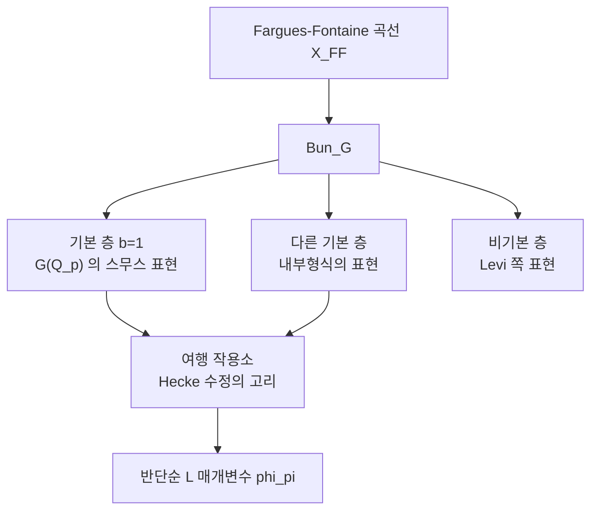

# Fargues–Scholze 기하화와 국소 Langlands

# 개요

[기하학적 Langlands 강령](geometric-langlands.md)은 곡선 $X$ 위의 다발 모듈라이 $\mathrm{Bun}_G$ 를 무대로 삼는다. 함수체 쪽에서는 곡선이 실제로 있으니 자연스럽다. 그런데 $\mathbb Q_p$ 같은 $p$ 진체에는 곡선이 없다. 국소체 하나는 점 하나처럼 보이고, 그 위에 다발을 얹을 공간이 없다.

Fargues 와 Scholze 의 출발점은 **곡선을 만들어내는 것**이었다. Fargues–Fontaine 곡선

$$
X_{\mathrm{FF}}=\mathrm{Proj}\Bigl(\bigoplus_{d\ge0}B^{\varphi=p^d}\Bigr)
$$

는 $p$ 진 주기환에서 대수기하의 곡선처럼 행동하는 대상을 뽑아낸 것이다. 이 곡선 위에서 $G$ 다발의 모듈라이 $\mathrm{Bun}_G$ 를 만들고, 그 위의 에탈층 범주를 보면 $G(\mathbb Q_p)$ 의 스무스 표현론이 통째로 들어 있다. 국소 Langlands 대응이 **기하학적 Langlands 의 $p$ 진 판본**으로 다시 쓰인다.

$$
D\bigl(\mathrm{Bun}_G,\Lambda\bigr)\ \supset\ \text{기본 층화}\ \longleftrightarrow\ \mathrm{Rep}\bigl(G(\mathbb Q_p)\bigr)
$$

성과는 구체적이다. 임의의 축소군 $G$ 와 임의의 기약 스무스 표현 $\pi$ 에 대해, 반단순 $L$ 매개변수 $\varphi_\pi$ 가 **무조건적으로** 구성된다. 그전까지 국소 Langlands 는 $\mathrm{GL}_n$ 과 일부 고전군에서만 알려져 있었다.

[$p$ 진 Hodge 이론](p-adic-hodge-theory.md)이 이 문서의 또 다른 부모인 것은 재료 때문이다. $B_{\mathrm{cris}}$ 와 $A_{\mathrm{inf}}$ 와 틸팅과 perfectoid 가 전부 곡선의 부품으로 쓰인다. 그 이론에서 손으로 다루던 주기환들이 여기서는 한 곡선의 국소 구조로 정리된다.

# 직관

## 왜 곡선이 필요한가

V. Lafforgue 가 함수체 위에서 자기동형 표현에 Galois 매개변수를 붙이는 방법을 찾았다. 요점은 **여행 작용소(excursion operator)** 다. 곡선 위 여러 점에서 Hecke 수정을 하고 다시 되돌아오는 고리를 만들면, 그 고리들이 이루는 대수의 작용이 매개변수를 결정한다. 이 방법의 전제는 곡선과 그 기본군이다.

$p$ 진체에는 둘 다 없었다. Fargues–Fontaine 곡선이 그 자리를 채운다. 기본군 노릇은 Weil 군 $W_{\mathbb Q_p}$ 가 하고, Hecke 수정은 곡선의 한 점 $\infty$ 에서 일어난다. **함수체에서 통하던 논법을 그대로 $p$ 진체로 옮기는 것**이 전략이다.

## 곡선이 아닌 곡선

$X_{\mathrm{FF}}$ 는 대수곡선이 아니다. Noether 환 위에 있지 않고, 유한형도 아니다. 그런데 곡선의 성질은 다 가지고 있다.

- 모든 닫힌점의 국소환이 이산부치환이다.
- 완비(complete)이고 류수가 0 이다.
- $\mathrm{Pic}(X_{\mathrm{FF}})\cong\mathbb Z$ 이고 차수가 잘 정의된다.
- 닫힌점들이 $\mathbb C_p$ 의 틸팅에서 오는 "미지의" 점들이다.

가장 중요한 성질은 벡터다발의 분류다. 대수곡선에서 $\mathbb P^1$ 위 다발이 $\bigoplus\mathcal O(n_i)$ 로 쪼개지는 것처럼, $X_{\mathrm{FF}}$ 위의 다발은

$$
\mathcal E\cong\bigoplus_i\mathcal O(\lambda_i),\qquad \lambda_i\in\mathbb Q
$$

로 쪼개진다. 차이는 기울기가 정수가 아니라 **유리수**라는 점이다. 그리고 이 분류는 Dieudonné–Manin 의 isocrystal 분류와 정확히 같은 모양이다. $p$ 진 Hodge 이론에서 $\varphi$ 가군을 기울기로 분해하던 것이 곡선 위 다발의 Harder–Narasimhan 분해로 다시 나타난다.

## $\mathrm{Bun}_G$ 의 점이 무엇인가

$G$ 다발의 모듈라이 $\mathrm{Bun}_G$ 를 만들면 그 점들이 Kottwitz 집합 $B(G)$ 로 분류된다. $G=\mathrm{GL}_n$ 이면 곧 isocrystal 의 동형류이고, 기울기 다중집합으로 적힌다.

```python
from fractions import Fraction as F
from math import gcd

def isocrystals(n, d, bound=1):
    """높이 n, 차수 d 인 isocrystal 을 단순 성분의 다중집합으로 열거한다.
       E_{r/s} 는 dim s, deg r 이고 gcd(r,s)=1 이다. 기울기는 [-bound, bound] 로 제한."""
    simples = [(r, s) for s in range(1, n + 1)
                      for r in range(-bound * s, bound * s + 1)
                      if gcd(abs(r), s) == 1]
    out = []
    def rec(i, rn, rd, chosen):
        if rn == 0:
            if rd == 0: out.append(tuple(chosen))
            return
        if i >= len(simples): return
        r, s = simples[i]
        if s <= rn: rec(i, rn - s, rd - r, chosen + [(r, s)])
        rec(i + 1, rn, rd, chosen)
    rec(0, n, d, [])
    return out

for n, d in ((1,0), (2,0), (2,1), (3,1), (4,2)):
    rows = isocrystals(n, d)
    print(f'n={n}, d={d}: ' + ' | '.join(
        ','.join(str(F(r,s)) for r,s in c) for c in rows))
```

```
n=1, d=0: 0
n=2, d=0: -1,1 | 0,0
n=2, d=1: 0,1 | 1/2
n=3, d=1: -1,1,1 | 0,0,1 | 0,1/2 | 1/3
n=4, d=2: -1,1,1,1 | 0,0,1,1 | 0,1,1/2 | 0,2/3 | 1,1/3 | 1/2,1/2
```

기울기가 모두 같은 것을 **기본(basic)** 이라 한다. $n=2,d=1$ 의 $1/2$ 와 $n=4,d=2$ 의 $1/2,1/2$ 가 그렇다. 나머지는 기울기가 갈라진 비기본 원소다. 이 구분이 층화의 뼈대다.

$$
\mathrm{Bun}_G=\bigsqcup_{b\in B(G)}\mathrm{Bun}_G^b
$$

**기본 층 위에 $G(\mathbb Q_p)$ 의 표현론이 얹히고, 비기본 층 위에는 더 작은 군(내부형식의 Levi)의 표현론이 얹힌다.** 국소 Langlands 가 다루는 대상 전체가 하나의 공간 위에 층화되어 배열된다.



# 정의

## 곡선

$C$ 를 표수 $p$ 의 완비 대수적 닫힌 비아르키메데스체라 하고, $C^\flat$ 를 그 틸팅이라 한다. $B$ 를 대응하는 주기환이라 할 때

$$
X_{\mathrm{FF}}=\mathrm{Proj}\Bigl(\bigoplus_{d\ge0}B^{\varphi=p^d}\Bigr)
$$

가 **Fargues–Fontaine 곡선**이다. 다이아몬드 언어로는 $X^{\mathrm{ad}}=\mathcal Y/\varphi^{\mathbb Z}$ 형태의 아디크 공간이다.

## $\mathrm{Bun}_G$

$G$ 를 $\mathbb Q_p$ 위의 축소군이라 하자. $S\mapsto\{S\ \text{위 상대 곡선 }X_{\mathrm{FF},S}\ \text{의 }G\ \text{다발}\}$ 이 perfectoid 공간의 v 위상에 대해 스택을 이루고, 이를 $\mathrm{Bun}_G$ 라 쓴다. Fargues 의 정리가 그 점들을

$$
|\mathrm{Bun}_G|\ \cong\ B(G)=\bigl\{\sigma\text{ 켤레류}\bigr\}
$$

로 준다.

## 스펙트럼 작용과 매개변수

$\Lambda$ 계수 에탈층 범주 $D(\mathrm{Bun}_G,\Lambda)$ 위에 Hecke 작용소가 작용하고, 여행 작용소의 대수가 그 중심에 사상한다. 이 사상을 통해 기약 표현 $\pi$ 마다

$$
\varphi_\pi:\ W_{\mathbb Q_p}\longrightarrow{}^LG(\overline{\mathbb Q}_\ell)
$$

가 정해진다. $\varphi_\pi$ 는 반단순으로만 결정되고, 꾸러미의 내부 구조까지 주지는 않는다.

# 성질

## 무엇이 증명되었고 무엇이 아닌가

| 주장 | 상태 |
| --- | --- |
| 모든 $\pi$ 에 반단순 $\varphi_\pi$ 를 붙인다 | 증명됨, 임의의 $G$ |
| 구성이 국소 상수이고 자연스럽다 | 증명됨 |
| $\mathrm{GL}_n$ 에서 고전 국소 Langlands 와 일치 | 증명됨 |
| 꾸러미가 성분군의 표현으로 매개된다 | 아님 |
| 대응이 전단사다 | 아님 |

**매개변수를 만드는 일과 꾸러미를 기술하는 일이 분리된다**는 점이 이 이론의 성격이다. 앞쪽은 기하가 해결하고, 뒤쪽은 여전히 [Vogan 꾸러미](vogan-packets.md)와 내시 이론의 몫이다.

## 범주적 국소 Langlands

기하화의 최종 형태는 등식이 아니라 범주 동치다.

$$
D\bigl(\mathrm{Bun}_G,\overline{\mathbb Q}_\ell\bigr)\ \simeq\ \mathrm{QCoh}\bigl(\mathrm{Loc}_{{}^LG}\bigr)
$$

오른쪽은 $L$ 매개변수의 스택 위 준연접층이다. 기하학적 Langlands 의 진술과 형태가 같고, 곡선만 $X_{\mathrm{FF}}$ 로 바뀌었다. 추측 상태이며 일부 경우에만 알려져 있다.

## 기술적 기반

증명은 다이아몬드와 v 스택 위의 에탈 코호몰로지 전체를 새로 세우는 작업 위에 있다. 기본 보조정리들, 곧 매끄러운 기저 변경, 유한성, 쌍대성이 이 범주에서 성립함을 보여야 했고, 그 작업이 논문 분량의 절반 이상을 차지한다. **$p$ 진 기하가 대수기하만큼 다룰 만해졌다**는 것이 부수적이지만 큰 결과다.

# 활용

## Kottwitz 추측

국소 Shimura 다양체(Rapoport–Zink 공간의 일반화)의 코호몰로지에 어떤 표현이 나타나는지를 Kottwitz 가 추측했다. 이 공간들이 $\mathrm{Bun}_G$ 의 두 층 사이의 Hecke 대응으로 실현되므로, 기하화의 틀에서 추측이 층의 함자적 성질로 번역된다. 상당 부분이 이 방법으로 증명되었다.

## 모듈러성 올림의 국소 조건

$p$ 진 Galois 표현의 국소 조건, 이를테면 de Rham 조건은 [Fontaine–Mazur 추측](fontaine-mazur.md)의 증명에서 다루기 까다로운 부분이다. 기하화 틀에서는 이 조건이 매개변수 스택의 부분대상으로 번역되고, 변형환과 Hecke 대수를 비교하는 논법의 국소 부분이 개념적으로 다시 쓰인다.

## 고전 문제로 되돌아오기

매개변수 구성이 무조건적이라는 점 덕분에, 고전적으로 접근하기 어려운 군에서도 $L$ 함수와 $\varepsilon$ 인자를 정의할 길이 열린다. 전역 쪽에서는 이렇게 얻은 국소 매개변수들이 [Arthur 매개변수](arthur-parameters.md)의 국소 성분과 어떻게 맞물리는지가 다음 질문이 된다. 기하가 만든 매개변수와 대각합 공식이 만든 매개변수가 같은 것인지를 확인하는 작업이 진행 중이다.

[^1]: L. Fargues, P. Scholze, *Geometrization of the local Langlands correspondence*, arXiv:2102.13459. 곡선 자체는 L. Fargues, J.-M. Fontaine, *Courbes et fibrés vectoriels en théorie de Hodge p-adique*, Astérisque 406 (2018). 다이아몬드와 v 스택의 기반은 P. Scholze, *Étale cohomology of diamonds*, arXiv:1709.07343. 여행 작용소의 원형은 V. Lafforgue, *Chtoucas pour les groupes réductifs et paramétrisation de Langlands globale*, J. Amer. Math. Soc. **31** (2018). 본문의 isocrystal 열거는 직접 한 것이다.

# 연관 문서

## 선수지식

- [기하학적 Langlands 강령](geometric-langlands.md)
- [p 진 Hodge 이론과 Fontaine 주기환](p-adic-hodge-theory.md)

## 더 알아보기

아직 연결한 문서가 없다.

#number_theory #field_theory #category_theory
