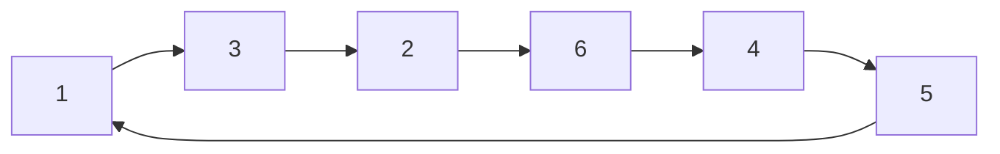

# Fermat 소정리와 Euler 정리

# 개요

Euler 정리는 법 $n$ 과 서로 소인 정수 $a$ 에 대해 $a^{\varphi(n)}\equiv 1 \pmod n$ 이라는 정리이고, Fermat 소정리는 $n$ 이 소수인 경우다. 두 정리는 모듈러 거듭제곱이 지수에 관해 주기적임을 말하며, 근거는 [군](groups.md)의 Lagrange 정리다. 이 주기성을 모듈러 역원 계산, 큰 지수의 축약, RSA 의 정확성, 확률적 소수판정이 쓴다.

# 직관

법 7에서 3의 거듭제곱을 나열한다.

$$
3,\ 2,\ 6,\ 4,\ 5,\ 1,\ 3,\ 2,\dots
$$

6 단계 만에 1 로 돌아오고 그 뒤 반복된다. 가역원이 유한개이므로 거듭제곱열은 반복되고, $3$ 이 가역이므로 순환이 1 에서 시작한다. 순환의 길이는 원소의 위수이고 Lagrange 정리에 의해 군의 크기를 나눈다. 군의 크기가 $\varphi(n)$ 이므로 $\varphi(n)$ 제곱은 1 이다.

# 정의

$n\ge2$ 에 대해 **Euler phi 함수** $\varphi(n)$ 은 $n$ 이하이면서 $n$ 과 서로 소인 양의 정수의 개수다.

$$
\varphi(n)=\char35{}\lbrace\thinspace 1\le k\le n : \gcd(k,n)=1\thinspace\rbrace
$$

[정수의 합동](modular-arithmetic.md)에서 잉여류환 $\mathbb Z/n$ 의 가역원 전체는 곱셈에 대해 군을 이루고 그 크기가 $\varphi(n)$ 이다.

$$
(\mathbb{Z}/n)^{\times}=\lbrace\thinspace\bar a\in\mathbb{Z}/n : \gcd(a,n)=1\thinspace\rbrace,\qquad
\big|(\mathbb{Z}/n)^{\times}\big|=\varphi(n)
$$

## Euler 정리

$$
\gcd(a,n)=1 \ \Longrightarrow\ a^{\varphi(n)}\equiv 1 \pmod{n}
$$

## Fermat 소정리

$p$ 가 [소수](primes.md)이면 $\varphi(p)=p-1$ 이므로 다음이 성립한다. 두 번째 형태는 $a$ 가 $p$ 의 배수일 때도 참이다[^1].

$$
p\nmid a \ \Longrightarrow\ a^{p-1}\equiv 1 \pmod{p},
\qquad
a^{p}\equiv a \pmod{p}\ \ (\forall a\in\mathbb{Z})
$$

# 성질

## 군론적 증명

가역원군 $G=(\mathbb Z/n)^{\times}$ 에서 $a$ 가 생성하는 순환 부분군을 $H$ 라 하자. $|H|$ 는 $a$ 의 위수 $d$ 이고, Lagrange 정리에 의해 $d$ 가 $|G|=\varphi(n)$ 을 나눈다[^2]. $\varphi(n)=dm$ 으로 쓰면

$$
a^{\varphi(n)}=\big(a^{d}\big)^{m}\equiv 1^{m}=1 \pmod{n}
$$

Fermat 소정리는 $n=p$ 인 경우다. $\varphi(n)$ 이 최소 주기는 아니다. 최소 지수는 Carmichael 함수 $\lambda(n)$ 이고 $\varphi(n)$ 을 나눈다. $n=8$ 에서 $\varphi(8)=4$ 이지만 모든 가역원의 제곱이 1 이므로 $\lambda(8)=2$ 다.

## 초등적 증명 (재배열)

$\gcd(a,n)=1$ 이면 사상 $x\mapsto ax$ 가 가역원 집합의 순열이다. 가역원 전체의 곱 $P$ 에 대해

$$
a^{\varphi(n)}P\equiv\prod_{\gcd(k,n)=1}(ak)\equiv P \pmod{n}
$$

이고, $P$ 가 가역이므로 양변에서 소거하면 결론이 나온다. 이 논증은 Lagrange 정리의 특수한 경우를 재현한다.

## 역원과 지수 축약

Euler 정리의 두 귀결이다.

$$
a^{-1}\equiv a^{\varphi(n)-1}\pmod{n},\qquad
a^{e}\equiv a^{\thinspace e \bmod \varphi(n)}\pmod{n}\ \ (\gcd(a,n)=1)
$$

두 번째 식에서 서로 소 조건은 뺄 수 없다. $n=4$ , $a=2$ , $e=2$ 에서 $e \bmod \varphi(4)=0$ 이지만 $2^0=1$ 이고 $2^2\equiv 0$ 이다. 서로 소가 아닌 경우에는 보정된 축약을 쓴다.

$$
e\ \ge\ \log_2 n \ \Longrightarrow\ a^{e}\equiv a^{\thinspace(e \bmod \varphi(n))+\varphi(n)} \pmod{n}
$$

역원 계산은 [유클리드 알고리즘](euclidean-algorithm.md)의 확장형이 더 빠르다.

## $\varphi$ 의 계산

$\varphi$ 는 곱셈적이다. 곱셈성은 [중국인의 나머지 정리](chinese-remainder-theorem.md)가 주는 군 동형에서 따라온다.

$$
\varphi(p^{k})=p^{k}-p^{k-1},\qquad
\varphi(n)=n\prod_{p\mid n}\Big(1-\frac{1}{p}\Big)
$$

## Carmichael 수

Fermat 소정리의 역은 거짓이다. 합성수이면서 자신과 서로 소인 모든 $a$ 에 대해 $a^{n-1}\equiv 1 \pmod n$ 인 수를 **Carmichael 수**라 한다. 가장 작은 것은 다음이고, 이런 수가 무한히 많다는 것을 1994 년에 Alford–Granville–Pomerance 가 증명했다[^4].

$$
561=3\cdot 11\cdot 17
$$

Korselt 판정법에 의해 $n$ 이 Carmichael 수인 것은 $n$ 이 square-free 이고 모든 소인수 $p$ 에 대해 $p-1$ 이 $n-1$ 을 나누는 것과 동치다.

# 활용

## RSA의 정확성

법 $N=pq$ , 공개 지수 $e$ , 비밀 지수 $d$ 가 다음을 만족한다고 하자.

$$
e\thinspace d\equiv 1 \pmod{\varphi(N)}
$$

$ed=1+k\varphi(N)$ 이므로 $\gcd(m,N)=1$ 인 평문에서 Euler 정리가 복호를 준다.

$$
(m^{e})^{d}=m^{1+k\varphi(N)}=m\cdot\big(m^{\varphi(N)}\big)^{k}\equiv m \pmod{N}
$$

$m$ 이 $p$ 나 $q$ 의 배수인 경우도 각 소인수를 법으로 따로 보면 성립한다. 구현은 $\varphi(N)$ 대신 $\mathrm{lcm}(p-1,q-1)$ 을 쓰고 복호를 CRT 로 분할한다.

## 확률적 소수판정

Fermat 판정은 무작위 $a$ 에 대해 $a^{n-1}$ 을 계산하고 1 이 아니면 합성수로 판정한다. 이 판정은 Carmichael 수를 통과시키므로 Miller–Rabin 이 조건을 강화한다. $n-1$ 을 다음과 같이 분해하고

$$
n-1=2^{s}q\quad (q\ \text{홀수})
$$

$n$ 이 홀수 소수이면 $\mathbb Z/n$ 이 체라 1 의 제곱근이 $\pm1$ 뿐이라는 사실을 더 쓴다. 다음 중 하나가 성립해야 한다.

$$
a^{q}\equiv 1,\qquad\text{또는}\qquad \exists\thinspace 0\le i\lt s:\ a^{2^{i}q}\equiv -1 \pmod n
$$

합성수 $n$ 에 대해 이를 통과하는 밑(strong liar)은 최대 $1/4$ 이므로, 독립으로 $k$ 회 반복하면 오류 확률이 $4^{-k}$ 이하다[^3].

밑을 처음 열두 개 소수 $2,3,\dots,37$ 로 고정하면 $2^{64}$ 미만의 모든 $n$ 에 대해 결정론적으로 정확하다.

## 그 밖의 쓰임

- 순환 소수의 주기. $1/p$ 의 십진 전개 주기는 법 $p$ 에서 10 의 위수이고 $p-1$ 을 나눈다.
- 원시근과 이산로그. $(\mathbb Z/p)^{\times}$ 가 순환군이라는 사실이 Diffie–Hellman 키 교환의 기반이고, 위수가 $p-1$ 의 약수라는 제약이 안전한 소수의 선택 기준을 준다.
- 지수 축약. 법 1000 에서 $7^{2024}$ 는 $\varphi(1000)=400$ 이므로 $7^{24}$ 로 줄어든다.

[^1]: Fermat's little theorem, Wikipedia (진술의 두 형태와 Euler 정리로의 일반화). https://en.wikipedia.org/wiki/Fermat%27s_little_theorem
[^2]: D. R. Wilkins, Fermat's Little Theorem (Trinity College Dublin 강의노트 8장), Lagrange 정리로부터의 도출. https://www.maths.tcd.ie/pub/Maths/Courseware/NumberTheory/2016/ch08.pdf
[^3]: Miller–Rabin primality test, Wikipedia (strong liar의 비율이 1/4 이하, Fermat 판정의 한계, 작은 밑 집합의 결정론적 범위). https://en.wikipedia.org/wiki/Miller%E2%80%93Rabin_primality_test
[^4]: Carmichael number, Wikipedia (561이 최소, Korselt 판정법, Alford–Granville–Pomerance 1994의 무한성 증명). https://en.wikipedia.org/wiki/Carmichael_number

# 연관 문서

## 선수지식

- [정수의 합동과 나머지 연산](modular-arithmetic.md)
- [군](groups.md)
- [소수와 유일분해](primes.md)

## 더 알아보기

- [RSA 암호](rsa-cryptosystem.md)
- [이차 상호법칙](quadratic-reciprocity.md)

#number_theory #theorem
