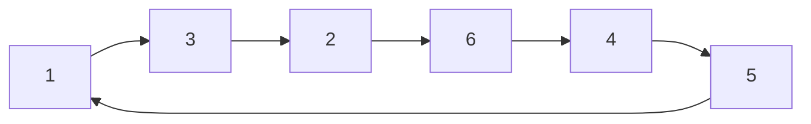

# Fermat 소정리와 Euler 정리

# 개요

Euler 정리는 법 n과 서로 소인 정수 a에 대해 a의 phi(n)제곱이 법 n에서 1과 합동이라는 정리이고, Fermat 소정리는 n이 소수인 특수한 경우다. 두 정리의 내용은 "모듈러 거듭제곱은 지수에 관해 주기적"이라는 것이며, 근거는 [군](groups.md)에서의 Lagrange 정리 하나다. 이 주기성이 모듈러 역원 계산, 큰 지수의 축약, RSA의 정확성, 확률적 소수판정의 토대가 된다. 정수론적 계산을 유한군의 구조 문제로 바꿔 놓는 첫 지점이라는 점에서 중요하다.

# 직관

법 7에서 3의 거듭제곱을 나열한다.

$$
3,\ 2,\ 6,\ 4,\ 5,\ 1,\ 3,\ 2,\dots
$$

6단계 만에 1로 돌아오고 그 뒤 반복된다. 가역원이 유한개뿐이므로 거듭제곱열은 언젠가 반복될 수밖에 없고, 가역이므로 "언젠가"가 아니라 정확히 1에서 순환이 시작된다. 순환의 길이는 원소의 위수이고, Lagrange 정리에 의해 군 전체의 크기를 나눈다. 군의 크기가 phi(n)이므로 phi(n)제곱은 항상 1이다.



# 정의

n을 2 이상의 정수라 하자. Euler phi 함수는 n 이하의 n과 서로 소인 양의 정수의 개수다.

$$
\varphi(n)=\char35{}\lbrace\thinspace 1\le k\le n : \gcd(k,n)=1\thinspace\rbrace
$$

[정수의 합동](modular-arithmetic.md)에서 잉여류환 Z/n의 가역원 전체는 곱셈에 대해 군을 이루며, 그 크기가 phi(n)이다.

$$
(\mathbb{Z}/n)^{\times}=\lbrace\thinspace\bar a\in\mathbb{Z}/n : \gcd(a,n)=1\thinspace\rbrace,\qquad
\big|(\mathbb{Z}/n)^{\times}\big|=\varphi(n)
$$

## Euler 정리

$$
\gcd(a,n)=1 \ \Longrightarrow\ a^{\varphi(n)}\equiv 1 \pmod{n}
$$

## Fermat 소정리

p를 [소수](primes.md)라 하면 phi(p) = p - 1이므로 다음이 성립하고, 두 번째 형태는 a가 p의 배수일 때도 참이다[^1].

$$
p\nmid a \ \Longrightarrow\ a^{p-1}\equiv 1 \pmod{p},
\qquad
a^{p}\equiv a \pmod{p}\ \ (\forall a\in\mathbb{Z})
$$

# 성질

## 군론적 증명

가역원군 G = (Z/n)^× 안에서 원소 a가 생성하는 순환 부분군 H를 생각한다. H의 크기는 a의 위수 d이고, Lagrange 정리에 의해 d는 |G| = phi(n)을 나눈다[^2]. phi(n) = d m으로 쓰면

$$
a^{\varphi(n)}=\big(a^{d}\big)^{m}\equiv 1^{m}=1 \pmod{n}
$$

Fermat 소정리는 n = p를 대입한 것이다. 이 증명은 phi(n)이 최소 주기라고 주장하지 않는다. 실제 최소 지수는 Carmichael 함수 lambda(n)이며 phi(n)을 나눈다. 예를 들어 n = 8에서 phi(8) = 4이지만 모든 가역원의 제곱이 1이므로 lambda(8) = 2다.

## 초등적 증명 (재배열)

군론을 쓰지 않는 표준 증명도 있다. gcd(a, n) = 1이면 사상 x → a x 는 가역원 집합의 순열이다. 따라서 가역원 전체의 곱 P에 대해

$$
a^{\varphi(n)}P\equiv\prod_{\gcd(k,n)=1}(ak)\equiv P \pmod{n}
$$

P가 가역이므로 양변에서 소거하면 결론이 나온다. 사실 이 논증이 Lagrange 정리의 특수한 경우를 직접 재현한 것이다.

## 역원과 지수 축약

Euler 정리의 가장 실용적인 귀결 두 개다.

$$
a^{-1}\equiv a^{\varphi(n)-1}\pmod{n},\qquad
a^{e}\equiv a^{\thinspace e \bmod \varphi(n)}\pmod{n}\ \ (\gcd(a,n)=1)
$$

두 번째 식에서 gcd 조건은 빠뜨릴 수 없다. n = 4, a = 2, e = 2에서 e mod phi(4) = 0이지만 2의 0제곱은 1이고 2의 2제곱은 0이다. 서로 소가 아닌 경우에는 지수를 0으로 떨어뜨리지 않는 보정된 축약을 쓴다. 지수가 충분히 클 때 다음이 성립한다.

$$
e\ \ge\ \log_2 n \ \Longrightarrow\ a^{e}\equiv a^{\thinspace(e \bmod \varphi(n))+\varphi(n)} \pmod{n}
$$

역원 계산 자체는 [유클리드 알고리즘](euclidean-algorithm.md)의 확장형이 더 빠르다.

## phi의 계산

phi는 곱셈적이고 소수 거듭제곱에서 값이 간단하다. 곱셈성은 [중국인의 나머지 정리](chinese-remainder-theorem.md)가 주는 군 동형에서 따라온다.

$$
\varphi(p^{k})=p^{k}-p^{k-1},\qquad
\varphi(n)=n\prod_{p\mid n}\Big(1-\frac{1}{p}\Big)
$$

## 역이 성립하지 않는다

Fermat 소정리의 역은 거짓이다. 합성수 n이면서 자신과 서로 소인 모든 a에 대해 a의 (n-1)제곱이 1과 합동인 수가 존재하며, Carmichael 수라 부른다. 가장 작은 것은 다음이고, 무한히 많다는 사실은 1994년에 Alford–Granville–Pomerance가 증명했다[^4].

$$
561=3\cdot 11\cdot 17
$$

Korselt 판정법에 의해 n이 Carmichael 수인 것은 n이 square-free이고 n의 모든 소인수 p에 대해 p - 1이 n - 1을 나누는 것과 동치다.

# 활용

## RSA의 정확성

법 N = p q, 공개 지수 e, 비밀 지수 d가 다음을 만족한다고 하자.

$$
e\thinspace d\equiv 1 \pmod{\varphi(N)}
$$

그러면 e d = 1 + k phi(N)이므로 gcd(m, N) = 1인 평문에서 Euler 정리로 복호가 확인된다.

$$
(m^{e})^{d}=m^{1+k\varphi(N)}=m\cdot\big(m^{\varphi(N)}\big)^{k}\equiv m \pmod{N}
$$

m이 p 또는 q의 배수인 예외적 경우도 각 소인수를 법으로 따로 확인하면 여전히 성립한다. 실제 구현은 phi(N) 대신 lcm(p-1, q-1)을 쓰고 복호는 CRT로 분할한다.

## 확률적 소수판정

Fermat 판정은 무작위 a에 대해 a의 (n-1)제곱을 확인하고 1이 아니면 합성수라고 단정한다. Carmichael 수를 통과시키므로 Miller–Rabin은 조건을 강화한다. 홀수 n - 1을 2의 거듭제곱과 홀수로 분해해

$$
n-1=2^{s}q\quad (q\ \text{홀수})
$$

n이 홀수 소수이면 Z/n이 체이므로 1의 제곱근은 1과 -1뿐이라는 사실을 추가로 쓴다. 즉 다음 중 하나가 성립해야 한다.

$$
a^{q}\equiv 1,\qquad\text{또는}\qquad \exists\thinspace 0\le i<s:\ a^{2^{i}q}\equiv -1 \pmod n
$$

합성수 n에 대해 이를 통과하는 밑 a("strong liar")는 n - 1 중 최대 1/4이므로, 독립적으로 k회 반복하면 오류 확률이 4의 -k제곱 이하다[^3].

```python
def miller_rabin(n, bases=(2, 3, 5, 7, 11, 13, 17, 19, 23, 29, 31, 37)):
    if n < 2: return False
    for p in bases:
        if n % p == 0: return n == p
    s, q = 0, n - 1
    while q % 2 == 0:
        s, q = s + 1, q // 2
    for a in bases:
        x = pow(a, q, n)
        if x in (1, n - 1): continue
        for _ in range(s - 1):
            x = x * x % n
            if x == n - 1: break
        else:
            return False
    return True
```

위 고정 밑 집합은 2^64 미만의 모든 n에 대해 결정론적으로 정확하다고 알려져 있다.

## 그 밖에

- 순환 소수의 주기. 1/p의 십진 전개 주기는 법 p에서 10의 위수이고 p - 1을 나눈다.
- 원시근과 이산로그. (Z/p)^×가 순환군이라는 사실이 Diffie–Hellman 키 교환의 기반이며, 위수가 p - 1의 약수라는 제약이 안전한 소수 선택 기준을 준다.
- 지수 축약을 통한 거대 거듭제곱 계산. 예를 들어 법 1000에서 7의 2024제곱은 phi(1000) = 400이므로 7의 24제곱으로 줄어든다.

[^1]: Fermat's little theorem, Wikipedia (진술의 두 형태와 Euler 정리로의 일반화). https://en.wikipedia.org/wiki/Fermat%27s_little_theorem
[^2]: D. R. Wilkins, Fermat's Little Theorem (Trinity College Dublin 강의노트 8장), Lagrange 정리로부터의 도출. https://www.maths.tcd.ie/pub/Maths/Courseware/NumberTheory/2016/ch08.pdf
[^3]: Miller–Rabin primality test, Wikipedia (strong liar의 비율이 1/4 이하, Fermat 판정의 한계, 작은 밑 집합의 결정론적 범위). https://en.wikipedia.org/wiki/Miller%E2%80%93Rabin_primality_test
[^4]: Carmichael number, Wikipedia (561이 최소, Korselt 판정법, Alford–Granville–Pomerance 1994의 무한성 증명). https://en.wikipedia.org/wiki/Carmichael_number

# 연관 문서

## 선수지식

- [정수의 합동과 나머지 연산](modular-arithmetic.md)
- [군](groups.md)
- [소수와 유일분해](primes.md)

## 더 알아보기

- [RSA 암호](rsa-cryptosystem.md)
- [이차 상호법칙](quadratic-reciprocity.md)

#number_theory #theorem
