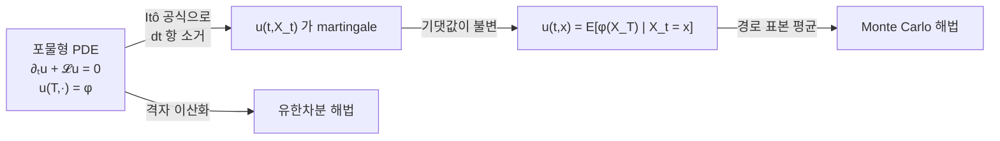

# Feynman–Kac 공식

# 개요

열방정식과 Brown 운동은 같은 것을 두 언어로 말한다. 열이 퍼지는 모습은 수많은 입자가 무작위로 돌아다니는 모습이고, 온도는 입자가 거기 있을 확률이다. 이 대응이 우연이 아니라 정리라는 것을 Feynman–Kac 공식이 말한다.

정확히는 포물형 편미분방정식의 해가 확산 과정에 대한 기댓값으로 쓰인다. 방정식을 풀지 않고 경로를 뽑아 평균하면 해의 값이 나온다. 거꾸로 기댓값을 계산해야 할 때 방정식을 풀어도 된다.

증명의 핵심은 [Itô 공식](ito-calculus.md) 한 줄이다. 해에 Itô 공식을 적용하면 `dt` 항이 방정식 때문에 정확히 0 이 되고, 남은 확률적분이 martingale 이므로 기댓값이 시간에 대해 변하지 않는다. [Girsanov 정리](girsanov.md)가 표류를 지워 martingale 을 만든 것이라면, 여기서는 방정식이 그 일을 한다. 금융에서 Black–Scholes 방정식과 위험중립 기댓값이 같은 답을 주는 이유가 바로 이 공식이다.

# 직관

## 방정식이 표류를 정확히 상쇄한다

풀고 싶은 방정식의 해를 `u(t,x)` 라 하고, 확산 과정 `X` 를 따라가며 `u(t,X_t)` 를 보자. Itô 공식은 이 값의 변화를 두 부분으로 나눈다.

$$
du(t,X_t)=\underbrace{\Big(\partial_tu+b\,\partial_xu+\tfrac12\sigma^2\partial_x^2u\Big)dt}_{\text{표류}}+\underbrace{\sigma\,\partial_xu\,dB_t}_{\text{요동}}
$$

그런데 괄호 안이 정확히 풀려는 방정식의 좌변이다. `u` 가 해라면 이 항이 0 이므로 표류가 사라지고, `u(t,X_t)` 가 martingale 이 된다.

martingale 이면 기댓값이 시간에 무관하므로, 지금 값과 만기 값의 기댓값이 같다.

$$
u(t,x)=\mathbb E\big[u(T,X_T)\mid X_t=x\big]=\mathbb E\big[\varphi(X_T)\mid X_t=x\big]
$$

만기 조건 `u(T,\cdot)=\varphi` 만 알면 오른쪽은 계산 가능한 기댓값이다. 방정식을 푸는 일이 경로를 뽑아 평균하는 일로 바뀐다.



## 소멸항은 생존 확률이다

방정식에 `-c(x)u` 항이 있으면 기댓값 안에 `\exp(-\int c\,ds)` 가 붙는다. 이 인자를 확률로 읽을 수 있다. 입자가 비율 `c(x)` 로 소멸한다고 하면, 만기까지 살아남을 확률이 정확히 그 지수다. 즉 소멸항이 있는 방정식의 해는 "살아남은 입자들만 센 기댓값" 이다.

금융에서 같은 인자가 할인 계수로 나타난다. 이자율 `r` 로 할인하는 것과 비율 `r` 로 소멸하는 것이 수식에서 구별되지 않는다.

## 왜 고차원에서 유용한가

유한차분법은 각 축을 `N` 등분하므로 `d` 차원에서 격자점이 `N^d` 개다. 10 차원만 되어도 계산이 불가능하다. 반면 Monte Carlo 오차는 `1/\sqrt{M}` 이고 `M` 은 경로 수이므로 차원에 직접 의존하지 않는다.

대신 얻는 것이 다르다. 유한차분법은 모든 격자점의 해를 한 번에 주고, Monte Carlo 는 지정한 한 점 `(t,x)` 의 해만 준다. 필요한 것이 한 점의 값이면 후자가 압도적으로 유리하다.

# 정의

## 생성원

`d` 차원 확산 과정

$$
dX_t=b(t,X_t)\,dt+\sigma(t,X_t)\,dB_t
$$

의 생성원을 다음 이차 미분연산자로 정의한다.

$$
\mathcal L_t f(x)=\sum_ib_i(t,x)\,\partial_if(x)+\frac12\sum_{i,j}\big(\sigma\sigma^{\mathsf T}\big)_{ij}(t,x)\,\partial_i\partial_jf(x)
$$

`X` 가 표준 Brown 운동이면 `\mathcal L = \tfrac12\Delta` 이므로 생성원이 Laplace 연산자의 절반이다. 열방정식과 Brown 운동의 대응이 여기서 나온다.

## 정리

`c \ge 0` 와 `g` 가 주어졌을 때 다음 종단값 문제를 생각한다.

$$
\partial_tu+\mathcal L_tu-c(t,x)\,u+g(t,x)=0,\qquad u(T,x)=\varphi(x)
$$

적절한 정칙성과 성장 조건 아래에서 해는 다음과 같다.

$$
u(t,x)=\mathbb E^{t,x}\left[\varphi(X_T)\,e^{-\int_t^Tc(s,X_s)ds}+\int_t^Tg(r,X_r)\,e^{-\int_t^rc(s,X_s)ds}\,dr\right]
$$

여기서 `\mathbb E^{t,x}` 는 `X_t = x` 에서 출발한 확산에 대한 기댓값이다. `c = 0`, `g = 0` 이면 앞 절의 단순한 꼴로 돌아간다.

## 시간 방향

방정식은 종단 조건에서 과거로 푼다. 초기값 문제로 보고 싶으면 `v(t,x) = u(T-t,x)` 로 시간을 뒤집으면 `\partial_tv = \mathcal Lv` 가 된다. 확산의 기댓값은 언제나 "미래를 보고 현재를 평가" 하는 구조이므로 종단값 문제가 자연스러운 형태다.

# 성질

## 증명

`c = g = 0` 인 경우로 보인다. `u` 가 해이고 충분히 매끄럽다고 가정한다. `Y_s = u(s,X_s)` 에 Itô 공식을 적용하면

$$
dY_s=\big(\partial_su+\mathcal L_su\big)(s,X_s)\,ds+\big(\nabla u\big)^{\mathsf T}\sigma\,dB_s=\big(\nabla u\big)^{\mathsf T}\sigma\,dB_s
$$

이다. 첫 항이 방정식 때문에 사라졌다. 양변을 `t` 에서 `T` 까지 적분하고 기댓값을 취하면, 확률적분의 기댓값이 0 이므로

$$
\mathbb E^{t,x}[u(T,X_T)]=u(t,x)
$$

를 얻고 `u(T,\cdot)=\varphi` 를 대입하면 끝난다.

일반적인 `c`, `g` 에 대해서는 `Y_s = u(s,X_s)e^{-\int_t^sc\,dr} + \int_t^s g\,e^{-\int_t^rc}\,dr` 로 잡으면 같은 계산이 된다. 지수 인자를 미분할 때 나오는 `-cu\,ds` 와 적분 항에서 나오는 `g\,ds` 가 방정식의 남은 두 항을 정확히 상쇄한다.

## 검증 정리이지 존재 정리가 아니다

위 논증은 해가 이미 존재하고 매끄럽다는 가정에서 그 해가 기댓값과 같음을 보인다. 확률적분의 기댓값이 0 이라는 단계에서 `\nabla u` 에 대한 적분가능성 조건도 필요하다.

거꾸로 기댓값으로 정의된 함수가 방정식을 만족한다는 방향은 별도의 논증이며, 확산이 퇴화하지 않는다는 조건이 들어간다. `\sigma\sigma^{\mathsf T}` 가 일정하게 양정의면 열방정식의 매끄럽게 하는 성질 덕분에 기댓값이 자동으로 매끄러워진다. 퇴화하는 경우 기댓값은 잘 정의되지만 고전적 해가 아니라 점성 해의 의미에서만 방정식을 만족할 수 있다.

## Kolmogorov 방정식과의 관계

`\varphi` 를 지시함수로 두면 `u(t,x) = \Pr(X_T \in A \mid X_t = x)` 이므로, Feynman–Kac 은 전이확률이 만족하는 Kolmogorov 후방방정식의 일반화다. 전이밀도가 `x` 가 아니라 도착점에 대해 만족하는 방정식이 전방방정식, 즉 Fokker–Planck 방정식이고, 이쪽은 생성원의 수반연산자를 쓴다.

| 대상 | 방정식 | 변수 |
|---|---|---|
| 기댓값 `u(t,x)` | `\partial_tu+\mathcal Lu=0` | 출발점, 시간을 거슬러 |
| 밀도 `p(t,y)` | `\partial_tp=\mathcal L^{*}p` | 도착점, 시간 순으로 |

## 확률적 표현이 주는 것

방정식의 성질 몇 가지가 기댓값 표현에서 즉시 읽힌다.

- 최대원리. `\varphi \le M` 이고 `c \ge 0`, `g = 0` 이면 기댓값도 `M` 이하다.
- 비음성. `\varphi \ge 0` 이면 `u \ge 0` 이다. 기댓값이 음수가 될 수 없다.
- 비교원리. `\varphi_1 \le \varphi_2` 이면 `u_1 \le u_2` 다.

편미분방정식 쪽에서 따로 증명해야 하는 정리들이 확률 표현에서는 기댓값의 단조성으로 한 줄에 나온다.

## 이산 대응

무작위 행보와 조화함수 사이에도 같은 구조가 있다. 격자에서 `u(x)` 가 이웃 평균과 같다는 이산 Laplace 방정식은 `u(X_n)` 이 martingale 이라는 것과 동치이고, 경계값 문제의 해는 "경계에 처음 닿는 지점에서의 경계값의 기댓값" 이다. Feynman–Kac 은 이 관찰의 연속시간 판이며, 소멸항이 있는 경우까지 확장한 것이다.

## 수치로 확인

Black–Scholes 방정식의 해를 닫힌 꼴과 Monte Carlo 로 각각 구해 비교한다.

```python
import math, random

def bs_call(S0, K, r, sig, T):
    """PDE 쪽: Black-Scholes 방정식의 닫힌 해."""
    N = lambda z: 0.5 * (1 + math.erf(z / math.sqrt(2)))
    d1 = (math.log(S0 / K) + (r + sig**2 / 2) * T) / (sig * math.sqrt(T))
    d2 = d1 - sig * math.sqrt(T)
    return S0 * N(d1) - K * math.exp(-r * T) * N(d2)

def mc_call(S0, K, r, sig, T, trials, seed=3):
    """확률 쪽: 위험중립측도 아래 할인된 기댓값."""
    rng = random.Random(seed)
    tot = 0.0
    for _ in range(trials):
        z = rng.gauss(0, 1)
        ST = S0 * math.exp((r - sig**2 / 2) * T + sig * math.sqrt(T) * z)
        tot += max(ST - K, 0.0)
    return math.exp(-r * T) * tot / trials

args = (100.0, 105.0, 0.03, 0.25, 1.0)
print(round(bs_call(*args), 4), round(mc_call(*args, trials=400000), 4))
# 9.1218 9.1216
```

같은 값이 나온다. 왼쪽은 방정식의 해이고 오른쪽은 기댓값이며, 둘이 같다는 것이 Feynman–Kac 의 내용이다. 할인 계수 `e^{-rT}` 가 정리의 소멸항 `c = r` 에 해당한다.

# 활용

## Black–Scholes 의 두 얼굴

파생상품 가격을 얻는 길이 둘이다. 복제 포트폴리오를 구성해 방정식을 세우고 푸는 길과, [Girsanov 정리](girsanov.md)로 위험중립측도를 만들어 할인된 기댓값을 계산하는 길이다.

$$
\partial_tV+rS\,\partial_SV+\tfrac12\sigma^2S^2\partial_S^2V-rV=0\qquad\Longleftrightarrow\qquad V_t=e^{-r(T-t)}\,\mathbb E_Q\big[\Phi(S_T)\big]
$$

Feynman–Kac 이 이 동치를 정리로 만들어 준다. 좌변의 `-rV` 가 우변의 할인 계수이고, 좌변의 표류 `rS` 가 위험중립측도의 표류다. 어느 쪽으로 계산해도 같은 답이 나온다는 보장이 있으므로 문제에 편한 쪽을 고르면 된다.

경로에 의존하는 지급이나 고차원 바스켓에서는 기댓값 쪽이, 조기 행사가 있는 미국형에서는 방정식 쪽이 유리하다.

## 고차원 방정식의 Monte Carlo 해법

수십 또는 수백 차원의 포물형 방정식은 격자법으로 접근할 수 없다. 특정 지점의 값만 필요하면 경로를 뽑아 평균하는 편이 유일한 현실적 방법이다. 확률 표현 덕분에 차원의 저주를 우회한다.

최근에는 신경망으로 해를 근사하면서 Feynman–Kac 의 확률 표현을 손실함수로 쓰는 방법이 쓰인다. 후방 확률미분방정식으로 정식화한 deep BSDE 계열이 그 예다.

## 물리에서의 기원

Feynman 의 경로적분은 양자역학의 전파자를 경로에 대한 합으로 쓴다. 시간을 허수로 돌리면 진동하는 위상이 감쇠하는 지수로 바뀌어 수학적으로 다룰 수 있는 측도가 되고, 그 결과가 Kac 의 정리다. 허수시간 회전이 양자역학과 확산을 잇는 표준적 장치이며, 격자 양자색역학의 Monte Carlo 계산이 그 위에 서 있다.

소멸항 `c` 를 위치에너지로 읽으면 Schrödinger 연산자의 스펙트럼을 확산 과정의 기댓값으로 연구할 수 있다. 바닥상태 에너지를 큰 시간 극한의 지수 감쇠율로 얻는 방법이 여기서 나온다.

# 연관 문서

## 선수지식

- [Girsanov 정리](girsanov.md)

## 더 알아보기

아직 연결한 문서가 없다.

#probability #analysis #theorem
