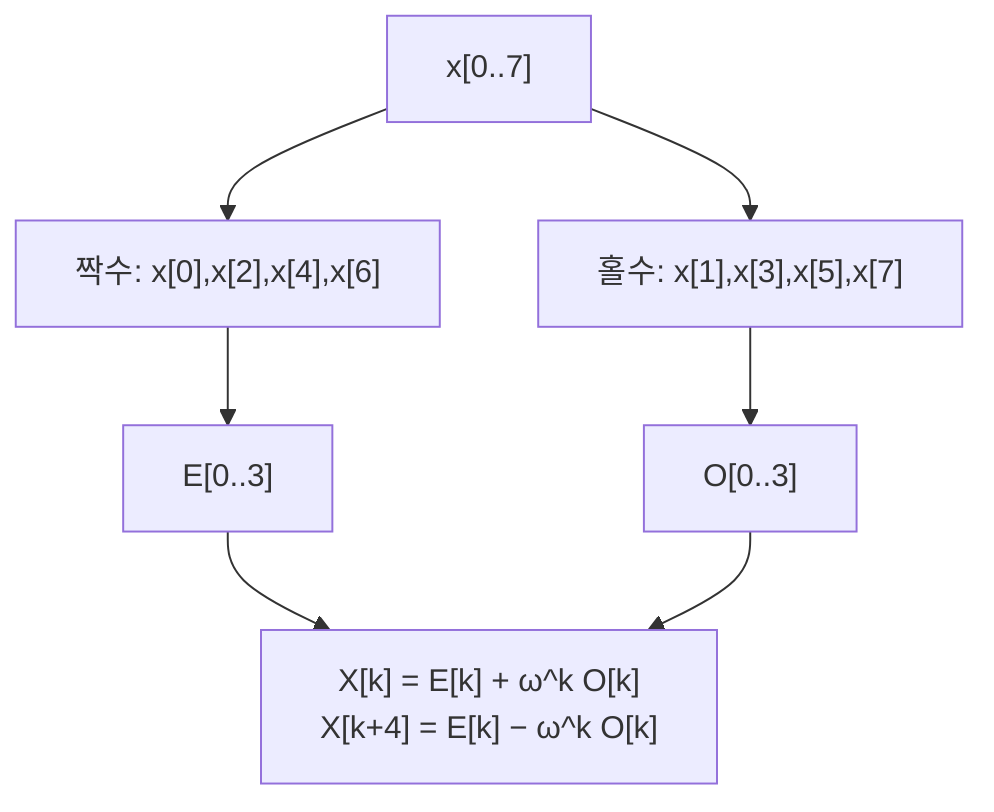

# 고속 Fourier 변환과 합성곱

# 개요

[이산 Fourier 변환](fourier.md)은 정의를 그대로 쓰면 $N$ 개의 출력마다 $N$ 번의 곱셈이 필요해 $O(N^2)$ 이다. 길이가 백만이면 계산량이 조 단위가 되어 실용성이 없다.

고속 Fourier 변환은 같은 값을 $O(N\log N)$ 에 계산한다. 길이 백만에서 $10^{12}$ 가 $2\times10^7$ 로 줄어든다.

근거는 단위근의 대칭성이다. $\omega^{2k}$ 가 절반 크기 문제의 단위근이므로 짝수 항과 홀수 항으로 나눈 두 부분문제가 원래와 같은 모양이 된다. 합성곱 정리를 더하면 다항식 곱셈과 큰 정수 곱셈도 $O(N\log N)$ 이 된다.

# 직관

## 단위근의 반감

$\omega = e^{-2\pi i/N}$ 의 제곱은 $e^{-2\pi i/(N/2)}$ 로, 정확히 절반 길이의 단위근이다. 그래서 입력을 짝수 인덱스와 홀수 인덱스로 나누면 각각이 길이 $N/2$ 의 같은 문제가 된다.

$$
X[k]=\underbrace{\sum_{t\text{ 짝수}}x[t]\omega^{kt}}\_{E[k]}+\omega^k\underbrace{\sum_{t\text{ 홀수}}x[t']\omega^{kt'}}\_{O[k]}
$$

$\omega^{k+N/2} = -\omega^k$ 를 쓰면 나머지 절반이 추가 곱셈 없이 나온다.

$$
X[k]=E[k]+\omega^kO[k],\qquad X[k+N/2]=E[k]-\omega^kO[k]
$$

두 값을 한꺼번에 만드는 이 두 줄이 **나비 연산**이다. 재귀식 $T(N) = 2T(N/2) + O(N)$ 에서 $O(N\log N)$ 이 나온다.

## 중복 계산의 제거

소박한 계산은 $\omega^{kt}$ 를 $N^2$ 개의 쌍마다 따로 곱한다. $\omega$ 의 거듭제곱은 $N$ 개뿐이고 같은 부분합이 여러 출력에 반복해 나타난다. FFT 는 그 부분합을 한 번만 계산해 재사용한다.

## 합성곱과 성분별 곱

두 수열의 순환 합성곱은 정의대로 하면 $O(N^2)$ 이다. Fourier 기저에서는 순환 이동이 대각화되어 합성곱이 성분별 곱이 된다.

$$
\mathcal F(x\asty)=\mathcal F(x)\cdot\mathcal F(y)
$$

변환하고 곱하고 되돌리면 $O(N\log N)$ 이다. 다항식 곱셈이 합성곱이므로 다항식과 큰 정수의 곱셈이 같은 방법으로 빨라진다.

# 정의

## Cooley–Tukey 기수 2

$N = 2^m$ 일 때 위의 분할을 재귀적으로 적용한다. 시간 영역에서 나누면 시간 솎음, 주파수 영역에서 나누면 주파수 솎음이라 하며 연산량은 같다.

재귀를 펴면 반복형이 된다. 입력을 인덱스의 비트를 뒤집은 순서로 재배열한 뒤 길이 2 부터 $N$ 까지 두 배씩 키우며 나비 연산을 적용한다. 추가 배열이 없어 제자리 계산이 가능하다.

## 비트 반전 순열

재귀에서 짝수와 홀수를 나누는 것은 인덱스의 최하위 비트로 나누는 것이다. $\log N$ 번 반복하면 최종 위치가 원래 인덱스의 비트를 뒤집은 값이 된다. $N = 8$ 에서 $1 = 001_2$ 은 $100_2 = 4$ 로 간다.

## 임의 길이

| 상황 | 방법 | 비용 |
|---|---|---|
| $N = 2^m$ | 기수 2 Cooley–Tukey | $O(N\log N)$ |
| $N = N_1N_2$ | 혼합 기수 | $O(N\log N)$ |
| $N$ 이 소수 | Rader: 곱셈군의 생성원으로 순환 합성곱으로 변환 | $O(N\log N)$ |
| 임의의 $N$ | Bluestein: $kt = \binom{k}{2}+\binom{t}{2}-\binom{k-t}{2}$ 로 합성곱화 | $O(N\log N)$ |

실무 라이브러리는 길이의 소인수분해를 보고 여러 기수를 섞어 쓴다. 길이를 2 의 거듭제곱으로 맞추는 0 채우기는 신호의 의미를 바꿀 수 있다.

# 성질

## 역변환

역변환은 지수의 부호를 바꾸고 $N$ 으로 나눈 것이므로 같은 루틴에 부호 인자만 바꿔 넘긴다. 입력의 켤레를 취해 정변환하고 결과의 켤레를 취해도 된다.

## 선형 합성곱과 순환 합성곱

Fourier 변환이 주는 것은 순환 합성곱이고, 길이 $N$ 을 넘는 항이 앞으로 되돌아와 겹친다.

다항식 곱셈처럼 선형 합성곱이 필요하면 결과 길이가 $\deg p + \deg q + 1$ 이상이 되도록 0 을 채운다. 위 구현의 $n$ 이 그 값이다. 이 단계를 빠뜨리면 높은 차수 항이 낮은 차수로 접혀 들어온다.

긴 신호를 짧은 필터와 합성곱할 때는 신호를 토막 내는 중첩 가산이나 중첩 저장 방식을 쓴다. 전체를 한 번에 변환하는 것보다 메모리와 지연이 유리하다.

## 수치 정밀도

부동소수점 FFT 의 상대오차는 $O(\epsilon\log N)$ 으로 자라고, 소박한 $O(N^2)$ 계산의 $O(\epsilon N)$ 보다 작다. 연산 수가 적어 오차도 적게 쌓인다.

정수 결과를 반올림으로 얻을 때는 계수와 길이가 커지면 오차가 $0.5$ 를 넘어 반올림이 틀린다. 정확한 결과가 필요하면 아래의 수론 변환을 쓴다.

## 수론 변환

복소 단위근 대신 유한체나 $\mathbb Z/p\mathbb Z$ 의 $N$ 차 원시 단위근을 쓰면 같은 알고리즘이 정수 산술만으로 돌아가고 반올림 오차가 없다.

$p = 998244353 = 119\cdot2^{23}+1$ 처럼 $p-1$ 이 큰 2 의 거듭제곱을 인수로 갖는 소수를 쓴다. 그래야 큰 $N$ 에 대한 원시 단위근이 존재한다. 계수가 $p$ 를 넘으면 서로 다른 소수 여럿으로 계산한 뒤 [중국인의 나머지 정리](chinese-remainder-theorem.md)로 합친다.

격자 기반 암호의 다항식 연산과 큰 정수 라이브러리가 이 변환을 쓴다.

## 실수 입력

실수 입력이면 $X[N-k]=\overline{X[k]}$ 이므로 출력의 절반이 잉여다. 길이 $N$ 실수 배열을 길이 $N/2$ 복소 배열로 묶어 변환한 뒤 후처리로 분리하면 비용이 절반이 된다.

## 다른 변환으로의 확장

이산 코사인 변환과 이산 사인 변환은 입력을 대칭으로 확장한 뒤 FFT 를 써서 같은 복잡도로 계산한다. 코사인 변환은 실수 계수만 나오고 에너지가 낮은 주파수에 몰려 JPEG 과 MP3 에 쓰인다.

여러 차원에서는 각 축에 대해 차례로 1 차원 변환을 적용해 $N^d$ 개의 원소를 $O(N^d\log N)$ 에 처리한다. 이미지와 3 차원 물리 시뮬레이션이 이 형태를 쓴다.

## 복잡도의 하한

지금까지 알려진 알고리즘의 최선은 $O(N\log N)$ 이다. 계수의 크기를 제한한 산술회로 모형에서는 Morgenstern 이 $\Omega(N\log N)$ 하한을 증명했다[^1]. 제한을 풀면 이 논법의 근거인 행렬식 증가율 논증이 통하지 않는다.

정수 곱셈에서는 Schönhage–Strassen 의 $O(n\log n\log\log n)$ 을 거쳐 Harvey 와 van der Hoeven 이 $O(n\log n)$ 을 달성했다. 이 알고리즘들은 임계 크기가 커서 실무에서는 단순한 FFT 기반 곱셈을 쓴다.

# 활용

## 신호 처리와 영상 압축

스펙트럼 분석, 필터링, 잡음 제거, 압축이 변환을 거친다. 시간 영역에서 $O(NM)$ 인 필터링이 주파수 영역에서 $O(N\log N)$ 이 되어 필터가 길수록 이득이 크다.

## 큰 수와 다항식의 곱셈

$n$ 자리 정수를 계수 배열로 보면 곱셈이 합성곱이고, 필산의 $O(n^2)$ 이 $O(n\log n)$ 으로 내려간다. 원주율을 수조 자리까지 계산하는 기록이 이 방법을 쓴다.

와일드카드가 있는 패턴 매칭도 합성곱 몇 번으로 환원된다.

## 편미분방정식의 스펙트럼 해법

주기 경계조건에서 미분이 Fourier 계수에 $2\pi ik/L$ 을 곱하는 연산이 되므로 미분방정식이 각 주파수마다 독립인 상미분방정식으로 분해된다. 유체 시뮬레이션과 파동 방정식의 스펙트럼 해법이 이 원리를 쓰고, 격자점 수에 대해 지수적으로 정확하다.

## 대각화 전략의 다른 사례

어려운 연산을 대각화하는 기저로 옮겨 성분별로 처리하고 되돌리는 형태를 순환 구조가 있는 선형 문제들이 공유한다. 순환행렬의 역행렬, Toeplitz 계의 빠른 해법, 유한 아벨군 위의 합성곱이 그 예다.

[^1]: J. Morgenstern, *Note on a lower bound on the linear complexity of the fast Fourier transform*, Journal of the ACM **20** (1973), 305–306. 계수의 절댓값을 제한한 선형회로에서 하한을 행렬식의 증가율로 얻는다.

# 연관 문서

## 선수지식

- [이산 Fourier 변환](fourier.md)

## 더 알아보기

아직 연결한 문서가 없다.

#algorithms #analysis #computation
