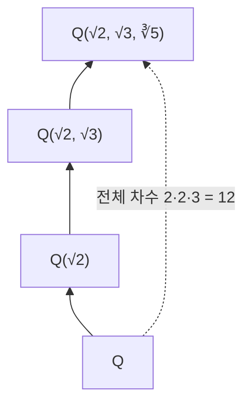

# 체의 확대

# 개요

체의 확대는 작은 [체](fields.md) $k$ 가 큰 체 $K$ 의 부분체일 때 이 쌍을 하나의 대상으로 보는 관점이다. 핵심 착상은 $K$ 를 $k$ 위의 [벡터 공간](vector-spaces.md)으로 읽는 것이다. 그러면 확대의 크기를 차원, 즉 확대 차수라는 정수 불변량으로 측정할 수 있고, 대수 문제가 선형대수 문제로 번역된다.

두 번째 착상은 [다항식환](polynomial-rings.md)과의 사전(dictionary)이다. 기약다항식으로 몫을 취하면 그 근을 품은 확대가 얻어지고, 반대로 확대체의 원소는 자기를 소멸시키는 최소다항식을 가진다. 이 사전 덕분에 "이 방정식의 해가 어떤 체에 사는가"라는 질문이 "어떤 차수의 확대를 쌓아야 하는가"로 바뀐다. 컴퍼스와 직선자 작도의 불가능성 증명과 [Galois 이론](galois-theory.md)이 그 직접적 귀결이다.

# 직관

$\mathbb{Q}$ 에 $2$ 의 제곱근을 넣으면 $a+b\sqrt2$ 꼴의 수 전체가 필요해진다. 곱셈에서 $2$ 가 다시 유리수로 돌아오므로 이보다 큰 집합은 필요하지 않다. 즉 $\mathbb{Q}(\sqrt2)$ 는 $\mathbb{Q}$ 위에서 $1$ 과 $\sqrt2$ 를 기저로 갖는 2차원 벡터 공간이다.

$$
\mathbb{Q}(\sqrt2)=\lbrace a+b\sqrt2: a,b\in\mathbb{Q}\rbrace,\qquad [\mathbb{Q}(\sqrt2):\mathbb{Q}]=2
$$

여러 원소를 차례로 넣으면 확대의 탑이 쌓이고, 차수는 층마다 곱해진다.

작도 불가능성 증명은 차수의 곱셈성에서 나온다. 작도로 얻을 수 있는 수는 2차 확대를 유한 번 쌓아서만 도달하므로 차수가 $2$ 의 거듭제곱이어야 하고, 세제곱근 $2$ 는 차수가 3이므로 도달할 수 없다.

# 정의

$k$ 가 $K$ 의 부분체일 때 $K$ 를 $k$ 의 확대체라 하고 $K/k$ 로 표기한다. $K$ 는 $k$ -벡터 공간 구조를 가지며, 그 차원을 확대 차수라 한다.

$$
[K:k]=\dim_k K
$$

차수가 유한하면 유한 확대라 한다. $K$ 의 원소 $\alpha$ 가 $k$ 위 대수적(algebraic)이라는 것은 $\alpha$ 를 근으로 갖는 $0$ 이 아닌 다항식이 $k[x]$ 에 존재한다는 뜻이고, 그렇지 않으면 초월적(transcendental)이라 한다.

$\alpha$ 가 $k$ 위 대수적일 때, $\alpha$ 를 소멸시키는 $k[x]$ 의 monic 다항식 중 차수가 최소인 것을 최소다항식이라 하고 $m$ 으로 쓴다. $S$ 를 $K$ 의 부분집합이라 할 때 $k(S)$ 는 $k$ 와 $S$ 를 포함하는 $K$ 의 최소 부분체다. 원소 하나로 생성된 $k(\alpha)$ 를 단순 확대라 한다.

$f$ 를 $k[x]$ 의 상수가 아닌 다항식이라 할 때, $K$ 가 $k$ 위 $f$ 의 분해체(splitting field)라는 것은 $f$ 가 $K[x]$ 에서 1차식들의 곱으로 분해되고, $K$ 가 $k$ 와 $f$ 의 근들로 생성된다는 뜻이다.

$$
f(x)=c\prod_{i=1}^{n}(x-\alpha_i)\ \text{in } K[x],\qquad K=k(\alpha_1,\dots,\alpha_n)
$$

# 성질

## 단순 확대의 구조

$\alpha$ 가 $k$ 위 대수적이고 최소다항식 $m$ 의 차수가 $d$ 이면 대입 준동형 $k[x]\to K$ , $x\mapsto\alpha$ 의 커널이 $(m)$ 이므로 다음 동형이 성립한다.

$$
k(\alpha)\cong k[x]/(m),\qquad [k(\alpha):k]=\deg m=d
$$

$m$ 은 기약이며 $\alpha$ 를 소멸시키는 모든 다항식을 나눈다. $m$ 이 $g\cdot h$ 로 쪼개지면 $g(\alpha)h(\alpha)=0$ 에서 체에는 영인수가 없으므로 더 낮은 차수의 소멸 다항식이 생겨 모순이다. $k(\alpha)$ 의 $k$ -기저는 $1,\alpha,\dots,\alpha^{d-1}$ 이다.

$\alpha$ 가 초월적이면 $k(\alpha)$ 는 유리함수체 $k(x)$ 와 동형이고 차수는 무한이다.

## 탑 법칙

$k\subseteq L\subseteq K$ 이고 각 층이 유한 확대일 때 차수는 곱셈적이다[^1].

$$
[K:k]=[K:L]\thinspace[L:k]
$$

증명 개요: $L$ 의 $k$ -기저 $(a_i)$ 와 $K$ 의 $L$ -기저 $(b_j)$ 를 잡으면 곱 $(a_ib_j)$ 가 $K$ 의 $k$ -기저가 된다. 생성은 두 표현을 차례로 대입해서 얻고, 일차독립성은 $b_j$ 에 대한 계수를 $L$ 안에서 모아 $a_i$ 의 일차독립성을 적용해 얻는다.

따름정리로 유한 확대의 모든 원소는 대수적이고, 중간체의 차수는 전체 차수를 나눈다. 특히 $[K:k]$ 가 소수이면 진짜 중간체가 없다.

## 유한 확대와 대수적 확대

유한 확대는 항상 대수적이다. $\alpha\in K$ 에 대해 $1,\alpha,\alpha^2,\dots$ 이 차원을 넘으면 일차종속이 되고, 그 관계가 곧 소멸 다항식이다. 역은 성립하지 않는다. $\mathbb{Q}$ 위 모든 대수적 수의 모임은 대수적 확대지만 차수가 무한이다.

유한 확대는 유한개의 대수적 원소로 생성되며, 역으로 대수적 원소 유한개로 생성된 확대는 유한하다. 탑 법칙과 단순 확대의 차수 계산을 반복하면 된다.

## 분해체의 존재와 유일성

상수가 아닌 $f\in k[x]$ 에 대해 분해체가 존재한다. $f$ 의 기약인수 하나로 몫을 취해 근을 하나 만들고, $f$ 를 그 1차식으로 나눈 뒤 귀납한다. 차수는 $(\deg f)!$ 이하로 유계다. 또한 분해체는 $k$ 를 고정하는 동형을 무시하면 유일하다[^2]. 이 유일성이 [유한체](finite-fields.md)의 분류와 Galois 군의 well-definedness를 지탱한다.

## 예제 계산

$\sqrt2$ 와 $\sqrt3$ 을 함께 넣은 확대는 차수 4다. $\mathbb{Q}(\sqrt2)$ 위에서 $x^2-3$ 이 기약임을 보이면 탑 법칙으로 $2\cdot 2=4$ 가 된다. 기저는 $1,\sqrt2,\sqrt3,\sqrt6$ 이고, 이 확대는 단순 확대이기도 하다.

$$
\mathbb{Q}(\sqrt2,\sqrt3)=\mathbb{Q}(\sqrt2+\sqrt3),\qquad [\mathbb{Q}(\sqrt2,\sqrt3):\mathbb{Q}]=4
$$

$\sqrt2+\sqrt3$ 의 최소다항식은 $x^4-10x^2+1$ 이다.

# 활용

## 작도 불가능성

컴퍼스와 직선자로 새로 얻는 점의 좌표는 직선과 원의 교점이므로 기존 좌표체 위에서 차수 1 또는 2의 확대에만 들어간다. 따라서 작도 가능한 수 $\alpha$ 는 2차 확대의 유한 탑 안에 있고, 탑 법칙에 의해 다음이 필요하다[^3].

$$
[\mathbb{Q}(\alpha):\mathbb{Q}]=2^{m}\ \text{for some } m\ge 0
$$

- 세제곱 배적: 세제곱근 $2$ 의 최소다항식은 $x^3-2$ 이므로 차수 3이고 $2$ 의 거듭제곱이 아니다. 불가능하다.
- 각의 삼등분: 20도의 코사인은 $8x^3-6x-1$ 의 근으로 차수 3이다. 60도는 삼등분할 수 없다.
- 원적 문제: 원주율은 초월수이므로 유한 차수 확대에 들어가지 않는다.

## 대수적 수와 수체

$\mathbb{Q}$ 의 유한 확대를 수체(number field)라 하고 정수론의 기본 무대가 된다. 대수적 수끼리의 합과 곱이 다시 대수적이라는 사실은 $\mathbb{Q}(\alpha,\beta)$ 가 유한 확대라는 탑 법칙 논증으로 얻어지며, 소멸 다항식을 직접 만드는 것보다 훨씬 간단하다.

## 다음 단계

확대의 자기동형(automorphism)을 모으면 군이 되고, 중간체와 부분군이 서로 대응한다. 이것이 [Galois 이론](galois-theory.md)이며, 분해체와 [군 작용](group-actions.md)이 그 언어다. 표수 $p$ 에서는 $\mathbb{F}\_p$ 의 유한 확대만이 유한체이므로 [유한체](finite-fields.md)가 확대 이론의 가장 완결된 사례가 된다.

[^1]: ProofWiki, "Degree of Field Extensions is Multiplicative" — 탑 법칙의 진술과 기저 곱 논증. https://proofwiki.org/wiki/Degree_of_Field_Extensions_is_Multiplicative
[^2]: A. W. Knapp, Basic Algebra, Chapter IX (Fields and Galois Theory) — 대수적 원소, 최소다항식, 분해체의 존재와 유일성. https://www.math.stonybrook.edu/~aknapp/books/basic-alg/b-alg-Ch9-sample.pdf
[^3]: X. Gao, "Field extensions and the classical compass and straight-edge constructions", University of Chicago REU 2009 — 작도 가능한 수의 차수가 $2$ 의 거듭제곱임과 세 고전 문제의 불가능성. https://www.math.uchicago.edu/~may/VIGRE/VIGRE2009/REUPapers/Gao.pdf

# 연관 문서

## 선수지식

- [체](fields.md)
- [다항식환](polynomial-rings.md)
- [벡터 공간](vector-spaces.md)

## 더 알아보기

- [유한체](finite-fields.md)
- [Galois 이론](galois-theory.md)

#field_theory #algebra #ring_theory
