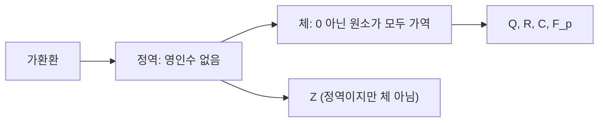

# 체

# 개요

체는 0이 아닌 모든 원소를 나눌 수 있는 가환환이다. [환](rings.md)에서 곱셈 가역성을 최대한 요구한 구조이므로, 환론에서 가장 단순하면서도 가장 많이 쓰이는 대상이다. 체가 중요한 이유는 두 가지다. 첫째, [벡터 공간](vector-spaces.md)과 행렬 이론은 계수가 체일 때 비로소 차원·기저·계수(rank) 이론이 온전히 작동한다. 둘째, 체는 [극대 아이디얼](prime-ideals.md)에 의한 몫환으로 자동 생산되므로, 환을 조사하는 도구이자 환에서 얻어지는 결과물이 된다.

체의 내적 구조를 가장 거칠게 나누는 불변량이 표수(characteristic)다. 표수는 0 또는 소수뿐이며, 그에 따라 체는 유리수체를 품는 것과 $\mathbb{F}_p$ 를 품는 것으로 갈라진다. 이 이분법이 [체의 확대](field-extensions.md)와 [유한체](finite-fields.md) 이론의 출발점이다.

# 직관

정수환 $\mathbb{Z}$ 에서는 $2$ 로 나눌 수 없지만 유리수체 $\mathbb{Q}$ 에서는 나눌 수 있다. 체는 "사칙연산이 모두 가능한 수 체계"를 공리화한 것이고, 순서·거리·극한 같은 해석적 구조는 전혀 요구하지 않는다. 따라서 원소가 두 개인 체 $\mathbb{F}_2$ 도, 원소가 비가산인 복소수체 $\mathbb{C}$ 도 같은 공리를 만족한다.

환에서 체로 가는 길은 조건을 계단식으로 강화하는 것으로 보면 된다.



표수는 "1을 몇 번 더하면 0이 되는가"이다. $\mathbb{Q}$ 에서는 아무리 더해도 $0$ 이 되지 않으므로 표수 0이고, $\mathbb{F}_5$ 에서는 다섯 번 더하면 $0$ 이므로 표수 5다. 표수 $p$ 인 체에서는 $p$ 배가 $0$ 이라는 사실이 항등식 수준으로 작동해서, 예컨대 제곱이 아니라 $p$ 제곱이 덧셈을 보존한다.

# 정의

가환환 $F$ 가 체(field)라는 것은 $1$ 이 $0$ 과 다르고, $0$ 이 아닌 모든 원소가 곱셈에 대한 역원을 가진다는 뜻이다. 곱셈 가역원 전체를 $F$ 의 곱셈군이라 부르고 $F^{\times}$ 로 표기한다.

$$
1\neq 0,\qquad \forall a\in F\setminus\{0\}\ \ \exists\, a^{-1}\in F:\ a\cdot a^{-1}=1
$$

동치로, 체는 곱셈군이 $0$ 이 아닌 원소 전체와 일치하는 가환환이다.

$$
F^{\times}=F\setminus\{0\}
$$

체 $F$ 의 표수는 $1$ 을 반복해서 더해 $0$ 을 만드는 최소 횟수이며, 그런 횟수가 없으면 0으로 정의한다. $n\cdot 1$ 은 $1$ 을 $n$ 번 더한 것을 뜻한다.

$$
\operatorname{char}F=\begin{cases}\min\{\,n\ge 1: n\cdot 1_F=0\,\} & \text{그런 } n \text{이 존재할 때}\\ 0 & \text{그렇지 않을 때}\end{cases}
$$

$F$ 의 소체(prime subfield)는 $F$ 에 포함된 모든 부분체의 교집합, 즉 $1$ 을 포함하는 가장 작은 부분체다. 부분체란 $F$ 의 부분집합이면서 $F$ 의 연산으로 체가 되는 것을 말한다.

$F$ 에서 체 $K$ 로 가는 환 준동형 중 $1$ 을 $1$ 로 보내는 것을 체 준동형이라 한다.

# 성질

## 표수는 0 또는 소수

$n\cdot 1=0$ 인 최소의 $n$ 이 합성수 $n=ab$ ( $1<a,b<n$ )라면 $(a\cdot 1)(b\cdot 1)=n\cdot 1=0$ 이 되어 체에서 영인수가 생기므로 모순이다. 체는 정역이므로 표수는 0이거나 소수다[^1].

## 소체는 $\mathbb{Q}$ 또는 $\mathbb{F}_p$

환 준동형 $\varphi:\mathbb{Z}\to F$ , $\varphi(n)=n\cdot 1$ 을 잡는다. 상 $\varphi(\mathbb{Z})$ 를 포함하는 최소 부분체가 소체다. 표수가 소수 $p$ 이면 커널이 $p\mathbb{Z}$ 이므로 제1동형정리로 $\mathbb{Z}/p\mathbb{Z}$ 와 동형인 부분체를 얻고, 이는 이미 체이므로 소체다. 표수가 0이면 $\varphi$ 가 단사이므로 $\varphi$ 를 분수로 확장한 $\mathbb{Q}\to F$ 가 단사 체 준동형이 되고, 그 상이 소체다[^1].

$$
\operatorname{char}F=p \Rightarrow \text{소체}\cong\mathbb{F}_p=\mathbb{Z}/p\mathbb{Z},\qquad \operatorname{char}F=0 \Rightarrow \text{소체}\cong\mathbb{Q}
$$

따라서 모든 체는 $\mathbb{Q}$ 또는 어떤 $\mathbb{F}_p$ 의 확대체다. $\mathbb{F}_p$ 의 연산은 [정수의 합동과 나머지 연산](modular-arithmetic.md)에서 $p$ 가 [소수](primes.md)일 때의 나머지 연산이다.

## 아이디얼과 준동형

체 $F$ 의 [아이디얼](ideals-quotient-rings.md)은 $0$ 과 $F$ 뿐이다. $0$ 이 아닌 원소 $a$ 를 포함하는 아이디얼은 $a$ 의 역원을 곱해 $1$ 을 포함하므로 $F$ 전체가 된다. 그 결과 체에서 나가는 $0$ 이 아닌 환 준동형은 모두 단사다. 커널이 아이디얼이고 $1$ 을 $1$ 로 보내므로 커널이 $F$ 전체일 수 없기 때문이다.

## 몫으로서의 체

가환환 $R$ 과 진아이디얼 $M$ 에 대해 다음이 성립한다[^2].

$$
M \text{이 극대 아이디얼} \iff R/M \text{가 체}
$$

이는 체를 만드는 표준적인 방법이다. $\mathbb{Z}$ 의 극대 아이디얼 $(p)$ 에서 $\mathbb{F}_p$ 를, 체 $k$ 위 다항식환의 극대 아이디얼에서 [체의 확대](field-extensions.md)를 얻는다. 반면 $(0)$ 은 $\mathbb{Z}$ 에서 소 아이디얼이지만 극대가 아니므로 $\mathbb{Z}$ 는 체가 아니다.

## 유한성에 대한 제약

체의 원소 개수는 임의로 정할 수 없다. 유한체의 위수는 반드시 소수의 거듭제곱이며, 각 위수마다 체가 동형을 무시하면 하나뿐이다. 예컨대 원소 6개인 체는 없다. 증명은 [유한체](finite-fields.md)에서 다룬다.

## 반례 모음

- 정수환 $\mathbb{Z}$ 는 정역이지만 $2$ 가 가역이 아니므로 체가 아니다.
- $\mathbb{Z}/6\mathbb{Z}$ 는 $2\cdot 3=0$ 이므로 정역조차 아니다. 반면 $\mathbb{Z}/5\mathbb{Z}$ 는 체다.
- 2차 정사각행렬 전체에는 가역이 아닌 $0$ 아닌 행렬이 있고 가환도 아니다. 나눗셈은 가능하지만 비가환인 구조는 division ring이라 부르며, 사원수체(quaternion)가 대표적이다.

# 활용

## 선형대수의 계수

[벡터 공간](vector-spaces.md)과 [선형사상](linear-maps.md)은 계수가 체일 때 정의된다. 체에서 나눗셈이 가능하다는 성질이 Gauss 소거법의 pivot 나눗셈, 기저의 존재, 차원의 유일성을 보장한다. 계수를 $\mathbb{Z}$ 로 바꾸면 기저가 없는 유한생성 모듈(예: $\mathbb{Z}/2\mathbb{Z}$ )이 생긴다.

## 유한체 위 계산

$\mathbb{F}_p$ 위의 계산은 나머지 연산으로 그대로 구현된다. 역원은 Fermat의 소정리 또는 [유클리드 알고리즘](euclidean-algorithm.md)의 확장형으로 구한다.

```python
p = 7
# F_p의 곱셈 역원 표: a * inv[a] = 1 (mod p)
inv = {a: pow(a, p - 2, p) for a in range(1, p)}
print(inv)          # {1: 1, 2: 4, 3: 5, 4: 2, 5: 3, 6: 6}
print((3 * 5) % p)  # 1
```

## 표수가 만드는 차이

표수 $p$ 인 체에서는 $p$ 제곱 사상이 체 준동형이다. 이항계수 $p!/(k!(p-k)!)$ 가 $0<k<p$ 에서 $p$ 로 나누어지기 때문이다.

$$
(x+y)^p=x^p+y^p \quad\text{in } \operatorname{char}p
$$

이 사상이 Frobenius endomorphism이며 [유한체](finite-fields.md)와 [Galois 이론](galois-theory.md)의 핵심 도구가 된다. 표수 0에서는 이런 항등식이 성립하지 않으므로, 표수 0과 표수 $p$ 의 이론은 미분·분리성(separability) 층위에서 갈라진다.

## 다항식과 확대

체 위의 [다항식환](polynomial-rings.md)은 나눗셈 정리를 가지므로 유클리드 정역이 된다. 기약다항식으로 몫을 취하면 더 큰 체가 나오고, 이 과정을 반복해 대수방정식의 해를 담는 체를 구성한다.

[^1]: Dummit, Math 5111 Lecture #5, "Subfields and Simple Extensions" — 표수가 0 또는 소수임과 소체가 $\mathbb{Q}$ 또는 $\mathbb{F}_p$ 와 동형임의 증명. https://dummit.cos.northeastern.edu/teaching_fa20_5111/5111_lecture_05_subfields_simple_extensions.pdf
[^2]: MIT OpenCourseWare 18.703, Lecture 18 "Prime and Maximal Ideals", Theorem 18.8. https://ocw.mit.edu/courses/18-703-modern-algebra-spring-2013/247dc7bcf731827674f4a2338f929a7a_MIT18_703S13_pra_l_18.pdf

# 연관 문서

## 선수지식

- [환](rings.md)
- [소 아이디얼과 극대 아이디얼](prime-ideals.md)

## 더 알아보기

- [다항식환](polynomial-rings.md)
- [체의 확대](field-extensions.md)

#field_theory #algebra
