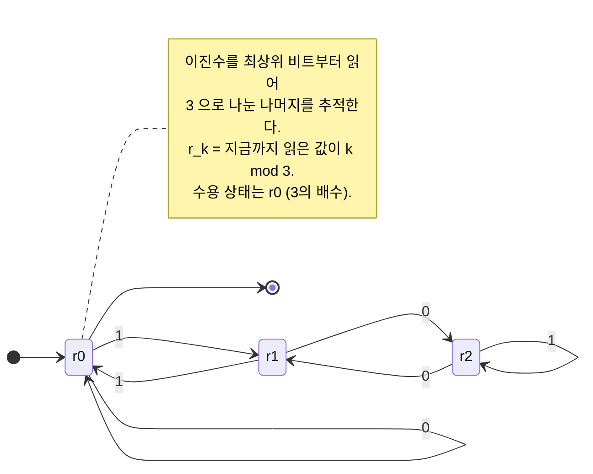

# 유한 오토마타

# 개요

유한 오토마타는 기억 용량이 상수인 계산 모델이다. 입력을 왼쪽에서 오른쪽으로 한 번 훑으면서 유한 개의 상태 중 하나만 유지하고, 다 읽은 뒤의 상태로 수용 여부를 결정한다. 이 모델이 인식하는 언어를 정규언어(regular language)라 한다.

제약이 극단적인데도 이론이 유난히 잘 맞아떨어진다. 결정적 모델(deterministic finite automaton, DFA)과 비결정적 모델(nondeterministic finite automaton, NFA)이 같은 표현력을 갖고, 정규 표현식이라는 문법적 기술과도 일치하며(Kleene 정리), 각 정규언어에는 상태 수가 최소인 DFA 가 동형을 제외하고 유일하게 존재한다(Myhill–Nerode 정리). 이 마지막 결과는 [동치관계](equivalence-relations.md)로 언어 자체를 분석해 얻어지며, 최소 DFA 의 상태가 곧 동치류다.

[계산 가능성](computability.md)의 관점에서는 유한 오토마타가 Turing 기계의 가장 약한 극단이다. 정지 문제 같은 결정불가능성이 여기서는 전혀 나타나지 않는다. 공허성, 동치성, 포함관계가 모두 결정가능하며, 그 대가로 $0^n1^n$ 같은 간단한 언어조차 인식하지 못한다.

# 직관

유한 오토마타는 "세는 능력이 없는 기계"다. 상태가 유한하므로 임의로 큰 수를 셀 수 없고, 지금까지 읽은 내용을 유한 개의 범주로만 요약할 수 있다.

이 요약이 무엇이어야 하는지가 이론의 핵심이다. 두 접두사 $x$ , $y$ 를 읽은 뒤의 상태를 구분할 필요가 있으려면, 어떤 이어지는 문자열 $z$ 가 있어 $xz$ 는 언어에 속하고 $yz$ 는 속하지 않아야 한다. 그런 $z$ 가 없다면 두 접두사는 미래에 대해 완전히 같은 정보를 주므로 같은 상태로 합쳐도 된다. 이 관계가 Myhill–Nerode 동치관계이고, 동치류의 개수가 최소 DFA 의 상태 수다.

여기서 두 가지가 따라 나온다. 동치류가 유한 개면 그것을 상태로 삼아 DFA 를 직접 만들 수 있다. 반대로 동치류가 무한하면 어떤 유한 오토마타도 그 언어를 인식할 수 없다. $\lbrace 0^n 1^n\rbrace$ 에서 $i \neq j$ 일 때 $0^i$ 와 $0^j$ 는 $1^i$ 를 붙여 보면 구분되므로 동치류가 무한히 많고, 따라서 정규언어가 아니다.

비결정성이 표현력을 늘리지 않는 이유도 같은 요약 관점에서 보인다. NFA 가 어떤 상태 집합에 "동시에 있을" 수 있다면, 그 상태 집합 자체를 하나의 상태로 부르면 된다. 상태 집합은 유한 개(부분집합이 $2^n$ 개)이므로 여전히 유한 오토마타다.

# 정의

## DFA

**정의.** 결정적 유한 오토마타(deterministic finite automaton)는 다섯 쌍

$$
M = (Q,\ \Sigma,\ \delta,\ q_0,\ F)
$$

이다. $Q$ 는 유한 상태 집합, $\Sigma$ 는 유한 알파벳, $\delta : Q \times \Sigma \to Q$ 는 전이함수, $q_0 \in Q$ 는 시작 상태, $F \subseteq Q$ 는 수용 상태 집합이다.

전이함수를 문자열로 확장한다. 빈 문자열 $\varepsilon$ 과 $a \in \Sigma$ 에 대해

$$
\hat\delta(q, \varepsilon) = q, \qquad \hat\delta(q, wa) = \delta\negthinspace\left(\hat\delta(q, w),\ a\right).
$$

$M$ 이 인식하는 언어는 $L(M) = \lbrace w \in \Sigma^\ast : \hat\delta(q_0, w) \in F\rbrace$ 이다. 어떤 DFA 가 인식하는 언어를 **정규언어**라 한다.

## NFA

**정의.** 비결정적 유한 오토마타는 전이가 집합값인 것이다. $\delta : Q \times (\Sigma \cup \lbrace\varepsilon\rbrace) \to \mathcal P(Q)$ 이고, $w$ 를 수용한다는 것은 $w$ 를 따라가는 실행 경로 가운데 수용 상태에서 끝나는 것이 **하나라도** 있다는 뜻이다.

$\varepsilon$ 전이는 입력을 소비하지 않고 상태를 옮긴다. 상태 집합 $S$ 의 $\varepsilon$ 폐포 $E(S)$ 는 $S$ 에서 $\varepsilon$ 전이만으로 도달 가능한 상태 전체다.

**정리 (부분집합 구성, subset construction).** 모든 NFA $N = (Q, \Sigma, \delta, q_0, F)$ 에 대해 같은 언어를 인식하는 DFA 가 존재한다.

구성. $Q' = \mathcal P(Q)$ 와 시작 상태 $q_0' = E(\lbrace q_0\rbrace)$ 를 두고, 전이를

$$
\delta'(S, a) = E\negthinspace\left(\bigcup_{q \in S} \delta(q, a)\right),
$$

로 하고 수용 상태를 $F' = \lbrace S \subseteq Q : S \cap F \neq \emptyset\rbrace$ 으로 둔다. 문자열 길이에 대한 귀납법으로 $\hat\delta'(q_0', w)$ 가 "$N$ 이 $w$ 를 읽은 뒤 있을 수 있는 상태 전체"임을 보이면, 수용 조건이 일치한다. ∎

상태 수는 최악의 경우 $2^n$ 까지 늘어나며, 이 지수적 증가가 실제로 불가피한 언어족이 존재한다(예: 끝에서 $n$ 번째 문자가 1인 문자열들). 즉 비결정성은 표현력이 아니라 **간결성**에서 이득을 준다.

## 정규 표현식과 Kleene 정리

정규 표현식은 다음 문법으로 귀납적으로 정의된다. $\emptyset$ 과 $\varepsilon$ 과 $a \in \Sigma$ 는 정규 표현식이고, $R_1$ 과 $R_2$ 가 정규 표현식이면 합집합 $R_1 + R_2$ 와 접합 $R_1 R_2$ 와 Kleene 스타 $R_1^\ast$ 도 그렇다. 각 표현식이 지시하는 언어는 정의대로다.

**정리 (Kleene).** 언어가 정규 표현식으로 기술되는 것과 어떤 유한 오토마타가 인식하는 것은 동치다.

증명 스케치. (⟸ 방향 아님) 표현식에서 오토마타로는 Thompson 구성이다. 각 연산자마다 $\varepsilon$ 전이로 기계를 이어 붙이는 가젯을 쓰고, 표현식 크기에 선형인 NFA 를 얻는다. 반대 방향은 상태 제거(state elimination)다. 간선에 정규 표현식을 라벨로 허용한 일반화 오토마타에서 시작·끝이 아닌 상태를 하나씩 지우면서, 지워지는 상태를 지나는 경로를 $R_{\mathrm{in}} R_{\mathrm{loop}}^\ast R_{\mathrm{out}}$ 로 흡수한다. 상태가 둘만 남으면 그 간선의 라벨이 답이다. ∎

## Myhill–Nerode 동치관계

언어 $L \subseteq \Sigma^\ast$ 에 대해 문자열 위의 관계를 정의한다.

$$
x \equiv_L y \iff \forall z \in \Sigma^\ast,\ \left( xz \in L \iff yz \in L \right).
$$

이는 동치관계이며, 오른쪽 접합에 대해 불변이다. 즉 $x \equiv_L y$ 이면 모든 $a$ 에 대해 $xa \equiv_L ya$ 다. 동치류의 개수를 $L$ 의 **지수**(index)라 한다.

**정리 (Myhill–Nerode).** $L$ 이 정규언어인 것과 $\equiv_L$ 의 지수가 유한한 것은 동치다. 이때 최소 DFA 의 상태 수는 정확히 그 지수이며, 최소 DFA 는 동형을 제외하고 유일하다.

증명 스케치. $L$ 이 DFA $M$ 으로 인식되면 $\hat\delta(q_0, x) = \hat\delta(q_0, y)$ 일 때 $x \equiv_L y$ 이므로 지수는 $M$ 의 상태 수 이하다. 역으로 지수가 유한하면 동치류를 상태로, $[x] \to [xa]$ 를 전이로, $[\varepsilon]$ 를 시작 상태로, $L$ 에 포함된 류들을 수용 상태로 삼아 DFA 를 만든다(오른쪽 불변성 덕분에 well-defined). 이 기계의 상태 수가 지수와 같고, 앞 부등식에 의해 최소다. 유일성은 임의의 최소 DFA 에서 도달 가능한 상태와 동치류 사이의 자연스러운 전단사를 확인하면 된다. ∎

# 성질

## Pumping lemma

**정리.** $L$ 이 정규언어이면 어떤 $p \ge 1$ 이 존재하여, 길이가 $p$ 이상인 모든 $w \in L$ 을 $w = xyz$ 로 쪼갤 수 있다. 여기서 $y$ 는 비어 있지 않고, $xy$ 의 길이는 $p$ 이하이며, 모든 $i \ge 0$ 에 대해 $x y^i z \in L$ 이다.

증명 스케치. $p$ 를 DFA 의 상태 수로 잡는다. $w$ 의 처음 $p$ 개 문자를 읽는 동안 $p+1$ 개의 상태를 지나므로 [비둘기집 원리](pigeonhole-principle.md)에 의해 같은 상태가 두 번 나온다. 그 사이의 부분 문자열이 $y$ 이고, 이 구간은 상태를 되돌리는 루프이므로 몇 번을 돌든 최종 상태가 같다. ∎

**적용 예.** $L = \lbrace 0^n 1^n : n \ge 0\rbrace$ 이 정규가 아님을 보인다. $p$ 가 주어졌다고 하고 $w = 0^p 1^p$ 를 잡는다. $xy$ 의 길이가 $p$ 이하이므로 $y$ 는 0으로만 이루어지고 비어 있지 않다. 그러면 $x y^2 z$ 는 0의 개수가 1의 개수보다 많아 $L$ 에 속하지 않는다. 모순. 같은 방식으로 $\lbrace ww : w \in \Sigma^\ast\rbrace$ 와 $\lbrace 0^{n^2}\rbrace$ 와 균형 잡힌 괄호 언어가 비정규임을 보인다.

**주의.** pumping lemma는 필요조건일 뿐 충분조건이 아니다. 조건을 만족하지만 정규가 아닌 언어가 존재하므로, "pumping이 된다"는 사실만으로 정규성을 결론지을 수 없다. 정확한 판정 기준은 Myhill–Nerode다. 실제로 비정규성을 보일 때도 서로 구분되는 접두사의 무한 족을 제시하는 편이 대개 더 짧다.

## 닫힘 성질과 결정 문제

정규언어 부류는 합집합, 접합, 스타, 여집합, 교집합, 뒤집기, 준동형과 그 역상에 대해 닫혀 있다. 여집합은 DFA 의 수용 상태를 뒤집으면 되고(NFA 로는 안 된다), 교집합은 곱 구성(두 DFA 를 동시에 돌리는 상태 쌍)으로 얻는다. 여집합과 합집합이 있으므로 정규언어는 [불 대수](boolean-algebras.md)의 구조를 이룬다.

결정 문제들도 모두 다루기 쉽다.

- **소속.** 입력 길이에 선형, 상수 메모리.
- **공허성.** 시작 상태에서 수용 상태로 가는 경로가 있는지 [그래프](graphs.md) 탐색으로 확인한다.
- **동치성.** $L(A) = L(B)$ 는 대칭차 $(A \cap B^c) \cup (A^c \cap B)$ 의 공허성과 같다. 또는 최소화 후 동형 판정, 또는 Hopcroft–Karp 방식으로 상태 쌍을 합병하며 확인한다.
- **최소화.** Hopcroft 알고리즘이 $O(n \log n)$ 에 최소 DFA 를 만든다. 구분 불가능한 상태들을 반복적으로 병합하는 과정이며, 결과는 Myhill–Nerode 동치류와 일치한다.

NFA 의 동치성·전체성 판정은 PSPACE(polynomial space)-완전이며([NP-완전성](np-completeness.md)(nondeterministic polynomial time)의 개념을 PSPACE 로 옮긴 것), 결정적으로 바꿀 때의 지수적 상태 폭발이 그 비용의 원천이다.

## 계산 모델 계층에서의 위치

정규언어는 문맥자유언어에 진부분집합으로 포함되고, 그 위로 문맥의존언어, 결정가능언어, 재귀적 열거가능언어가 이어진다. 각 단계는 기억 장치의 종류로 구분된다: 없음(유한 오토마타), 스택 하나(푸시다운 오토마타), 선형 테이프, 무제한 테이프.

이 계층은 결정 문제의 난이도에서 갈린다. 유한 오토마타에서는 모든 자연스러운 질문이 결정가능하지만, Turing 기계로 올라가면 [Rice 정리](rice-theorem.md)에 의해 의미론적 성질이 전부 결정불가능하다. 표현력과 분석가능성은 맞바꾸는 관계다.

한 가지 대수적 관점을 덧붙이면, 정규언어는 유한 모노이드로도 특징지어진다. $\Sigma^\ast$ 에서 유한 모노이드로의 준동형으로 인식되는 언어가 정확히 정규언어이며, 이 관점이 정규언어의 부분족(예: 스타 없는 언어 = aperiodic 모노이드)을 분류하는 도구가 된다[^1].

# 활용

## 실제 쓰임

- **어휘 분석.** 컴파일러의 토크나이저는 각 토큰 종류를 정규 표현식으로 적고, Thompson 구성과 부분집합 구성을 거쳐 하나의 DFA 로 합친다. lex/flex가 이 과정을 자동화한다.
- **문자열 검색.** Knuth–Morris–Pratt의 실패 함수는 패턴에 대한 DFA 를 암묵적으로 만든 것이고, Aho–Corasick은 여러 패턴을 동시에 처리하는 오토마타다.
- **정규 표현식 엔진.** 역참조 없는 표준 정규 표현식은 DFA 로 컴파일해 입력 길이에 선형으로 매칭할 수 있다. 반면 역참조를 허용하는 확장 문법은 정규언어를 벗어나고 백트래킹이 지수 시간까지 갈 수 있다.
- **모델 검사와 프로토콜 검증.** 유한 상태 시스템의 명세를 오토마타로 적고 교집합의 공허성으로 위반 여부를 판정한다. 무한 문자열을 다루는 Büchi 오토마타로 확장하면 선형 시제 논리(linear temporal logic, LTL) 검증이 된다.
- **하드웨어.** 순차 논리 회로는 문자 그대로 유한 상태 기계이며, 상태 최소화는 플립플롭 개수를 줄이는 합성 기법이다.

## 이론적 연결

- **동치관계.** Myhill–Nerode는 "언어가 스스로 자신의 최소 기계를 정의한다"는 진술이다. 비슷한 구조가 [군](groups.md) 작용의 궤도 분해나 최소 모델 구성에서도 반복된다.
- **대수와 논리.** 정규언어는 문자열 위의 단항 2차 논리(monadic second-order logic, MSO)로 정의 가능한 언어와 일치한다(Büchi–Elgot–Trakhtenbrot 정리). [1차 논리](first-order-logic.md)로만 정의 가능한 언어는 스타 없는 정규언어와 일치한다.
- **학습 이론.** Angluin의 L* 알고리즘은 소속 질의와 동치 질의만으로 최소 DFA 를 다항시간에 학습한다. 관측표의 행이 곧 Myhill–Nerode 동치류의 근사다[^2].

[^1]: J. E. Hopcroft, R. Motwani, J. D. Ullman, Introduction to Automata Theory, Languages, and Computation, https://archive.org/details/introductiontoau0000hopc
[^2]: D. Angluin, Learning Regular Sets from Queries and Counterexamples, Information and Computation 75(2), 1987, https://www.sciencedirect.com/science/article/pii/0890540187900526

# 연관 문서

## 선수지식

- [계산 가능성](computability.md)
- [동치관계](equivalence-relations.md)

## 더 알아보기

아직 연결한 문서가 없다.

#computation #algorithms #logic
