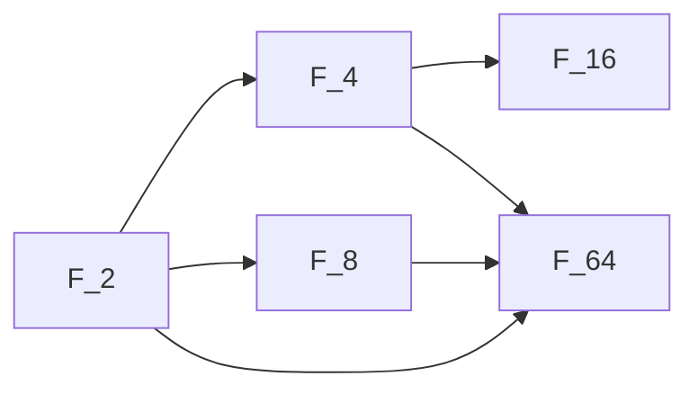

# 유한체

# 개요

유한체는 원소 개수가 유한한 [체](fields.md)다. 유한체는 완전히 분류된다. 위수는 반드시 소수의 거듭제곱 $p^n$ 이고, 각 $p^n$ 마다 체가 동형을 무시하면 정확히 하나 존재한다. 이 체를 $\mathbb{F}\_q$ ( $q=p^n$ ) 또는 $\mathrm{GF}(q)$ 로 쓴다.

유한체가 $\mathbb{F}\_p$ 위의 [확대](field-extensions.md)이면서 한 다항식의 분해체라는 점에서 이 분류가 나온다. 구조도 단순하다. 덧셈군은 $\mathbb{F}\_p$ 위 $n$ 차원 벡터 공간, 곱셈군은 위수 $q-1$ 의 순환군, 자기동형군은 Frobenius가 생성하는 위수 $n$ 의 순환군이다. 이 완결성 덕분에 유한체는 오류정정 부호, 암호, 조합 설계에서 표준 계산 대상으로 쓰인다.

# 직관

$p$ 가 [소수](primes.md)일 때 [나머지 연산](modular-arithmetic.md) $\mathbb{Z}/p\mathbb{Z}$ 는 체다. $0$ 이 아닌 모든 나머지가 $p$ 와 서로소라 역원을 갖는다. 반면 $\mathbb{Z}/6\mathbb{Z}$ 는 $2\cdot 3=0$ 이어서 체가 아니다. 그래서 "원소 6개인 체"를 나머지 연산으로는 만들 수 없다.

원소 4개인 체는 $\mathbb{Z}/4\mathbb{Z}$ 가 아니라 $\mathbb{F}\_2$ 위의 2차 확대로 만든다. $x^2+x+1$ 은 $\mathbb{F}\_2$ 에서 근이 없으므로 기약이고, 몫환이 체가 된다.

$$
\mathbb{F}\_4=\mathbb{F}\_2[x]/(x^2+x+1)=\lbrace 0,\thinspace 1,\thinspace\alpha,\thinspace\alpha+1\rbrace,\qquad \alpha^2=\alpha+1
$$

여기서 $\alpha$ 의 거듭제곱이 $\alpha$ , $\alpha+1$ , $1$ 로 순환하며 $0$ 이 아닌 원소 세 개를 모두 훑는다. 곱셈군이 순환군이므로 유한체의 곱셈은 지수 하나로 좌표화된다.

부분체 관계는 지수의 나눗셈 관계와 정확히 같다. $\mathbb{F}\_{16}$ 은 $\mathbb{F}\_8$ 을 포함하지 않는다. $3$ 이 $4$ 를 나누지 않기 때문이다.

# 정의

유한체는 원소 개수가 유한한 체이고, 그 원소 개수를 위수라 한다. 위수 $q$ 의 유한체를 $\mathbb{F}\_q$ 로 쓴다.

$q=p^n$ 인 유한체는 $\mathbb{F}\_p$ 위의 $n$ 차 확대로 실현된다. 즉 $\mathbb{F}\_p[x]$ 의 $n$ 차 기약다항식 $f$ 를 잡으면 다음이 성립한다.

$$
\mathbb{F}\_{p^n}\cong \mathbb{F}\_p[x]/(f),\qquad [\mathbb{F}\_{p^n}:\mathbb{F}\_p]=n
$$

$\mathbb{F}\_q$ 의 곱셈군을 생성하는 원소를 원시근(primitive element) 또는 generator라 한다.

Frobenius 사상은 $p$ 제곱 사상이다.

$$
\varphi:\mathbb{F}\_q\to\mathbb{F}\_q,\qquad \varphi(a)=a^{p}
$$

# 성질

## 위수

유한체 $F$ 의 표수는 $0$ 일 수 없으므로 소수 $p$ 이고, 소체는 $\mathbb{F}\_p$ 와 동형이다. $F$ 는 $\mathbb{F}\_p$ 위 유한차원 벡터 공간이므로 차원을 $n$ 이라 하면 원소 개수는 $p^n$ 이다[^1].

## 곱셈군의 순환성

$\mathbb{F}\_q$ 의 곱셈군은 위수 $q-1$ 의 순환군이다[^2].

$$
\mathbb{F}\_q^{\times}\cong \mathbb{Z}/(q-1)\mathbb{Z}
$$

증명 개요: $d$ 가 $q-1$ 을 나눌 때 $x^d-1$ 은 체에서 근을 최대 $d$ 개 가지므로, 위수가 $d$ 를 나누는 원소가 $d$ 개를 넘지 않는다. 유한 abelian 군에서 이 조건은 순환성과 동치다. 또는 지수(exponent) $m$ 이 $q-1$ 보다 작다고 가정하면 모든 원소가 $x^m-1$ 의 근이 되어 근의 개수 제한에 모순임을 보인다.

따름정리로 모든 원소는 다음을 만족한다. 이는 Fermat의 소정리를 유한체로 일반화한 것이다.

$$
a^{q}=a\quad\text{for all } a\in\mathbb{F}\_q
$$

## 존재와 유일성

각 소수 $p$ 와 $n\ge 1$ 에 대해 위수 $p^n$ 의 체가 존재하고, 동형을 무시하면 유일하다[^1].

존재: $\mathbb{F}\_p$ 위 $x^{p^n}-x$ 의 분해체 $K$ 를 잡는다. 이 다항식의 도함수는 $-1$ 이므로 중근이 없고 근이 정확히 $p^n$ 개다. Frobenius의 $n$ 제곱으로 고정되는 원소들은 덧셈·곱셈·역원에 닫혀 있어 부분체를 이루므로, 근 전체가 위수 $p^n$ 의 체가 된다.

유일성: 위수 $p^n$ 의 체 $F$ 에서는 모든 원소가 $a^{p^n}=a$ 를 만족하므로 $F$ 는 $x^{p^n}-x$ 의 분해체다. 분해체가 동형을 무시하면 유일하므로 $F$ 가 유일하다.

$$
\mathbb{F}\_{p^n}=\lbrace a : a^{p^n}=a\rbrace\subseteq \overline{\mathbb{F}\_p}
$$

이 결과가 "원소 6개인 체는 없다"와 "원소 4개인 체는 동형을 무시하면 하나"를 동시에 준다. 기약다항식을 다르게 골라도 얻어지는 체는 동형이다.

## 부분체와 Frobenius

$\mathbb{F}\_{p^n}$ 의 부분체는 $n$ 의 약수 $m$ 에 대응하는 $\mathbb{F}\_{p^m}$ 들뿐이고, 이 대응은 일대일이다.

$$
\mathbb{F}\_{p^m}\subseteq \mathbb{F}\_{p^n}\iff m\mid n
$$

Frobenius 사상 $\varphi$ 는 체 자기동형이다. 표수 $p$ 에서 $(a+b)^p=a^p+b^p$ 이므로 덧셈을 보존하고, 단사인 사상이 유한집합에서 전사이므로 자기동형이다. $\mathbb{F}\_p$ 의 원소는 $a^p=a$ 로 고정되므로 $\varphi$ 는 $\mathbb{F}\_p$ 를 고정한다. 자기동형군은 $\varphi$ 가 생성하는 위수 $n$ 의 순환군이다[^3].

$$
\mathrm{Gal}(\mathbb{F}\_{p^n}/\mathbb{F}\_p)=\langle\varphi\rangle\cong\mathbb{Z}/n\mathbb{Z}
$$

즉 유한체의 확대는 모두 Galois 확대이며 [Galois 이론](galois-theory.md)의 대응이 부분군과 약수의 대응으로 구체화된다. 부분군 $\langle\varphi^m\rangle$ 의 고정체가 $\mathbb{F}\_{p^m}$ 이다.

## 기약다항식의 개수

$\mathbb{F}\_p[x]$ 의 monic 기약다항식 중 차수 $n$ 인 것의 개수는 Möbius 반전으로 다음과 같다. 이 값은 $n\ge 1$ 에서 항상 양수이므로 존재성의 다른 증명이 된다.

$$
N_p(n)=\frac{1}{n}\sum_{d\mid n}\mu(d)\thinspace p^{n/d}
$$

# 활용

## 다항식 표현

$\mathbb{F}\_{p^n}$ 산술은 $\mathbb{F}\_p$ 계수 다항식을 기약다항식으로 나눈 나머지로 구현한다. 실무에서는 $\mathbb{F}\_{2^8}$ 이 바이트 한 개에 대응해 널리 쓰인다. **AES**(Advanced Encryption Standard)는 $x^8+x^4+x^3+x+1$ 을 법으로 하는 $\mathbb{F}\_{256}$ 을 사용한다.

## 오류정정 부호

Reed–Solomon 부호는 메시지를 $\mathbb{F}\_q$ 위 다항식으로 보고 여러 점에서 평가한다. 차수 $k$ 미만의 다항식은 서로 다른 점 $k$ 개로 결정되므로, 평가값을 $n$ 개 보내면 임의의 $(n-k)/2$ 개 오류를 정정할 수 있다. 이 논증은 "체 위 차수 $d$ 다항식의 근이 최대 $d$ 개"라는 사실 하나에 의존하며, 계수환이 체가 아니면 무너진다.

## 암호와 난수

$\mathbb{F}\_p$ 와 $\mathbb{F}\_{2^n}$ 의 곱셈군이 순환군이라는 사실은 이산로그 문제가 정의되는 군을 주고, Diffie–Hellman 키 교환의 기반이 된다. 원시근을 이용한 선형 되풀이 수열(LFSR)은 최대 주기 $2^n-1$ 의 비트열을 만든다.

## 조합론과 기하

$\mathbb{F}\_q$ 위의 사영평면은 위수 $q$ 의 유한사영평면을 주고, 이는 조합 설계와 직교 라틴방진 구성에 쓰인다. $\mathbb{F}\_q$ 위 벡터 공간의 부분공간 개수를 세는 문제는 Gauss 이항계수로 이어진다.

[^1]: A. Landesman, "Notes on finite fields" — 위수가 $p^n$ 임, $x^{p^n}-x$ 의 분해체로서의 존재, 분해체 유일성에 의한 유일성. https://people.math.harvard.edu/~landesman/assets/finite-fields.pdf
[^2]: K. Conrad, "Finite multiplicative subgroups of a field" — 체의 유한 곱셈 부분군이 순환군임의 증명. https://math.stanford.edu/~conrad/210BPage/handouts/math210b-finite-mult-groups-cyclic.pdf
[^3]: Judson, Abstract Algebra: Theory and Applications, §22.1 "Structure of a Finite Field" — Frobenius 자기동형과 부분체 격자. https://math.libretexts.org/Bookshelves/Abstract_and_Geometric_Algebra/Abstract_Algebra:_Theory_and_Applications_(Judson)/22:_Finite_Fields/22.01:_Structure_of_a_Finite_Field

# 연관 문서

## 선수지식

- [체의 확대](field-extensions.md)
- [정수의 합동과 나머지 연산](modular-arithmetic.md)

## 더 알아보기

- [오류정정부호](error-correcting-codes.md)
- [타원곡선과 군 구성](elliptic-curves.md)
- [이차 상호법칙](quadratic-reciprocity.md)

#field_theory #algebra #cryptography #combinatorics
