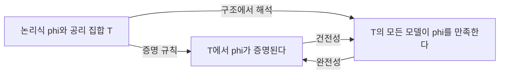

# 1차 논리

# 개요

1차 논리(first-order logic)는 대상에 대한 양화("모든 x에 대하여", "어떤 x가 존재하여")를 허용하고 술어와 함수 기호로 구조를 기술하는 형식 언어다. [명제와 증명](proofs.md)에서 비형식적으로 다룬 "증명"을 기호 조작 규칙으로 확정하고, "참"을 구조 안의 만족 관계로 확정한 뒤 둘이 일치함을 보이는 것이 이 이론의 핵심이다.

이 일치가 Gödel의 건전성·완전성 정리이며, 그 부산물인 compactness 정리는 모델 이론 전체의 기본 도구가 된다. 군·환·체 같은 대수 구조와 [ZFC 공리계](zfc-axioms.md)는 모두 1차 논리의 이론으로 표현되므로, 1차 논리는 현대 수학의 기본 서술 언어다.

동시에 1차 논리에는 원리적 한계가 있다. 부분집합 전체에 대한 양화를 허용하지 않기 때문에 무한 구조를 유일하게 특징짓지 못하고, 충분히 강한 산술 이론은 [Gödel 불완전성 정리](godel-incompleteness.md)에 걸린다.

# 직관

"모든 사람은 죽는다"를 명제 논리로는 쪼갤 수 없다. 1차 논리는 대상 변수 x, 술어 Human, Mortal을 도입해 "모든 x에 대해 Human(x)이면 Mortal(x)"로 쓴다. 즉 논의 영역(domain)의 원소를 변수로 지목하고, 술어로 원소의 성질과 관계를 말한다.

여기에는 두 층이 있다. 하나는 기호열을 다루는 구문(syntax) 층이고, 다른 하나는 그 기호열에 의미를 주는 구조(structure) 층이다.



건전성은 "증명한 것은 참이다", 완전성은 "참인 것은 증명된다"에 해당한다. 두 화살표가 모두 성립한다는 사실은 자명하지 않으며, 완전성 쪽이 어렵다.

compactness에 대한 직관: 하나의 증명은 유한히 많은 공리만 쓴다. 따라서 모순이 유도되면 유한 부분집합에서 이미 모순이 유도된다. 이를 의미론 쪽으로 옮기면 "유한 부분집합이 모두 만족 가능하면 전체가 만족 가능하다"가 된다. [Compactness](compactness.md)라는 이름은 이 성질이 적절한 위상에서 실제로 compact성과 같다는 점에서 왔다.

# 정의

언어(signature) L은 상수 기호, 함수 기호, 관계(술어) 기호들의 모임이며 각 함수·관계 기호에는 자연수 arity가 붙는다. 항(term)은 변수와 상수에서 함수 기호를 유한히 적용해 얻는 기호열이다.

원자 논리식은 항 t1, t2에 대한 등식이나 관계 기호의 적용이고, 논리식(formula)은 원자 논리식에서 연결사와 양화사로 생성된다.

$$
\varphi ::= t_1 = t_2 \mid R(t_1,\dots,t_n) \mid \neg\varphi \mid \varphi\wedge\psi \mid \varphi\vee\psi \mid \varphi\to\psi \mid \forall x\thinspace\varphi \mid \exists x\thinspace\varphi
$$

자유 변수가 없는 논리식을 문장(sentence)이라 한다. 이론(theory) T는 문장들의 집합이다.

L-구조 M은 공집합이 아닌 논의 영역과 각 기호의 해석으로 이루어진다.

$$
\mathcal{M}=\bigl(M,\ (c^{\mathcal M})_{c},\ (f^{\mathcal M})_{f},\ (R^{\mathcal M})_{R}\bigr),\quad f^{\mathcal M}:M^{n}\to M,\ R^{\mathcal M}\subseteq M^{n}
$$

## 만족 관계

변수 배정 $v$ 와 구조 $\mathcal{M}$ 에 대해 만족 관계를 논리식의 구조에 대한 재귀로 정의한다(Tarski의 진리 정의). 양화사 절만 적으면 다음과 같다.

$$
\mathcal{M},v\models \forall x\thinspace\varphi \iff \text{모든 } a\in M \text{ 에 대해 } \mathcal{M},v[x\mapsto a]\models\varphi
$$

문장 집합 $T$ 의 모든 문장을 만족하는 구조를 $T$ 의 모델이라 한다. 의미론적 귀결과 증명 가능성을 각각 다음으로 쓴다.

$$
T\models\varphi \iff \text{T의 모든 모델이 } \varphi \text{를 만족},\qquad T\vdash\varphi \iff \text{T에서 } \varphi \text{의 형식적 증명이 존재}
$$

증명 체계는 Hilbert 체계, 자연추론, sequent calculus 중 무엇을 써도 아래 정리들이 같은 형태로 성립한다.

# 성질

## 건전성 정리

$T$ 에서 $\varphi$ 가 증명되면 $T$ 의 모든 모델이 $\varphi$ 를 만족한다.

$$
T\vdash\varphi \implies T\models\varphi
$$

증명은 증명의 길이에 대한 귀납법이다. 각 공리가 모든 구조에서 참이고 각 추론 규칙이 만족을 보존함을 확인하면 된다.

## 완전성 정리 (Gödel, 1929)

$T$ 가 $\varphi$ 를 의미론적으로 귀결하면 $T$ 에서 $\varphi$ 가 증명된다[^1].

$$
T\models\varphi \implies T\vdash\varphi
$$

동치인 형태: 무모순인(즉 모순을 증명하지 않는) 모든 이론은 모델을 가진다. Henkin의 증명 개요는 다음과 같다. 무모순 이론 $T$ 를 시작으로 각 존재 문장마다 새 상수 기호(witness)를 추가해 언어를 확장하고, 무모순성을 유지하면서 극대 무모순 집합(complete theory)으로 확장한다. 그 다음 항들의 등식 [동치류](relations.md)를 원소로 삼아 구조를 만들면 그 구조가 $T$ 의 모델이 된다. 언어가 비가산이면 확장 단계에서 정렬순서나 [Zorn 보조정리](axiom-of-choice.md)가 필요하다.

## Compactness 정리

$T$ 의 모든 유한 부분집합이 모델을 가지면 $T$ 도 모델을 가진다[^2].

증명: 대우를 쓴다. $T$ 가 모델을 갖지 않으면 완전성의 대우에 의해 $T$ 는 모순을 증명하고, 그 증명은 $T$ 의 유한 부분집합 $T_0$ 만 사용한다. 따라서 $T_0$ 가 이미 모델을 갖지 않는다.

응용 예: 무한 모델을 가지는 이론에는 임의로 큰 모델이 있다. 크기가 $\kappa$ 이상임을 말하는 문장들을 $T$ 에 추가해도 임의의 유한 부분집합은 여전히 만족 가능하기 때문이다. 이것이 Löwenheim–Skolem 정리의 상향 부분이다.

## 표현력의 한계

- 유한성은 1차 논리로 표현되지 않는다. "논의 영역이 유한하다"를 말하는 문장 집합이 있다면 compactness에 모순이 생긴다.
- 하향 Löwenheim–Skolem: 가산 언어의 이론이 무한 모델을 가지면 가산 모델을 가진다. ZFC가 무모순이면 ZFC에는 가산 모델이 있다는 Skolem 역설이 여기서 나온다. 역설처럼 보일 뿐 모순은 아니다. 모델 내부에서 "비가산"이라는 판정은 그 모델이 가진 함수들만으로 이루어지기 때문이다([가산성과 비가산성](cardinality.md)).
- 실수체의 완비성이나 자연수의 귀납법 원리를 "모든 부분집합에 대하여"로 말하려면 2차 논리가 필요하다. 1차 산술로는 표준 모델을 고정할 수 없고, compactness는 초실수 같은 비표준 모델의 존재를 보장한다.
- 결정 가능성: 1차 논리의 타당성 판정 문제는 결정 불가능하다(Church–Turing). 다만 타당한 문장의 집합은 recursively enumerable이다. 완전성 정리가 증명 탐색을 가능하게 하기 때문이다([계산 가능성과 정지 문제](computability.md)).

# 활용

## 수학 이론의 형식화

- 군의 이론: 언어는 이항 함수 기호 하나와 상수 하나, 공리는 결합법칙·항등원·역원 세 문장이다([군](groups.md)).
- 체, 순서체, 대수적으로 닫힌 체 등도 유한히 많은 문장 또는 하나의 공리 스킴으로 적힌다([체](fields.md)).
- 집합론은 관계 기호 하나(원소 관계)만 가진 언어의 이론이다([ZFC 공리계](zfc-axioms.md)).
- Peano 산술 PA는 0, 후속자, 덧셈, 곱셈 기호를 가지며 귀납법을 논리식마다 하나씩 주는 스킴으로 표현한다.

## 대수에서의 compactness 논법

체 K 위의 문장이 표수 0에서 참이면 충분히 큰 소수 p마다 표수 p에서도 참이다. 표수가 0이라는 조건은 무한히 많은 문장으로만 적히므로, 유한 개만 쓰는 증명은 큰 표수에서도 통한다. 이런 이전(transfer) 논법은 대수기하에서 표준적으로 쓰인다.

## 자동 추론

완전성 정리는 "타당한 문장은 언젠가 증명이 발견된다"를 보장하므로 resolution, tableau, SMT 같은 증명 탐색 절차의 정당화가 된다. 다음은 항등원의 유일성을 1차 언어로 적은 예다.

```text
theory Group:
  forall x y z.  m(m(x,y),z) = m(x,m(y,z))
  forall x.      m(x,e) = x  &  m(e,x) = x
  forall x. exists y. m(x,y) = e

goal:
  forall e'. (forall x. m(x,e') = x) -> e' = e
```

고전 논리 대신 증명의 구성성을 요구하면 [직관주의 논리](intuitionism.md)가 되고, 그때 의미론은 구조 하나가 아니라 [Kripke 모형](kripke-semantics.md)의 족이 된다.

[^1]: Gödel's completeness theorem, Wikipedia. https://en.wikipedia.org/wiki/G%C3%B6del%27s_completeness_theorem
[^2]: Compactness Theorem, Internet Encyclopedia of Philosophy. https://iep.utm.edu/compactness/

# 연관 문서

## 선수지식

- [명제와 증명](proofs.md)
- [집합](sets.md)

## 더 알아보기

- [Gödel 불완전성 정리](godel-incompleteness.md)
- [형식주의와 Hilbert 프로그램](formalism-hilbert-program.md)
- [ZFC 공리계](zfc-axioms.md)
- [Compactness 정리와 Löwenheim–Skolem 정리](lowenheim-skolem.md)
- [논리주의와 Frege 프로그램](logicism.md)

#logic
