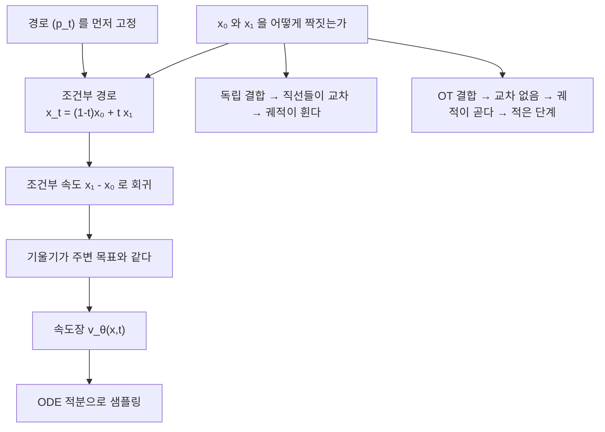

# 흐름 정합

# 개요

[확산모형](diffusion-models.md)은 데이터에 잡음을 더하는 확률미분방정식을 세우고 그 역과정을 학습한다. 잘 작동하지만 샘플 하나를 만드는 데 수백 번의 신경망 호출이 필요하다.

흐름 정합은 순서를 뒤집는다. 잡음 분포에서 데이터 분포로 가는 **경로를 먼저 정해 놓고**, 그 경로를 만드는 속도장을 회귀로 학습한다. 학습 목표가 확률미분방정식이 아니라 상미분방정식이고, 손실함수는 평범한 제곱오차다.

$$
\frac{dx}{dt}=v_\theta(x,t),\qquad
\mathcal L=\mathbb E_{t,x}\big\|v_\theta(x,t)-u_t(x)\big\|^2
$$

문제는 목표 속도장 $u_t(x)$ 를 계산할 수 없다는 것이다. 이것을 푸는 것이 **조건부 흐름 정합**이다. 데이터 점 하나를 조건으로 걸면 경로가 단순해져 목표가 닫힌 형태로 나오고, 두 손실의 기울기가 같다는 정리가 이를 정당화한다.

경로를 어떻게 고르느냐가 남는데, 여기서 [최적 수송](optimal-transport.md)이 들어온다. 아래에서 수치로 확인하겠지만, 적분 단계를 줄이는 열쇠는 조건부 경로의 모양이 아니라 잡음과 데이터를 **어떻게 짝짓느냐** 다.

# 직관

## 점수 대신 속도를 배운다

확산모형의 확률흐름 상미분방정식은 역방향 확률미분방정식과 같은 주변분포를 만든다. 곧 생성은 원래부터 상미분방정식으로 서술할 수 있었다. 그렇다면 확률미분방정식을 거치지 말고 처음부터 속도장을 목표로 삼으면 된다.

확률경로 $(p_t)_{t\in[0,1]}$ 와 속도장 $v_t$ 의 관계는 연속방정식이다.

$$
\partial_tp_t+\nabla\cdot(p_tv_t)=0
$$

$p_0$ 를 표준정규, $p_1$ 을 데이터 분포로 두고 이 식을 만족하는 $v_t$ 를 하나 찾으면, $p_0$ 에서 뽑은 점을 $v_t$ 를 따라 흘려보내는 것으로 생성이 끝난다.

## 조건부화가 목표를 만들어 준다

목표 속도장 $u_t(x)$ 는 데이터 분포 전체에 대한 기댓값이라 계산할 수 없다. 그런데 데이터 점 $x_1$ 을 조건으로 걸면 상황이 달라진다. 조건부 경로를 직선으로 잡아

$$
x_t=(1-t)x_0+tx_1,\qquad x_0\sim p_0
$$

로 두면 조건부 속도가 $u_t(x\mid x_0,x_1)=x_1-x_0$ 으로 상수다. 목표가 그냥 두 점의 차이다.

> **조건부 흐름 정합 정리.** $u_t(x)=\mathbb E[x_1-x_0\mid x_t=x]$ 이므로, 조건부 목표에 대한 제곱오차와 주변 목표에 대한 제곱오차는 $\theta$ 에 대해 같은 기울기를 준다.

조건부 기댓값이 제곱오차의 최소점이라는 사실을 쓴 것이다. 확산모형에서 점수를 직접 배우지 않고 "더해진 잡음" 을 예측하는 것과 정확히 같은 구조이며, 그래서 구현이 몇 줄로 끝난다.

```python
# 의사코드. 학습 한 걸음이 이게 전부다.
t  = rand()                       # [0,1]
x0 = randn_like(x1)               # 잡음
xt = (1 - t) * x0 + t * x1        # 경로 위의 한 점
loss = mse(v_theta(xt, t), x1 - x0)
```

## 직선 경로와 직선 궤적은 다르다

조건부 경로가 직선이라고 해서 실제로 적분하는 궤적이 직선인 것은 아니다. 적분하는 것은 조건부 속도가 아니라 그 기댓값인 주변 속도장이기 때문이다.

$x_0$ 와 $x_1$ 을 독립으로 뽑으면 수많은 조건부 직선이 서로 교차하고, 교차점에서 주변 속도가 평균으로 뭉개진다. 그 결과 궤적이 휘고, 오일러 적분에 많은 단계가 필요해진다.

해법은 짝짓기를 바꾸는 것이다. 배치 안에서 잡음과 데이터를 최적 수송으로 짝지으면 직선들이 덜 교차하고 궤적이 펴진다. 1 차원에서는 이 효과가 극단적이다. 분위수끼리 짝지으면 궤적이 **정확히** 직선이 되어 오일러 한 걸음으로 샘플링이 끝난다. 아래 코드가 이를 확인한다.



# 정의

## 확률경로와 속도장

$p_0$ 를 사전분포, $p_1$ 을 데이터 분포라 하자. 이 둘을 잇는 확률경로 $(p_t)$ 와 연속방정식을 만족하는 속도장 $u_t$ 를 목표로 삼는다. $u_t$ 가 주어지면 상미분방정식

$$
\frac{dx}{dt}=u_t(x),\qquad x(0)\sim p_0
$$

의 해가 $x(t)\sim p_t$ 를 만족하고, 특히 $x(1)\sim p_1$ 이다.

## 흐름 정합과 조건부 흐름 정합

$$
\mathcal L_{\mathrm{FM}}(\theta)=\mathbb E_{t\sim U[0,1],\,x\sim p_t}\big\|v_\theta(x,t)-u_t(x)\big\|^2
$$

계산할 수 없는 목적함수다. 결합 $\pi(x_0,x_1)$ 과 조건부 경로를 고르면 계산 가능한 목적함수가 나온다.

$$
\mathcal L_{\mathrm{CFM}}(\theta)=\mathbb E_{t,\,(x_0,x_1)\sim\pi,\,x_t}\big\|v_\theta(x_t,t)-u_t(x_t\mid x_0,x_1)\big\|^2
$$

두 손실은 $\theta$ 에 무관한 상수만큼 다르므로 기울기가 같다.

## 스케줄과 결합

일반적인 가우시안 경로는 두 함수 $\alpha_t,\sigma_t$ 로 쓴다.

$$
x_t=\alpha_tx_1+\sigma_tx_0,\qquad u_t(x_t\mid x_0,x_1)=\alpha_t'x_1+\sigma_t'x_0
$$

$(\alpha_t,\sigma_t)=(t,1-t)$ 가 직선 보간이고, $(\sin\frac{\pi t}2,\cos\frac{\pi t}2)$ 는 확산모형의 분산보존 스케줄에 해당한다. 어느 쪽이든 경계조건 $\alpha_0=\sigma_1=0$ 과 $\alpha_1=\sigma_0=1$ 만 맞으면 된다.

결합 $\pi$ 는 보통 독립곱 $p_0\otimes p_1$ 로 잡지만, 미니배치 안에서 비용행렬 $C_{ij}=\Vert x_0^{(i)}-x_1^{(j)}\Vert^2$ 에 대한 최적 수송을 풀어 짝지을 수도 있다. 배치가 작으면 Hungarian 알고리즘, 크면 Sinkhorn 을 쓴다.

# 성질

## 확산모형과의 관계

확산모형의 확률흐름 상미분방정식은 특정 $(\alpha_t,\sigma_t)$ 에 대한 흐름 정합과 같다. 점수 $\nabla\log p_t$ 와 속도장은 서로 선형변환으로 옮겨진다.

$$
u_t(x)=\frac{\alpha_t'}{\alpha_t}x+\Big(\sigma_t\sigma_t'-\frac{\alpha_t'}{\alpha_t}\sigma_t^2\Big)\nabla\log p_t(x)
$$

그러니 흐름 정합은 확산모형을 대체하는 다른 원리가 아니라, 같은 대상을 스케줄과 결합을 자유롭게 고를 수 있는 형태로 다시 쓴 것이다. 실질적인 이득은 세 가지다. 사전분포가 가우시안일 필요가 없고, 스케줄 설계가 확률미분방정식의 제약에서 풀리며, 결합을 바꿔 궤적을 펼 수 있다.

## 결정론적 샘플링의 부수입

상미분방정식이라 샘플링이 결정론적이고 가역이다.

- 같은 초기 잡음이 항상 같은 샘플을 준다. 잠재공간 보간과 편집이 자연스럽다.
- 역방향으로 적분해 데이터를 잠재변수로 되돌릴 수 있다.
- 연속 정규화 흐름의 순간 변수변환 공식으로 로그우도를 계산할 수 있다.

$$
\log p_1(x_1)=\log p_0(x_0)-\int_0^1\nabla\cdot v_\theta\big(x(t),t\big)\,dt
$$

발산의 대각합 추정에 Hutchinson 추정량을 쓰면 고차원에서도 다룰 수 있다.

## 직선화

학습한 흐름으로 $(x_0,x_1)$ 쌍을 생성해 그 쌍을 결합으로 삼아 다시 학습하는 절차를 되풀이하면 궤적이 점점 펴진다. 이 반복이 **rectified flow** 이며, 한두 번만 반복해도 몇 단계 샘플링이 가능한 모형이 나온다. 각 반복이 결합을 최적 수송 쪽으로 미는 사영으로 해석된다.

여기서 주의할 점이 있다. 직선화가 개선하는 것은 **결합**이지 조건부 경로의 모양이 아니다. 다음 절의 수치 실험이 그 구분을 분명히 보여준다.

# 활용

## 세 가지 설정을 수치로 비교한다

$p_0=N(0,1)$ 에서 $p_1=\frac12N(-2,0.3^2)+\frac12N(2,0.3^2)$ 로 가는 1 차원 문제다. 가우시안 혼합이라 주변 속도장이 닫힌 형태로 나오므로, 신경망 없이 흐름 정합의 이상적인 목표 자체를 적분해 볼 수 있다.

```python
import math

comps = [(0.5, -2.0, 0.3), (0.5, 2.0, 0.3)]
npdf = lambda x, m, s: math.exp(-0.5*((x - m)/s)**2)/(s*math.sqrt(2*math.pi))

# x_t = α_t x₁ + σ_t x₀.  (α,σ) = (t, 1-t) 이면 조건부 경로가 직선이다.
LINEAR = (lambda t: t, lambda t: 1 - t, lambda t: 1.0, lambda t: -1.0)
TRIG = (lambda t: math.sin(math.pi*t/2), lambda t: math.cos(math.pi*t/2),
        lambda t: math.pi/2*math.cos(math.pi*t/2),
        lambda t: -math.pi/2*math.sin(math.pi*t/2))

def velocity(x, t, sch):
    """독립 결합에서의 주변 속도장 u_t(x) = E[α'x₁ + σ'x₀ | x_t = x].
    성분별 가우시안이라 사후 가중치와 조건부 기댓값이 모두 닫힌 형태다."""
    al, sg, dal, dsg = (f(t) for f in sch)
    num = den = 0.0
    for w, m, s in comps:
        V = al*al*s*s + sg*sg                                # Var(x_t)
        g = w * npdf(x, al*m, math.sqrt(V))                  # 사후 가중치 (정규화 전)
        num += g * (dal*m + (dal*al*s*s + dsg*sg)/V * (x - al*m))
        den += g
    return num/den

def integrate(x, steps, sch):
    t, h = 0.0, 1.0/steps
    for _ in range(steps):
        x += h*velocity(x, t, sch); t += h
    return x

cdf0 = lambda x: 0.5*(1 + math.erf(x/math.sqrt(2)))
cdf1 = lambda x: sum(w*0.5*(1 + math.erf((x - m)/(s*math.sqrt(2)))) for w, m, s in comps)

def inverse(cdf, q):
    lo, hi = -10.0, 10.0
    for _ in range(200):
        mid = (lo + hi)/2
        lo, hi = (mid, hi) if cdf(mid) < q else (lo, mid)
    return (lo + hi)/2

inv0 = lambda q: inverse(cdf0, q)
inv1 = lambda q: inverse(cdf1, q)

def velocity_ot(x, t):
    """OT 결합의 주변 속도장. 1 차원에서 최적 결합은 분위수끼리 짝짓는 것이고,
    x_t(q) = (1-t)F₀⁻¹(q) + t F₁⁻¹(q) 가 q 에 대해 증가하므로 q 를 되찾을 수 있다."""
    lo, hi = 1e-12, 1 - 1e-12
    for _ in range(200):
        mid = (lo + hi)/2
        lo, hi = (mid, hi) if (1-t)*inv0(mid) + t*inv1(mid) < x else (lo, mid)
    q = (lo + hi)/2
    return inv1(q) - inv0(q)

def integrate_ot(x, steps):
    t, h = 0.0, 1.0/steps
    for _ in range(steps):
        x += h*velocity_ot(x, t); t += h
    return x

qs = [i/20 for i in range(1, 20)]
err = lambda f: max(abs(cdf1(f(inv0(q))) - q) for q in qs)      # Kolmogorov 거리

print("Euler 적분 단계 수에 따른 오차 (독립 결합)")
print("  steps |   직선 경로 |  삼각 스케줄")
for steps in (2, 4, 8, 16, 32, 64, 256):
    print(f"  {steps:>5} | {err(lambda x: integrate(x, steps, LINEAR)):11.6f}"
          f" | {err(lambda x: integrate(x, steps, TRIG)):12.6f}")

print("\nOT 결합(분위수 짝짓기)에서의 같은 오차")
for steps in (1, 2, 4):
    print(f"  steps={steps}: {err(lambda x: integrate_ot(x, steps)):.3e}")

# Euler 적분 단계 수에 따른 오차 (독립 결합)
#   steps |   직선 경로 |  삼각 스케줄
#       2 |    0.225249 |     0.110937
#       4 |    0.125269 |     0.057919
#       8 |    0.061770 |     0.025210
#      16 |    0.031245 |     0.012670
#      32 |    0.015674 |     0.006425
#      64 |    0.007845 |     0.003243
#     256 |    0.001962 |     0.000817
#
# OT 결합(분위수 짝짓기)에서의 같은 오차
#   steps=1: 4.441e-16
#   steps=2: 1.943e-16
#   steps=4: 2.359e-16
```

읽을 것이 세 가지다.

첫째, 두 스케줄 모두 단계를 두 배로 늘리면 오차가 절반이 된다. 오일러 법의 1 차 수렴이고, 주변 속도장이 실제로 $p_0$ 를 $p_1$ 로 정확히 옮긴다는 확인이다. 흐름 정합의 이론이 수치로 확인된 것이다.

둘째, 이 문제에서는 **직선 조건부 경로가 삼각 스케줄보다 오히려 나쁘다.** 조건부 경로가 직선이어도 적분하는 것은 주변 속도장이므로, 궤적의 곡률은 별개의 문제다. "직선 경로가 곧 적은 단계" 라는 요약은 틀렸다.

셋째, 결합을 바꾸면 이야기가 완전히 달라진다. OT 결합에서는 궤적이 정확히 직선이라 오일러 **한 걸음**이 기계 정밀도까지 정확하다. 단계 수를 줄이는 것은 스케줄이 아니라 결합이다. rectified flow 의 반복이 하는 일이 바로 이 결합 개선이며, 고차원에서 미니배치 최적 수송을 푸는 비용을 감수하는 이유도 여기에 있다.

## 실무에서의 위치

이미지와 영상 생성모형이 대체로 이 틀로 옮겨 왔다. 손실이 단순하고, 스케줄을 바꾸기 쉽고, 조건부 생성과 안내 기법이 그대로 이식된다. 몇 단계 샘플링이 필요한 경우에는 직선화나 증류를 덧붙인다.

사전분포가 가우시안일 필요가 없다는 점도 실용적이다. 저해상도 이미지에서 고해상도로, 흐린 이미지에서 선명한 이미지로 가는 경로를 직접 세울 수 있어 초해상도와 복원 문제에 자연스럽게 맞는다. 두 임의의 분포를 잇는 일반적인 틀이라는 점이 최적 수송과 공유하는 관점이다.

# 연관 문서

## 선수지식

- [확산모형](diffusion-models.md)
- [최적 수송과 Wasserstein 거리](optimal-transport.md)

## 더 알아보기

아직 연결한 문서가 없다.

#machine_learning #probability #optimization
