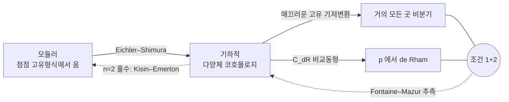
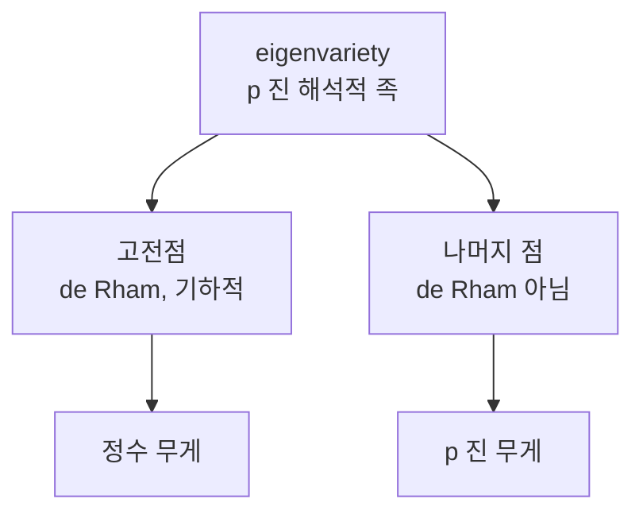

# Fontaine–Mazur 추측

# 개요

[p 진 Hodge 이론](p-adic-hodge-theory.md)은 국소 Galois 군 $G_{\mathbb Q_p}$ 의 표현에 de Rham, 반안정, 결정적이라는 등급을 매겼다. 그 등급은 순전히 국소적인 조건이다. 표현 하나를 소수 $p$ 자리에서만 들여다보고 판정한다.

Fontaine 과 Mazur 는 1995 년에 이 국소 조건이 전역적인 출신 성분을 결정한다고 추측했다.[^1] 전역 표현

$$
\rho\colon G_{\mathbb Q}=\mathrm{Gal}(\bar{\mathbb Q}/\mathbb Q)\longrightarrow \mathrm{GL}_n(\mathbb Q_p)
$$

가 기약이고 다음 두 조건을 만족한다고 하자.

1. 유한 개의 소수를 제외하고 **비분기**다.
2. $G_{\mathbb Q_p}$ 로 제한하면 **de Rham** 이다.

그러면 $\rho$ 는 **기하적**이다. 즉 어떤 매끄러운 사영 다양체 $X/\mathbb Q$ 의 에탈 코호몰로지 $H^i_{\mathrm{et}}(X_{\bar{\mathbb Q}},\mathbb Q_p)$ 의 부분몫에 Tate 꼬임을 허용해 나타난다.

역방향은 정리다. 기하에서 온 표현은 좋은 환원을 가진 소수에서 비분기이고([Galois 표현](galois-representations.md)의 매끄러운 고유 기저변환), $p$ 자리에서는 Faltings–Tsuji 의 $C_{\mathrm{dR}}$ 비교동형이 de Rham 성을 준다. 어려운 것은 조건에서 기하로 가는 방향이다. 이 추측은 **"대수다양체에서 온다"는 초월적 조건을 두 개의 검사 가능한 조건으로 대체하자**는 제안이다.

$n=2$ 홀수 경우는 Kisin 과 Emerton 이 $p$ 진 국소 Langlands 와 모듈러성 올림 정리로 대체로 해결했다. 그때 결론은 [모듈러 곡선](modular-curves.md)에서 나오는 Eichler–Shimura 표현으로 진술된다. 기하적이라는 말이 곧 **모듈러**라는 말이 되는 것이다.

# 직관

## 표현은 넘쳐나고 기하는 드물다

세는 것부터 해 보자. $\mathbb Q$ 위의 매끄러운 사영 다양체는 유한한 자료(방정식 계수)로 주어지므로 동형을 무시하면 **셀 수 있게** 많다. 각각의 코호몰로지는 유한 차원이다. 따라서 기하적 표현 전체는 셀 수 있는 집합이다.

반면 연속 표현은 그렇지 않다. 가장 작은 예로 1 차원을 보자. 순환지표 $\chi\colon G_{\mathbb Q}\to\mathbb Z_p^\times$ 의 $p$ 진 거듭제곱

$$
\chi^s\colon g\longmapsto \chi(g)^s=\exp\bigl(s\log\chi(g)\bigr),\qquad s\in\mathbb Z_p
$$

는 $s$ 가 $\mathbb Z_p$ 를 훑는 동안 서로 다른 연속 지표를 준다. $\mathbb Z_p$ 는 연속체 크기다. 게다가 이들은 모두 $p$ 밖에서 비분기다. 조건 1 만으로는 아무것도 못 걸러낸다.

걸러내는 것은 조건 2 다. $\chi^s$ 가 de Rham 이 되는 것은 $s\in\mathbb Z$ 일 때뿐이고, 그때 $\chi^s$ 는 $\mathbb Q_p(-s)$ 로 실제로 기하에서 온다. 연속체 크기의 족에서 $\mathbb Z$ 만 남는다. **de Rham 조건이 연속을 이산으로 자른다**는 것이 추측 전체의 축약판이다.

```javascript
// s = 1/3 과 s = 2 를 Z_5 안에서 비교한다.
// p 진 전개가 유한 자리에서 끊기면 s 는 (음 아닌) 정수다.
const p = 5n, N = 12, M = p ** BigInt(N);

const digits = (s) => {
  const out = [];
  let x = ((s % M) + M) % M;
  for (let i = 0; i < N; i++) { out.push(Number(x % p)); x /= p; }
  return out.join('');
};

const inverseMod = (a, m) => {              // 확장 유클리드
  let [r0, r1, t0, t1] = [a, m, 1n, 0n];
  while (r1 !== 0n) { const q = r0 / r1;
    [r0, r1] = [r1, r0 - q * r1]; [t0, t1] = [t1, t0 - q * t1]; }
  return ((t0 % m) + m) % m;
};

console.log('s = 1/3 :', digits(inverseMod(3n, M)));  // 231313131313  (반복, 정수 아님)
console.log('s = 2   :', digits(2n));                 // 200000000000  (끊긴다, 정수)
```

$s=1/3$ 의 $5$ 진 전개 $2+3\cdot5+1\cdot5^2+3\cdot5^3+\cdots$ 는 끝나지 않는다. 지표 $\chi^{1/3}$ 은 [Sen 작용소](sen-theory.md)의 고유값이 $1/3$ 이라 정수가 아니고, 따라서 Hodge–Tate 조차 아니다. 아무 다양체의 코호몰로지에도 들어 있지 않다.

## 1 차원은 이미 정리다

위 관찰을 끝까지 밀면 $n=1$ 인 Fontaine–Mazur 는 [유체론](class-field-theory.md)의 따름정리가 된다. Kronecker–Weber 로

$$
G_{\mathbb Q}^{\mathrm{ab}}\cong\widehat{\mathbb Z}^\times\cong\prod_\ell\mathbb Z_\ell^\times
$$

이고, 거의 모든 곳 비분기인 연속 지표 $\eta\colon G_{\mathbb Q}\to\mathbb Q_p^\times$ 는 $\mathbb Z_p^\times$ 성분과 유한 성분으로 갈린다. $p$ 자리에서 de Rham 이라는 조건이 $\mathbb Z_p^\times$ 성분을 $m\in\mathbb Z$ 인 $\chi^m$ 으로 고정하고, 남는 것은

$$
\eta=\varepsilon\cdot\chi^{m},\qquad \varepsilon\ \text{는 유한위수 Dirichlet 지표}
$$

뿐이다. 그리고 이런 $\eta$ 는 분원체 $\mathbb Q(\zeta_N)$ 의 코호몰로지 안에 실제로 들어 있다. 조건을 만족하는 것과 기하에서 오는 것이 정확히 일치한다.

## 왜 두 조건이 함께여야 하는가

한쪽만으로는 안 된다는 것을 각각 확인해 두면 추측의 모양이 분명해진다.

- **비분기만**: 위에서 본 $s\notin\mathbb Z$ 인 $\chi^s$ 다. $p$ 밖 어디서도 분기하지 않지만 기하적이지 않다. $p$ 자리의 야생 자유도가 통제되지 않는다.
- **de Rham 만**: 무한히 많은 소수에서 분기하도록 표현을 억지로 만들 수 있다. $\mathbb Q$ 의 절대 Galois 군은 그만큼 크다. 그런 표현은 도체가 정의되지 않아 자기동형 형식과 짝지을 대상이 없다.

두 조건은 각각 무한 자유도를 하나씩 죽인다. 조건 1 은 유한 개 소수의 분기만 허용해 **가로 방향**을, 조건 2 는 $p$ 자리에서 여과·Frobenius 자료를 정수 무게로 묶어 **세로 방향**을 잘라낸다.

## 조건과 결론의 사슬



실선은 정리, 점선은 추측 또는 부분적으로만 증명된 함의다. 화살표가 순환을 이루므로 어느 한 점선이 채워지면 셋이 모두 동치가 된다.

# 정의

## 기하적 표현

$\rho\colon G_{\mathbb Q}\to\mathrm{GL}_n(\mathbb Q_p)$ 가 연속이라 하자. $\rho$ 가 **기하적**(geometric)이라 함은 매끄러운 사영 다양체 $X/\mathbb Q$ 와 정수 $i,j$ 가 있어 $\rho$ 가

$$
H^i_{\mathrm{et}}\bigl(X_{\bar{\mathbb Q}},\mathbb Q_p\bigr)(j)
$$

의 부분몫과 동형인 경우를 말한다. $(j)$ 는 $j$ 번째 Tate 꼬임이다. 꼬임을 허용하는 이유는 $\mathbb Q_p(j)$ 자체가 $\mathbb G_m$ 의 코호몰로지에서 오는 가장 값싼 표현이라, 이를 배제하면 정의가 무게 이동에 대해 닫히지 않기 때문이다.

## 조건 1: 거의 모든 곳 비분기

소수 $\ell$ 에 대해 $I_\ell\subset G_{\mathbb Q}$ 를 관성군이라 할 때 $\rho(I_\ell)=1$ 이면 $\ell$ 에서 비분기다. 조건 1 은 유한집합 $S$ 밖의 모든 $\ell$ 에서 비분기라는 뜻이고, 이는 $\rho$ 가 $\mathbb Q$ 의 최대 $S$ 비분기 확대의 Galois 군 $G_{\mathbb Q,S}$ 를 통해 인수분해된다는 것과 같다. Hermite–Minkowski 에 의해 $G_{\mathbb Q,S}$ 는 유한생성에 가까운 통제를 받는다.

## 조건 2: $p$ 에서 de Rham

$\rho|\_{G_{\mathbb Q_p}}$ 가 de Rham 이라 함은 $D_{\mathrm{dR}}(\rho)=\bigl(B_{\mathrm{dR}}\otimes\rho\bigr)^{G_{\mathbb Q_p}}$ 의 차원이 $n$ 과 같다는 것이다. Berger 의 $p$ 진 단연법(monodromy) 정리에 의해 이는 **잠재적 반안정**과 동치다. 즉 유한 확대 $L/\mathbb Q_p$ 위에서 $\rho$ 가 반안정이 된다는 조건이다.

이 재서술이 중요하다. 잠재적 반안정 표현에는 Weil–Deligne 표현이 붙고, 그것이 $p$ 자리의 국소 Langlands 매개변수가 된다. de Rham 조건은 "표현이 $p$ 자리에서도 자기동형 형식과 짝지어질 자격이 있다" 는 말과 같다.

## 추측의 정밀한 형태

$n=2$ 에서는 Hodge–Tate 무게와 홀짝성까지 지정한 형태로 적는다. $\rho\colon G_{\mathbb Q}\to\mathrm{GL}_2(\mathbb Q_p)$ 가 기약, 거의 모든 곳 비분기, $p$ 에서 de Rham 이고 Hodge–Tate 무게가 $k\ge2$ 인 $\lbrace 0,k-1\rbrace$ 로 **서로 다르다**고 하자. 그러면

$$
\det\rho(c)=-1\quad(c\ \text{는 복소켤레}) \;\Longrightarrow\; \rho\cong\rho_f\ \text{ (어떤 무게 } k \text{ 첨점 고유형식 } f)
$$

가 추측된다. 홀수 조건 $\det\rho(c)=-1$ 은 사실 잉여가 아니다. 기하적이면서 무게가 서로 다른 2 차원 표현은 Hodge 구조의 대칭 때문에 홀수일 수밖에 없다.

무게가 **같은** 경우 $\lbrace 0,0\rbrace$ 는 성격이 다르다. 이때 추측은 $\rho$ 의 상이 유한하다고 주장하고, 그 경우 $\rho$ 는 Artin 표현이 되어 Artin 추측의 영역으로 넘어간다. 이 부분은 여전히 열려 있다.

## 변형환의 언어

Mazur 의 변형이론이 추측을 기하적 대상 사이의 진술로 바꾼다. 잔여표현 $\bar\rho\colon G_{\mathbb Q,S}\to\mathrm{GL}\_2(\mathbb F_p)$ 를 고정하면 그 변형을 분류하는 보편 변형환 $R_{\bar\rho}$ 가 있고, 한편 같은 잔여표현을 주는 고유형식들이 Hecke 대수 $\mathbb T_{\bar\rho}$ 를 이룬다. 모듈러성이 자연사상

$$
R_{\bar\rho}\longrightarrow\mathbb T_{\bar\rho}
$$

을 준다. 이 사상이 동형이라는 것이 이른바 $R=T$ 정리이고, Fontaine–Mazur 는 그 사상의 **$\mathbb Q_p$ 값 점 수준의 전사성**이다. de Rham 조건을 만족하는 $R_{\bar\rho}$ 의 점이 모두 $\mathbb T_{\bar\rho}$ 에서 온다는 주장이기 때문이다.

# 성질

## 알려진 경우

| 상황 | 결과 |
|---|---|
| $n=1$ | 정리. 유체론과 Kronecker–Weber |
| $n=2$ 이고 홀수, 서로 다른 HT 무게, $\bar\rho\vert\_{\mathbb Q(\zeta_p)}$ 기약 | Kisin, Emerton (대체로 해결)[^2] |
| $n=2$ 이고 HT 무게 같음 | 미해결. Artin 추측과 얽힘 |
| $n=2$ 이고 짝수 | 결론이 "그런 것은 없다" 쪽. 부분 결과만 |
| $n\ge3$ | 열려 있음. 자기쌍대 경우에 부분 결과 |

$n=2$ 증명의 뼈대는 두 단계다. 먼저 [Serre 추측](modular-forms.md)(Khare–Wintenberger 정리)이 잔여표현 $\bar\rho$ 가 모듈러임을 준다. 그 다음 모듈러성 올림 정리가 "잔여적으로 모듈러 + $p$ 에서 de Rham" 을 "모듈러" 로 올린다. Kisin 은 이 올림 단계에서 $p$ 진 국소 Langlands 대응을 써서, 그전까지 필요했던 국소 조건의 제약을 크게 걷어냈다.

## 왜 어려운가: 고전점과 족

$p$ 진 자기동형 형식의 족(Hida 족, eigenvariety)을 생각하면 추측의 난점이 보인다. 족의 점들은 모두 거의 모든 곳 비분기인 Galois 표현을 주지만, de Rham 인 점은 **고전점**뿐이고 그 집합은 족 안에서 조밀하되 여집합이 훨씬 크다.



추측은 "de Rham 인 점은 모두 고전점" 이라고 말한다. 그런데 de Rham 성은 $p$ 자리의 국소 조건이고 고전성은 전역적인 자기동형 자료다. 국소 조건 하나가 족 안에서 어느 점인지를 결정한다는 주장이라 증명이 쉬울 리가 없다. Kisin 과 Emerton 의 접근이 성공한 것은 $\mathrm{GL}_2(\mathbb Q_p)$ 의 $p$ 진 국소 Langlands 대응이 그 국소 조건을 표현론적 조건으로 번역해 주었기 때문이다.

## 무게가 정수라는 것만으로는 부족하다

Hodge–Tate 는 de Rham 보다 약한 조건이다. Sen 작용소의 고유값이 정수이고 대각화되면 Hodge–Tate 지만, de Rham 이 되려면 여과가 $B_{\mathrm{dR}}$ 수준에서 정합해야 한다. 실제로 Hodge–Tate 이지만 de Rham 이 아닌 2 차원 표현이 있다. $\mathbb Q_p(1)$ 에 의한 자명하지 않은 확대

$$
0\to\mathbb Q_p(1)\to V\to\mathbb Q_p\to0
$$

들의 공간 $H^1(G_{\mathbb Q_p},\mathbb Q_p(1))\cong\widehat{\mathbb Q_p^\times}\otimes\mathbb Q_p$ 는 2 차원이고, de Rham(여기서는 반안정과 같다) 인 확대는 그중 1 차원 부분공간뿐이다. 나머지 방향은 Hodge–Tate 무게가 $\lbrace 0,-1\rbrace$ 로 멀쩡한 정수인데도 기하적이 아니다. 그러니 Sen 무게의 정수성은 **필요조건**일 뿐이고, 계산으로 후보를 걸러낼 때만 쓴다.

## 국소–전역 원리로서

이 추측은 형태상 국소–전역 원리다. 그런데 방향이 특이하다. Hasse 원리류의 진술은 모든 자리에서의 정보를 모아 전역 결론을 얻는데, Fontaine–Mazur 는 **한 자리 $p$ 에서의 정보와 나머지 자리에서의 소극적 조건(비분기)** 만으로 전역 결론을 얻는다. 그것이 가능한 이유는 $p$ 진 표현이 $\ell$ 진 표현과 달리 $p$ 자리에서 기하의 정보를 통째로 지고 있기 때문이다. $p$ 진 Hodge 이론이 이 비대칭을 만들었고, 추측은 그 비대칭을 끝까지 쓴다.

# 활용

## 모듈러성 정리의 최종 형태

Wiles 의 반안정 타원곡선 모듈러성, Breuil–Conrad–Diamond–Taylor 의 일반화, Khare–Wintenberger 의 Serre 추측이 모두 "잔여표현이 모듈러면 올려서 모듈러" 라는 구조를 공유한다. Fontaine–Mazur 는 이 사슬의 끝점이다. 잔여표현에 대한 가정 없이, 국소 조건만으로 모듈러성을 주장하기 때문이다. $n=2$ 경우가 해결된 지금, 실용적인 결론은 이렇다.

> $\mathbb Q$ 위의 2 차원 홀수 기약 $p$ 진 Galois 표현으로 서로 다른 정수 무게를 가진 것은, 사실상 모두 첨점 고유형식에서 온다.

[타원곡선](elliptic-curves.md)의 $p$ 진 Tate 가군이 정확히 이 유형이므로 모듈러성 정리가 특수 경우로 되살아난다.

## 계산에서의 필터

주어진 표현이 기하적인지 판정하려 할 때 실제로 도는 절차는 필요조건의 사슬이다.

1. 도체가 유한한가. 분기하는 소수를 나열할 수 있는가.
2. Sen 작용소의 고유값이 정수이고 대각화되는가. 아니면 즉시 탈락.
3. 무게가 서로 다르고 홀수인가. 그러면 그 무게와 도체의 $S_k(\Gamma_0(N))$ 를 실제로 계산해 후보 고유형식을 찾는다.
4. 몇 개의 소수에서 $a_\ell$ 과 $\mathrm{tr}\thinspace\rho(\mathrm{Frob}_\ell)$ 을 대조한다.

[모듈러 기호](modular-symbols.md)로 3 단계의 공간을 계산할 수 있으므로 이 절차 전체가 컴퓨터에서 돈다. 추측은 이 절차가 원리적으로 **완전**하다고, 즉 후보가 없으면 그런 표현도 없다고 보장한다.

## 남은 방향

- **일반 차원**: 자기쌍대 조건 아래 Taylor 등의 potential automorphy 기법이 부분 결과를 준다. 자기쌍대성을 벗어나면 [Langlands 강령](langlands-program.md)의 일반 함자성이 필요해진다.
- **기하화**: Fargues–Scholze 는 $p$ 진 국소 Langlands 를 $\mathrm{Bun}_G$ 위의 층으로 재구성했다. 이 틀에서 de Rham 조건은 매개변수 공간의 어떤 부분대상으로 번역되고, Kisin–Emerton 논법의 국소 부분이 개념적으로 다시 쓰인다.
- **무게가 $\lbrace 0,0\rbrace$ 인 경우**: 홀수 2 차원 Artin 표현의 모듈러성은 Buzzard–Taylor 이후 상당히 진전되었지만, "상이 유한하다" 를 국소 조건에서 끌어내는 부분은 여전히 별개의 난점이다.

[^1]: J.-M. Fontaine, B. Mazur, *Geometric Galois representations*, Elliptic Curves, Modular Forms, and Fermat's Last Theorem (1995), 41–78. 본문의 조건 1, 2 와 기하적 표현의 정의가 이 논문의 §1 이다.

[^2]: M. Kisin, *The Fontaine–Mazur conjecture for GL(2)*, J. Amer. Math. Soc. **22** (2009), 641–690. M. Emerton, *Local-global compatibility in the p-adic Langlands programme for GL(2)* (preprint, 2011). 잔여표현 쪽 입력인 Serre 추측은 C. Khare, J.-P. Wintenberger, *Serre's modularity conjecture I, II*, Invent. Math. **178** (2009).

# 연관 문서

## 선수지식

- [p 진 Hodge 이론과 Fontaine 주기환](p-adic-hodge-theory.md)
- [모듈러 곡선 X_0(N)](modular-curves.md)

## 더 알아보기

- [Galois 표현의 변형과 보편 변형환](deformation-rings.md)

#number_theory #field_theory #theorem
