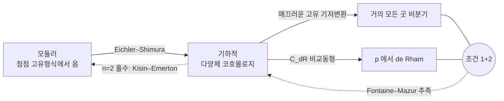

# Fontaine–Mazur 추측

# 개요

[p 진 Hodge 이론](p-adic-hodge-theory.md)은 국소 Galois 군 $G_{\mathbb Q_p}$ 의 표현에 de Rham, 반안정, 결정적이라는 등급을 매긴다. 이 등급은 소수 $p$ 자리만 보고 판정하는 국소 조건이다.

Fontaine 과 Mazur 는 1995 년에 이 국소 조건이 표현의 전역적 출처를 결정한다고 추측했다.[^1] 전역 표현

$$
\rho\colon G_{\mathbb Q}=\mathrm{Gal}(\bar{\mathbb Q}/\mathbb Q)\longrightarrow \mathrm{GL}\_n(\mathbb Q_p)
$$

가 기약이고 다음 두 조건을 만족한다고 하자.

1. 유한 개의 소수를 제외하고 **비분기**다.
2. $G_{\mathbb Q_p}$ 로 제한하면 **de Rham** 이다.

그러면 $\rho$ 는 **기하적**이다. 즉 어떤 매끄러운 사영 다양체 $X/\mathbb Q$ 의 에탈 코호몰로지 $H^i_{\mathrm{et}}(X_{\bar{\mathbb Q}},\mathbb Q_p)$ 의 부분몫에 Tate 꼬임을 허용해 나타난다.

역방향은 정리다. 기하에서 온 표현은 좋은 환원을 가진 소수에서 비분기이고([Galois 표현](galois-representations.md)의 매끄러운 고유 기저변환), $p$ 자리에서는 Faltings–Tsuji 의 $C_{\mathrm{dR}}$ 비교동형이 de Rham 성을 준다. 어려운 방향은 조건에서 기하로 가는 쪽이다. 추측은 대수다양체에서 온다는 조건을 검사 가능한 두 조건으로 대체한다.

$n=2$ 홀수 경우는 Kisin 과 Emerton 이 $p$ 진 국소 Langlands 와 모듈러성 올림 정리로 대체로 해결했다. 결론은 [모듈러 곡선](modular-curves.md)에서 나오는 Eichler–Shimura 표현으로 진술되고, 기하적이라는 조건이 모듈러라는 조건이 된다.

# 직관

## 표현의 개수와 기하적 표현의 개수

$\mathbb Q$ 위의 매끄러운 사영 다양체는 유한한 자료로 주어지므로 동형을 무시하면 셀 수 있게 많고 각각의 코호몰로지가 유한 차원이다. 기하적 표현 전체는 셀 수 있는 집합이다.

연속 표현은 그렇지 않다. 1 차원에서 순환지표 $\chi\colon G_{\mathbb Q}\to\mathbb Z_p^\times$ 의 $p$ 진 거듭제곱

$$
\chi^s\colon g\longmapsto \chi(g)^s=\exp\bigl(s\log\chi(g)\bigr),\qquad s\in\mathbb Z_p
$$

는 $s$ 가 $\mathbb Z_p$ 를 훑는 동안 서로 다른 연속 지표를 주고, 이들은 모두 $p$ 밖에서 비분기다. 조건 1 은 연속체 크기의 이 족을 걸러내지 못한다.

$\chi^s$ 가 de Rham 인 것은 $s\in\mathbb Z$ 일 때뿐이고, 그때 $\chi^s=\mathbb Q_p(-s)$ 는 기하에서 온다. 조건 2 가 연속체 크기의 족에서 $\mathbb Z$ 만 남긴다.

$s=1/3$ 의 $5$ 진 전개 $2+3\cdot5+1\cdot5^2+3\cdot5^3+\cdots$ 는 끝나지 않는다. 지표 $\chi^{1/3}$ 은 [Sen 작용소](sen-theory.md)의 고유값이 정수가 아니라 Hodge–Tate 도 아니고, 어떤 다양체의 코호몰로지에도 들어 있지 않다.

## 1 차원의 경우

$n=1$ 인 Fontaine–Mazur 는 [유체론](class-field-theory.md)의 따름정리다. Kronecker–Weber 로

$$
G_{\mathbb Q}^{\mathrm{ab}}\cong\widehat{\mathbb Z}^\times\cong\prod_\ell\mathbb Z_\ell^\times
$$

이고, 거의 모든 곳 비분기인 연속 지표 $\eta\colon G_{\mathbb Q}\to\mathbb Q_p^\times$ 는 $\mathbb Z_p^\times$ 성분과 유한 성분으로 갈린다. $p$ 자리에서 de Rham 이라는 조건이 $\mathbb Z_p^\times$ 성분을 $m\in\mathbb Z$ 인 $\chi^m$ 으로 고정하고, 남는 것은

$$
\eta=\varepsilon\cdot\chi^{m},\qquad \varepsilon\ \text{는 유한위수 Dirichlet 지표}
$$

뿐이고, 이런 $\eta$ 는 분원체 $\mathbb Q(\zeta_N)$ 의 코호몰로지에 들어 있다. 조건을 만족하는 것과 기하에서 오는 것이 일치한다.

## 두 조건의 역할

한쪽 조건만으로는 결론이 성립하지 않는다.

- **비분기만**: $s\notin\mathbb Z$ 인 $\chi^s$ 는 $p$ 밖에서 분기하지 않지만 기하적이 아니다. $p$ 자리의 야생 자유도가 통제되지 않는다.
- **de Rham 만**: 무한히 많은 소수에서 분기하는 표현을 만들 수 있다. 그런 표현은 도체가 정의되지 않아 자기동형 형식과 짝지을 대상이 없다.

조건 1 은 유한 개 소수의 분기만 허용해 가로 방향의 자유도를, 조건 2 는 $p$ 자리의 여과와 Frobenius 자료를 정수 무게로 묶어 세로 방향의 자유도를 없앤다.

## 조건과 결론의 사슬

실선은 정리, 점선은 추측이거나 부분적으로 증명된 함의다. 화살표가 순환을 이루므로 한 점선이 채워지면 셋이 동치가 된다.

# 정의

## 기하적 표현

$\rho\colon G_{\mathbb Q}\to\mathrm{GL}\_n(\mathbb Q_p)$ 가 연속이라 하자. $\rho$ 가 **기하적**(geometric)이라 함은 매끄러운 사영 다양체 $X/\mathbb Q$ 와 정수 $i,j$ 가 있어 $\rho$ 가

$$
H^i_{\mathrm{et}}\bigl(X_{\bar{\mathbb Q}},\mathbb Q_p\bigr)(j)
$$

의 부분몫과 동형인 경우다. $(j)$ 는 $j$ 번째 Tate 꼬임이다. $\mathbb Q_p(j)$ 가 $\mathbb G_m$ 의 코호몰로지에서 오므로, 꼬임을 배제하면 정의가 무게 이동에 대해 닫히지 않는다.

## 조건 1: 거의 모든 곳 비분기

소수 $\ell$ 에 대해 $I_\ell\subset G_{\mathbb Q}$ 를 관성군이라 할 때 $\rho(I_\ell)=1$ 이면 $\ell$ 에서 비분기다. 조건 1 은 유한집합 $S$ 밖의 모든 $\ell$ 에서 비분기라는 뜻이고, 이는 $\rho$ 가 $\mathbb Q$ 의 최대 $S$ 비분기 확대의 Galois 군 $G_{\mathbb Q,S}$ 를 통해 인수분해된다는 것과 같다. Hermite–Minkowski 에 의해 $G_{\mathbb Q,S}$ 는 유한생성에 가까운 통제를 받는다.

## 조건 2: $p$ 에서 de Rham

$\rho|\_{G_{\mathbb Q_p}}$ 가 de Rham 이라 함은 $D_{\mathrm{dR}}(\rho)=\bigl(B_{\mathrm{dR}}\otimes\rho\bigr)^{G_{\mathbb Q_p}}$ 의 차원이 $n$ 과 같다는 것이다. Berger 의 $p$ 진 단연법(monodromy) 정리에 의해 이는 **잠재적 반안정**과 동치다. 즉 유한 확대 $L/\mathbb Q_p$ 위에서 $\rho$ 가 반안정이 된다는 조건이다.

잠재적 반안정 표현에는 Weil–Deligne 표현이 붙고 그것이 $p$ 자리의 국소 Langlands 매개변수다. de Rham 조건은 표현이 $p$ 자리에서 자기동형 형식과 짝지어질 자격을 갖는다는 조건이다.

## 추측의 정밀한 형태

$n=2$ 에서는 Hodge–Tate 무게와 홀짝성까지 지정한 형태로 적는다. $\rho\colon G_{\mathbb Q}\to\mathrm{GL}\_2(\mathbb Q_p)$ 가 기약, 거의 모든 곳 비분기, $p$ 에서 de Rham 이고 Hodge–Tate 무게가 $k\ge2$ 인 $\lbrace 0,k-1\rbrace$ 로 **서로 다르다**고 하자. 그러면

$$
\det\rho(c)=-1\quad(c\ \text{는 복소켤레}) \thickspace\Longrightarrow\thickspace \rho\cong\rho_f\ \text{ (어떤 무게 } k \text{ 첨점 고유형식 } f)
$$

가 추측된다. 기하적이면서 무게가 서로 다른 2 차원 표현은 Hodge 구조의 대칭에서 홀수가 되므로 홀수 조건은 잉여가 아니다.

무게가 같은 $\lbrace 0,0\rbrace$ 인 경우 추측은 $\rho$ 의 상이 유한하다고 주장한다. 그러면 $\rho$ 가 Artin 표현이 되고 Artin 추측의 영역으로 넘어간다. 이 경우는 증명되지 않았다[^1].

## 변형환의 언어

Mazur 의 변형이론이 추측을 기하적 대상 사이의 진술로 바꾼다. 잔여표현 $\bar\rho\colon G_{\mathbb Q,S}\to\mathrm{GL}\_2(\mathbb F_p)$ 를 고정하면 그 변형을 분류하는 보편 변형환 $R_{\bar\rho}$ 가 있고, 한편 같은 잔여표현을 주는 고유형식들이 Hecke 대수 $\mathbb T_{\bar\rho}$ 를 이룬다. 모듈러성이 자연사상

$$
R_{\bar\rho}\longrightarrow\mathbb T_{\bar\rho}
$$

을 준다. 이 사상이 동형이라는 것이 $R=T$ 정리이고, Fontaine–Mazur 는 de Rham 조건을 만족하는 $R_{\bar\rho}$ 의 점이 모두 $\mathbb T_{\bar\rho}$ 에서 온다는 $\mathbb Q_p$ 값 점 수준의 전사성이다.

# 성질

## 알려진 경우

| 상황 | 결과 |
|---|---|
| $n=1$ | 정리. 유체론과 Kronecker–Weber |
| $n=2$ 이고 홀수, 서로 다른 HT 무게, $\bar\rho\vert\_{\mathbb Q(\zeta_p)}$ 기약 | Kisin, Emerton (대체로 해결)[^2] |
| $n=2$ 이고 HT 무게 같음 | 증명되지 않음[^1]. Artin 추측과 얽힘 |
| $n=2$ 이고 짝수 | 결론이 "그런 것은 없다" 쪽. 부분 결과만 |
| $n\ge3$ | 증명되지 않음[^1]. 자기쌍대 경우에 부분 결과 |

$n=2$ 증명은 두 단계다. [Serre 추측](serre-conjecture.md)(Khare–Wintenberger 정리)이 잔여표현 $\bar\rho$ 의 모듈러성을 주고, 모듈러성 올림 정리가 잔여적으로 모듈러이면서 $p$ 에서 de Rham 인 표현을 모듈러로 올린다. Kisin 은 올림 단계에서 $p$ 진 국소 Langlands 대응을 써서 국소 조건의 제약을 걷어냈다.

## 고전점과 족

$p$ 진 자기동형 형식의 족(Hida 족, eigenvariety)에서 난점이 드러난다. 족의 점들은 모두 거의 모든 곳 비분기인 Galois 표현을 주지만, de Rham 인 점은 정수 무게를 갖는 고전점뿐이고 그 집합은 족 안에서 조밀하되 여집합이 훨씬 크다. 나머지 점의 무게는 $p$ 진 무게 공간의 값이다.

추측은 de Rham 인 점이 모두 고전점이라고 주장한다. de Rham 성은 $p$ 자리의 국소 조건이고 고전성은 전역적인 자기동형 자료라, 국소 조건 하나가 족 안의 위치를 결정한다는 진술이다. Kisin 과 Emerton 은 $\mathrm{GL}\_2(\mathbb Q_p)$ 의 $p$ 진 국소 Langlands 대응으로 그 국소 조건을 표현론적 조건으로 번역했다.

## Sen 무게의 정수성

Hodge–Tate 는 de Rham 보다 약한 조건이다. Sen 작용소의 고유값이 정수이고 대각화되면 Hodge–Tate 지만, de Rham 이 되려면 여과가 $B_{\mathrm{dR}}$ 수준에서 정합해야 한다. 실제로 Hodge–Tate 이지만 de Rham 이 아닌 2 차원 표현이 있다. $\mathbb Q_p(1)$ 에 의한 자명하지 않은 확대

$$
0\to\mathbb Q_p(1)\to V\to\mathbb Q_p\to0
$$

들의 공간 $H^1(G_{\mathbb Q_p},\mathbb Q_p(1))\cong\widehat{\mathbb Q_p^\times}\otimes\mathbb Q_p$ 는 2 차원이고, de Rham(여기서는 반안정과 같다) 인 확대는 1 차원 부분공간뿐이다. 나머지 방향은 Hodge–Tate 무게가 정수 $\lbrace 0,-1\rbrace$ 인데도 기하적이 아니다. Sen 무게의 정수성은 필요조건이고 후보를 걸러내는 데만 쓴다.

## 국소–전역 원리로서

이 추측은 국소–전역 원리의 한 형태다. Hasse 원리류의 진술은 모든 자리의 정보를 모아 전역 결론을 얻지만, Fontaine–Mazur 는 한 자리 $p$ 의 정보와 나머지 자리의 비분기 조건만으로 전역 결론을 얻는다. $p$ 진 표현이 $\ell$ 진 표현과 달리 $p$ 자리에서 기하의 정보를 지고 있어 이 비대칭이 생긴다.

# 활용

## 모듈러성 정리의 최종 형태

Wiles 의 반안정 타원곡선 모듈러성, Breuil–Conrad–Diamond–Taylor 의 일반화, Khare–Wintenberger 의 Serre 추측은 잔여표현이 모듈러면 올려서 모듈러라는 구조를 공유한다. Fontaine–Mazur 는 잔여표현에 대한 가정 없이 국소 조건만으로 모듈러성을 주장한다. $n=2$ 경우의 결론은 다음과 같다.

> $\mathbb Q$ 위의 2 차원 홀수 기약 $p$ 진 Galois 표현으로 서로 다른 정수 무게를 가진 것은, 사실상 모두 첨점 고유형식에서 온다.

[타원곡선](elliptic-curves.md)의 $p$ 진 Tate 가군이 정확히 이 유형이므로 모듈러성 정리가 특수 경우로 되살아난다.

## 계산에서의 필터

주어진 표현이 기하적인지 판정하는 절차는 필요조건의 사슬이다.

1. 도체가 유한한가. 분기하는 소수를 나열할 수 있는가.
2. Sen 작용소의 고유값이 정수이고 대각화되는가. 아니면 즉시 탈락.
3. 무게가 서로 다르고 홀수인가. 그러면 그 무게와 도체의 $S_k(\Gamma_0(N))$ 를 실제로 계산해 후보 고유형식을 찾는다.
4. 몇 개의 소수에서 $a_\ell$ 과 $\mathrm{tr}\thinspace\rho(\mathrm{Frob}\_\ell)$ 을 대조한다.

[모듈러 기호](modular-symbols.md)로 3 단계의 공간을 계산하므로 절차 전체가 컴퓨터에서 돈다. 추측은 이 절차의 완전성, 곧 후보가 없으면 그런 표현도 없음을 보장한다.

[^1]: J.-M. Fontaine, B. Mazur, *Geometric Galois representations*, Elliptic Curves, Modular Forms, and Fermat's Last Theorem (1995), 41–78. 본문의 조건 1, 2 와 기하적 표현의 정의가 이 논문의 §1 이다. 같은 절이 추측을 제기하면서 어느 경우가 증명되지 않았는지도 밝힌다.

[^2]: M. Kisin, *The Fontaine–Mazur conjecture for GL(2)*, J. Amer. Math. Soc. **22** (2009), 641–690. M. Emerton, *Local-global compatibility in the p-adic Langlands programme for GL(2)* (preprint, 2011). 잔여표현 쪽 입력인 Serre 추측은 C. Khare, J.-P. Wintenberger, *Serre's modularity conjecture I, II*, Invent. Math. **178** (2009).

# 연관 문서

## 선수지식

- [p 진 Hodge 이론과 Fontaine 주기환](p-adic-hodge-theory.md)
- [모듈러 곡선](modular-curves.md)

## 더 알아보기

- [Galois 표현의 변형과 보편 변형환](deformation-rings.md)

#number_theory #field_theory #theorem
