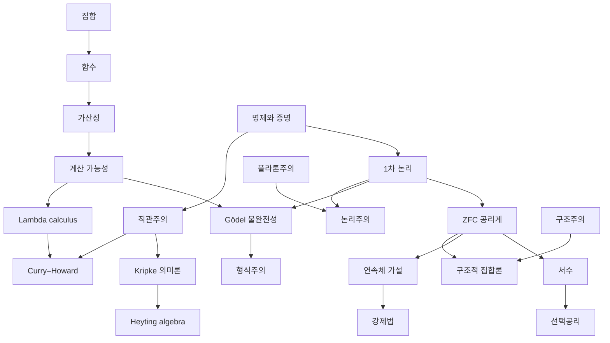

# 수학기초론 개관

# 개요

수학기초론은 수학 자체를 대상으로 삼는다. 수학적 대상이 무엇인지(수리철학), 무엇을 말할 수 있는지(논리), 무엇 위에 세우는지(집합론), 무엇을 기계적으로 할 수 있는지(계산 가능성)를 묻는다. 네 물음은 20 세기 초 역설의 충격에서 함께 태어났고, Gödel 의 불완전성 정리가 넷을 한 자리에 묶는다.

[집합](sets.md)이 대상을 주고 [명제와 증명](proofs.md)이 그 대상을 논하는 언어를 준다. 거기서 [1차 논리](first-order-logic.md)로 가면 [ZFC 공리계](zfc-axioms.md)(Zermelo–Fraenkel 집합론에 선택공리를 더한 것)와 [Gödel 불완전성 정리](godel-incompleteness.md)가 나오고, [기수](cardinality.md)로 가면 [계산 가능성](computability.md)이 나온다. 수리철학의 다섯 입장, 곧 [플라톤주의](mathematical-platonism.md), [논리주의](logicism.md), [형식주의](formalism-hilbert-program.md), [직관주의](intuitionism.md), [구조주의](mathematical-structuralism.md)는 이 기술적 결과에 대한 서로 다른 해석이다.

# 지도

# 갈래

## 수리철학

수학적 대상은 어디에 있고 증명은 무엇을 하는가. 다섯 답이다.

- [수학적 플라톤주의](mathematical-platonism.md): 대상은 우리와 무관하게 존재하고 증명은 발견이다
- [논리주의와 Frege 프로그램](logicism.md): 수학은 논리로 환원된다
- [형식주의와 Hilbert 프로그램](formalism-hilbert-program.md): 수학은 규칙이 지배하는 기호이고 무모순성이 전부다
- [직관주의](intuitionism.md): 대상은 정신의 구성이고 참은 증명을 가졌다는 뜻이다
- [수학적 구조주의](mathematical-structuralism.md) → [구조적 집합론](structural-set-theory.md): 대상은 구조 안의 자리다

## 논리의 체계

- [명제와 증명](proofs.md) → [1차 논리](first-order-logic.md): 구문과 의미, 건전성과 완전성
- [Löwenheim–Skolem 정리](lowenheim-skolem.md): 1차 논리가 크기를 구별하지 못한다
- [Peano 공리](peano-axioms.md): 자연수의 공리계, 2차 형태의 범주성과 1차 형태의 비표준 모형
- [Gödel 불완전성 정리](godel-incompleteness.md): 산술을 담는 체계는 자기 무모순성을 증명하지 못한다
- [2계 산술](second-order-arithmetic.md): 수 변수와 집합 변수를 함께 쓰는 언어, 내포를 제한해 얻는 다섯 부분체계

## 모형론

- [모형론](model-theory.md): 구조와 논리식의 관계, 양화사 소거와 범주성
- [초곱](ultraproducts.md): 초필터로 묶은 구조, Łoś 정리와 콤팩트성의 모형 구성
- [안정 이론](stable-theories.md): 매개변수 위의 타입 개수로 매긴 조건, 순서 성질의 부재와 갈래짓기 독립
- [o-최소성](o-minimality.md): 정의 가능 집합이 구간과 점의 유한 합집합이라는 조건, 셀 분해와 차원
- [구성가능 집합](constructible-sets.md): 대수적 집합의 Boolean 조합, Chevalley 정리와 양화사 소거의 동치
- [Pila–Wilkie 정리](pila-wilkie-theorem.md): 정의 가능 집합의 초월적 부분에 놓인 유리점의 셈, 산술기하에의 응용
- [Ax–Grothendieck 정리](ax-grothendieck.md): 단사 다항식 사상은 전사, 유한체에서 특성 $0$ 으로의 이전

## 무한소

- [비표준 해석학](nonstandard-analysis.md): 무한소를 가진 순서체 위에서 극한을 대수 계산으로 바꾼다
- [내부집합론](internal-set-theory.md): 초곱 대신 표준 술어와 공리꼴 셋으로 무한소를 세우는 공리계

## 구성적 논리

- [직관주의](intuitionism.md) → [Kripke 의미론](kripke-semantics.md) → [Heyting algebra](heyting-algebras.md); [Boolean algebra](boolean-algebras.md)는 고전 쪽 대응물
- [Curry–Howard 대응](curry-howard.md): 증명이 프로그램이다

## 역수학

- [역수학](reverse-mathematics.md): 정리마다 그것을 증명하는 데 필요한 공리를 되돌려 찾는다
- [약한 König 보조정리](weak-konig-lemma.md): 무한 이진 나무의 가지, $\mathrm{WKL}\_0$ 과 동치인 정리와 원시재귀 산술 보존성

## 집합론의 기초

- [집합](sets.md) → [함수](functions.md), [동치관계](equivalence-relations.md) → [부분순서](partial-orders.md)
- [기수](cardinality.md): 대각선 논법과 무한의 크기
- [ZFC 공리계](zfc-axioms.md) → [서수](ordinals.md) → [선택공리](axiom-of-choice.md)

## 독립성과 강제법

- [연속체 가설](continuum-hypothesis.md) → [강제법](forcing.md) → [Martin 의 공리](martins-axiom.md) → [Suslin 문제](suslin-problem.md)
- [Boolean 값 모형](boolean-valued-models.md): 강제법을 완비 Boolean 대수 위의 진리값으로 다시 쓴 판본
- [무작위 실수 강제법](random-real-forcing.md): [측도](measure.md) 대수를 조건으로 쓰는 강제법, Cohen 실수와의 대비
- [구성가능 우주](constructible-universe.md): 정의 가능한 부분집합만 쌓은 내부 모형, 일반화 연속체 가설(generalized continuum hypothesis, GCH)과 선택공리가 정리가 된다
- [큰 기수](large-cardinals.md): 도달 불가능 기수부터 측도 가능 기수까지, 무모순성 강도를 재는 눈금

## 기술집합론

- [Borel 계층](borel-hierarchy.md): 열린집합에서 가산 연산을 초한으로 되풀이한 단계, Suslin 정리
- [기수 불변량](cardinal-characteristics.md): 영집합과 제1범주 아이디얼의 네 기수, Cichoń 도표
- [Luzin 집합과 Sierpiński 집합](luzin-sierpinski-sets.md): 한쪽 뜻으로만 작은 비가산 집합, 연속체 가설 아래의 구성
- [Erdős–Sierpiński 쌍대성](erdos-sierpinski-duality.md): 연속체 가설 아래에서 두 아이디얼을 맞바꾸는 대합

## 계산 가능성

- [계산 가능성](computability.md) → [Lambda calculus](lambda-calculus.md), [Rice 정리](rice-theorem.md), [유한 오토마타](finite-automata.md)
- [영역 이론과 Kleene 고정점 정리](domain-theory.md): 재귀의 의미론
- [Galois 연결](galois-connections.md) → [추상해석](abstract-interpretation.md): 순서 이론이 프로그램 분석이 되는 자리

# 연관 문서

## 선수지식

- [집합](sets.md)
- [명제와 증명](proofs.md)

## 더 알아보기

### 수리철학의 입장

- [수학적 플라톤주의](mathematical-platonism.md)
- [논리주의와 Frege 프로그램](logicism.md)
- [형식주의와 Hilbert 프로그램](formalism-hilbert-program.md)
- [직관주의](intuitionism.md)
- [수학적 구조주의](mathematical-structuralism.md)

### 공리계

- [ZFC 공리계](zfc-axioms.md)

#foundations #philosophy_of_math #logic #set_theory #overview
