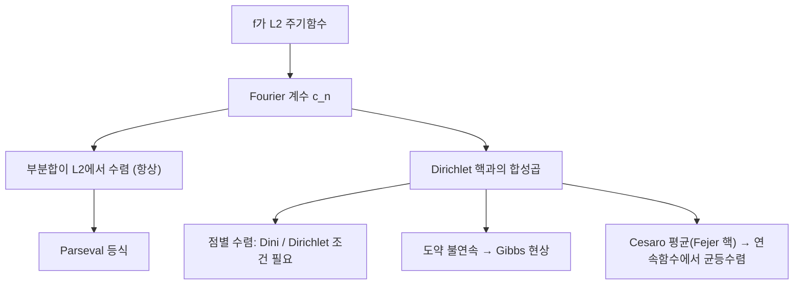

# Fourier 급수

# 개요

주기함수를 sin과 cos의 무한합으로 쓰는 것이 Fourier 급수다. 형식적으로는 18세기의 계산 기법이지만, 오늘날의 정확한 진술은 [Hilbert 공간](hilbert-spaces.md)의 언어로 주어진다. 주기 $2\pi$ 의 제곱적분가능 함수들이 이루는 공간에서 삼각함수계는 정규직교기저이고, Fourier 계수는 그 기저에 대한 좌표다.

이렇게 보면 세 가지가 정리된다. 첫째, 제곱평균($L^2$ ) 수렴은 언제나 성립하며 Parseval 등식이 따라온다. 둘째, 각 점에서의 수렴은 훨씬 미묘해서 추가 조건(Dirichlet, Dini)이 필요하다. 셋째, 불연속점 근처에서는 부분합이 함수를 넘어서 출렁이는 Gibbs 현상이 사라지지 않는다.

Fourier 급수의 실질적인 힘은 미분이 계수의 곱셈으로 바뀐다는 데 있다. 열방정식과 파동방정식이 상수계수 [상미분방정식](ordinary-differential-equations.md)의 모음으로 분해되는 것이 그 결과다.

# 직관

주기함수를 "순수한 진동의 합"으로 분해한다는 발상은 물리적이다. 수학적으로 이 분해가 정당한 이유는 서로 다른 진동수의 삼각함수들이 적분 내적에 대해 직교하기 때문이다. 직교하는 방향들로 벡터를 분해하는 일은 유한차원에서 익숙하고, 무한차원에서 그 일을 가능하게 하는 것이 완비성이다.

주의할 점은 "수렴"이라는 말이 여러 뜻을 가진다는 것이다. $L^2$ 수렴은 평균적인 오차가 0으로 간다는 뜻이지 각 점에서의 값이 맞아 들어간다는 뜻이 아니다. 실제로 계수만 보고 있으면 함수의 국소적 성질은 전혀 보이지 않는다. 어느 한 점의 값을 바꿔도 모든 계수가 그대로이므로, 점별 수렴에 관한 어떤 정리도 $L^2$ 이론만으로는 나올 수 없다.

부분합을 적분 핵으로 쓰면 이 사정이 분명해진다. $N$ 항 부분합은 Dirichlet 핵과의 합성곱이고, 이 핵은 절댓값 적분이 $\log N$ 처럼 커진다. 즉 부분합 연산자는 균등하게 유계가 아니며, 여기서 점별 수렴의 온갖 병리가 나온다.



# 정의

## 삼각함수계와 직교성

구간에서의 내적을 [Riemann 적분](riemann-integral.md)(또는 더 일반적으로 [Lebesgue 적분](lebesgue-integral.md))으로 정의한다.

$$
\langle f, g\rangle = \frac{1}{2\pi}\int_{-\pi}^{\pi} f(x)\thinspace\overline{g(x)}\thinspace dx .
$$

복소 지수계 $e_n(x)=\exp(inx)$ 는 이 내적에 대해 정규직교다.

$$
\langle e_n, e_m\rangle = \frac{1}{2\pi}\int_{-\pi}^{\pi} e^{i(n-m)x}\thinspace dx = \begin{cases} 1 & n = m,\cr 0 & n \ne m.\end{cases}
$$

실수형으로는 $1$ , $\cos(nx)$ , $\sin(nx)$ 들이 서로 직교하며, 이는 곱을 합으로 바꾸는 삼각 항등식에서 바로 나온다.

## Fourier 계수와 부분합

$f$ 가 주기 $2\pi$ 이고 적분가능하면 계수와 부분합을 다음과 같이 정의한다.

$$
\hat{f}(n) = \frac{1}{2\pi}\int_{-\pi}^{\pi} f(x)\thinspace e^{-inx}\thinspace dx,\qquad S_N f(x) = \sum_{n=-N}^{N} \hat{f}(n)\thinspace e^{inx}.
$$

실수형 계수와의 관계는 다음과 같다.

$$
a_n = \frac{1}{\pi}\int_{-\pi}^{\pi} f(x)\cos(nx)\thinspace dx,\qquad b_n = \frac{1}{\pi}\int_{-\pi}^{\pi} f(x)\sin(nx)\thinspace dx,
$$

$$
S_N f(x) = \frac{a_0}{2} + \sum_{n=1}^{N}\big(a_n\cos(nx) + b_n\sin(nx)\big).
$$

함수가 짝함수면 sin 계수가, 홀함수면 cos 계수가 모두 0이다.

## Dirichlet 핵

부분합은 합성곱으로 쓰인다.

$$
S_N f(x) = \frac{1}{2\pi}\int_{-\pi}^{\pi} f(x-t)\thinspace D_N(t)\thinspace dt,\qquad D_N(t) = \sum_{n=-N}^{N} e^{int} = \frac{\sin\big((N+\tfrac12)t\big)}{\sin(t/2)} .
$$

$D_N$ 의 적분은 항상 $2\pi$ 지만, 절댓값 적분(Lebesgue 상수)은 $\log N$ 정도로 발산한다. 이것이 점별 수렴이 자동이 아닌 근본 이유다.

## Cesàro 평균과 Fejér 핵

부분합의 산술평균을 쓰면 핵이 음이 아닌 근사항등원이 된다.

$$
\sigma_N f = \frac{1}{N+1}\sum_{k=0}^{N} S_k f,\qquad F_N(t) = \frac{1}{N+1}\left(\frac{\sin\big(\tfrac{(N+1)t}{2}\big)}{\sin(t/2)}\right)^2 \ge 0 .
$$

# 성질

## L2 수렴과 Parseval

$f$ 가 제곱적분가능하면 부분합은 $f$ 의 $2N+1$ 차원 부분공간으로의 정사영이므로, 그 차수의 삼각다항식 가운데 제곱평균 오차를 최소화한다. 삼각함수계가 완비이므로 다음이 성립한다.

$$
\Vert S_N f - f\Vert \xrightarrow[N\to\infty]{} 0,\qquad \sum_{n\in\mathbb{Z}} |\hat{f}(n)|^2 = \frac{1}{2\pi}\int_{-\pi}^{\pi} |f(x)|^2\thinspace dx .
$$

완비성 증명의 표준 경로는 Fejér 정리다. 연속 주기함수에 대해 Cesàro 평균이 균등수렴하므로 삼각다항식이 연속함수 공간에서 조밀하고, 연속함수가 $L^2$ 에서 조밀하므로 삼각함수계에 직교하는 벡터는 0뿐이다. 따라서 Parseval은 [Hilbert 공간](hilbert-spaces.md)의 일반론에서 자동으로 따라온다.

편극하면 다음 형태(Parseval 항등식)도 얻는다.

$$
\frac{1}{2\pi}\int_{-\pi}^{\pi} f(x)\overline{g(x)}\thinspace dx = \sum_{n\in\mathbb{Z}} \hat{f}(n)\overline{\hat{g}(n)} .
$$

## 계수의 감쇠와 함수의 매끄러움

Riemann–Lebesgue 보조정리로 적분가능한 함수의 계수는 0으로 간다. 부분적분을 반복하면 매끄러움이 감쇠 속도로 번역된다. $f$ 가 $k$ 번 연속미분가능한 주기함수면

$$
\widehat{f^{(k)}}(n) = (in)^k \hat{f}(n),\qquad |\hat{f}(n)| = o\big(|n|^{-k}\big).
$$

특히 계수가 절대수렴하면 급수는 균등수렴하고 합은 연속이다. 이는 [함수열의 균등수렴](uniform-convergence.md)이 극한의 연속성을 보존한다는 사실의 직접적인 응용이다. 반대로 도약 불연속이 있으면 계수는 $1/n$ 정도로만 줄고 절대수렴하지 않는다.

## 점별 수렴

부분합에서 $x$ 에서의 값 $s$ 를 빼면 Dirichlet 핵의 홀짝성 때문에 국소적인 적분만 남는다. 여기서 두 가지 고전적 판정법이 나온다.

- Dini 판정. 어떤 양수 $\delta$ 에 대해

$$
\int_{0}^{\delta} \frac{|f(x+t) + f(x-t) - 2s|}{t}\thinspace dt < \infty
$$

이면 $S_Nf(x)\to s$ . 특히 $f$ 가 $x$ 에서 Hölder 조건을 만족하면 조건이 충족된다.

- Dirichlet 조건. $f$ 가 한 주기에서 조각별 단조이고 유한개의 불연속만 가지면, 모든 점에서 좌우극한의 평균으로 수렴한다.

$$
S_N f(x) \longrightarrow \frac{f(x^+) + f(x^-)}{2}.
$$

일반적으로는 연속성만으로 부족하다. du Bois-Reymond의 예처럼 어떤 점에서 부분합이 발산하는 연속 주기함수가 존재한다(균등유계성 원리로 존재만 보이는 것이 표준이다). 반면 Carleson의 정리는 제곱적분가능한 함수의 Fourier 급수가 거의 어디서나 수렴함을 말한다.[^1] 적분가능하기만 한 함수에서는 이것조차 거짓이며, 어디서나 발산하는 Kolmogorov의 예가 있다.

## Gibbs 현상

도약 불연속 근처에서 부분합은 함수를 일정 비율만큼 초과한다. 도약 크기를 1로 두면, 초과분의 극한은 $N$ 을 키워도 줄지 않고 다음 상수로 수렴한다.[^2]

$$
\frac{1}{\pi}\int_{0}^{\pi} \frac{\sin t}{t}\thinspace dt - \frac{1}{2} \approx 0.0895 .
$$

즉 약 9퍼센트의 과도 진동이 남는다. 오버슈트가 일어나는 위치는 불연속점에 점점 가까워지므로 $L^2$ 수렴과 모순되지 않는다. 넓이가 0으로 가면서 높이는 그대로인 것이다. 이 현상은 부분합이라는 절단 방식의 성질이며, Fejér 평균처럼 음이 아닌 핵을 쓰면 사라진다. 신호 처리에서 창함수를 곱하는 이유가 여기에 있다.

## 몇 가지 고전적 귀결

사각파, 톱니파 같은 구체적인 함수에 Parseval을 적용하면 급수의 합이 떨어진다. 예를 들어 구간에서 $f(x)=x$ 의 계수를 계산해 Parseval을 쓰면 다음을 얻는다.

$$
\sum_{n=1}^{\infty} \frac{1}{n^2} = \frac{\pi^2}{6}.
$$

같은 방식으로 다른 짝수 차수 zeta 값도 계산된다. 또한 균등수렴하는 삼각급수의 계수가 유일하게 결정된다는 사실(계수의 유일성)은 직교성만으로 나온다.

# 활용

## 열방정식

Fourier가 급수를 도입한 원래 문제다. 양 끝에서 온도가 0인 막대의 열전도를 생각한다.

$$
\frac{\partial u}{\partial t} = \kappa \frac{\partial^2 u}{\partial x^2},\qquad u(0,t) = u(\pi,t) = 0,\qquad u(x,0) = f(x).
$$

변수분리를 하면 $\sin(nx)$ 가 공간 방향의 고유함수이고 시간 방향은 지수 감쇠다. 초기조건을 sin 급수로 전개하면 해가 바로 나온다.

$$
u(x,t) = \sum_{n=1}^{\infty} b_n\thinspace e^{-\kappa n^2 t} \sin(nx),\qquad b_n = \frac{2}{\pi}\int_{0}^{\pi} f(x)\sin(nx)\thinspace dx .
$$

$t>0$ 이면 계수가 지수적으로 죽으므로 해는 즉시 무한히 매끄러워진다. 열방정식의 평활화 성질이 계수 감쇠로 곧바로 읽힌다. 파동방정식에서는 지수 대신 $\cos(nct)$ , $\sin(nct)$ 가 나오며 감쇠가 없어 초기 불연속이 그대로 전파된다.

## 이산 변환과의 관계

표본을 유한개만 쓰면 적분이 유한합이 되고, 그것이 [이산 Fourier 변환](fourier.md)이다. 실제 계산은 거의 언제나 이 유한 버전과 FFT로 한다. 주기함수를 [멱급수](power-series.md)로 전개하는 경우와는 다르다. 멱급수는 해석적 함수에만 쓸 수 있고 수렴 반경 안에서만 유효하지만, Fourier 급수는 매끄럽지 않은 함수, 불연속 함수에도 적용되며 전 구간에서 평균적으로 수렴한다.

## 사각파 근사 코드

홀수 차수 sin 항만 남는 사각파의 부분합을 그려 보면 Gibbs 오버슈트를 수치로 확인할 수 있다.

```python
import numpy as np

x = np.linspace(-np.pi, np.pi, 20001)
square = np.where(x >= 0, 1.0, -1.0)

def partial_sum(N):
    # 사각파의 Fourier 급수: (4/pi) * sum_{k odd} sin(kx)/k
    s = np.zeros_like(x)
    for k in range(1, N + 1, 2):
        s += np.sin(k * x) / k
    return 4.0 / np.pi * s

for N in (5, 25, 101, 501):
    s = partial_sum(N)
    l2 = np.sqrt(np.mean((s - square) ** 2))
    overshoot = s.max() - 1.0          # 도약 크기 2에 대한 절대 초과분
    print(N, "L2 오차", round(l2, 4), "오버슈트", round(overshoot, 4))
```

$L^2$ 오차는 0으로 가지만 오버슈트는 약 0.179에 머문다. 도약 크기 2로 나누면 앞의 상수 0.0895가 나온다.

## 다른 방향으로의 확장

- 비주기 함수에는 Fourier 변환, 격자 위에서는 Poisson 합 공식이 대응한다.
- 구면 위에서는 구면 조화함수, 일반 콤팩트 군에서는 Peter–Weyl 정리가 같은 역할을 한다. 어느 경우든 "적당한 연산자의 고유함수가 정규직교기저를 이룬다"는 구조가 공통이다.
- 계수 자체를 다루는 조화해석은 [정칙함수와 Cauchy 적분 정리](holomorphic-functions.md)와도 만난다. 단위원 위의 Fourier 급수에서 음의 지수를 버리면 원판 위의 정칙함수가 된다.

[^1]: Wikipedia, "Carleson's theorem", https://en.wikipedia.org/wiki/Carleson%27s_theorem
[^2]: Wikipedia, "Gibbs phenomenon", https://en.wikipedia.org/wiki/Gibbs_phenomenon

# 연관 문서

## 선수지식

- [Hilbert 공간](hilbert-spaces.md)
- [Riemann 적분](riemann-integral.md)

## 더 알아보기

- [Poisson 합 공식](poisson-summation.md)
- [Lobachevsky 함수와 쌍곡 사면체의 부피](lobachevsky-function.md)

#analysis
