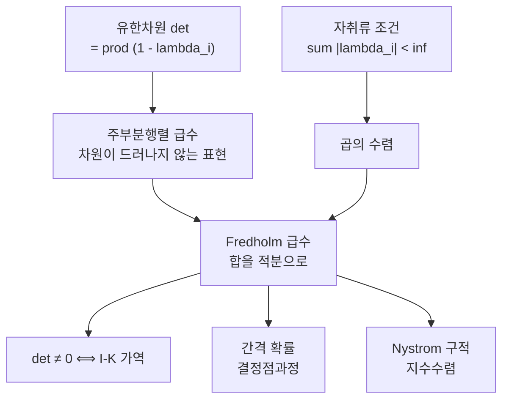

# Fredholm 행렬식

# 개요

[행렬식](determinants.md)은 유한차원의 개념이다. $n \times n$ 행렬의 행렬식은 $n!$ 개 항의 합이고, $n \to \infty$ 에서 이 정의는 아무 의미가 없다. 그런데 적분방정식

$$
\phi(x) - \int_a^b K(x,y)\thinspace\phi(y)\thinspace dy = f(x)
$$

에서 $I - K$ 의 가역성을 판정하는 수가 필요하다. 유한차원에서 그 역할을 하는 것이 행렬식이다.

Fredholm 은 1900 년에 유한차원 행렬식이 만족하는 급수 전개를 무한차원으로 옮겼다. 그 급수는 커널이 충분히 좋으면 수렴하고, 값 $\det(I-K)$ 는 유한차원 행렬식처럼 행동한다. 0 이 아니면 $I-K$ 가 가역이고, 곱에 대해 곱셈적이며, $K$ 에 대해 해석적이다.

[결정점과정](determinantal-point-process.md)의 간격 확률, Tracy–Widom 분포, 산란 이론의 위상 이동, 제타 함수의 정규화가 $\det(I-K)$ 로 표현된다. 가역성 판정의 근거는 [Fredholm 작용소와 지표](fredholm-operators.md)에서 $I - K$ 가 콤팩트 섭동이라 지표가 0 이라는 사실이다. 지표가 0 이면 단사와 전사가 동치이므로 판정할 조건이 하나다.

# 직관

## 자취류 조건

대각화 가능한 유한차원 행렬에서 $\det(I - K) = \prod_i (1 - \lambda_i)$ 다. 무한차원에서 이 곱이 수렴하려면 $\sum_i|\lambda_i| < \infty$ 여야 한다. 이것이 **자취류**(trace class) 조건이다.

콤팩트성만으로는 부족하다. 콤팩트이면 $\lambda_i \to 0$ 이지만 $\lambda_i = 1/i$ 처럼 느리게 갈 수 있고 그러면 $\prod(1-\lambda_i)$ 가 0 으로 발산한다. 고유값이 합할 수 있을 만큼 빨리 줄어야 하고, 자취류가 그 조건이다.

## 급수의 의미

유한차원에서

$$
\det(I - K) = \sum_{k \ge 0}(-1)^k \sum_{i_1 < \dots < i_k}\det\bigl(K_{i_a i_b}\bigr)_{a,b=1}^{k}
$$

가 성립한다. $k$ 번째 항은 크기 $k$ 인 주부분행렬의 행렬식을 모은 것이고, 이 표현에는 차원이 드러나지 않는다. 지수 집합을 연속체로 바꾸고 합을 적분으로 바꾸면 무한차원 정의가 된다.

$$
\det(I - K) = \sum_{k\ge0}\frac{(-1)^k}{k!}\int_{[a,b]^k}\det\bigl(K(x_i,x_j)\bigr)_{i,j=1}^{k}\thinspace dx_1\cdots dx_k
$$

$1/k!$ 은 순서 없는 선택을 순서 있는 적분으로 바꾸며 생긴다. 확률에서 $k$ 번째 항은 점 $k$ 개가 동시에 나타나는 방식을 세는 양이고, 결정점과정의 간격 확률이 이 급수다.

## 수렴 속도

Hadamard 부등식이 $k \times k$ 행렬식을 행 노름의 곱으로 누르므로 급수의 $k$ 번째 항이 $k^{k/2}M^k/k!$ 규모로 눌린다. $k!$ 이 $k^{k/2}$ 를 압도하므로 급수가 모든 $K$ 에 대해 완전함수로 수렴한다. 수렴 반경이 무한대이므로 Fredholm 이론이 임의의 자취류 커널을 다룬다.

# 정의

## 자취류 작용소

Hilbert 공간 위의 콤팩트 작용소 $K$ 의 특이값을 $s_1 \ge s_2 \ge \cdots$ 라 할 때

$$
\lVert K\rVert_1 = \sum_i s_i < \infty
$$

이면 $K$ 가 **자취류**다. 임의의 정규직교기저에 대해 $\sum_i \langle Ke_i, e_i\rangle$ 가 절대수렴하고 기저에 의존하지 않으므로 **자취** $\mathrm{tr}K$ 가 정의된다. 자취류 작용소들은 $\lVert\cdot\rVert_1$ 에 대해 Banach 공간을 이루고, 유계 작용소를 곱해도 자취류로 남는 양쪽 아이디얼이다.

Lidskii 의 정리는 자취류 $K$ 에 대해 $\mathrm{tr}K = \sum_i\lambda_i$ 라고 진술한다. 우변은 대수적 중복도를 세어 절대수렴하며, 등식은 $K$ 가 자기수반이 아닐 때도 성립한다.

## Fredholm 행렬식

자취류 $K$ 에 대해

$$
\det(I - zK) = \prod_i (1 - z\lambda_i) = \sum_{k\ge0}\frac{(-z)^k}{k!}\int \det\bigl(K(x_i,x_j)\bigr)_{i,j\le k}\thickspace d^k x
$$

로 정의한다. 두 표현이 같다는 것이 **Plemelj–Smithies 항등식**이다. 좌변은 $z$ 의 완전함수이고 그 영점이 $1/\lambda_i$ 다. 커널 형태는 $K$ 가 적분작용소이고 $K(x,y)$ 가 연속일 때 쓴다. 자취류성은 커널의 매끄러움으로 확인하며 $[a,b]$ 위의 $C^1$ 커널이면 충분하다.

## 자취를 통한 표현

$\lVert K\rVert < 1$ 이면 로그를 전개해

$$
\log\det(I - K) = \mathrm{tr}\log(I - K) = -\sum_{m\ge1}\frac{1}{m}\mathrm{tr}K^m
$$

를 얻는다. 행렬식의 로그가 로그의 자취라는 이 등식이 계산에서 가장 많이 쓰인다. 우변의 $\mathrm{tr}K^m$ 은 $m$ 중 적분

$$
\mathrm{tr}K^m = \int K(x_1,x_2)K(x_2,x_3)\cdots K(x_m,x_1)\thinspace d^m x
$$

이므로 섭동 전개나 점근 해석에서 항별로 다룬다.

# 성질

## 가역성 판정

자취류 $K$ 에 대해 $I - K$ 가 가역일 필요충분조건은 $\det(I-K) \ne 0$ 이다.

$K$ 가 콤팩트이므로 [$I - K$ ](fredholm-operators.md) 는 지표 0 인 Fredholm 작용소이고 단사이면 전사다. 이것이 **Fredholm 대안**이다. 제차 방정식 $\phi = K\phi$ 가 자명해만 가지면 비제차 방정식이 모든 $f$ 에 대해 유일해를 갖고, 그렇지 않으면 해가 없거나 무한히 많다.

## 곱셈성과 연속성

자취류 $K, L$ 에 대해

$$
\det\bigl((I-K)(I-L)\bigr) = \det(I-K)\thinspace\det(I-L)
$$

이 성립한다. 또 $\lVert K_n - K\rVert_1 \to 0$ 이면 $\det(I-K_n) \to \det(I-K)$ 이고, 더 정량적으로

$$
\bigl\lvert\det(I-K) - \det(I-L)\bigr\rvert \le \lVert K - L\rVert_1\thinspace\exp\bigl(\lVert K\rVert_1 + \lVert L\rVert_1 + 1\bigr)
$$

이다. 이 연속성은 자취류 노름에 대한 것이고 작용소 노름에 대한 것이 아니다. 작용소 노름으로 가까운 두 작용소의 행렬식이 크게 다를 수 있다.

유한 랭크 근사가 자취류 노름으로 수렴하면 행렬식도 같은 속도로 수렴하므로, 이 부등식이 수치 계산의 근거다.

## 지표와의 경계

$I - K$ 는 지표가 항상 0 이라 지표가 정보를 주지 않고 행렬식이 세밀한 정보를 준다. 일반 Fredholm 작용소에서는 지표가 불변량이지만 행렬식을 정의할 수 없다. 두 불변량은 상보적이다.

## 정규화 행렬식

$K$ 가 자취류가 아니고 Hilbert–Schmidt 일 뿐이면 곱 $\prod(1-\lambda_i)$ 가 발산할 수 있다. 이때는

$$
{\det}_2(I - K) = \prod_i (1-\lambda_i)e^{\lambda_i}
$$

처럼 발산하는 1 차 항을 지수인자로 상쇄한다. $K \in \mathcal S_p$ 에 대해 ${\det}_p$ 가 있다. 발산하는 항을 정해진 규칙으로 빼는 이 조작이 물리의 재규격화에 해당하고, 대가로 곱셈성이 수정된다.

# 활용

## Nyström 구적에 의한 계산

Fredholm 급수를 항별로 계산하면 다중적분이 겹친다. Bornemann 의 방법은 $[a,b]$ 위의 구적 마디 $x_i$ 와 무게 $w_i$ 를 잡고

$$
\det(I-K) \thickspace\approx\thickspace \det\Bigl(\delta_{ij} - \sqrt{w_i w_j}\thinspace K(x_i,x_j)\Bigr)_{i,j=1}^{n}
$$

라는 $n \times n$ 행렬식 하나를 계산하는 것이다. $\sqrt{w_iw_j}$ 는 대칭을 유지하려고 나눠 붙였고, 계산의 본체는 적분작용소를 구적으로 이산화한 Nyström 근사다. 커널이 해석적이고 Gauss 구적을 쓰면 수렴이 지수적이라 마디 몇 개로 기계정밀도에 닿는다.

랭크 2 커널은 유한 랭크라 Gauss 구적이 다항식을 정확히 적분하고 $n = 8$ 에서 15 자리가 맞는다.

해석적 커널에서는 Nyström 근사가 마디 수에 대해 지수적으로 수렴한다. $s$ 가 작을 때 $1-\det$ 은 $s$ 에서 시작하고 다음 항이 $\pi^2 s^4/36$ 이다. 급수의 2 차와 3 차 항이 상쇄되어 $s^4$ 가 첫 보정이다.

## 간격 확률과 무작위 행렬

[결정점과정](determinantal-point-process.md)에서 구간 $J$ 에 점이 하나도 없을 확률이 정확히 $\det(I - K)\_{L^2(J)}$ 다. 무작위 행렬의 고유값이 결정점과정을 이루므로, 고유값 사이의 간격 분포가 전부 이 행렬식으로 쓰인다. 최대 고유값의 분포인 Tracy–Widom $F_2$ 도 Airy 커널에 대한 $\det(I - K_{\mathrm{Ai}})\_{L^2(s,\infty)}$ 이며, 커널과 구간만 바꾸면 같은 수치 절차로 계산된다.

확률에서 나온 양이 해석적으로 다루기 쉬운 결정식으로 표현되고, 그 결정식이 Painlevé 방정식과 이어진다.

## 산란과 정규화된 행렬식

산란 이론에서 Jost 함수가 섭동 작용소의 Fredholm 행렬식으로 쓰이고, 그 위상의 증가가 속박 상태의 개수를 센다. Birman–Krein 공식이 $\det$ 의 위상과 스펙트럼 이동 함수를 잇는 형태로 이 관계를 정리한다.

Laplace 작용소처럼 자취류가 아닌 대상에는 제타 정규화 행렬식 $\exp(-\zeta'(0))$ 을 쓴다. 정의는 Fredholm 행렬식과 다르지만 발산하는 고유값 곱에 유한한 값을 지정한다는 점에서 ${\det}_p$ 정규화와 같은 계열이다. 해석적 비틀림과 곡면 위의 행렬식 공식이 이 틀에 속한다.[^1]

[^1]: Barry Simon, *Trace Ideals and Their Applications*, 2nd ed., Chapters 3 and 5. 자취류 아이디얼, Lidskii 정리, Fredholm 행렬식의 정의와 곱셈성, 정규화 행렬식 det_p. 수치 계산은 Folkmar Bornemann, *On the numerical evaluation of Fredholm determinants*, Mathematics of Computation 79 (2010), §§1–3.

# 연관 문서

## 선수지식

- [행렬식](determinants.md)
- [Fredholm 작용소와 지표](fredholm-operators.md)

## 더 알아보기

- [결정점과정](determinantal-point-process.md)

#functional_analysis #analysis #linear_algebra #computation
