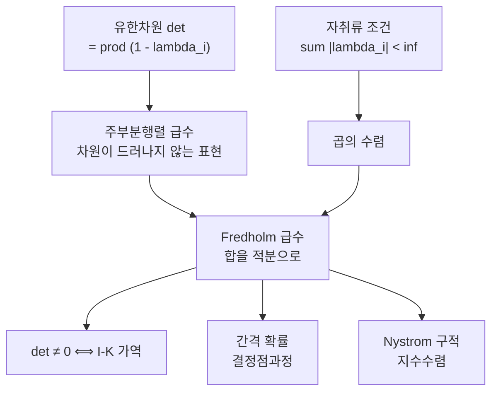

# Fredholm 행렬식

# 개요

[행렬식](determinants.md)은 유한차원의 개념이다. $n \times n$ 행렬의 행렬식은 $n!$ 개 항의 합이고, $n \to \infty$ 에서 이 정의는 아무 의미가 없다. 그런데 적분방정식

$$
\phi(x) - \int_a^b K(x,y)\,\phi(y)\,dy = f(x)
$$

를 다루다 보면 "$I - K$ 가 가역인가" 를 판정하는 수 하나가 있었으면 좋겠다는 생각이 자연스럽게 든다. 유한차원에서 그 역할을 하던 것이 행렬식이었으니 말이다.

Fredholm 이 1900년에 한 일이 이것이다. 행렬식을 정의의 형태로 옮기는 대신, 유한차원 행렬식이 만족하는 **급수 전개**를 무한차원으로 그대로 밀어 올렸다. 놀랍게도 그 급수는 커널이 웬만큼만 좋으면 수렴하며, 수렴한 값 $\det(I-K)$ 는 유한차원에서와 똑같이 행동한다. 0 이 아니면 $I-K$ 가 가역이고, 곱에 대해 곱셈적이고, $K$ 에 대해 해석적이다.

오늘날 이 수는 적분방정식보다 다른 곳에서 더 자주 쓰인다. [결정점과정](determinantal-point-process.md)의 간격 확률, Tracy–Widom 분포, 산란 이론의 위상 이동, 제타 함수의 정규화가 모두 $\det(I-K)$ 하나로 표현된다. 그리고 [Fredholm 작용소와 지표](fredholm-operators.md)에서 본 "$I - K$ 는 콤팩트 섭동이므로 지표가 0" 이라는 사실이, 이 수가 가역성 판정에 쓰일 수 있는 근거가 된다. 지표가 0 이라야 단사와 전사가 같은 말이 되고, 그래야 판정할 것이 하나뿐이다.

# 직관

## 왜 자취류인가

대각화 가능한 유한차원 행렬에서 $\det(I - K) = \prod_i (1 - \lambda_i)$ 다. 무한차원에서 이 곱이 수렴하려면 $\sum_i|\lambda_i| < \infty$ 여야 한다. 이것이 **자취류**(trace class) 조건이다.

콤팩트 작용소만으로는 부족하다는 점이 중요하다. 콤팩트이면 $\lambda_i \to 0$ 이지만 $\lambda_i = 1/i$ 처럼 느리게 갈 수 있고, 그러면 $\prod(1-\lambda_i)$ 가 0 으로 발산한다. 고유값이 **합할 수 있을 만큼 빨리** 줄어야 행렬식이 산다. 자취류는 그 최소 요구조건을 정확히 집어낸 것이다.

## 급수는 무엇을 세는가

유한차원에서

$$
\det(I - K) = \sum_{k \ge 0}(-1)^k \sum_{i_1 < \dots < i_k}\det\bigl(K_{i_a i_b}\bigr)_{a,b=1}^{k}
$$

가 성립한다. $k$ 번째 항은 크기 $k$ 인 주부분행렬의 행렬식을 전부 모은 것이다. 이 표현에는 차원이 겉으로 드러나지 않으므로, 지수 집합을 연속체로 바꾸고 합을 적분으로 바꾸면 그대로 무한차원 정의가 된다.

$$
\det(I - K) = \sum_{k\ge0}\frac{(-1)^k}{k!}\int_{[a,b]^k}\det\bigl(K(x_i,x_j)\bigr)_{i,j=1}^{k}\,dx_1\cdots dx_k
$$

$1/k!$ 은 순서 없는 선택을 순서 있는 적분으로 바꾸며 생긴 것이다. 확률 쪽에서 보면 $k$ 번째 항은 "점 $k$ 개가 동시에 나타날 방식" 을 세는 양이고, 그래서 결정점과정의 간격 확률이 바로 이 급수가 된다.

## 왜 이렇게 빨리 수렴하는가

Hadamard 부등식이 $k \times k$ 행렬식을 행 노름의 곱으로 누르므로, 위 급수의 $k$ 번째 항은 $k^{k/2}M^k/k!$ 규모로 눌린다. $k!$ 이 $k^{k/2}$ 를 압도하므로 급수는 모든 $K$ 에 대해 **완전함수**로 수렴한다. 수렴 반경이 무한대라는 것이 Fredholm 이론의 출발점이고, 아래 수치 계산에서 격자를 조금만 키워도 자릿수가 쏟아지는 이유도 결국 이 여유에서 온다.



# 정의

## 자취류 작용소

Hilbert 공간 위의 콤팩트 작용소 $K$ 의 특이값을 $s_1 \ge s_2 \ge \cdots$ 라 할 때

$$
\lVert K\rVert_1 = \sum_i s_i < \infty
$$

이면 $K$ 를 **자취류**라 한다. 이때 임의의 정규직교기저에 대해 $\sum_i \langle Ke_i, e_i\rangle$ 가 절대수렴하고 기저에 의존하지 않으므로 **자취** $\operatorname{tr}K$ 가 잘 정의된다. 자취류 작용소들은 $\lVert\cdot\rVert_1$ 에 대해 Banach 공간을 이루고, 유계 작용소를 곱해도 자취류로 남는 양쪽 아이디얼이다.

Lidskii 의 정리가 자취와 고유값을 잇는다. 자취류 $K$ 에 대해 $\operatorname{tr}K = \sum_i\lambda_i$ 이며, 우변은 대수적 중복도를 세어 절대수렴한다. 자기수반이 아닐 때에도 성립한다는 점이 요지이고, 증명은 간단하지 않다.

## Fredholm 행렬식

자취류 $K$ 에 대해

$$
\det(I - zK) = \prod_i (1 - z\lambda_i) = \sum_{k\ge0}\frac{(-z)^k}{k!}\int \det\bigl(K(x_i,x_j)\bigr)_{i,j\le k}\;d^k x
$$

로 정의한다. 두 표현이 같다는 것이 **Plemelj–Smithies** 의 항등식이고, 좌변은 $z$ 의 완전함수이며 그 영점이 정확히 $1/\lambda_i$ 다. 커널로 쓰인 형태는 $K$ 가 적분작용소이고 $K(x,y)$ 가 충분히 좋을 때(예를 들어 연속) 쓸 수 있다. 자취류성은 커널의 매끄러움으로 확인하는 것이 보통이며, $[a,b]$ 위의 $C^1$ 커널이면 충분하다.

## 자취를 통한 표현

$\lVert K\rVert < 1$ 이면 로그를 전개해

$$
\log\det(I - K) = \operatorname{tr}\log(I - K) = -\sum_{m\ge1}\frac{1}{m}\operatorname{tr}K^m
$$

를 얻는다. "행렬식의 로그는 로그의 자취" 라는 이 한 줄이 실용에서 가장 많이 쓰이는 형태다. 우변의 $\operatorname{tr}K^m$ 은 $m$ 중 적분

$$
\operatorname{tr}K^m = \int K(x_1,x_2)K(x_2,x_3)\cdots K(x_m,x_1)\,d^m x
$$

이므로, 섭동 전개나 점근 해석에서 항별로 다루기 좋다.

# 성질

## 가역성 판정

자취류 $K$ 에 대해 $I - K$ 가 가역일 필요충분조건이 $\det(I-K) \ne 0$ 이다. 유한차원 판정이 글자 그대로 살아남는다.

여기서 [Fredholm 작용소와 지표](fredholm-operators.md)가 결정적이다. $K$ 가 콤팩트이므로 $I - K$ 는 지표 0 인 Fredholm 작용소이고, 따라서 단사이면 자동으로 전사다. 확인할 것이 하나로 줄어드는 이 사실을 **Fredholm 대안**이라 부른다. 제차 방정식 $\phi = K\phi$ 가 자명해만 가지면 비제차 방정식이 모든 $f$ 에 대해 유일해를 갖고, 그렇지 않으면 해가 없거나 무한히 많다. 중간이 없다.

## 곱셈성과 연속성

자취류 $K, L$ 에 대해

$$
\det\bigl((I-K)(I-L)\bigr) = \det(I-K)\,\det(I-L)
$$

이 성립한다. 또 $\lVert K_n - K\rVert_1 \to 0$ 이면 $\det(I-K_n) \to \det(I-K)$ 이고, 더 정량적으로

$$
\bigl\lvert\det(I-K) - \det(I-L)\bigr\rvert \le \lVert K - L\rVert_1\,\exp\bigl(\lVert K\rVert_1 + \lVert L\rVert_1 + 1\bigr)
$$

이다. 자취류 노름에 대한 연속성이지 작용소 노름에 대한 연속성이 **아니라는** 점을 놓치면 안 된다. 작용소 노름으로 가까운 두 작용소의 행렬식이 전혀 다를 수 있다.

이 부등식이 수치 계산의 근거다. 유한 랭크 근사가 자취류 노름으로 수렴하기만 하면 행렬식도 같은 속도로 수렴한다.

## 지표와의 경계

$\det$ 가 살아 있는 곳과 지표가 살아 있는 곳은 정확히 엇갈린다. $I - K$ 는 지표가 항상 0 이므로 지표는 아무 정보도 주지 않고, 대신 행렬식이 세밀한 정보를 준다. 반대로 일반 Fredholm 작용소에서는 지표가 유용한 불변량이지만 행렬식을 정의할 수 없다. 하나가 잘 정의되는 자리에서 다른 하나가 자명해지는 상보적 관계다.

## 무엇이 정규화를 요구하는가

$K$ 가 자취류가 아니고 Hilbert–Schmidt 일 뿐이면 곱 $\prod(1-\lambda_i)$ 가 발산할 수 있다. 이때는

$$
{\det}_2(I - K) = \prod_i (1-\lambda_i)e^{\lambda_i}
$$

처럼 발산하는 1차 항을 지수인자로 상쇄해 쓴다. 더 일반적으로 $K \in \mathcal S_p$ 에 대해 ${\det}_p$ 가 있으며, 이 정규화가 물리에서 재규격화라 부르는 조작의 수학적 원형이다. 유한한 답을 얻기 위해 발산하는 항을 정해진 규칙으로 빼는데, 그 대가로 곱셈성이 수정된다.

# 활용

## 수치 계산: 구적 하나로 끝난다

Fredholm 급수를 항별로 계산하려 들면 다중적분이 겹쳐 실용적이지 않다. Bornemann 이 지적한 것은 훨씬 단순하다. $[a,b]$ 위의 구적 마디 $x_i$ 와 무게 $w_i$ 를 잡고

$$
\det(I-K) \;\approx\; \det\Bigl(\delta_{ij} - \sqrt{w_i w_j}\,K(x_i,x_j)\Bigr)_{i,j=1}^{n}
$$

라는 $n \times n$ 행렬식 하나를 계산하면 된다. 대칭을 유지하려고 $\sqrt{w_iw_j}$ 로 나눠 붙인 것이고, 본질은 적분작용소를 구적으로 이산화한 Nyström 근사다. 커널이 해석적이고 Gauss 구적을 쓰면 수렴이 **지수적**이라, 마디 몇 개로 기계정밀도에 닿는다.

```python
import math

def gauss_legendre(n, a, b):
    """[a,b] 위의 Gauss-Legendre 마디와 무게. Newton 으로 Legendre 영점을 찾는다."""
    xs, ws = [], []
    for i in range(n):
        x = math.cos(math.pi * (i + 0.75) / (n + 0.5))
        for _ in range(100):
            p0, p1 = 1.0, 0.0
            for k in range(n):
                p0, p1 = ((2 * k + 1) * x * p0 - k * p1) / (k + 1), p0
            dp = n * (x * p0 - p1) / (x * x - 1)
            dx = -p0 / dp
            x += dx
            if abs(dx) < 1e-15:
                break
        xs.append(x)
        ws.append(2 / ((1 - x * x) * dp * dp))
    c, r = (a + b) / 2, (b - a) / 2
    return [c + r * x for x in xs], [r * w for w in ws]

def det_dense(A):
    """부분 피벗 LU 로 행렬식."""
    n, d = len(A), 1.0
    A = [row[:] for row in A]
    for k in range(n):
        p = max(range(k, n), key=lambda i: abs(A[i][k]))
        if p != k:
            A[k], A[p] = A[p], A[k]
            d = -d
        if A[k][k] == 0:
            return 0.0
        d *= A[k][k]
        for i in range(k + 1, n):
            f = A[i][k] / A[k][k]
            for j in range(k, n):
                A[i][j] -= f * A[k][j]
    return d

def fredholm(K, a, b, n):
    """det(I - K) 를 Nystrom 구적으로."""
    x, w = gauss_legendre(n, a, b)
    s = [math.sqrt(wi) for wi in w]
    M = [[(1.0 if i == j else 0.0) - s[i] * s[j] * K(x[i], x[j])
          for j in range(n)] for i in range(n)]
    return det_dense(M)

# 1. 랭크 2 커널: cos(x-y) = cos x cos y + sin x sin y 이므로 정확값 (1 - pi/2)^2
print(f"cos(x-y) on [0,pi]   정확값 {(1 - math.pi / 2) ** 2:.15f}")
for n in (4, 8, 12, 20):
    print(f"   n={n:2d}: {fredholm(lambda x, y: math.cos(x - y), 0, math.pi, n):.15f}")

# 2. sine 커널의 간격 확률.  작은 s 에서 1 - s + (pi^2/36) s^4
def sine(x, y):
    d = math.pi * (x - y)
    return 1.0 if abs(d) < 1e-14 else math.sin(d) / d

print("\nsine 커널, det(I-K) on [0,s]")
print("   s      n=10            n=20            n=40          (1-det-s)/s^4")
for s in (0.05, 0.2, 1.0, 2.0):
    vals = [fredholm(sine, 0, s, n) for n in (10, 20, 40)]
    c4 = (vals[-1] - 1 + s) / s ** 4
    print(f" {s:4.2f}  " + "  ".join(f"{v:.12f}" for v in vals) + f"   {c4:.6f}")
print(f"\n   pi^2/36 = {math.pi ** 2 / 36:.6f}")
```

랭크 2 커널에서는 $n = 8$ 에 이미 15 자리가 맞는다. 유한 랭크 커널을 Gauss 구적으로 재는 일은 결국 다항식을 정확히 적분하는 일이므로 당연하지만, 구현이 옳다는 확인으로 쓸 만하다.

sine 커널 쪽이 본론이다. $n=10$ 과 $n=40$ 이 12 자리까지 같은 값을 내놓는다. 마디 열 개로 무한차원 행렬식을 열두 자리까지 얻은 것이고, 이것이 해석적 커널에서 Nyström 근사가 갖는 지수수렴이다. 마지막 열은 $1 - s$ 에서 벗어난 양을 $s^4$ 로 나눈 것인데, $s = 0.05$ 에서 $0.2738$ 이 나와 알려진 전개 계수 $\pi^2/36 = 0.2742$ 를 네 자리까지 준다. $s$ 를 키우면 $s=0.2$ 에서 이 비가 $0.2684$ 로 내려가고 $s \ge 1$ 에서는 고차항이 지배해 뜻을 잃는다. 급수의 $2$ 차와 $3$ 차 항이 정확히 상쇄되어 $s^4$ 가 첫 보정이라는 사실까지 수치가 확인해 준다.

## 간격 확률과 무작위 행렬

[결정점과정](determinantal-point-process.md)에서 구간 $J$ 에 점이 하나도 없을 확률이 정확히 $\det(I - K)\_{L^2(J)}$ 다. 무작위 행렬의 고유값이 결정점과정을 이루므로, 고유값 사이의 간격 분포가 전부 이 행렬식으로 쓰인다. 최대 고유값의 분포인 Tracy–Widom $F_2$ 도 Airy 커널에 대한 $\det(I - K_{\mathrm{Ai}})\_{L^2(s,\infty)}$ 이고, 위 코드의 커널과 구간만 바꾸면 그대로 계산된다.

이 지점이 Fredholm 행렬식이 오늘날 가장 많이 쓰이는 자리다. 확률에서 나온 양이 해석적으로 다루기 쉬운 결정식으로 표현되고, 그 결정식이 다시 Painlevé 방정식 같은 완전히 다른 대상과 이어진다.

## 산란과 정규화된 행렬식

산란 이론에서 Jost 함수가 섭동 작용소의 Fredholm 행렬식으로 쓰이고, 그 위상의 증가가 속박 상태의 개수를 센다. Birman–Krein 공식이 $\det$ 의 위상과 스펙트럼 이동 함수를 잇는 형태로 이 관계를 정리한다.

Laplace 작용소처럼 자취류가 아닌 대상에는 제타 정규화 행렬식 $\exp(-\zeta'(0))$ 을 쓴다. Fredholm 행렬식과 정의는 다르지만 "발산하는 고유값 곱에 유한한 값을 지정한다" 는 동기가 같고, 위에서 본 ${\det}_p$ 정규화와 같은 계열의 조작이다. 해석적 비틀림이나 곡면 위의 행렬식 공식이 모두 이 틀에서 나온다.[^1]

[^1]: Barry Simon, *Trace Ideals and Their Applications*, 2nd ed., Chapters 3 and 5. 자취류 아이디얼, Lidskii 정리, Fredholm 행렬식의 정의와 곱셈성, 정규화 행렬식 det_p. 수치 계산은 Folkmar Bornemann, *On the numerical evaluation of Fredholm determinants*, Mathematics of Computation 79 (2010), §§1–3.

# 연관 문서

## 선수지식

- [행렬식](determinants.md)
- [Fredholm 작용소와 지표](fredholm-operators.md)

## 더 알아보기

- [결정점과정](determinantal-point-process.md)

#functional_analysis #analysis #linear_algebra #computation
