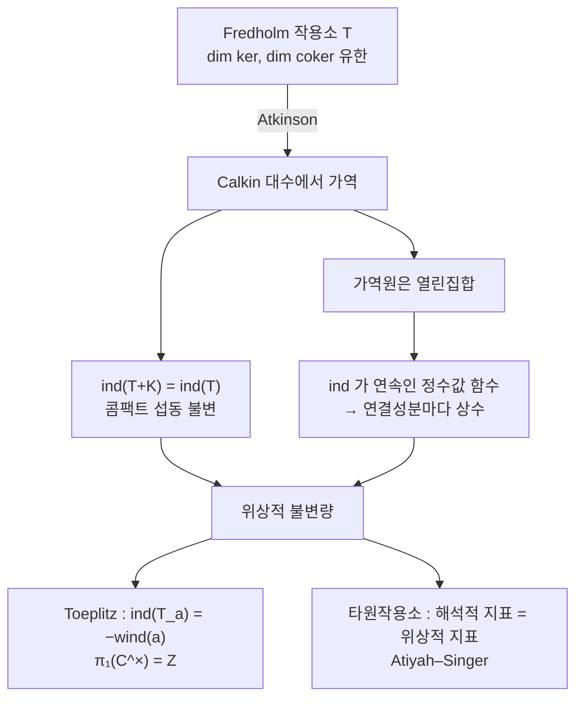

# Fredholm 작용소와 지표

# 개요

유한 차원에서 선형사상 $T\colon V\to W$ 의 지표

$$
\mathrm{ind}(T)=\dim\ker T-\dim\mathrm{coker}\,T
$$

는 $\dim V-\dim W$ 다. $T$ 가 무엇인지는 전혀 들어가지 않는다. 계수 정리가 두 항을 정확히 상쇄시키기 때문이고, 그래서 유한 차원에서 지표는 정보를 담지 않는다.

무한 차원에서 사정이 달라진다. $\dim V=\dim W=\infty$ 라 뺄셈이 뜻을 잃는데도, 두 차원이 각각 유한한 작용소들이 있다. 그런 작용소를 **Fredholm 작용소**라 하고, 그 지표는 정수 하나를 준다. 이 정수는 놀랄 만큼 강건하다. 작은 섭동에도, 콤팩트 섭동에도, 연속 변형에도 변하지 않는다.

$$
\mathrm{ind}\colon\mathcal F(H)\longrightarrow\mathbb Z\quad\text{가 연결성분을 완전히 분류한다}
$$

강건하다는 것은 계산할 수 있다는 뜻이다. 해석적으로 정의된 양이 위상적 불변량이 되고, 그것이 [지표 정리](index-theorem.md)로 이어진다. Toeplitz 작용소에서는 이 사실이 가장 단순한 형태로 나타난다. 지표가 기호의 **감음수**의 부호를 바꾼 것이다.

# 직관

## 왜 무한 차원에서만 뜻이 있는가

유한 차원에서 $T\colon F^m\to F^n$ 의 계수를 $r$ 라 하면 $\dim\ker=m-r$ 이고 $\dim\mathrm{coker}=n-r$ 이므로 지표는 언제나 $m-n$ 이다. $T$ 를 아무리 흔들어도 두 차원이 같이 움직여 차가 고정된다.

무한 차원에서는 이 상쇄가 자동이 아니다. 왼쪽 이동 작용소 $S^*$ 와 오른쪽 이동 작용소 $S$ 를 보자.

$$
S(x_0,x_1,\dots)=(0,x_0,x_1,\dots),\qquad S^*(x_0,x_1,\dots)=(x_1,x_2,\dots)
$$

$S$ 는 단사지만 전사가 아니다. 상이 여차원 1 이라 $\mathrm{ind}(S)=-1$ 이다. $S^*$ 는 전사지만 핵이 1 차원이라 $\mathrm{ind}(S^\ast)=+1$ 이다. 유한 차원에서는 단사와 전사가 같은 말이지만 여기서는 갈라지고, 그 갈라짐의 크기가 지표다.

$S^\ast S=I$ 인데 $SS^\ast\ne I$ 라는 비대칭이 핵심이다. 무한 차원에서만 가능한 일이고, 지표는 이 비대칭을 세는 정수다.

## 왜 변하지 않는가

지표가 콤팩트 섭동에 불변이라는 사실이 결정적이다.

$$
\mathrm{ind}(T+K)=\mathrm{ind}(T)\qquad(K\ \text{콤팩트})
$$

이유를 Calkin 대수로 보면 분명하다. 유계 작용소 전체를 콤팩트 작용소로 나눈 몫대수 $\mathcal B(H)/\mathcal K(H)$ 에서, $T$ 가 Fredholm 이라는 것은 $T$ 의 상이 **가역**이라는 것과 같다. 콤팩트 작용소를 더하는 것은 몫에서 아무 일도 하지 않는다.

그리고 가역원 전체는 열린집합이고, 지표는 그 위에서 연속인 정수값 함수다. 연속인 정수값 함수는 연결성분마다 상수다. 지표가 연속 변형에 불변인 이유가 이것이며, 위상적 불변량이라는 말의 정확한 뜻이다.

## 감음수가 지표가 되는 이유

Hardy 공간 $H^2$ 를 $\ell^2$ 의 복사본으로 보고, 원 위의 함수 $a(z)$ 를 곱한 뒤 다시 $H^2$ 로 사영하는 작용소가 **Toeplitz 작용소** $T_a$ 다.

$a(z)=z$ 이면 $T_z=S$ 이고 지표가 $-1$ 이다. $a(z)=z^n$ 이면 지표가 $-n$ 이다. 한편 $a(z)=z^n$ 의 감음수는 $n$ 이다. 일반적으로

$$
\mathrm{ind}(T_a)=-\mathrm{wind}(a)
$$

가 성립한다. 그럴듯한 설명은 이렇다. 지표는 연속 변형에 불변이고 기호가 $0$ 을 지나지 않는 한 $T_a$ 는 Fredholm 을 유지하므로, 지표는 기호의 호모토피류에만 의존한다. 그런데 원에서 $\mathbb C^\times$ 로 가는 연속 함수의 호모토피류는 감음수가 완전히 분류한다. 곧 $\pi_1(\mathbb C^\times)=\mathbb Z$ 다. 그러니 지표는 감음수의 함수여야 하고, 곱셈성 $\mathrm{ind}(T_{ab})=\mathrm{ind}(T_a)+\mathrm{ind}(T_b)$ 까지 쓰면 그 함수는 선형이며, $a=z$ 한 점에서 값을 맞추면 부호까지 정해진다.

# 정의

## Fredholm 작용소

Hilbert 공간 사이의 [유계 작용소](bounded-operators.md) $T\colon H_1\to H_2$ 가 **Fredholm** 이라는 것은

$$
\dim\ker T<\infty,\qquad \dim\mathrm{coker}\,T=\dim(H_2/\overline{\mathrm{ran}\,T})<\infty
$$

이고 상이 닫혀 있다는 뜻이다. 사실 두 차원이 유한하면 상이 닫힌다는 것이 따라 나오므로, 조건은 두 줄로 충분하다. **지표**를 $\mathrm{ind}(T)=\dim\ker T-\dim\mathrm{coker}\thinspace T\in\mathbb Z$ 로 정의한다.

$H_1=H_2=H$ 일 때 Fredholm 작용소 전체를 $\mathcal F(H)$ 라 쓴다.

## Atkinson 정리

> $T\in\mathcal B(H)$ 가 Fredholm 인 것은 $\pi(T)$ 가 Calkin 대수 $\mathcal B(H)/\mathcal K(H)$ 에서 가역인 것과 동치다. 곧 $ST-I$ 와 $TS-I$ 가 모두 콤팩트인 $S$ 가 존재하는 것과 같다.

이 $S$ 를 **유사역원**이라 한다. Fredholm 성질이 "콤팩트 오차를 무시하면 가역" 이라는 뜻임을 말해 주며, 지표 이론 전체가 이 한 문장 위에 세워진다.

## Toeplitz 작용소

$H^2\subset L^2(S^1)$ 을 음의 Fourier 계수가 모두 $0$ 인 함수들의 공간(Hardy 공간)이라 하고, $P\colon L^2\to H^2$ 를 직교사영이라 하자. $a\in C(S^1)$ 에 대해

$$
T_a\colon H^2\to H^2,\qquad T_af=P(af)
$$

를 **Toeplitz 작용소**라 한다. Fourier 기저에서 행렬이 $(T_a)_{jk}=\hat a(j-k)$ 라 대각선을 따라 상수인 무한 행렬이 된다. $a(z)=z$ 이면 오른쪽 이동 작용소다.

# 성질

## 기본 성질

> 1. $\mathcal F(H)$ 는 $\mathcal B(H)$ 의 열린 부분집합이고 합성에 닫혀 있으며 $\mathrm{ind}(TS)=\mathrm{ind}(T)+\mathrm{ind}(S)$ 다.
> 2. $\mathrm{ind}(T+K)=\mathrm{ind}(T)$ 가 모든 콤팩트 $K$ 에 대해 성립한다.
> 3. $\mathrm{ind}$ 는 국소상수다. $\Vert T-T'\Vert$ 이 충분히 작으면 $\mathrm{ind}(T)=\mathrm{ind}(T')$ 다.
> 4. $\mathrm{ind}(T^*)=-\mathrm{ind}(T)$ 이고, $T$ 가 자기수반이면 지표가 $0$ 이다.
> 5. **Fredholm 대체정리.** $K$ 가 콤팩트면 $I-K$ 는 지표 $0$ 의 Fredholm 작용소다. 따라서 $(I-K)x=y$ 는 유일해를 갖거나, 동차방정식이 유한 차원의 해공간을 갖거나 둘 중 하나다.

다섯째가 이 이론의 출발점이다. 적분방정식 $u(x)-\int k(x,y)u(y)dy=f(x)$ 에서 "유일하게 풀리거나, 동차해가 있어 가해조건이 붙거나" 라는 이분법이 유한 차원 연립방정식과 똑같이 성립한다는 고전적 정리다. Fredholm 이 1903년에 적분방정식에서 발견했고, 지표 이론은 그 일반화다[^1].

넷째는 자기수반 작용소의 지표가 왜 재미없는지를 말해 준다. 지표가 무언가를 세려면 대칭이 깨져야 한다.

## 지표가 연결성분을 분류한다

> $\mathcal F(H)$ 의 연결성분은 정확히 지표의 등위집합이다. 곧 $\mathrm{ind}\colon\pi_0(\mathcal F(H))\to\mathbb Z$ 가 전단사다.

같은 지표를 가진 두 Fredholm 작용소는 Fredholm 을 유지하며 연속적으로 이어지고, 지표가 다르면 이을 수 없다. 지표가 위상적 불변량의 완전한 목록이라는 뜻이다.

이 사실의 무게는 Atiyah–Jänich 정리에서 드러난다. 콤팩트 공간 $X$ 에서 $\mathcal F(H)$ 로 가는 연속 사상의 호모토피류 전체가 $K$ 이론 $K^0(X)$ 와 같다. $\mathcal F(H)$ 가 $K$ 이론의 분류공간이며, 지표가 $X$ 가 한 점일 때의 특수한 경우다.

## Toeplitz 작용소의 지표

> **Gohberg–Krein.** $a\in C(S^1)$ 이 $0$ 을 값으로 갖지 않으면 $T_a$ 는 Fredholm 이고
> $$
> \mathrm{ind}(T_a)=-\mathrm{wind}(a)
> $$
> 다. $a$ 가 $0$ 을 값으로 가지면 $T_a$ 는 Fredholm 이 아니다.

$T_aT_b-T_{ab}$ 가 콤팩트라는 사실이 증명의 뼈대다. 기호를 곱하는 것과 작용소를 곱하는 것이 콤팩트 오차 안에서 같으므로, Calkin 대수에서 $a\mapsto\pi(T_a)$ 가 대수 준동형이 된다. 따라서 $a$ 가 $0$ 을 지나지 않으면(곧 $C(S^1)$ 에서 가역이면) $\pi(T_a)$ 가 가역이고 Atkinson 이 적용된다.

$a(z)=z-c$ 를 직접 계산해 보면 공식이 확인된다. $T_a=S-c$ 의 핵은 언제나 $0$ 이고, 여핵은 $\ker(S^*-\bar c)=\lbrace(x_0,\bar cx_0,\bar c^2x_0,\dots)\rbrace$ 인데 이 수열이 $\ell^2$ 에 있으려면 $|c|<1$ 이어야 한다. 그래서 지표는 $|c|<1$ 에서 $-1$ 이고 $|c|>1$ 에서 $0$ 이다. 감음수도 정확히 그렇게 나뉜다.

## 지표 정리로 가는 길

닫힌 다양체 위의 타원 미분작용소 $D$ 는 적당한 Sobolev 공간 사이에서 Fredholm 이다. 타원성이 유사역원의 존재를 주고, 그 유사역원이 콤팩트 오차를 남기기 때문이다. 그래서 $\mathrm{ind}(D)$ 가 정의되고, 위의 불변성에 의해 계수를 연속적으로 흔들어도 변하지 않는다.

[지표 정리](index-theorem.md)는 이 정수를 명시적으로 계산한다.

$$
\mathrm{ind}(D)=\int_M\mathrm{ch}(\sigma(D))\,\mathrm{Td}(TM\otimes\mathbb C)
$$

우변은 주기호의 위상적 데이터만으로 만들어진다. 해석적으로 정의된 양이 위상으로 계산된다는 이 구조가 Gauss–Bonnet 정리와 Riemann–Roch 정리를 특수한 경우로 포함한다. Fredholm 지표는 그 전체 틀의 가장 기초적인 층이다.

# 활용

## 어디에 쓰이는가

- **적분방정식.** Fredholm 대체정리가 2종 적분방정식의 가해성을 완전히 결정한다. 경계값 문제를 경계적분방정식으로 바꾸어 푸는 수치해석의 기초다.
- **편미분방정식.** 타원 경계값 문제에서 해의 존재와 가해조건의 개수가 곧 핵과 여핵의 차원이다. 지표가 "해의 자유도에서 제약의 개수를 뺀 값" 이라는 실용적 의미를 갖는다.
- **작용소 대수와 $K$ 이론.** 지표 사상이 $C^*$ 대수의 $K_1$ 에서 $K_0$ 으로 가는 연결 준동형이다. Toeplitz 확대의 지표 계산이 Bott 주기성의 한 증명을 준다.
- **수치선형대수.** 유한 절단 $T_N(a)$ 의 스펙트럼은 $N\to\infty$ 에서 기호의 상과 감음수가 $0$ 이 아닌 점들의 모임으로 수렴한다. 절단이 지표를 $0$ 으로 만들어 버리기 때문에 생기는 현상이며, Toeplitz 선형계의 반복해법 설계에서 실제로 중요하다.

[^1]: 기본 성질과 Atkinson 정리는 R. Douglas, *Banach Algebra Techniques in Operator Theory* (2판, 1998) 5장. Toeplitz 작용소의 지표 공식은 같은 책 7장이며 원 결과는 I. Gohberg, M. Krein (1958). 연결성분 분류와 $K$ 이론과의 관계는 M. Atiyah, *K-Theory* (1967) 부록. 본문의 계산은 직접 한 것이다.

# 연관 문서

## 선수지식

- [유계 작용소와 스펙트럼](bounded-operators.md)

## 더 알아보기

- [Fredholm 행렬식](fredholm-determinant.md)
- [지표 정리](index-theorem.md)

#functional_analysis #analysis #topology
