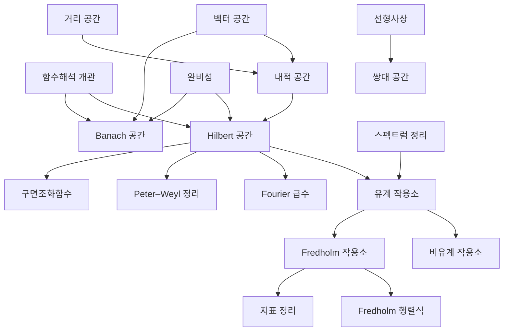

# 함수해석 개관

# 개요

함수해석은 무한차원 벡터공간과 그 위의 선형사상을 다룬다. 유한차원에서는 노름을 무엇으로 잡아도 수렴이 같고 모든 선형사상이 연속이지만, 무한차원에서는 둘 다 깨진다. 노름과 완비성을 먼저 정하고 그 위에서만 극한과 작용소를 논한다.

[벡터 공간](vector-spaces.md)에 노름을 주고 완비성을 요구하면 [Banach 공간](banach-spaces.md)이 되고, 노름이 [내적](inner-product-spaces.md)에서 오면 [Hilbert 공간](hilbert-spaces.md)이 된다. Hilbert 공간에는 직교분해와 정규직교기저가 있어 유한차원의 기하가 거의 그대로 남는다. [Fourier 급수](fourier-series.md)가 그 기저의 대표적인 예다.

작용소 쪽에서는 [유계 작용소](bounded-operators.md)의 스펙트럼이 고윳값의 자리를 대신한다. 무한차원에서는 고유벡터 없이도 역원이 없을 수 있어 스펙트럼이 점스펙트럼, 연속스펙트럼, 잔여스펙트럼으로 갈린다. 미분작용소처럼 정의역 전체에서 유계가 아닌 것은 [비유계 작용소](unbounded-operators.md)로 따로 다룬다.

[Fredholm 작용소](fredholm-operators.md)는 핵과 여핵이 유한차원인 작용소다. 그 지표가 연속 변형에 불변이어서 해석적 대상에 위상적 불변량을 붙인다. 이 불변성이 [지표 정리](index-theorem.md)로 이어진다.

# 지도

# 갈래

## 공간

- [내적 공간](inner-product-spaces.md) — 내적이 정하는 노름과 직교성. Cauchy–Schwarz 부등식과 Gram–Schmidt 직교화
- [Hilbert 공간](hilbert-spaces.md) — 완비 내적 공간. 닫힌 부분공간으로의 직교사영과 Riesz 표현 정리
- [Banach 공간](banach-spaces.md) — 완비 노름 공간. 열린사상 정리, 닫힌 그래프 정리, 균등유계성 원리
- [쌍대 공간](dual-space.md) — 선형범함수 전체가 이루는 공간. 유한차원과 달리 원공간과 표준적으로 동형이 아니다

## 수렴과 직교기저

- [균등수렴](uniform-convergence.md) — 점별수렴과 달리 연속성과 적분을 보존한다. 상한 노름의 수렴과 같다
- [Fourier 급수](fourier-series.md) — 삼각함수계가 주기함수의 $L^2$ 공간에서 정규직교기저를 이룬다

## 작용소와 스펙트럼

- [유계 작용소와 스펙트럼](bounded-operators.md) — 연속과 유계가 동치이고, 스펙트럼이 점·연속·잔여로 갈린다
- [비유계 작용소와 Stone 정리](unbounded-operators.md) — 조밀한 정의역에서만 정의되는 자기수반 작용소와 한 매개변수 유니터리 군의 대응
- [Fredholm 작용소와 지표](fredholm-operators.md) — 핵과 여핵이 유한차원인 작용소. 지표가 연속 변형에 불변이다
- [Fredholm 행렬식](fredholm-determinant.md) — 대각합 유한 작용소의 행렬식. 적분방정식의 해와 결정점과정에 쓴다

## 표현론과의 접점

- [Peter–Weyl 정리](peter-weyl.md) — 콤팩트 군의 정칙 표현이 기약 표현의 직합으로 분해되고 행렬계수가 $L^2$ 의 기저가 된다
- [구면조화함수와 SO(3) 의 표현](spherical-harmonics.md) — 구면 위 $L^2$ 공간의 회전군 표현에 따른 분해

# 연관 문서

## 선수지식

- [집합](sets.md)

## 더 알아보기

- [Banach 공간](banach-spaces.md)
- [Hilbert 공간](hilbert-spaces.md)

#functional_analysis #analysis #linear_algebra #overview
